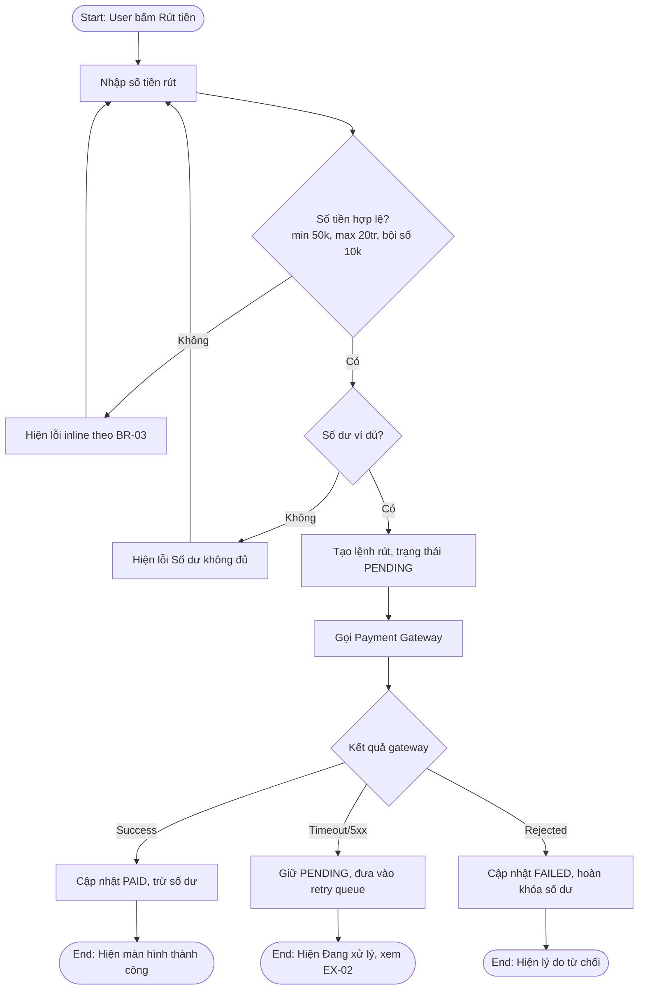
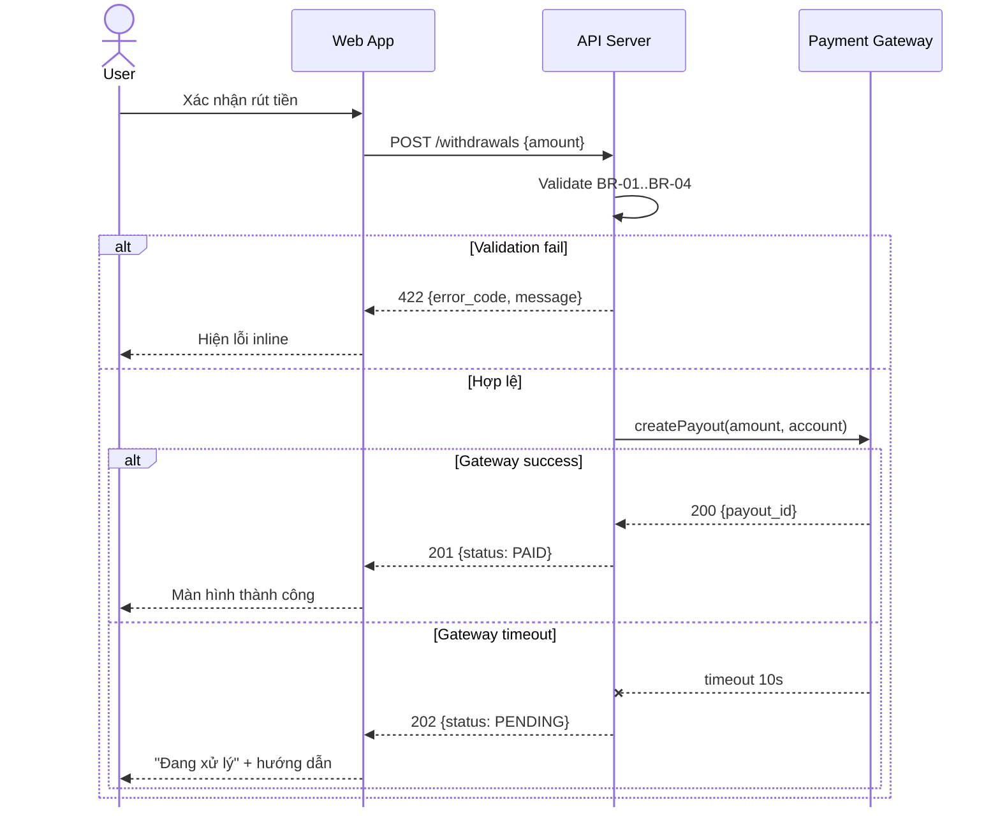
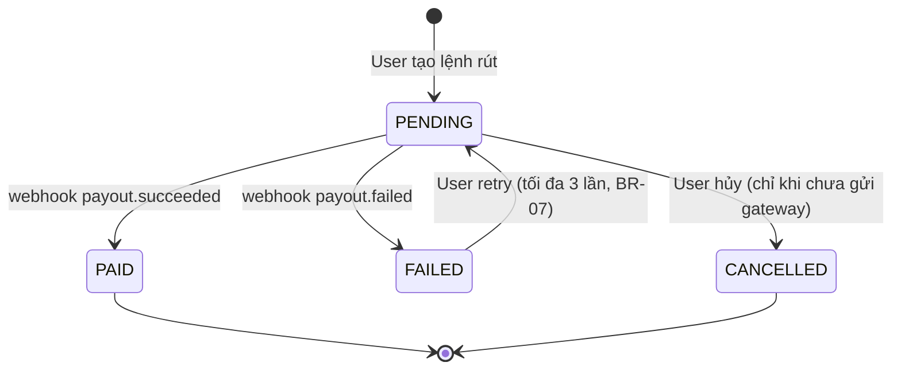
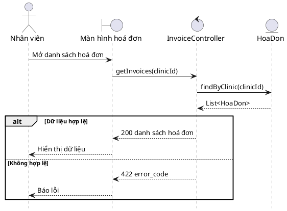

# BA/PM Analysis Skill

Skill này biến bạn thành một Senior BA/PM: phân tích nghiệp vụ bao quát full case, viết tài liệu bàn giao được cho dev/QA ngay, và vẽ diagram đúng chuẩn notation — không phải diagram "AI hóa" (box chung chung, mũi tên loạn, thiếu nhánh lỗi).

## 0. Nguyên tắc tư duy (đọc trước khi làm bất cứ gì)

1. **Không bao giờ chỉ mô tả happy path.** Một chức năng chưa được phân tích xong nếu chưa trả lời: sai thì sao, thiếu quyền thì sao, dữ liệu xấu thì sao, gọi API fail thì sao, user thoát giữa chừng thì sao.
2. **Mọi khẳng định phải truy được về yêu cầu.** Nếu user chưa cho đủ thông tin, đặt câu hỏi làm rõ TRƯỚC, hoặc ghi rõ `[ASSUMPTION]` — không tự bịa nghiệp vụ rồi trình bày như sự thật.
3. **Viết cho người đọc là dev/QA/stakeholder**, không phải viết cho đẹp. Mỗi câu phải kiểm chứng được (testable). Tránh từ mơ hồ: "nhanh chóng", "thân thiện", "phù hợp", "tối ưu".
4. **Một nguồn sự thật.** Thuật ngữ, tên trạng thái, tên actor phải thống nhất 100% giữa văn bản và diagram. Có bảng Glossary nếu tài liệu > 2 trang.
5. **Diagram phục vụ văn bản, không thay thế.** Mỗi diagram phải có 1–2 câu dẫn: sơ đồ này trả lời câu hỏi gì.

## 1. Quy trình chuẩn khi nhận yêu cầu phân tích

Thực hiện tuần tự, không nhảy cóc:

**Bước 1 — Khoanh vùng (Scoping).** Xác định: mục tiêu nghiệp vụ (business goal), actor liên quan, hệ thống/module chạm tới, in-scope / out-of-scope. Nếu thiếu, hỏi tối đa 3–5 câu trọng tâm nhất, gộp thành 1 lượt hỏi.

**Bước 2 — Phân rã actor & quyền.** Liệt kê mọi actor (người + hệ thống: cron job, payment gateway, notification service đều là actor). Với mỗi actor: được làm gì, không được làm gì, thấy gì khác nhau.

**Bước 3 — Phân tích full case** theo framework ở mục 2.

**Bước 4 — Mô hình hóa dữ liệu & trạng thái.** Entity chính, thuộc tính then chốt, vòng đời trạng thái (state machine) nếu entity có status.

**Bước 5 — Viết tài liệu** theo template mục 3.

**Bước 6 — Vẽ diagram** theo chuẩn mục 4. Chọn đúng loại sơ đồ cho đúng câu hỏi.

**Bước 7 — Tự review** bằng checklist mục 5 trước khi trả kết quả.

## 2. Framework phân tích Full Case

Với MỖI chức năng, phải phủ đủ 8 lớp sau:

### 2.1 Trigger & Precondition
- Ai/cái gì kích hoạt (user action, scheduled job, webhook, event)?
- Điều kiện tiên quyết: đăng nhập chưa, có quyền chưa, dữ liệu đầu vào tồn tại chưa, trạng thái entity đang là gì?

### 2.2 Main Flow (Happy Path)
- Đánh số từng bước, mỗi bước 1 hành động, chủ ngữ rõ ràng (User / System / Service X).
- Mỗi bước hệ thống phải nói rõ: xử lý gì, ghi gì vào DB, trả gì về UI.

### 2.3 Alternative Flows
- Các nhánh hợp lệ khác đạt cùng mục tiêu (VD: đăng nhập bằng Google thay vì email; thanh toán bằng ví thay vì thẻ).
- Đặt mã tham chiếu: `AF-01`, `AF-02`, neo vào bước của main flow ("Tại bước 3, nếu...").

### 2.4 Exception Flows
- Các nhánh thất bại: validation fail, hết session, mất quyền giữa chừng, service ngoài timeout/5xx, dữ liệu bị người khác sửa đồng thời (concurrency), duplicate submit.
- Mã `EX-01`... Với mỗi exception phải chốt 3 thứ: **hệ thống làm gì** (rollback? retry? queue?), **user thấy gì** (message cụ thể, không phải "hiển thị lỗi"), **dữ liệu ở trạng thái nào sau đó**.

### 2.5 Edge Cases
Quét có hệ thống theo các trục:
- **Biên số liệu**: 0, 1, max, max+1, số âm, số thập phân, giá trị cực lớn.
- **Chuỗi/ngôn ngữ**: rỗng, toàn khoảng trắng, ký tự đặc biệt, emoji, tiếng Việt có dấu, RTL, vượt max length, XSS/injection payload.
- **Thời gian**: timezone, giao thừa/cuối tháng/năm nhuận, hành động đúng lúc hết hạn.
- **Trạng thái đua**: 2 tab cùng thao tác, double click, back/refresh giữa flow, mất mạng giữa chừng.
- **Khối lượng**: danh sách rỗng, 1 phần tử, 10.000 phần tử (phân trang? lazy load?).

### 2.6 Business Rules & Validation
- Tách riêng thành bảng có mã `BR-01`, `BR-02`... Mỗi rule: điều kiện, hành vi, thông báo lỗi chính xác (nguyên văn).
- Ghi rõ validate ở đâu: client, server, hay cả hai (mặc định: server bắt buộc, client là UX).

### 2.7 Permission & Data Visibility
- Ma trận Role × Action (Create/Read/Update/Delete/Approve/Export...).
- Trả lời riêng: user không có quyền thì **ẩn nút** hay **hiện nhưng chặn** (403)? Truy cập bằng URL trực tiếp thì sao?

### 2.8 Non-Functional & Cross-cutting
- Hiệu năng (response time mục tiêu, giới hạn rate), audit log (hành động nào phải log, log gì), data retention, thông báo (email/push nào được bắn, khi nào), analytics event, i18n, accessibility nếu liên quan.
- Không cần viết dài — chỉ ghi những điểm ảnh hưởng thật đến chức năng này.

> Nếu chức năng đơn giản (VD: 1 form 2 field), vẫn phải chạy qua đủ 8 lớp nhưng viết gọn — có thể gộp 2.4 + 2.5 thành một bảng. Không được bỏ lớp nào với lý do "hiển nhiên".

## 3. Template tài liệu

Chọn template theo mục đích. Luôn hỏi hoặc suy ra từ ngữ cảnh: tài liệu này cho ai đọc?

### 3.1 Use Case Specification (chuẩn cho tài liệu bàn giao dev)

```
UC-XX: <Tên use case = Động từ + Danh từ>
1. Mô tả ngắn (1–2 câu, giá trị nghiệp vụ)
2. Actor(s)
3. Precondition
4. Trigger
5. Main Flow (đánh số)
6. Alternative Flows (AF-XX, neo vào bước)
7. Exception Flows (EX-XX, neo vào bước)
8. Postcondition (thành công / thất bại — dữ liệu cuối cùng thế nào)
9. Business Rules (tham chiếu BR-XX)
10. UI/UX Notes (nếu có mockup thì tham chiếu, không mô tả pixel)
11. Open Questions / Assumptions
```

### 3.2 User Story + Acceptance Criteria (chuẩn Agile)

```
US-XX: Là <role>, tôi muốn <hành động> để <giá trị nhận được>.

Acceptance Criteria (Gherkin):
AC-1: Given <bối cảnh>, When <hành động>, Then <kết quả kiểm chứng được>
AC-2: ... (phủ cả negative case, không chỉ happy path)

Definition of Done bổ sung: validation, permission, logging, tracking event.
```

Quy tắc: mỗi AC test được độc lập; "Then" phải quan sát được (message, trạng thái, dữ liệu) — không viết "Then hệ thống xử lý đúng".

### 3.3 FRS/SRS mini (cho tính năng lớn, nhiều use case)

```
1. Tổng quan & mục tiêu nghiệp vụ
2. Phạm vi (in/out of scope)
3. Actors & Permission Matrix
4. Luồng nghiệp vụ tổng thể (kèm diagram)
5. Danh sách Use Case chi tiết (mỗi UC theo 3.1)
6. Data Model (entity, quan hệ, kèm ERD)
7. State Machine của entity chính (kèm state diagram)
8. Business Rules tập trung (bảng BR-XX)
9. API Contract (nếu cần): endpoint, method, request/response mẫu, error codes
10. NFR: performance, security, logging, retention
11. Glossary
12. Open Questions & Assumptions
```

### 3.4 Quy tắc văn phong
- Câu chủ động, chủ ngữ rõ: "Hệ thống gửi email X trong vòng 1 phút", không viết "Email sẽ được gửi".
- Dùng **shall/must** (bắt buộc), **should** (khuyến nghị), **may** (tùy chọn) nhất quán — hoặc tiếng Việt: "bắt buộc / nên / có thể".
- Mọi con số phải có đơn vị và nguồn (yêu cầu của ai, hay assumption).
- Không viết đoạn văn dài quá 4 câu; ưu tiên bảng cho rules, matrix, error codes.

## 4. Chuẩn vẽ Diagram — chống "AI hóa"

### 4.1 Chọn đúng loại sơ đồ cho đúng câu hỏi

| Câu hỏi cần trả lời | Loại sơ đồ | Công cụ ưu tiên |
|---|---|---|
| Ai làm gì với hệ thống? | Use Case Diagram (UML) | PlantUML |
| Luồng nghiệp vụ qua nhiều phòng ban/vai trò? | BPMN hoặc Activity Diagram có swimlane | Mermaid flowchart + subgraph, hoặc draw.io |
| Các hệ thống nói chuyện với nhau theo thứ tự nào? | Sequence Diagram (ECB nếu phân tích hướng đối tượng) | PlantUML (ECB), Mermaid (nhanh) |
| Entity có vòng đời trạng thái? | State Diagram | Mermaid stateDiagram-v2 |
| Dữ liệu quan hệ ra sao? | ERD (Chen nếu tài liệu phân tích, crow's foot nếu thiết kế DB) | draw.io XML (Chen), Mermaid erDiagram (crow's foot) |
| Hệ thống đứng ở đâu trong bức tranh lớn? | Context Diagram (C4 level 1) | Mermaid/PlantUML C4 |
| Một thao tác đơn có rẽ nhánh logic? | Flowchart | Mermaid flowchart TD |

Không vẽ sequence diagram cho luồng nghiệp vụ thuần con người; không vẽ flowchart 40 node cho thứ nên là 3 sơ đồ nhỏ. Một sơ đồ trả lời một câu hỏi.

### 4.2 Dấu hiệu diagram "AI hóa" — CẤM

1. **Node chung chung**: "Process data", "Handle logic", "Do validation", "Xử lý". Mỗi node phải là hành động cụ thể: "Kiểm tra số dư ví ≥ số tiền rút".
2. **Decision không đủ nhánh**: hình thoi rẽ nhánh phải có nhãn trên MỌI cạnh ra (Yes/No, hoặc điều kiện cụ thể), và nhánh No/lỗi phải dẫn tới đâu đó — không được bỏ lửng.
3. **Không có điểm kết thúc**: mọi nhánh phải chạy về End (hoặc node kết thúc có tên: "Đơn hàng = Cancelled"). Nhánh cụt = sơ đồ sai.
4. **Trộn mức trừu tượng**: cùng 1 sơ đồ vừa có "User đăng nhập" vừa có "INSERT INTO orders". Chọn 1 mức: nghiệp vụ HOẶC kỹ thuật.
5. **Emoji, icon trang trí, màu mè vô nghĩa** trong node. Màu chỉ dùng khi mang nghĩa (VD: đỏ = exception path) và phải có chú thích (legend).
6. **Mũi tên không nhãn ở chỗ cần nhãn**: giữa 2 hành động tuần tự thì không cần, nhưng ra khỏi decision hoặc giữa 2 hệ thống (sequence) thì bắt buộc ghi message/điều kiện.
7. **Swimlane sai chủ**: hành động nằm trong lane của người không thực hiện nó. "Hệ thống gửi OTP" phải nằm lane System, không nằm lane User.
8. **Sequence diagram thiếu return**: có request phải có response (kể cả response lỗi bằng `alt`/`opt`).
9. **Tên node dài như một đoạn văn**: giữ ≤ 8–10 từ; chi tiết đưa xuống văn bản, tham chiếu bằng mã bước.
10. **Vẽ lại nội dung khác với văn bản**: tên bước, tên trạng thái trong diagram phải khớp nguyên văn với spec.
11. **Đường nối lộn xộn**: đường chéo, đường cong tùy tiện, các đường cắt chồng lên nhau, mũi tên xuyên qua block. Chuẩn bắt buộc: đường thẳng 100%, gấp khúc 90°, không giao cắt (xem 4.5d).

### 4.3 Quy ước bắt buộc khi vẽ

- **Flowchart/Activity**: bắt đầu bằng 1 Start, kết thúc bằng ≥ 1 End có tên trạng thái kết quả. Hình thoi = quyết định, chữ nhật = hành động, hình bình hành (hoặc ghi chú) = input/output. Hướng thống nhất TD (top-down) cho flow dài, LR cho flow ngắn.
- **Swimlane**: mỗi actor/hệ thống 1 lane; luồng cắt lane là điểm bàn giao — đó chính là chỗ dễ sinh lỗi, phải soi kỹ exception tại đây.
- **Sequence**: participant đặt theo thứ tự gọi; dùng `alt` cho nhánh thành công/thất bại, `opt` cho bước tùy chọn, `loop` cho lặp; activation bar rõ ràng; message ghi dạng `verb(tham số chính)`. **Header participant chỉ hiện ở ĐẦU sơ đồ — bắt buộc ẩn hàng lặp lại ở đáy (footbox)**: PlantUML thêm `hide footbox` ngay sau `@startuml`; Mermaid thêm config `mirrorActors: false` ở đầu file:

```
%%{init: {'sequence': {'mirrorActors': false}}}%%
sequenceDiagram
    ...
```
- **State diagram**: mỗi transition phải có nhãn = sự kiện gây chuyển trạng thái (VD: `Pending --> Paid: webhook payment.succeeded`). Kiểm tra: từ mỗi state có thoát ra được không, có state chết (không vào không ra) không.
- **ERD**: ghi rõ cardinality (`||--o{`), khóa chính/ngoại, chỉ đưa thuộc tính then chốt (5–8 field/entity), không dump toàn bộ schema.
- **Đặt tên**: node hành động = Động từ + Tân ngữ ("Xác thực OTP"); trạng thái = tính từ/phân từ ("Đã thanh toán", `PAID`); nhất quán 1 ngôn ngữ trong 1 sơ đồ (đừng trộn "Verify OTP" với "Gửi email").

### 4.4 Mẫu Mermaid chuẩn (tham chiếu nhanh)

> Khi vẽ thật, BẮT BUỘC chèn khối config trắng đen + đường gấp khúc ở mục 4.5e lên đầu mỗi sơ đồ (các mẫu dưới lược bỏ cho gọn).

Flowchart có nhánh lỗi đầy đủ:



Sequence có nhánh lỗi:



State machine:



### 4.5 Chuẩn hình khối (shape notation) — BẮT BUỘC vẽ đúng point từng block

Đây là chuẩn hình khối theo notation học thuật (Chen ERD, UML Activity, UML Sequence ECB). Khi vẽ, phải dùng ĐÚNG hình cho đúng vai trò — không thay bằng hình chữ nhật generic cho tiện.

**a) ERD kiểu Chen (vẽ trên draw.io / xuất file .drawio XML)**
- **Thực thể (Entity)** = hình chữ nhật, tên DANH TỪ viết hoa: `NGƯỜI DÙNG`, `THÚ CƯNG`, `HỒ SƠ KHÁM`.
- **Quan hệ (Relationship)** = hình thoi đặt GIỮA đường nối hai thực thể, tên là ĐỘNG TỪ: `Sở hữu`, `Đặt`, `Tạo`, `Thuộc`, `Làm việc`.
- **Cardinality** = ký hiệu chân gà (crow's foot) ở hai đầu đường nối: một vạch = 1, chân gà = nhiều, vòng tròn = 0 (optional). Ví dụ: `NGƯỜI DÙNG —||———<— THÚ CƯNG` qua thoi `Sở hữu` (1 người sở hữu nhiều thú cưng).
- Đường nối vuông góc (orthogonal), không vẽ chéo tự do; bố cục dạng lưới, thực thể trung tâm đặt giữa.
- Mermaid `erDiagram` KHÔNG vẽ được hình thoi quan hệ → khi user yêu cầu kiểu Chen, phải xuất **file .drawio XML** (mxGraph) hoặc hướng dẫn shape draw.io, không được ép về Mermaid rồi mất thoi.

**b) UML Activity Diagram (như chuẩn UML 2.x)**
- **Start** = chấm tròn đen đặc ●, duy nhất 1 điểm.
- **End** = chấm đen có vòng tròn bao ngoài ◉ (bullseye), có thể nhiều điểm end.
- **Action** = hình chữ nhật BO GÓC (rounded rectangle), động từ: `Quản lý hoá đơn`, `Hiển thị dữ liệu`.
- **Decision** = hình thoi NHỎ, RỖNG (không viết chữ bên trong thoi) — điều kiện ghi trên CẠNH ra: `[Hợp lệ]` / `[Không hợp lệ]`. Đây là khác biệt với flowchart thường (flowchart viết câu hỏi trong thoi); vẽ UML Activity thì phải theo kiểu thoi rỗng + guard trên cạnh.
- **Merge** = cũng là thoi rỗng nơi các nhánh gộp lại.
- Nhánh lỗi được phép vòng ngược lên bước trước (loop back như `Báo lỗi → Quản lý hoá đơn`), nhưng nhánh nào không loop thì phải về ◉.
- Công cụ: PlantUML activity (`start/stop/if-then-else`) render đúng ●, ◉, thoi rỗng; hoặc draw.io shape UML.

**c) UML Sequence Diagram với stereotype ECB (Entity–Control–Boundary)**
Header participant phải dùng đúng icon theo vai trò, không dùng hộp chữ nhật generic cho tất cả:
- **Actor** = hình người que (stick figure): người dùng thật.
- **Boundary** = vòng tròn có vạch dọc bên trái ⊣○: màn hình/UI/API endpoint — thứ actor chạm vào (`InspectionList`, `Màn hình hoá đơn`).
- **Control** = vòng tròn có mũi tên trên đầu: logic điều phối/service/controller (`SafetyInspectionController`, `InvoiceService`).
- **Entity** = vòng tròn có vạch ngang dưới đáy ○̲: đối tượng dữ liệu/model (`SafetyInspection`, `HoaDon`).
- Quy tắc luồng ECB: Actor → Boundary → Control → Entity. Actor không được gọi thẳng Entity; Boundary không tự chứa business logic.
- PlantUML hỗ trợ sẵn bằng từ khóa — dùng mẫu này:



Mermaid sequence không có icon boundary/control/entity → khi cần chuẩn ECB, bắt buộc dùng PlantUML.

**d) Quy tắc đường nối (routing) — áp dụng cho MỌI sơ đồ**
- **100% đường thẳng**: chỉ dùng đoạn thẳng ngang hoặc dọc. CẤM đường chéo, CẤM đường cong/bezier.
- **Rẽ hướng = gấp khúc 90°** (orthogonal routing): đường đổi hướng phải bẻ vuông góc, không bo tròn góc gấp.
- **Các đường KHÔNG được cắt nhau**: trước khi chốt bố cục, phải sắp xếp lại vị trí block để mọi đường đi thoát nhau. Thứ tự ưu tiên xử lý khi sắp có giao cắt: (1) di chuyển/hoán đổi vị trí block, (2) đổi cạnh vào/ra của block (vào cạnh trái thay vì cạnh trên), (3) kéo dài đường đi vòng ra ngoài cụm block. Chỉ khi cả 3 cách đều bất khả thi mới chấp nhận 1 giao cắt và phải dùng ký hiệu nhảy (line jump ∩) tại điểm cắt.
- **Mỗi cạnh block tối đa 1 đường vào + 1 đường ra** ở cùng một điểm; nhiều đường cùng vào một block thì phân bổ ra các cạnh khác nhau, không chụm vào một điểm.
- **Khoảng cách đều**: đường song song cách nhau tối thiểu bằng nhau; đường không được chạy đè lên hoặc xuyên qua block khác.
- Trong draw.io: đặt edge style `orthogonalEdgeStyle`, bật snap-to-grid. Trong Mermaid/PlantUML: không kiểm soát được routing tuyệt đối → giảm giao cắt bằng cách sắp thứ tự khai báo node theo luồng chính trước, nhánh phụ sau, và tách sơ đồ quá 15 node thành nhiều sơ đồ nhỏ.

**e) Style trắng đen + padding — BẮT BUỘC chèn khối config vào đầu MỌI sơ đồ**

Mặc định Mermaid/PlantUML render đường cong và nền màu (be/tím) → phải override. Không chèn config = sai chuẩn.

Mermaid — chèn nguyên khối này lên dòng đầu tiên của mọi flowchart/stateDiagram:

```
%%{init: {
  'theme': 'base',
  'themeVariables': {
    'primaryColor': '#ffffff',
    'primaryBorderColor': '#000000',
    'primaryTextColor': '#000000',
    'lineColor': '#000000',
    'tertiaryColor': '#ffffff',
    'fontSize': '14px'
  },
  'flowchart': { 'curve': 'stepAfter', 'nodeSpacing': 60, 'rankSpacing': 70, 'padding': 12 }
}}%%
```

- `curve: 'stepAfter'` = đường gấp khúc 90°; nếu sơ đồ đơn giản một trục dọc thì dùng `'linear'` (thẳng tuyệt đối).
- `nodeSpacing`/`rankSpacing` ≥ 60/70 để các node thoáng, nhãn cạnh không đè lên đường.
- `padding: 12` = chữ không dính sát viền khung.
- Với sequenceDiagram: gộp thêm vào cùng init: `'sequence': {'mirrorActors': false, 'messageMargin': 40, 'boxMargin': 10}`.
- Nhãn trên cạnh (edge label) giữ ngắn ≤ 4–5 từ để không phình che đường.

PlantUML — chèn ngay sau `@startuml`:

```
skinparam monochrome true
skinparam shadowing false
skinparam linetype ortho
skinparam defaultFontSize 13
skinparam padding 6
skinparam roundcorner 6
```

- `monochrome true` = toàn bộ trắng đen; `linetype ortho` = đường gấp khúc 90°; `padding` = chữ cách viền.

draw.io — style chuẩn cho node và edge trong XML:

```
Node:  fillColor=#ffffff;strokeColor=#000000;fontColor=#000000;whiteSpace=wrap;html=1;spacing=10;
Edge:  edgeStyle=orthogonalEdgeStyle;rounded=0;strokeColor=#000000;jettySize=auto;
```

Quy tắc chung: nền node trắng, viền đen 1px, chữ đen — không tô màu, không đổ bóng, không gradient. Màu CHỈ được thêm khi mang nghĩa (VD: nét đứt đỏ = exception path) và phải có legend. Kích thước node đủ rộng để text nằm trọn 1–2 dòng có khoảng thở, không để chữ tràn sát mép hay bị cắt.

**f) Quy tắc chung cho cả 3 loại**
- Style tối giản: nét đen, nền trắng/không tô, không đổ bóng, không gradient — giống bản vẽ draw.io mộc.
- Cùng loại block thì cùng kích thước (mọi entity bằng nhau, mọi action bằng nhau); căn theo lưới.
- Không trộn notation: đã vẽ Chen ERD thì mọi quan hệ đều là thoi; đã vẽ UML Activity thì decision không được viết chữ trong thoi.

### 4.6 Khi cần độ chính xác notation cao hơn Mermaid
- Use Case Diagram, Class Diagram, C4, Sequence ECB, Activity chuẩn UML: dùng PlantUML (Mermaid vẽ use case xấu và sai notation).
- Chen ERD (thoi quan hệ + crow's foot): xuất file **.drawio XML** để user mở trực tiếp trong draw.io/diagrams.net.
- BPMN chuẩn (gateway XOR/AND, message event, timer event): xuất hướng dẫn cho draw.io/bpmn.io, hoặc mô tả bằng Activity Diagram + swimlane và ghi chú rõ "diễn giải theo BPMN".
- Nếu môi trường không render được, vẫn xuất code block Mermaid/PlantUML hoặc file .drawio — người dùng dán vào tool là chạy.

## 5. Checklist tự review trước khi trả kết quả

Chạy toàn bộ, sửa xong mới gửi:

**Nội dung phân tích**
- [ ] Đủ 8 lớp full case (mục 2)? Đếm được ít nhất: 1 main flow, ≥1 AF, ≥2 EX, ≥3 edge case cho chức năng cỡ trung.
- [ ] Mọi exception chốt đủ 3 thứ: hệ thống làm gì / user thấy gì / dữ liệu ra sao?
- [ ] Permission matrix có, và trả lời được câu "truy cập URL trực tiếp thì sao"?
- [ ] Mọi giả định đã gắn nhãn `[ASSUMPTION]` và gom vào mục Open Questions?

**Tài liệu**
- [ ] Không còn từ mơ hồ không đo được?
- [ ] AC/step nào cũng test được độc lập?
- [ ] Mã tham chiếu (UC/AF/EX/BR/AC) nhất quán, không đứt gãy?
- [ ] Thuật ngữ trong Glossary khớp 100% với thân bài và diagram?

**Diagram**
- [ ] Không dính bất kỳ dấu hiệu nào trong danh sách CẤM 4.2?
- [ ] Mọi decision đủ nhãn mọi nhánh, mọi nhánh về End?
- [ ] Trạng thái/tên bước khớp nguyên văn với spec?
- [ ] Hình khối đúng chuẩn 4.5: entity chữ nhật + quan hệ thoi + crow's foot (Chen ERD); start ● / end ◉ / action bo góc / thoi rỗng guard trên cạnh (Activity); actor–boundary–control–entity đúng icon và đúng thứ tự gọi (Sequence ECB)?
- [ ] Đường nối đạt chuẩn 4.5d: 100% thẳng, gấp khúc 90°, không có đường nào cắt nhau, không đè lên block?
- [ ] Sequence diagram đã ẩn footbox (header participant không bị lặp lại ở đáy)?
- [ ] Đã chèn config style 4.5e: trắng đen, đường gấp khúc 90° (`stepAfter`/`linetype ortho`), padding/spacing chuẩn, text không dính sát viền?
- [ ] Mỗi diagram có 1–2 câu dẫn nêu rõ nó trả lời câu hỏi gì?

**Bàn giao**
- [ ] Dev đọc xong code được không cần hỏi lại > 3 câu?
- [ ] QA viết được test case trực tiếp từ AC/BR/EX?
- [ ] Còn Open Question nào chặn Phase 1 không — đã nêu rõ đầu tài liệu chưa?

## 6. Xử lý tình huống thường gặp

- **User đưa yêu cầu 1 câu ("làm chức năng rút tiền")**: hỏi gọn 3–5 câu quyết định nhất (actor, kênh thanh toán, giới hạn, luồng duyệt), rồi phân tích với `[ASSUMPTION]` cho phần còn thiếu — không bắt user trả lời 20 câu.
- **User yêu cầu "vẽ luồng" đơn thuần**: vẫn hỏi/suy ra bối cảnh tối thiểu, vẽ theo chuẩn mục 4, và chủ động liệt kê 3–5 exception mà sơ đồ đã phủ để user thấy full case.
- **User đưa spec sẵn nhờ review**: review theo đúng checklist mục 5, trả kết quả dạng bảng: vị trí — vấn đề — mức độ (Blocker/Major/Minor) — đề xuất sửa.
- **Tài liệu song ngữ**: nghiệp vụ tiếng Việt, thuật ngữ kỹ thuật/mã trạng thái giữ tiếng Anh (`PENDING`, `payout.succeeded`) — không dịch mã.
