# Tài liệu mô tả và thiết kế hệ thống — Bambi WMS (Hệ thống quản lý kho Mẹ và Bé)

> Tài liệu này mô tả đầy đủ dự án để phục vụ viết luận văn: quy trình nghiệp vụ, sơ đồ chức năng, sơ đồ use case tổng quát và chi tiết, mô hình dữ liệu (ý niệm / luận lý / vật lý), sơ đồ tuần tự (sequence) và sơ đồ hoạt động (activity).
>
> Các sơ đồ được viết bằng **Mermaid**. Có thể xem trực tiếp trên GitHub/VS Code (extension Markdown Preview Mermaid) hoặc dán vào <https://mermaid.live> để xuất ảnh PNG/SVG chèn vào Word.

---

## 0. Giới thiệu tổng quan hệ thống

**Bambi WMS** là hệ thống quản lý kho (Warehouse Management System) cho chuỗi cửa hàng Mẹ và Bé. Hệ thống quản lý toàn bộ vòng đời hàng hóa trong kho: từ danh mục sản phẩm, cấu trúc lưu trữ (kho → khu → kệ → vị trí), nhập kho, xuất kho, chuyển kho, kiểm kê, điều chỉnh tồn, đến báo cáo và cảnh báo vận hành.

| Thành phần | Công nghệ |
| --- | --- |
| Frontend | React + TypeScript + Vite |
| Backend | Express + TypeScript |
| Cơ sở dữ liệu | MySQL 8 (InnoDB) |
| Xác thực | JWT (access + refresh token), bcrypt |
| Tài liệu API | OpenAPI/Swagger |

**Nguyên tắc cốt lõi về tồn kho:**

- Tồn kho **không** lưu trong bảng sản phẩm; được quản lý bởi bảng `stock_locations` theo bộ khóa `product_variant_id + location_id + batch_id`.
- Mọi biến động tồn phải sinh bản ghi `inventory_transactions` (append-only — chỉ thêm, không sửa/xóa).
- Phiếu nhập/xuất/chuyển/điều chỉnh **chỉ làm đổi tồn khi được xác nhận (confirm) hoặc duyệt (approve)**.
- Hàng có hạn sử dụng quản lý theo lô (`product_batches`), xuất theo chiến lược **FEFO** (First Expired First Out) / **FIFO**.
- Muốn sửa giao dịch sai → tạo giao dịch đối ứng loại `REVERSAL`, không xóa lịch sử.

---

# CHƯƠNG 2: KHẢO SÁT VÀ PHÂN TÍCH

## 2.4.1 Các quy trình, nghiệp vụ

Hệ thống có 6 nhóm quy trình nghiệp vụ chính. Điểm chung của các chứng từ kho: đều theo mô hình **soạn phiếu (DRAFT) → xác nhận/duyệt → hệ thống ghi giao dịch tồn**, và có thể **đảo (reverse)** khi sai sót.

### Quy trình chung của một chứng từ kho

Sơ đồ trả lời câu hỏi: một chứng từ kho đi qua những bước nào từ lúc soạn tới lúc ghi sổ, và dừng ở đâu khi thiếu quyền hoặc dữ liệu không hợp lệ.

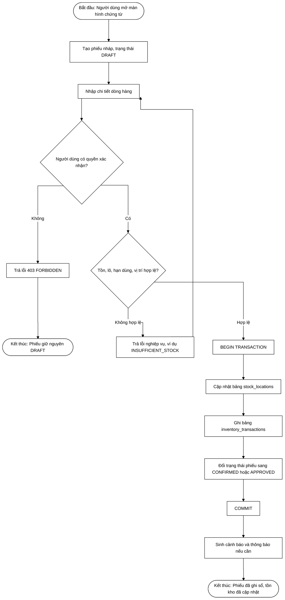
```mermaid
%%{init: {
  'theme': 'base',
  'themeVariables': {
    'primaryColor': '#ffffff',
    'primaryBorderColor': '#000000',
    'primaryTextColor': '#000000',
    'secondaryColor': '#ffffff',
    'secondaryBorderColor': '#000000',
    'secondaryTextColor': '#000000',
    'tertiaryColor': '#ffffff',
    'tertiaryBorderColor': '#000000',
    'tertiaryTextColor': '#000000',
    'lineColor': '#000000',
    'textColor': '#000000',
    'mainBkg': '#ffffff',
    'nodeBorder': '#000000',
    'clusterBkg': '#ffffff',
    'clusterBorder': '#000000',
    'edgeLabelBackground': '#ffffff',
    'fontSize': '14px'
  },
  'flowchart': { 'curve': 'stepAfter', 'nodeSpacing': 60, 'rankSpacing': 70, 'padding': 12, 'useMaxWidth': false }
}}%%
flowchart TD
    Start(["Bắt đầu: Người dùng mở màn hình chứng từ"]) --> A["Tạo phiếu nháp, trạng thái DRAFT"]
    A --> B["Nhập chi tiết dòng hàng"]
    B --> C{"Người dùng có quyền xác nhận?"}
    C -->|Không| C1["Trả lỗi 403 FORBIDDEN"]
    C1 --> End1(["Kết thúc: Phiếu giữ nguyên DRAFT"])
    C -->|Có| Dq{"Tồn, lô, hạn dùng, vị trí hợp lệ?"}
    Dq -->|Không hợp lệ| D1["Trả lỗi nghiệp vụ, ví dụ INSUFFICIENT_STOCK"]
    D1 --> B
    Dq -->|Hợp lệ| F["BEGIN TRANSACTION"]
    F --> G["Cập nhật bảng stock_locations"]
    G --> H["Ghi bảng inventory_transactions"]
    H --> I["Đổi trạng thái phiếu sang CONFIRMED hoặc APPROVED"]
    I --> J["COMMIT"]
    J --> K["Sinh cảnh báo và thông báo nếu cần"]
    K --> End2(["Kết thúc: Phiếu đã ghi sổ, tồn kho đã cập nhật"])
```

### 1) Quy trình Nhập kho (Goods Receipt)

Mục đích: ghi nhận hàng nhập từ nhà cung cấp, làm **tăng** tồn kho.

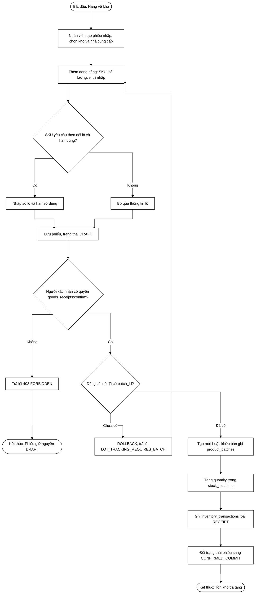
```mermaid
%%{init: {
  'theme': 'base',
  'themeVariables': {
    'primaryColor': '#ffffff',
    'primaryBorderColor': '#000000',
    'primaryTextColor': '#000000',
    'secondaryColor': '#ffffff',
    'secondaryBorderColor': '#000000',
    'secondaryTextColor': '#000000',
    'tertiaryColor': '#ffffff',
    'tertiaryBorderColor': '#000000',
    'tertiaryTextColor': '#000000',
    'lineColor': '#000000',
    'textColor': '#000000',
    'mainBkg': '#ffffff',
    'nodeBorder': '#000000',
    'clusterBkg': '#ffffff',
    'clusterBorder': '#000000',
    'edgeLabelBackground': '#ffffff',
    'fontSize': '14px'
  },
  'flowchart': { 'curve': 'stepAfter', 'nodeSpacing': 60, 'rankSpacing': 70, 'padding': 12, 'useMaxWidth': false }
}}%%
flowchart TD
    Start(["Bắt đầu: Hàng về kho"]) --> S1["Nhân viên tạo phiếu nhập, chọn kho và nhà cung cấp"]
    S1 --> S2["Thêm dòng hàng: SKU, số lượng, vị trí nhập"]
    S2 --> S3{"SKU yêu cầu theo dõi lô và hạn dùng?"}
    S3 -->|Có| S4["Nhập số lô và hạn sử dụng"]
    S3 -->|Không| S5["Bỏ qua thông tin lô"]
    S4 --> S6["Lưu phiếu, trạng thái DRAFT"]
    S5 --> S6
    S6 --> S7{"Người xác nhận có quyền goods_receipts:confirm?"}
    S7 -->|Không| S8["Trả lỗi 403 FORBIDDEN"]
    S8 --> End1(["Kết thúc: Phiếu giữ nguyên DRAFT"])
    S7 -->|Có| S9{"Dòng cần lô đã có batch_id?"}
    S9 -->|Chưa có| S10["ROLLBACK, trả lỗi LOT_TRACKING_REQUIRES_BATCH"]
    S10 --> S2
    S9 -->|Đã có| S11["Tạo mới hoặc khớp bản ghi product_batches"]
    S11 --> S12["Tăng quantity trong stock_locations"]
    S12 --> S13["Ghi inventory_transactions loại RECEIPT"]
    S13 --> S14["Đổi trạng thái phiếu sang CONFIRMED, COMMIT"]
    S14 --> End2(["Kết thúc: Tồn kho đã tăng"])
```

### 2) Quy trình Xuất kho (Goods Issue)

Mục đích: xuất hàng bán/điều phối, làm **giảm** tồn. Phân bổ hàng theo **FEFO/FIFO**.

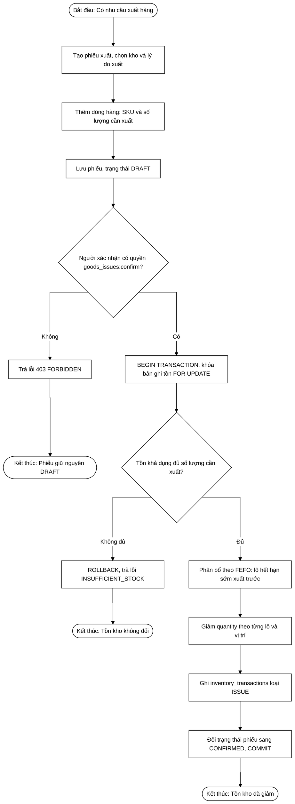
```mermaid
%%{init: {
  'theme': 'base',
  'themeVariables': {
    'primaryColor': '#ffffff',
    'primaryBorderColor': '#000000',
    'primaryTextColor': '#000000',
    'secondaryColor': '#ffffff',
    'secondaryBorderColor': '#000000',
    'secondaryTextColor': '#000000',
    'tertiaryColor': '#ffffff',
    'tertiaryBorderColor': '#000000',
    'tertiaryTextColor': '#000000',
    'lineColor': '#000000',
    'textColor': '#000000',
    'mainBkg': '#ffffff',
    'nodeBorder': '#000000',
    'clusterBkg': '#ffffff',
    'clusterBorder': '#000000',
    'edgeLabelBackground': '#ffffff',
    'fontSize': '14px'
  },
  'flowchart': { 'curve': 'stepAfter', 'nodeSpacing': 60, 'rankSpacing': 70, 'padding': 12, 'useMaxWidth': false }
}}%%
flowchart TD
    Start(["Bắt đầu: Có nhu cầu xuất hàng"]) --> S1["Tạo phiếu xuất, chọn kho và lý do xuất"]
    S1 --> S2["Thêm dòng hàng: SKU và số lượng cần xuất"]
    S2 --> S3["Lưu phiếu, trạng thái DRAFT"]
    S3 --> S4{"Người xác nhận có quyền goods_issues:confirm?"}
    S4 -->|Không| S5["Trả lỗi 403 FORBIDDEN"]
    S5 --> End1(["Kết thúc: Phiếu giữ nguyên DRAFT"])
    S4 -->|Có| S6["BEGIN TRANSACTION, khóa bản ghi tồn FOR UPDATE"]
    S6 --> S7{"Tồn khả dụng đủ số lượng cần xuất?"}
    S7 -->|Không đủ| S8["ROLLBACK, trả lỗi INSUFFICIENT_STOCK"]
    S8 --> End2(["Kết thúc: Tồn kho không đổi"])
    S7 -->|Đủ| S9["Phân bổ theo FEFO: lô hết hạn sớm xuất trước"]
    S9 --> S10["Giảm quantity theo từng lô và vị trí"]
    S10 --> S11["Ghi inventory_transactions loại ISSUE"]
    S11 --> S12["Đổi trạng thái phiếu sang CONFIRMED, COMMIT"]
    S12 --> End3(["Kết thúc: Tồn kho đã giảm"])
```

### 3) Quy trình Chuyển kho (Stock Transfer)

Mục đích: di chuyển hàng giữa hai vị trí/kho. Sinh cặp giao dịch `TRANSFER_OUT` + `TRANSFER_IN`.

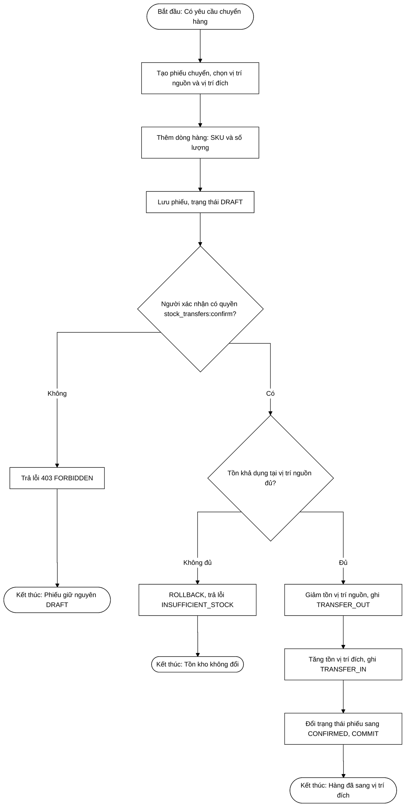
```mermaid
%%{init: {
  'theme': 'base',
  'themeVariables': {
    'primaryColor': '#ffffff',
    'primaryBorderColor': '#000000',
    'primaryTextColor': '#000000',
    'secondaryColor': '#ffffff',
    'secondaryBorderColor': '#000000',
    'secondaryTextColor': '#000000',
    'tertiaryColor': '#ffffff',
    'tertiaryBorderColor': '#000000',
    'tertiaryTextColor': '#000000',
    'lineColor': '#000000',
    'textColor': '#000000',
    'mainBkg': '#ffffff',
    'nodeBorder': '#000000',
    'clusterBkg': '#ffffff',
    'clusterBorder': '#000000',
    'edgeLabelBackground': '#ffffff',
    'fontSize': '14px'
  },
  'flowchart': { 'curve': 'stepAfter', 'nodeSpacing': 60, 'rankSpacing': 70, 'padding': 12, 'useMaxWidth': false }
}}%%
flowchart TD
    Start(["Bắt đầu: Có yêu cầu chuyển hàng"]) --> S1["Tạo phiếu chuyển, chọn vị trí nguồn và vị trí đích"]
    S1 --> S2["Thêm dòng hàng: SKU và số lượng"]
    S2 --> S3["Lưu phiếu, trạng thái DRAFT"]
    S3 --> S4{"Người xác nhận có quyền stock_transfers:confirm?"}
    S4 -->|Không| S5["Trả lỗi 403 FORBIDDEN"]
    S5 --> End1(["Kết thúc: Phiếu giữ nguyên DRAFT"])
    S4 -->|Có| S6{"Tồn khả dụng tại vị trí nguồn đủ?"}
    S6 -->|Không đủ| S7["ROLLBACK, trả lỗi INSUFFICIENT_STOCK"]
    S7 --> End2(["Kết thúc: Tồn kho không đổi"])
    S6 -->|Đủ| S8["Giảm tồn vị trí nguồn, ghi TRANSFER_OUT"]
    S8 --> S9["Tăng tồn vị trí đích, ghi TRANSFER_IN"]
    S9 --> S10["Đổi trạng thái phiếu sang CONFIRMED, COMMIT"]
    S10 --> End3(["Kết thúc: Hàng đã sang vị trí đích"])
```

### 4) Quy trình Kiểm kê (Stock Count)

Mục đích: đếm thực tế và đối chiếu với tồn hệ thống. Có nhiều bước trạng thái.

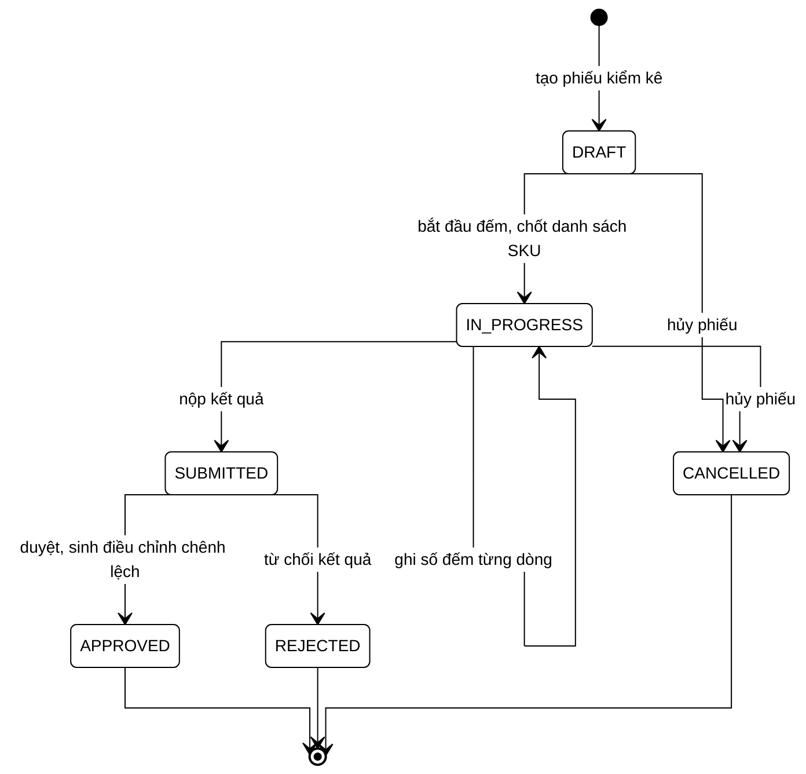
```mermaid
%%{init: {
  'theme': 'base',
  'themeVariables': {
    'primaryColor': '#ffffff',
    'primaryBorderColor': '#000000',
    'primaryTextColor': '#000000',
    'secondaryColor': '#ffffff',
    'secondaryBorderColor': '#000000',
    'secondaryTextColor': '#000000',
    'tertiaryColor': '#ffffff',
    'tertiaryBorderColor': '#000000',
    'tertiaryTextColor': '#000000',
    'lineColor': '#000000',
    'textColor': '#000000',
    'mainBkg': '#ffffff',
    'nodeBorder': '#000000',
    'clusterBkg': '#ffffff',
    'clusterBorder': '#000000',
    'edgeLabelBackground': '#ffffff',
    'fontSize': '14px',
    'labelBackgroundColor': '#ffffff'
  },
  'flowchart': { 'curve': 'stepAfter', 'nodeSpacing': 60, 'rankSpacing': 70, 'padding': 12 },
  'state': { 'padding': 12, 'useMaxWidth': false }
}}%%
stateDiagram-v2
    [*] --> DRAFT: tạo phiếu kiểm kê
    DRAFT --> IN_PROGRESS: bắt đầu đếm, chốt danh sách SKU
    DRAFT --> CANCELLED: hủy phiếu
    IN_PROGRESS --> IN_PROGRESS: ghi số đếm từng dòng
    IN_PROGRESS --> SUBMITTED: nộp kết quả
    IN_PROGRESS --> CANCELLED: hủy phiếu
    SUBMITTED --> APPROVED: duyệt, sinh điều chỉnh chênh lệch
    SUBMITTED --> REJECTED: từ chối kết quả
    APPROVED --> [*]
    REJECTED --> [*]
    CANCELLED --> [*]
```

Khi **approve**: hệ thống so sánh số đếm với tồn hệ thống, chênh lệch dương sinh giao dịch `COUNT_ADJUSTMENT_IN`, chênh lệch âm sinh `COUNT_ADJUSTMENT_OUT`.

### 5) Quy trình Điều chỉnh tồn (Stock Adjustment)

Mục đích: chỉnh tồn do hư hỏng, mất mát, sai lệch... Bắt buộc qua bước **duyệt** (không tự duyệt).

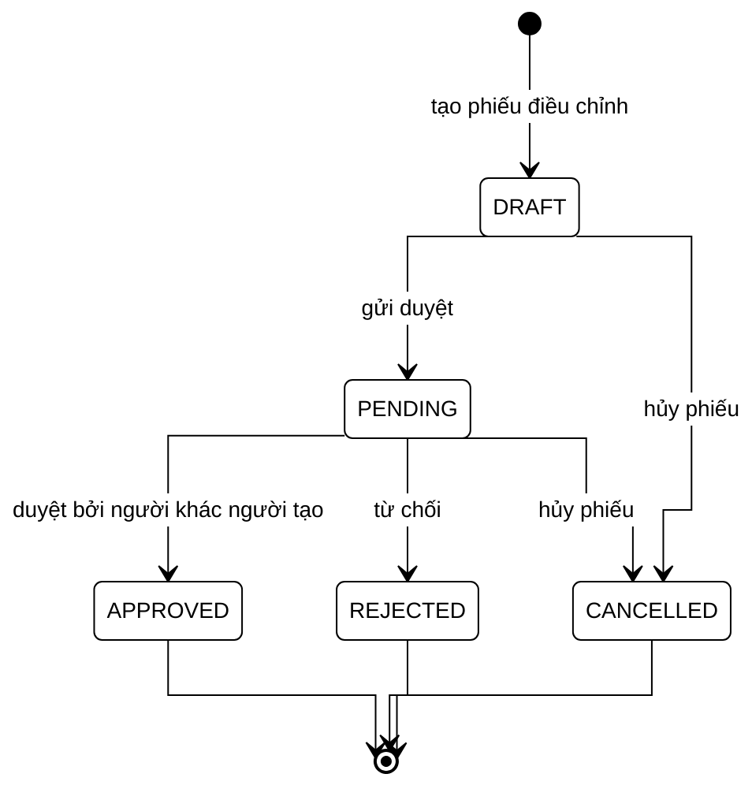
```mermaid
%%{init: {
  'theme': 'base',
  'themeVariables': {
    'primaryColor': '#ffffff',
    'primaryBorderColor': '#000000',
    'primaryTextColor': '#000000',
    'secondaryColor': '#ffffff',
    'secondaryBorderColor': '#000000',
    'secondaryTextColor': '#000000',
    'tertiaryColor': '#ffffff',
    'tertiaryBorderColor': '#000000',
    'tertiaryTextColor': '#000000',
    'lineColor': '#000000',
    'textColor': '#000000',
    'mainBkg': '#ffffff',
    'nodeBorder': '#000000',
    'clusterBkg': '#ffffff',
    'clusterBorder': '#000000',
    'edgeLabelBackground': '#ffffff',
    'fontSize': '14px',
    'labelBackgroundColor': '#ffffff'
  },
  'flowchart': { 'curve': 'stepAfter', 'nodeSpacing': 60, 'rankSpacing': 70, 'padding': 12 },
  'state': { 'padding': 12, 'useMaxWidth': false }
}}%%
stateDiagram-v2
    [*] --> DRAFT: tạo phiếu điều chỉnh
    DRAFT --> PENDING: gửi duyệt
    DRAFT --> CANCELLED: hủy phiếu
    PENDING --> APPROVED: duyệt bởi người khác người tạo
    PENDING --> REJECTED: từ chối
    PENDING --> CANCELLED: hủy phiếu
    APPROVED --> [*]
    REJECTED --> [*]
    CANCELLED --> [*]
```

Khi **approve**: sinh `MANUAL_ADJUSTMENT_IN` / `MANUAL_ADJUSTMENT_OUT` tùy chiều điều chỉnh.

### 6) Quy trình Xác thực và phân quyền

Sơ đồ trả lời câu hỏi: một người dùng được xác thực và kiểm tra quyền ở những điểm nào trước khi chạm tới nghiệp vụ.

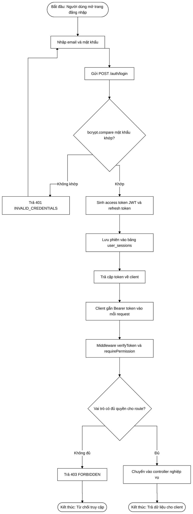
```mermaid
%%{init: {
  'theme': 'base',
  'themeVariables': {
    'primaryColor': '#ffffff',
    'primaryBorderColor': '#000000',
    'primaryTextColor': '#000000',
    'secondaryColor': '#ffffff',
    'secondaryBorderColor': '#000000',
    'secondaryTextColor': '#000000',
    'tertiaryColor': '#ffffff',
    'tertiaryBorderColor': '#000000',
    'tertiaryTextColor': '#000000',
    'lineColor': '#000000',
    'textColor': '#000000',
    'mainBkg': '#ffffff',
    'nodeBorder': '#000000',
    'clusterBkg': '#ffffff',
    'clusterBorder': '#000000',
    'edgeLabelBackground': '#ffffff',
    'fontSize': '14px'
  },
  'flowchart': { 'curve': 'stepAfter', 'nodeSpacing': 60, 'rankSpacing': 70, 'padding': 12, 'useMaxWidth': false }
}}%%
flowchart TD
    Start(["Bắt đầu: Người dùng mở trang đăng nhập"]) --> A["Nhập email và mật khẩu"]
    A --> B["Gửi POST /auth/login"]
    B --> C{"bcrypt.compare mật khẩu khớp?"}
    C -->|Không khớp| C1["Trả 401 INVALID_CREDENTIALS"]
    C1 --> A
    C -->|Khớp| Dn["Sinh access token JWT và refresh token"]
    Dn --> E["Lưu phiên vào bảng user_sessions"]
    E --> F["Trả cặp token về client"]
    F --> G["Client gắn Bearer token vào mỗi request"]
    G --> H["Middleware verifyToken và requirePermission"]
    H --> I{"Vai trò có đủ quyền cho route?"}
    I -->|Không đủ| I1["Trả 403 FORBIDDEN"]
    I1 --> End1(["Kết thúc: Từ chối truy cập"])
    I -->|Đủ| J["Chuyển vào controller nghiệp vụ"]
    J --> End2(["Kết thúc: Trả dữ liệu cho client"])
```

---

## 2.4.2 Sơ đồ chức năng

Phân rã chức năng hệ thống theo các phân hệ (mỗi phân hệ tương ứng một module backend + feature frontend).

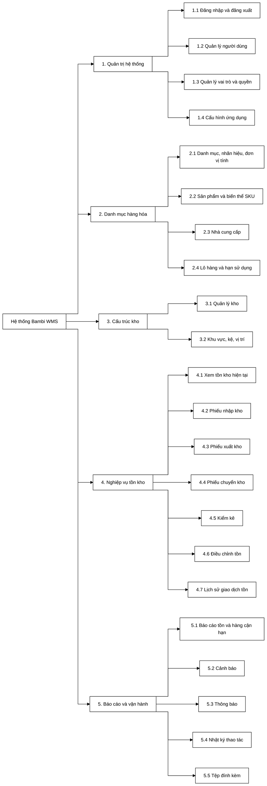
```mermaid
%%{init: {
  'theme': 'base',
  'themeVariables': {
    'primaryColor': '#ffffff',
    'primaryBorderColor': '#000000',
    'primaryTextColor': '#000000',
    'secondaryColor': '#ffffff',
    'secondaryBorderColor': '#000000',
    'secondaryTextColor': '#000000',
    'tertiaryColor': '#ffffff',
    'tertiaryBorderColor': '#000000',
    'tertiaryTextColor': '#000000',
    'lineColor': '#000000',
    'textColor': '#000000',
    'mainBkg': '#ffffff',
    'nodeBorder': '#000000',
    'clusterBkg': '#ffffff',
    'clusterBorder': '#000000',
    'edgeLabelBackground': '#ffffff',
    'fontSize': '14px'
  },
  'flowchart': { 'curve': 'stepAfter', 'nodeSpacing': 60, 'rankSpacing': 70, 'padding': 12, 'useMaxWidth': false }
}}%%
flowchart LR
    ROOT["Hệ thống Bambi WMS"]
    ROOT --> A["1. Quản trị hệ thống"]
    ROOT --> B["2. Danh mục hàng hóa"]
    ROOT --> C["3. Cấu trúc kho"]
    ROOT --> Dm["4. Nghiệp vụ tồn kho"]
    ROOT --> E["5. Báo cáo và vận hành"]

    A --> A1["1.1 Đăng nhập và đăng xuất"]
    A --> A2["1.2 Quản lý người dùng"]
    A --> A3["1.3 Quản lý vai trò và quyền"]
    A --> A4["1.4 Cấu hình ứng dụng"]

    B --> B1["2.1 Danh mục, nhãn hiệu, đơn vị tính"]
    B --> B2["2.2 Sản phẩm và biến thể SKU"]
    B --> B3["2.3 Nhà cung cấp"]
    B --> B4["2.4 Lô hàng và hạn sử dụng"]

    C --> C1["3.1 Quản lý kho"]
    C --> C2["3.2 Khu vực, kệ, vị trí"]

    Dm --> D1["4.1 Xem tồn kho hiện tại"]
    Dm --> D2["4.2 Phiếu nhập kho"]
    Dm --> D3["4.3 Phiếu xuất kho"]
    Dm --> D4["4.4 Phiếu chuyển kho"]
    Dm --> D5["4.5 Kiểm kê"]
    Dm --> D6["4.6 Điều chỉnh tồn"]
    Dm --> D7["4.7 Lịch sử giao dịch tồn"]

    E --> E1["5.1 Báo cáo tồn và hàng cận hạn"]
    E --> E2["5.2 Cảnh báo"]
    E --> E3["5.3 Thông báo"]
    E --> E4["5.4 Nhật ký thao tác"]
    E --> E5["5.5 Tệp đính kèm"]
```

---

## 2.4.3 Sơ đồ Use case tổng quát

### Mô tả các Actor

| Actor | Mô tả |
| --- | --- |
| **Nhân viên kho (Staff)** | Người trực tiếp thao tác: tạo phiếu nhập/xuất/chuyển, đếm kiểm kê, xem tồn. Vai trò mặc định khi đăng ký. |
| **Quản lý kho (Warehouse Manager)** | Có quyền **xác nhận/duyệt** chứng từ (confirm receipt/issue/transfer, approve adjustment/count), reverse giao dịch, xử lý cảnh báo. |
| **Quản trị viên (Admin)** | Quản lý người dùng, vai trò, quyền, cấu hình hệ thống, danh mục nền. |
| **Hệ thống (System)** | Actor phụ (thời gian/tự động): sinh cảnh báo tồn thấp/near-expiry, sinh thông báo, ghi audit log. |

### Sơ đồ Use case tổng quát

> Sơ đồ vẽ theo đúng notation UML: actor là hình người que đặt ngoài ranh giới hệ thống, use case là hình elip đặt trong khung `Hệ thống Bambi WMS`, đường liên kết (association) là nét liền gấp khúc 90° và không cắt nhau. Quan hệ dùng chung (Đăng nhập, Xem báo cáo) được nêu ở bảng mô tả bên dưới.
>
> Sơ đồ này viết bằng **PlantUML** (`docs/diagrams/09_2-4-3_so-do-use-case-tong-quat_flow.puml`) vì Mermaid không có ký hiệu chuẩn cho use case diagram; 53 sơ đồ còn lại vẫn dùng Mermaid.

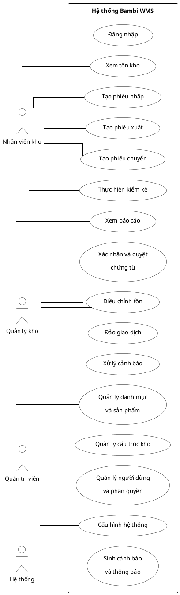
```plantuml
@startuml
skinparam shadowing false
skinparam linetype ortho
skinparam defaultFontSize 13
skinparam padding 6
skinparam roundcorner 6
skinparam backgroundColor #ffffff
skinparam ArrowColor #000000
skinparam nodesep 22
skinparam ranksep 70
skinparam usecase {
  BackgroundColor #ffffff
  BorderColor #000000
  FontColor #000000
}
skinparam actor {
  BackgroundColor #ffffff
  BorderColor #000000
  FontColor #000000
}
skinparam rectangle {
  BackgroundColor #ffffff
  BorderColor #000000
  FontColor #000000
}
left to right direction

actor "Nhân viên kho" as Staff
actor "Quản lý kho" as Manager
actor "Quản trị viên" as Admin
actor "Hệ thống" as Sys

rectangle "Hệ thống Bambi WMS" {
  usecase "Đăng nhập" as UC01
  usecase "Xem tồn kho" as UC02
  usecase "Tạo phiếu nhập" as UC03
  usecase "Tạo phiếu xuất" as UC04
  usecase "Tạo phiếu chuyển" as UC05
  usecase "Thực hiện kiểm kê" as UC06
  usecase "Xem báo cáo" as UC07
  usecase "Xác nhận và duyệt\nchứng từ" as UC08
  usecase "Điều chỉnh tồn" as UC09
  usecase "Đảo giao dịch" as UC10
  usecase "Xử lý cảnh báo" as UC11
  usecase "Quản lý danh mục\nvà sản phẩm" as UC12
  usecase "Quản lý cấu trúc kho" as UC13
  usecase "Quản lý người dùng\nvà phân quyền" as UC14
  usecase "Cấu hình hệ thống" as UC15
  usecase "Sinh cảnh báo\nvà thông báo" as UC16
}

Staff -- UC01
Staff -- UC02
Staff -- UC03
Staff -- UC04
Staff -- UC05
Staff -- UC06
Staff -- UC07

Manager -- UC08
Manager -- UC09
Manager -- UC10
Manager -- UC11

Admin -- UC12
Admin -- UC13
Admin -- UC14
Admin -- UC15

Sys -- UC16
@enduml
```

### Mô tả sơ lược các Use case

| Use case | Actor chính | Mô tả sơ lược |
| --- | --- | --- |
| Đăng nhập | Tất cả | Xác thực email/mật khẩu, cấp access + refresh token. |
| Quản lý danh mục và sản phẩm | Admin | CRUD category, brand, unit, product, product variant (SKU). |
| Quản lý cấu trúc kho | Admin | CRUD kho, khu (zone), kệ (shelf), vị trí (location). |
| Xem tồn kho | Staff, Manager | Xem tồn hiện tại theo SKU/vị trí/lô, hàng gần hết hạn. |
| Tạo phiếu nhập | Staff | Soạn phiếu nhập từ NCC, thêm dòng hàng + lô/hạn. |
| Tạo phiếu xuất | Staff | Soạn phiếu xuất theo FEFO/FIFO. |
| Tạo phiếu chuyển | Staff | Soạn phiếu chuyển vị trí/kho. |
| Kiểm kê | Staff | Đếm thực tế, nộp kết quả để duyệt. |
| Điều chỉnh tồn | Manager | Soạn phiếu điều chỉnh, gửi duyệt. |
| Xác nhận/Duyệt chứng từ | Manager | Confirm phiếu nhập/xuất/chuyển; approve kiểm kê/điều chỉnh → cập nhật tồn. |
| Đảo giao dịch (Reverse) | Manager | Đảo phiếu đã xác nhận, sinh giao dịch REVERSAL. |
| Xem báo cáo | Staff, Manager | Báo cáo tồn, near-expiry, biến động. |
| Quản lý người dùng và phân quyền | Admin | CRUD user, gán role, gán permission cho role. |
| Cấu hình hệ thống | Admin | Chỉnh `app_settings`. |
| Sinh cảnh báo và thông báo | System | Tự động sinh alert tồn thấp/hết hạn, notification. |
| Xử lý cảnh báo | Manager | Đánh dấu đã đọc/đã xử lý cảnh báo. |

---

# CHƯƠNG 3: THIẾT KẾ

## 3.1 Mô hình dữ liệu

### 3.1.1 Mức ý niệm (Conceptual)

Mô hình dữ liệu được chia thành **6 phân hệ**. Sơ đồ dưới đây là bản đồ quan hệ mức ý niệm giữa các phân hệ (các thực thể chi tiết xem ở mức luận lý 3.1.2). Cách trình bày theo phân hệ giúp các đường quan hệ **không cắt nhau** và mỗi sơ đồ vừa một khổ trang.

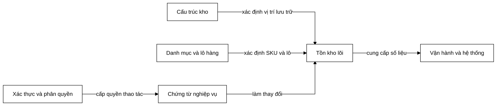
```mermaid
%%{init: {
  'theme': 'base',
  'themeVariables': {
    'primaryColor': '#ffffff',
    'primaryBorderColor': '#000000',
    'primaryTextColor': '#000000',
    'secondaryColor': '#ffffff',
    'secondaryBorderColor': '#000000',
    'secondaryTextColor': '#000000',
    'tertiaryColor': '#ffffff',
    'tertiaryBorderColor': '#000000',
    'tertiaryTextColor': '#000000',
    'lineColor': '#000000',
    'textColor': '#000000',
    'mainBkg': '#ffffff',
    'nodeBorder': '#000000',
    'clusterBkg': '#ffffff',
    'clusterBorder': '#000000',
    'edgeLabelBackground': '#ffffff',
    'fontSize': '14px'
  },
  'flowchart': { 'curve': 'stepAfter', 'nodeSpacing': 60, 'rankSpacing': 70, 'padding': 12, 'useMaxWidth': false }
}}%%
flowchart LR
    A["Xác thực và phân quyền"]
    B["Cấu trúc kho"]
    C["Danh mục và lô hàng"]
    Dc["Tồn kho lõi"]
    E["Chứng từ nghiệp vụ"]
    F["Vận hành và hệ thống"]

    A -->|cấp quyền thao tác| E
    B -->|xác định vị trí lưu trữ| Dc
    C -->|xác định SKU và lô| Dc
    E -->|làm thay đổi| Dc
    Dc -->|cung cấp số liệu| F
```

| Phân hệ | Thực thể ý niệm chính |
| --- | --- |
| Xác thực và Phân quyền | Người dùng, Vai trò, Quyền, Phiên đăng nhập |
| Cấu trúc kho | Kho, Khu vực, Kệ, Vị trí |
| Danh mục và Lô hàng | Danh mục, Nhãn hiệu, Đơn vị, Sản phẩm, Biến thể (SKU), Nhà cung cấp, Lô hàng |
| Tồn kho lõi | Tồn theo vị trí (Stock), Giao dịch tồn (Inventory Transaction) |
| Chứng từ nghiệp vụ | Phiếu nhập/xuất/chuyển/kiểm kê/điều chỉnh và dòng chi tiết |
| Vận hành và Hệ thống | Cảnh báo, Thông báo, Nhật ký, Tệp đính kèm, Cấu hình |

### 3.1.2 Mức luận lý (Logical)

Chi tiết từng phân hệ kèm khóa chính (PK), khóa ngoại (FK) và thuộc tính tiêu biểu. Mỗi phân hệ là một ERD con riêng để tránh đường cắt nhau.

**a) Phân hệ Xác thực và Phân quyền**

Sơ đồ trả lời câu hỏi: tài khoản, vai trò, quyền và phiên đăng nhập liên kết với nhau ra sao.

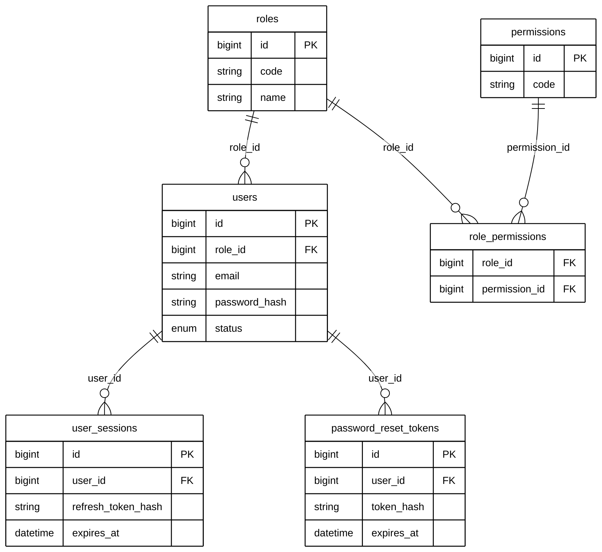
```mermaid
%%{init: {
  'theme': 'base',
  'themeVariables': {
    'primaryColor': '#ffffff',
    'primaryBorderColor': '#000000',
    'primaryTextColor': '#000000',
    'secondaryColor': '#ffffff',
    'secondaryBorderColor': '#000000',
    'secondaryTextColor': '#000000',
    'tertiaryColor': '#ffffff',
    'tertiaryBorderColor': '#000000',
    'tertiaryTextColor': '#000000',
    'lineColor': '#000000',
    'textColor': '#000000',
    'mainBkg': '#ffffff',
    'nodeBorder': '#000000',
    'clusterBkg': '#ffffff',
    'clusterBorder': '#000000',
    'edgeLabelBackground': '#ffffff',
    'fontSize': '14px',
    'attributeBackgroundColorOdd': '#ffffff',
    'attributeBackgroundColorEven': '#ffffff'
  },
  'er': { 'entityPadding': 12, 'minEntityWidth': 130, 'useMaxWidth': false }
}}%%
erDiagram
    roles ||--o{ users : role_id
    roles ||--o{ role_permissions : role_id
    permissions ||--o{ role_permissions : permission_id
    users ||--o{ user_sessions : user_id
    users ||--o{ password_reset_tokens : user_id

    roles {
        bigint id PK
        string code
        string name
    }
    permissions {
        bigint id PK
        string code
    }
    role_permissions {
        bigint role_id FK
        bigint permission_id FK
    }
    users {
        bigint id PK
        bigint role_id FK
        string email
        string password_hash
        enum status
    }
    user_sessions {
        bigint id PK
        bigint user_id FK
        string refresh_token_hash
        datetime expires_at
    }
    password_reset_tokens {
        bigint id PK
        bigint user_id FK
        string token_hash
        datetime expires_at
    }
```

**b) Phân hệ Cấu trúc kho**

Sơ đồ trả lời câu hỏi: kho được phân rã tới vị trí lưu trữ theo mấy cấp và người dùng gắn với kho nào.

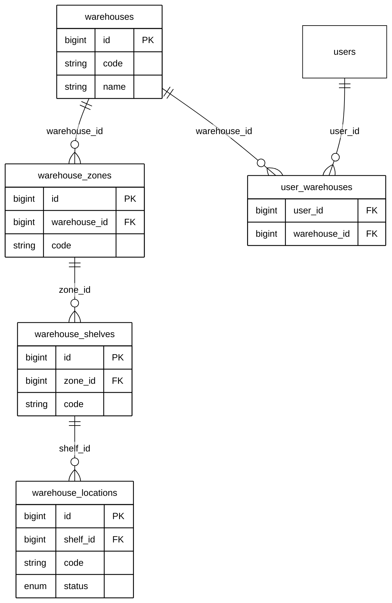
```mermaid
%%{init: {
  'theme': 'base',
  'themeVariables': {
    'primaryColor': '#ffffff',
    'primaryBorderColor': '#000000',
    'primaryTextColor': '#000000',
    'secondaryColor': '#ffffff',
    'secondaryBorderColor': '#000000',
    'secondaryTextColor': '#000000',
    'tertiaryColor': '#ffffff',
    'tertiaryBorderColor': '#000000',
    'tertiaryTextColor': '#000000',
    'lineColor': '#000000',
    'textColor': '#000000',
    'mainBkg': '#ffffff',
    'nodeBorder': '#000000',
    'clusterBkg': '#ffffff',
    'clusterBorder': '#000000',
    'edgeLabelBackground': '#ffffff',
    'fontSize': '14px',
    'attributeBackgroundColorOdd': '#ffffff',
    'attributeBackgroundColorEven': '#ffffff'
  },
  'er': { 'entityPadding': 12, 'minEntityWidth': 130, 'useMaxWidth': false }
}}%%
erDiagram
    warehouses ||--o{ warehouse_zones : warehouse_id
    warehouse_zones ||--o{ warehouse_shelves : zone_id
    warehouse_shelves ||--o{ warehouse_locations : shelf_id
    warehouses ||--o{ user_warehouses : warehouse_id
    users ||--o{ user_warehouses : user_id

    warehouses {
        bigint id PK
        string code
        string name
    }
    warehouse_zones {
        bigint id PK
        bigint warehouse_id FK
        string code
    }
    warehouse_shelves {
        bigint id PK
        bigint zone_id FK
        string code
    }
    warehouse_locations {
        bigint id PK
        bigint shelf_id FK
        string code
        enum status
    }
    user_warehouses {
        bigint user_id FK
        bigint warehouse_id FK
    }
```

**c) Phân hệ Danh mục và Lô hàng**

Sơ đồ trả lời câu hỏi: một SKU được mô tả bởi những bảng danh mục nào và lô hàng gắn vào đâu.

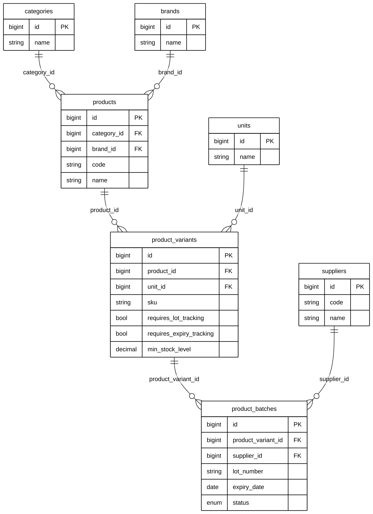
```mermaid
%%{init: {
  'theme': 'base',
  'themeVariables': {
    'primaryColor': '#ffffff',
    'primaryBorderColor': '#000000',
    'primaryTextColor': '#000000',
    'secondaryColor': '#ffffff',
    'secondaryBorderColor': '#000000',
    'secondaryTextColor': '#000000',
    'tertiaryColor': '#ffffff',
    'tertiaryBorderColor': '#000000',
    'tertiaryTextColor': '#000000',
    'lineColor': '#000000',
    'textColor': '#000000',
    'mainBkg': '#ffffff',
    'nodeBorder': '#000000',
    'clusterBkg': '#ffffff',
    'clusterBorder': '#000000',
    'edgeLabelBackground': '#ffffff',
    'fontSize': '14px',
    'attributeBackgroundColorOdd': '#ffffff',
    'attributeBackgroundColorEven': '#ffffff'
  },
  'er': { 'entityPadding': 12, 'minEntityWidth': 130, 'useMaxWidth': false }
}}%%
erDiagram
    categories ||--o{ products : category_id
    brands ||--o{ products : brand_id
    products ||--o{ product_variants : product_id
    units ||--o{ product_variants : unit_id
    product_variants ||--o{ product_batches : product_variant_id
    suppliers ||--o{ product_batches : supplier_id

    categories {
        bigint id PK
        string name
    }
    brands {
        bigint id PK
        string name
    }
    units {
        bigint id PK
        string name
    }
    suppliers {
        bigint id PK
        string code
        string name
    }
    products {
        bigint id PK
        bigint category_id FK
        bigint brand_id FK
        string code
        string name
    }
    product_variants {
        bigint id PK
        bigint product_id FK
        bigint unit_id FK
        string sku
        bool requires_lot_tracking
        bool requires_expiry_tracking
        decimal min_stock_level
    }
    product_batches {
        bigint id PK
        bigint product_variant_id FK
        bigint supplier_id FK
        string lot_number
        date expiry_date
        enum status
    }
```

**d) Phân hệ Tồn theo vị trí (`stock_locations`)**

Sơ đồ trả lời câu hỏi: tồn kho được lưu ở mức chi tiết nào — theo SKU, theo vị trí hay theo lô.

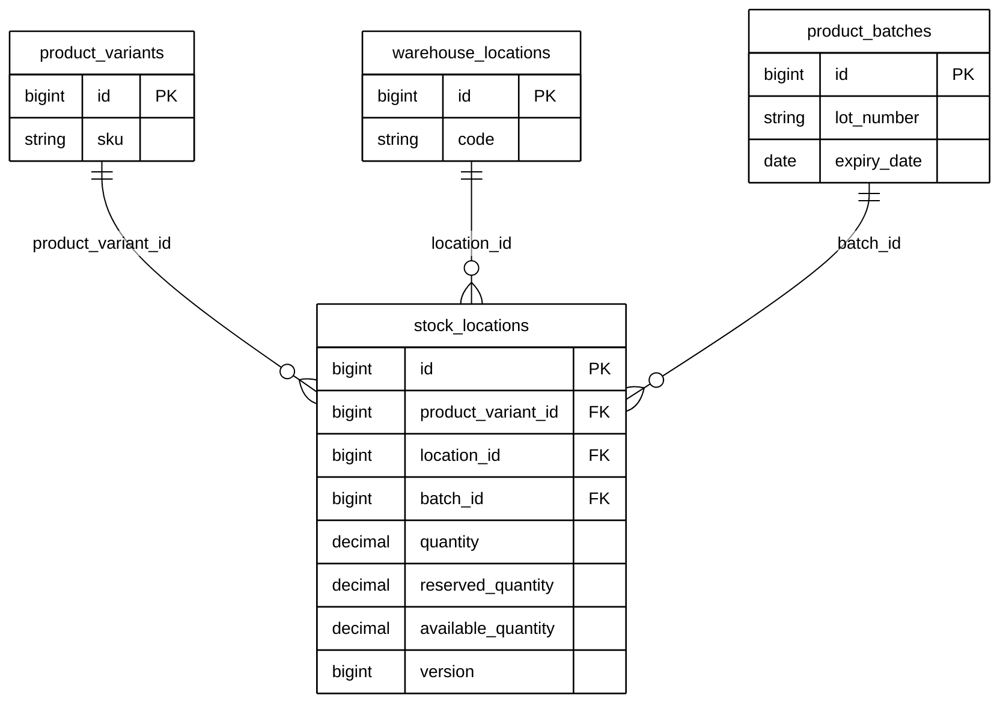
```mermaid
%%{init: {
  'theme': 'base',
  'themeVariables': {
    'primaryColor': '#ffffff',
    'primaryBorderColor': '#000000',
    'primaryTextColor': '#000000',
    'secondaryColor': '#ffffff',
    'secondaryBorderColor': '#000000',
    'secondaryTextColor': '#000000',
    'tertiaryColor': '#ffffff',
    'tertiaryBorderColor': '#000000',
    'tertiaryTextColor': '#000000',
    'lineColor': '#000000',
    'textColor': '#000000',
    'mainBkg': '#ffffff',
    'nodeBorder': '#000000',
    'clusterBkg': '#ffffff',
    'clusterBorder': '#000000',
    'edgeLabelBackground': '#ffffff',
    'fontSize': '14px',
    'attributeBackgroundColorOdd': '#ffffff',
    'attributeBackgroundColorEven': '#ffffff'
  },
  'er': { 'entityPadding': 12, 'minEntityWidth': 130, 'useMaxWidth': false }
}}%%
erDiagram
    product_variants ||--o{ stock_locations : product_variant_id
    warehouse_locations ||--o{ stock_locations : location_id
    product_batches ||--o{ stock_locations : batch_id

    product_variants {
        bigint id PK
        string sku
    }
    warehouse_locations {
        bigint id PK
        string code
    }
    product_batches {
        bigint id PK
        string lot_number
        date expiry_date
    }
    stock_locations {
        bigint id PK
        bigint product_variant_id FK
        bigint location_id FK
        bigint batch_id FK
        decimal quantity
        decimal reserved_quantity
        decimal available_quantity
        bigint version
    }
```

**e) Phân hệ Lịch sử giao dịch (`inventory_transactions`)**

Sơ đồ trả lời câu hỏi: mỗi biến động tồn được ghi lại kèm những thông tin truy vết nào.

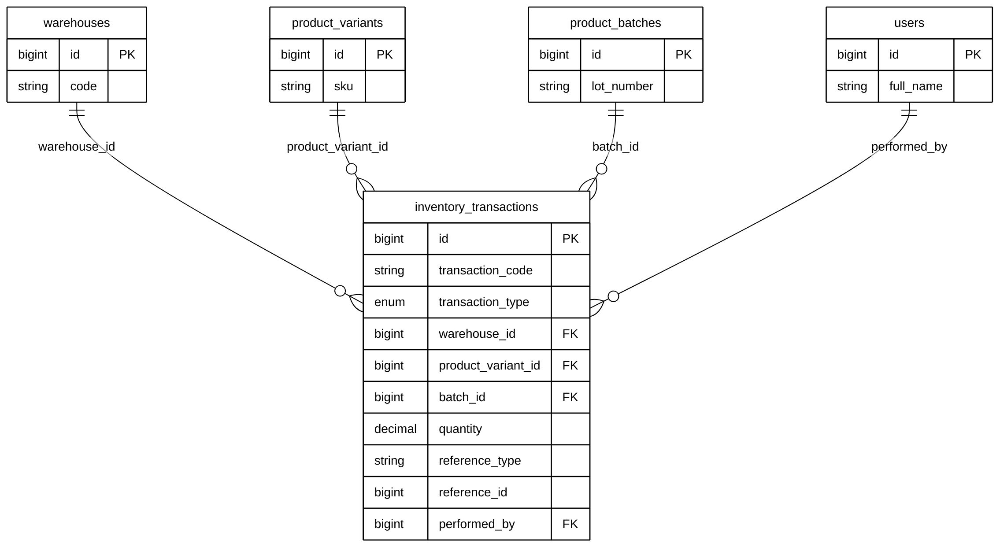
```mermaid
%%{init: {
  'theme': 'base',
  'themeVariables': {
    'primaryColor': '#ffffff',
    'primaryBorderColor': '#000000',
    'primaryTextColor': '#000000',
    'secondaryColor': '#ffffff',
    'secondaryBorderColor': '#000000',
    'secondaryTextColor': '#000000',
    'tertiaryColor': '#ffffff',
    'tertiaryBorderColor': '#000000',
    'tertiaryTextColor': '#000000',
    'lineColor': '#000000',
    'textColor': '#000000',
    'mainBkg': '#ffffff',
    'nodeBorder': '#000000',
    'clusterBkg': '#ffffff',
    'clusterBorder': '#000000',
    'edgeLabelBackground': '#ffffff',
    'fontSize': '14px',
    'attributeBackgroundColorOdd': '#ffffff',
    'attributeBackgroundColorEven': '#ffffff'
  },
  'er': { 'entityPadding': 12, 'minEntityWidth': 130, 'useMaxWidth': false }
}}%%
erDiagram
    warehouses ||--o{ inventory_transactions : warehouse_id
    product_variants ||--o{ inventory_transactions : product_variant_id
    product_batches ||--o{ inventory_transactions : batch_id
    users ||--o{ inventory_transactions : performed_by

    warehouses {
        bigint id PK
        string code
    }
    product_variants {
        bigint id PK
        string sku
    }
    product_batches {
        bigint id PK
        string lot_number
    }
    users {
        bigint id PK
        string full_name
    }
    inventory_transactions {
        bigint id PK
        string transaction_code
        enum transaction_type
        bigint warehouse_id FK
        bigint product_variant_id FK
        bigint batch_id FK
        decimal quantity
        string reference_type
        bigint reference_id
        bigint performed_by FK
    }
```

**f) Phân hệ Chứng từ nghiệp vụ**

Năm loại chứng từ có cấu trúc giống nhau: một bảng *phiếu* (header) và một bảng *dòng chi tiết* (item). Sơ đồ liệt kê đủ cả năm cặp bảng, chỉ giữ khóa chính, khóa ngoại và thuộc tính tiêu biểu của mỗi bảng.

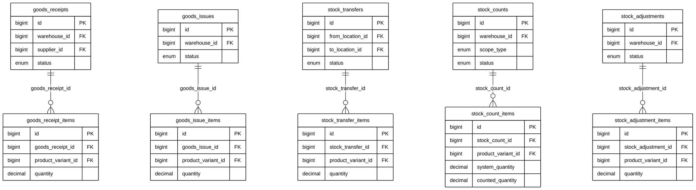
```mermaid
%%{init: {
  'theme': 'base',
  'themeVariables': {
    'primaryColor': '#ffffff',
    'primaryBorderColor': '#000000',
    'primaryTextColor': '#000000',
    'secondaryColor': '#ffffff',
    'secondaryBorderColor': '#000000',
    'secondaryTextColor': '#000000',
    'tertiaryColor': '#ffffff',
    'tertiaryBorderColor': '#000000',
    'tertiaryTextColor': '#000000',
    'lineColor': '#000000',
    'textColor': '#000000',
    'mainBkg': '#ffffff',
    'nodeBorder': '#000000',
    'clusterBkg': '#ffffff',
    'clusterBorder': '#000000',
    'edgeLabelBackground': '#ffffff',
    'fontSize': '14px',
    'attributeBackgroundColorOdd': '#ffffff',
    'attributeBackgroundColorEven': '#ffffff'
  },
  'er': { 'entityPadding': 12, 'minEntityWidth': 130, 'useMaxWidth': false }
}}%%
erDiagram
    goods_receipts ||--o{ goods_receipt_items : goods_receipt_id
    goods_issues ||--o{ goods_issue_items : goods_issue_id
    stock_transfers ||--o{ stock_transfer_items : stock_transfer_id
    stock_counts ||--o{ stock_count_items : stock_count_id
    stock_adjustments ||--o{ stock_adjustment_items : stock_adjustment_id

    goods_receipts {
        bigint id PK
        bigint warehouse_id FK
        bigint supplier_id FK
        enum status
    }
    goods_receipt_items {
        bigint id PK
        bigint goods_receipt_id FK
        bigint product_variant_id FK
        decimal quantity
    }
    goods_issues {
        bigint id PK
        bigint warehouse_id FK
        enum status
    }
    goods_issue_items {
        bigint id PK
        bigint goods_issue_id FK
        bigint product_variant_id FK
        decimal quantity
    }
    stock_transfers {
        bigint id PK
        bigint from_location_id FK
        bigint to_location_id FK
        enum status
    }
    stock_transfer_items {
        bigint id PK
        bigint stock_transfer_id FK
        bigint product_variant_id FK
        decimal quantity
    }
    stock_counts {
        bigint id PK
        bigint warehouse_id FK
        enum scope_type
        enum status
    }
    stock_count_items {
        bigint id PK
        bigint stock_count_id FK
        bigint product_variant_id FK
        decimal system_quantity
        decimal counted_quantity
    }
    stock_adjustments {
        bigint id PK
        bigint warehouse_id FK
        enum status
    }
    stock_adjustment_items {
        bigint id PK
        bigint stock_adjustment_id FK
        bigint product_variant_id FK
        decimal quantity
    }
```

> Liên kết giữa các phân hệ: `stock_locations` và `inventory_transactions` (phân hệ d, e) tham chiếu tới `product_variants`, `warehouse_locations`, `product_batches` (phân hệ b, c); các dòng chứng từ (phân hệ f) tham chiếu `product_variants`. Việc tách phân hệ chỉ nhằm trình bày rõ ràng, không thay đổi ràng buộc khóa ngoại thực tế trong CSDL.

### 3.1.3 Mức vật lý (Physical)

Kiểu dữ liệu, ràng buộc, generated column, index thực tế của MySQL 8. Trích các bảng lõi tồn kho.

**Bảng `product_variants` (SKU)**

| Cột | Kiểu | Ràng buộc |
| --- | --- | --- |
| id | BIGINT UNSIGNED | PK, AUTO_INCREMENT |
| product_id | BIGINT UNSIGNED | FK → products(id) |
| unit_id | BIGINT UNSIGNED | FK → units(id) |
| sku | VARCHAR(100) | UNIQUE, NOT NULL |
| barcode | VARCHAR(100) | UNIQUE, NULL |
| requires_lot_tracking | BOOLEAN | DEFAULT FALSE |
| requires_expiry_tracking | BOOLEAN | DEFAULT FALSE |
| min_stock_level | DECIMAL(18,3) | DEFAULT 0, CHECK ≥ 0 |
| max_stock_level | DECIMAL(18,3) | NULL, CHECK ≥ min |
| status | ENUM('ACTIVE','INACTIVE','DISCONTINUED') | DEFAULT 'ACTIVE' |
| deleted_at | DATETIME(3) | NULL (soft delete) |

**Bảng `product_batches` (Lô/hạn dùng)**

| Cột | Kiểu | Ràng buộc |
| --- | --- | --- |
| id | BIGINT UNSIGNED | PK |
| product_variant_id | BIGINT UNSIGNED | FK → product_variants(id) |
| supplier_id | BIGINT UNSIGNED | FK → suppliers(id), NULL |
| lot_number | VARCHAR(100) | UNIQUE(variant, lot) |
| manufacture_date | DATE | NULL |
| expiry_date | DATE | NULL, CHECK expiry > manufacture |
| status | ENUM('ACTIVE','NEAR_EXPIRY','EXPIRED','BLOCKED','DEPLETED') | DEFAULT 'ACTIVE' |

**Bảng `stock_locations` (Tồn hiện tại — nguồn sự thật)**

| Cột | Kiểu | Ràng buộc / Ghi chú |
| --- | --- | --- |
| id | BIGINT UNSIGNED | PK |
| product_variant_id | BIGINT UNSIGNED | FK → product_variants(id) |
| location_id | BIGINT UNSIGNED | FK → warehouse_locations(id) |
| batch_id | BIGINT UNSIGNED | FK → product_batches(id), NULL |
| quantity | DECIMAL(18,3) | DEFAULT 0, CHECK ≥ 0 |
| reserved_quantity | DECIMAL(18,3) | DEFAULT 0, CHECK ≤ quantity |
| version | BIGINT UNSIGNED | Optimistic locking |
| batch_key | BIGINT UNSIGNED | **GENERATED** `IFNULL(batch_id, 0)` STORED |
| available_quantity | DECIMAL(18,3) | **GENERATED** `quantity - reserved_quantity` STORED |
| — | — | **UNIQUE(product_variant_id, location_id, batch_key)** |

> `batch_key` giải quyết vấn đề MySQL cho phép nhiều NULL trong unique index — nhờ đó bộ khóa tồn kho vẫn duy nhất khi hàng không có lô.

**Bảng `inventory_transactions` (Lịch sử biến động — append-only)**

| Cột | Kiểu | Ghi chú |
| --- | --- | --- |
| id | BIGINT UNSIGNED | PK |
| transaction_code | VARCHAR(80) | UNIQUE |
| transaction_type | ENUM | RECEIPT, ISSUE, TRANSFER_IN/OUT, COUNT_ADJUSTMENT_IN/OUT, MANUAL_ADJUSTMENT_IN/OUT, RETURN_IN/OUT, INITIAL_STOCK, REVERSAL |
| warehouse_id | BIGINT UNSIGNED | FK → warehouses(id) |
| product_variant_id | BIGINT UNSIGNED | FK → product_variants(id) |
| batch_id | BIGINT UNSIGNED | FK → product_batches(id), NULL |
| source_location_id / destination_location_id | BIGINT UNSIGNED | FK → warehouse_locations(id) |
| quantity | DECIMAL(18,3) | CHECK > 0 |
| quantity_before / quantity_after | DECIMAL(18,3) | Snapshot tồn |
| reference_type / reference_id | VARCHAR/BIGINT | Trỏ về phiếu gốc |
| reversal_of_transaction_id | BIGINT UNSIGNED | FK tự tham chiếu (đảo giao dịch) |
| performed_by / approved_by | BIGINT UNSIGNED | FK → users(id) |

**View báo cáo:** `vw_current_stock`, `vw_product_total_stock`, `vw_near_expiry_stock`.

Toàn bộ 38 bảng chia 6 nhóm: xác thực/phân quyền, cấu trúc kho, danh mục, tồn kho, chứng từ nghiệp vụ, hệ thống. Chi tiết đầy đủ xem [backend/warehouse_management_mysql.sql](backend/warehouse_management_mysql.sql).

---

## 3.2 Mô hình xử lý

### 3.2.1 Use case chi tiết (kèm bảng mô tả)

#### UC-05: Tạo và xác nhận phiếu nhập kho

| Mục | Nội dung |
| --- | --- |
| **Mã UC** | UC-05 |
| **Tên** | Nhập kho (Goods Receipt) |
| **Actor** | Nhân viên kho (tạo), Quản lý kho (xác nhận) |
| **Mô tả** | Ghi nhận hàng nhập từ NCC, tăng tồn khi xác nhận |
| **Tiền điều kiện** | Đã đăng nhập; đã có kho, NCC, SKU; người xác nhận có quyền `goods_receipts:confirm` |
| **Hậu điều kiện** | Phiếu CONFIRMED; `stock_locations` tăng; có bản ghi `inventory_transactions` type RECEIPT |
| **Luồng chính** | 1. Chọn kho + NCC → 2. Thêm dòng (SKU, SL, lô, hạn, vị trí) → 3. Lưu DRAFT → 4. Quản lý xác nhận → 5. Hệ thống tạo/khớp lô → 6. Tăng tồn → 7. Ghi giao dịch → 8. Phiếu CONFIRMED |
| **Luồng phụ / ngoại lệ** | 4a. Thiếu quyền → 403; 5a. SKU yêu cầu lô nhưng thiếu → lỗi validation; 6a. Lỗi DB → ROLLBACK, phiếu giữ DRAFT |

#### UC-06: Tạo và xác nhận phiếu xuất kho

| Mục | Nội dung |
| --- | --- |
| **Mã UC** | UC-06 |
| **Tên** | Xuất kho (Goods Issue) |
| **Actor** | Nhân viên kho (tạo), Quản lý kho (xác nhận) |
| **Mô tả** | Xuất hàng, giảm tồn, phân bổ FEFO/FIFO |
| **Tiền điều kiện** | Đã đăng nhập; SKU có tồn khả dụng; quyền `goods_issues:confirm` |
| **Hậu điều kiện** | Phiếu CONFIRMED; tồn giảm; giao dịch ISSUE cho từng lô phân bổ |
| **Luồng chính** | 1. Tạo phiếu, chọn chiến lược FEFO/FIFO → 2. Thêm dòng (SKU, SL) → 3. Lưu DRAFT → 4. Xác nhận → 5. Khóa tồn FOR UPDATE → 6. Phân bổ theo lô hết hạn sớm → 7. Giảm tồn + ghi giao dịch → 8. COMMIT |
| **Ngoại lệ** | 5a. Tồn không đủ → `INSUFFICIENT_STOCK`, ROLLBACK; 6a. Xung đột version → `CONCURRENT_UPDATE` |

#### UC-09: Điều chỉnh tồn kho

| Mục | Nội dung |
| --- | --- |
| **Mã UC** | UC-09 |
| **Tên** | Điều chỉnh tồn (Stock Adjustment) |
| **Actor** | Quản lý kho (tạo và gửi), Quản lý khác (duyệt) |
| **Mô tả** | Chỉnh tồn do hư hỏng/mất mát; bắt buộc duyệt bởi người khác |
| **Tiền điều kiện** | Đăng nhập; quyền `stock_adjustments:approve` để duyệt |
| **Hậu điều kiện** | APPROVED → tồn thay đổi + giao dịch MANUAL_ADJUSTMENT_IN/OUT |
| **Luồng chính** | 1. Tạo DRAFT → 2. Gửi duyệt (PENDING) → 3. Người khác duyệt → 4. Cập nhật tồn + ghi giao dịch |
| **Quy tắc** | Người tạo **không được** tự duyệt phiếu của mình |

#### UC-08: Kiểm kê

| Mục | Nội dung |
| --- | --- |
| **Mã UC** | UC-08 |
| **Actor** | Nhân viên kho, Quản lý kho |
| **Mô tả** | Đếm thực tế và đối chiếu, chênh lệch sinh điều chỉnh |
| **Luồng trạng thái** | DRAFT → IN_PROGRESS (start) → ghi count từng dòng → SUBMITTED (submit) → APPROVED/REJECTED |
| **Hậu điều kiện (APPROVED)** | Chênh lệch dương → COUNT_ADJUSTMENT_IN; âm → COUNT_ADJUSTMENT_OUT |

### 3.2.2 Sơ đồ tuần tự (Sequence)

Kiến trúc lớp mỗi request: `Routes → Middleware (auth/permission) → Controller → Validation (Zod) → Service → Repository → MySQL`.

#### Sequence 1: Đăng nhập

Sơ đồ trả lời câu hỏi: các lớp nào tham gia vào một lần đăng nhập và hệ thống trả gì về khi mật khẩu sai.

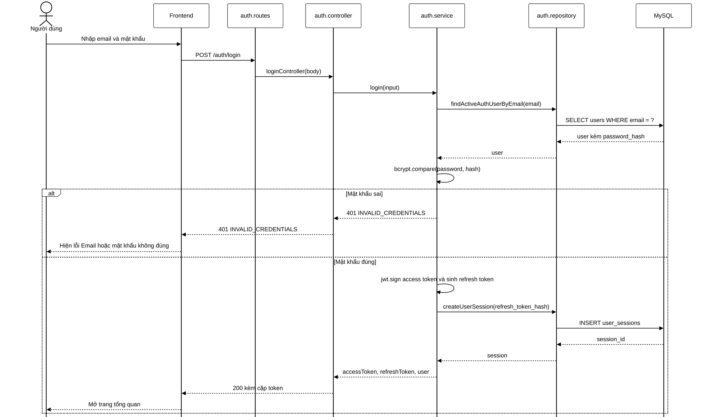
```mermaid
%%{init: {
  'theme': 'base',
  'themeVariables': {
    'primaryColor': '#ffffff',
    'primaryBorderColor': '#000000',
    'primaryTextColor': '#000000',
    'secondaryColor': '#ffffff',
    'secondaryBorderColor': '#000000',
    'secondaryTextColor': '#000000',
    'tertiaryColor': '#ffffff',
    'tertiaryBorderColor': '#000000',
    'tertiaryTextColor': '#000000',
    'lineColor': '#000000',
    'textColor': '#000000',
    'mainBkg': '#ffffff',
    'nodeBorder': '#000000',
    'clusterBkg': '#ffffff',
    'clusterBorder': '#000000',
    'edgeLabelBackground': '#ffffff',
    'fontSize': '14px',
    'actorBkg': '#ffffff',
    'actorBorder': '#000000',
    'actorTextColor': '#000000',
    'actorLineColor': '#000000',
    'signalColor': '#000000',
    'signalTextColor': '#000000',
    'labelBoxBkgColor': '#ffffff',
    'labelBoxBorderColor': '#000000',
    'labelTextColor': '#000000',
    'loopTextColor': '#000000',
    'noteBkgColor': '#ffffff',
    'noteBorderColor': '#000000',
    'noteTextColor': '#000000',
    'activationBkgColor': '#ffffff',
    'activationBorderColor': '#000000',
    'altBackground': '#ffffff'
  },
  'sequence': { 'mirrorActors': false, 'messageMargin': 40, 'boxMargin': 10, 'useMaxWidth': false }
}}%%
sequenceDiagram
    actor U as Người dùng
    participant FE as Frontend
    participant R as auth.routes
    participant C as auth.controller
    participant S as auth.service
    participant Repo as auth.repository
    participant DB as MySQL

    U->>FE: Nhập email và mật khẩu
    FE->>R: POST /auth/login
    R->>C: loginController(body)
    C->>S: login(input)
    S->>Repo: findActiveAuthUserByEmail(email)
    Repo->>DB: SELECT users WHERE email = ?
    DB-->>Repo: user kèm password_hash
    Repo-->>S: user
    S->>S: bcrypt.compare(password, hash)
    alt Mật khẩu sai
        S-->>C: 401 INVALID_CREDENTIALS
        C-->>FE: 401 INVALID_CREDENTIALS
        FE-->>U: Hiện lỗi Email hoặc mật khẩu không đúng
    else Mật khẩu đúng
        S->>S: jwt.sign access token và sinh refresh token
        S->>Repo: createUserSession(refresh_token_hash)
        Repo->>DB: INSERT user_sessions
        DB-->>Repo: session_id
        Repo-->>S: session
        S-->>C: accessToken, refreshToken, user
        C-->>FE: 200 kèm cặp token
        FE-->>U: Mở trang tổng quan
    end
```

#### Sequence 2: Xác nhận phiếu xuất kho (FEFO) — nghiệp vụ lõi

Sơ đồ trả lời câu hỏi: khi xác nhận phiếu xuất, hệ thống khóa và trừ tồn theo FEFO ở bước nào, và trả lỗi gì khi tồn không đủ.

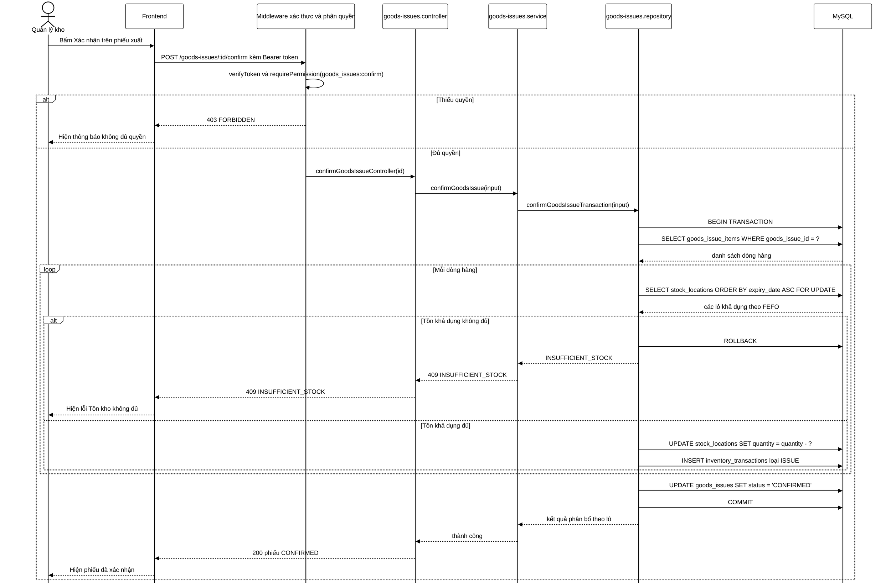
```mermaid
%%{init: {
  'theme': 'base',
  'themeVariables': {
    'primaryColor': '#ffffff',
    'primaryBorderColor': '#000000',
    'primaryTextColor': '#000000',
    'secondaryColor': '#ffffff',
    'secondaryBorderColor': '#000000',
    'secondaryTextColor': '#000000',
    'tertiaryColor': '#ffffff',
    'tertiaryBorderColor': '#000000',
    'tertiaryTextColor': '#000000',
    'lineColor': '#000000',
    'textColor': '#000000',
    'mainBkg': '#ffffff',
    'nodeBorder': '#000000',
    'clusterBkg': '#ffffff',
    'clusterBorder': '#000000',
    'edgeLabelBackground': '#ffffff',
    'fontSize': '14px',
    'actorBkg': '#ffffff',
    'actorBorder': '#000000',
    'actorTextColor': '#000000',
    'actorLineColor': '#000000',
    'signalColor': '#000000',
    'signalTextColor': '#000000',
    'labelBoxBkgColor': '#ffffff',
    'labelBoxBorderColor': '#000000',
    'labelTextColor': '#000000',
    'loopTextColor': '#000000',
    'noteBkgColor': '#ffffff',
    'noteBorderColor': '#000000',
    'noteTextColor': '#000000',
    'activationBkgColor': '#ffffff',
    'activationBorderColor': '#000000',
    'altBackground': '#ffffff'
  },
  'sequence': { 'mirrorActors': false, 'messageMargin': 40, 'boxMargin': 10, 'useMaxWidth': false }
}}%%
sequenceDiagram
    actor M as Quản lý kho
    participant FE as Frontend
    participant MW as Middleware xác thực và phân quyền
    participant C as goods-issues.controller
    participant S as goods-issues.service
    participant Repo as goods-issues.repository
    participant DB as MySQL

    M->>FE: Bấm Xác nhận trên phiếu xuất
    FE->>MW: POST /goods-issues/:id/confirm kèm Bearer token
    MW->>MW: verifyToken và requirePermission(goods_issues:confirm)
    alt Thiếu quyền
        MW-->>FE: 403 FORBIDDEN
        FE-->>M: Hiện thông báo không đủ quyền
    else Đủ quyền
        MW->>C: confirmGoodsIssueController(id)
        C->>S: confirmGoodsIssue(input)
        S->>Repo: confirmGoodsIssueTransaction(input)
        Repo->>DB: BEGIN TRANSACTION
        Repo->>DB: SELECT goods_issue_items WHERE goods_issue_id = ?
        DB-->>Repo: danh sách dòng hàng
        loop Mỗi dòng hàng
            Repo->>DB: SELECT stock_locations ORDER BY expiry_date ASC FOR UPDATE
            DB-->>Repo: các lô khả dụng theo FEFO
            alt Tồn khả dụng không đủ
                Repo->>DB: ROLLBACK
                Repo-->>S: INSUFFICIENT_STOCK
                S-->>C: 409 INSUFFICIENT_STOCK
                C-->>FE: 409 INSUFFICIENT_STOCK
                FE-->>M: Hiện lỗi Tồn kho không đủ
            else Tồn khả dụng đủ
                Repo->>DB: UPDATE stock_locations SET quantity = quantity - ?
                Repo->>DB: INSERT inventory_transactions loại ISSUE
            end
        end
        Repo->>DB: UPDATE goods_issues SET status = 'CONFIRMED'
        Repo->>DB: COMMIT
        Repo-->>S: kết quả phân bổ theo lô
        S-->>C: thành công
        C-->>FE: 200 phiếu CONFIRMED
        FE-->>M: Hiện phiếu đã xác nhận
    end
```

#### Sequence 3: Tạo phiếu nhập kho

Sơ đồ trả lời câu hỏi: dữ liệu phiếu nhập được kiểm tra ở đâu trước khi ghi xuống cơ sở dữ liệu.

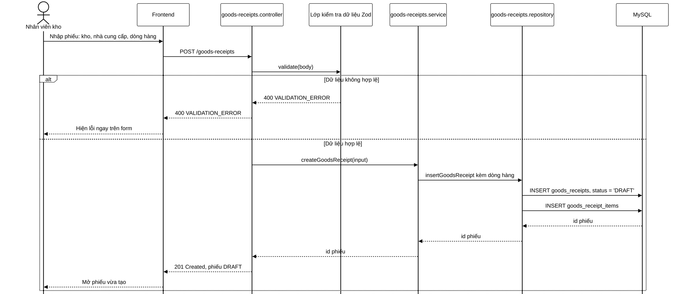
```mermaid
%%{init: {
  'theme': 'base',
  'themeVariables': {
    'primaryColor': '#ffffff',
    'primaryBorderColor': '#000000',
    'primaryTextColor': '#000000',
    'secondaryColor': '#ffffff',
    'secondaryBorderColor': '#000000',
    'secondaryTextColor': '#000000',
    'tertiaryColor': '#ffffff',
    'tertiaryBorderColor': '#000000',
    'tertiaryTextColor': '#000000',
    'lineColor': '#000000',
    'textColor': '#000000',
    'mainBkg': '#ffffff',
    'nodeBorder': '#000000',
    'clusterBkg': '#ffffff',
    'clusterBorder': '#000000',
    'edgeLabelBackground': '#ffffff',
    'fontSize': '14px',
    'actorBkg': '#ffffff',
    'actorBorder': '#000000',
    'actorTextColor': '#000000',
    'actorLineColor': '#000000',
    'signalColor': '#000000',
    'signalTextColor': '#000000',
    'labelBoxBkgColor': '#ffffff',
    'labelBoxBorderColor': '#000000',
    'labelTextColor': '#000000',
    'loopTextColor': '#000000',
    'noteBkgColor': '#ffffff',
    'noteBorderColor': '#000000',
    'noteTextColor': '#000000',
    'activationBkgColor': '#ffffff',
    'activationBorderColor': '#000000',
    'altBackground': '#ffffff'
  },
  'sequence': { 'mirrorActors': false, 'messageMargin': 40, 'boxMargin': 10, 'useMaxWidth': false }
}}%%
sequenceDiagram
    actor St as Nhân viên kho
    participant FE as Frontend
    participant C as goods-receipts.controller
    participant V as Lớp kiểm tra dữ liệu Zod
    participant S as goods-receipts.service
    participant Repo as goods-receipts.repository
    participant DB as MySQL

    St->>FE: Nhập phiếu: kho, nhà cung cấp, dòng hàng
    FE->>C: POST /goods-receipts
    C->>V: validate(body)
    alt Dữ liệu không hợp lệ
        V-->>C: 400 VALIDATION_ERROR
        C-->>FE: 400 VALIDATION_ERROR
        FE-->>St: Hiện lỗi ngay trên form
    else Dữ liệu hợp lệ
        C->>S: createGoodsReceipt(input)
        S->>Repo: insertGoodsReceipt kèm dòng hàng
        Repo->>DB: INSERT goods_receipts, status = 'DRAFT'
        Repo->>DB: INSERT goods_receipt_items
        DB-->>Repo: id phiếu
        Repo-->>S: id phiếu
        S-->>C: id phiếu
        C-->>FE: 201 Created, phiếu DRAFT
        FE-->>St: Mở phiếu vừa tạo
    end
```

#### Sequence 4: Duyệt phiếu điều chỉnh tồn

Sơ đồ trả lời câu hỏi: hệ thống chặn hành vi tự duyệt phiếu điều chỉnh ở bước nào.

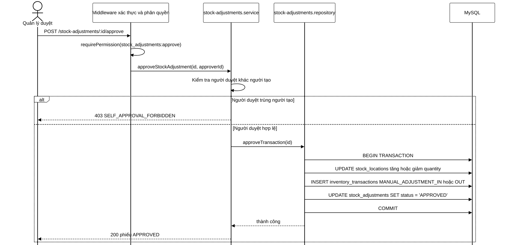
```mermaid
%%{init: {
  'theme': 'base',
  'themeVariables': {
    'primaryColor': '#ffffff',
    'primaryBorderColor': '#000000',
    'primaryTextColor': '#000000',
    'secondaryColor': '#ffffff',
    'secondaryBorderColor': '#000000',
    'secondaryTextColor': '#000000',
    'tertiaryColor': '#ffffff',
    'tertiaryBorderColor': '#000000',
    'tertiaryTextColor': '#000000',
    'lineColor': '#000000',
    'textColor': '#000000',
    'mainBkg': '#ffffff',
    'nodeBorder': '#000000',
    'clusterBkg': '#ffffff',
    'clusterBorder': '#000000',
    'edgeLabelBackground': '#ffffff',
    'fontSize': '14px',
    'actorBkg': '#ffffff',
    'actorBorder': '#000000',
    'actorTextColor': '#000000',
    'actorLineColor': '#000000',
    'signalColor': '#000000',
    'signalTextColor': '#000000',
    'labelBoxBkgColor': '#ffffff',
    'labelBoxBorderColor': '#000000',
    'labelTextColor': '#000000',
    'loopTextColor': '#000000',
    'noteBkgColor': '#ffffff',
    'noteBorderColor': '#000000',
    'noteTextColor': '#000000',
    'activationBkgColor': '#ffffff',
    'activationBorderColor': '#000000',
    'altBackground': '#ffffff'
  },
  'sequence': { 'mirrorActors': false, 'messageMargin': 40, 'boxMargin': 10, 'useMaxWidth': false }
}}%%
sequenceDiagram
    actor M as Quản lý duyệt
    participant MW as Middleware xác thực và phân quyền
    participant S as stock-adjustments.service
    participant Repo as stock-adjustments.repository
    participant DB as MySQL

    M->>MW: POST /stock-adjustments/:id/approve
    MW->>MW: requirePermission(stock_adjustments:approve)
    MW->>S: approveStockAdjustment(id, approverId)
    S->>S: Kiểm tra người duyệt khác người tạo
    alt Người duyệt trùng người tạo
        S-->>M: 403 SELF_APPROVAL_FORBIDDEN
    else Người duyệt hợp lệ
        S->>Repo: approveTransaction(id)
        Repo->>DB: BEGIN TRANSACTION
        Repo->>DB: UPDATE stock_locations tăng hoặc giảm quantity
        Repo->>DB: INSERT inventory_transactions MANUAL_ADJUSTMENT_IN hoặc OUT
        Repo->>DB: UPDATE stock_adjustments SET status = 'APPROVED'
        Repo->>DB: COMMIT
        Repo-->>S: thành công
        S-->>M: 200 phiếu APPROVED
    end
```

### 3.2.3 Sơ đồ hoạt động (Activity)

#### Activity 1: Xác nhận phiếu xuất kho theo FEFO

Sơ đồ trả lời câu hỏi: một lần xác nhận phiếu xuất xử lý lần lượt từng dòng hàng như thế nào trong một giao dịch.

```mermaid
%%{init: {
  'theme': 'base',
  'themeVariables': {
    'primaryColor': '#ffffff',
    'primaryBorderColor': '#000000',
    'primaryTextColor': '#000000',
    'secondaryColor': '#ffffff',
    'secondaryBorderColor': '#000000',
    'secondaryTextColor': '#000000',
    'tertiaryColor': '#ffffff',
    'tertiaryBorderColor': '#000000',
    'tertiaryTextColor': '#000000',
    'lineColor': '#000000',
    'textColor': '#000000',
    'mainBkg': '#ffffff',
    'nodeBorder': '#000000',
    'clusterBkg': '#ffffff',
    'clusterBorder': '#000000',
    'edgeLabelBackground': '#ffffff',
    'fontSize': '14px'
  },
  'flowchart': { 'curve': 'stepAfter', 'nodeSpacing': 60, 'rankSpacing': 70, 'padding': 12, 'useMaxWidth': false }
}}%%
flowchart TD
    Start(["Bắt đầu: Người dùng bấm Xác nhận"]) --> A["Xác thực token và kiểm tra quyền"]
    A --> B{"Có quyền goods_issues:confirm?"}
    B -->|Không| B1["Trả 403 FORBIDDEN"]
    B1 --> End1(["Kết thúc: Phiếu giữ nguyên DRAFT"])
    B -->|Có| C["BEGIN TRANSACTION"]
    C --> Dr["Đọc danh sách dòng hàng của phiếu"]
    Dr --> E["Chọn dòng hàng tiếp theo"]
    E --> F["Khóa các lô tồn FOR UPDATE, sắp xếp hết hạn sớm trước"]
    F --> G{"Tổng tồn khả dụng đủ số cần xuất?"}
    G -->|Không đủ| G1["ROLLBACK, trả lỗi INSUFFICIENT_STOCK"]
    G1 --> End2(["Kết thúc: Tồn kho không đổi"])
    G -->|Đủ| H["Phân bổ số lượng vào từng lô theo FEFO"]
    H --> I["Giảm quantity của từng lô"]
    I --> J["Ghi inventory_transactions loại ISSUE"]
    J --> K{"Còn dòng hàng chưa xử lý?"}
    K -->|Còn| E
    K -->|Hết| L["Đổi trạng thái phiếu sang CONFIRMED"]
    L --> Mc["COMMIT"]
    Mc --> N["Sinh cảnh báo nếu tồn xuống dưới mức tối thiểu"]
    N --> End3(["Kết thúc: Xuất kho thành công"])
```

#### Activity 2: Quy trình kiểm kê

Sơ đồ trả lời câu hỏi: kết quả kiểm kê được đối chiếu và chuyển thành giao dịch điều chỉnh ở bước nào.

```mermaid
%%{init: {
  'theme': 'base',
  'themeVariables': {
    'primaryColor': '#ffffff',
    'primaryBorderColor': '#000000',
    'primaryTextColor': '#000000',
    'secondaryColor': '#ffffff',
    'secondaryBorderColor': '#000000',
    'secondaryTextColor': '#000000',
    'tertiaryColor': '#ffffff',
    'tertiaryBorderColor': '#000000',
    'tertiaryTextColor': '#000000',
    'lineColor': '#000000',
    'textColor': '#000000',
    'mainBkg': '#ffffff',
    'nodeBorder': '#000000',
    'clusterBkg': '#ffffff',
    'clusterBorder': '#000000',
    'edgeLabelBackground': '#ffffff',
    'fontSize': '14px'
  },
  'flowchart': { 'curve': 'stepAfter', 'nodeSpacing': 60, 'rankSpacing': 70, 'padding': 12, 'useMaxWidth': false }
}}%%
flowchart TD
    Start(["Bắt đầu: Tạo phiếu kiểm kê DRAFT"]) --> A["Chọn phạm vi kiểm kê: kho, khu vực hoặc SKU"]
    A --> B["Bắt đầu đếm, chuyển IN_PROGRESS, chốt danh sách dòng"]
    B --> C["Nhân viên ghi số lượng thực đếm từng dòng"]
    C --> Dq{"Đã đếm hết các dòng?"}
    Dq -->|Chưa| C
    Dq -->|Rồi| E["Nộp kết quả, chuyển SUBMITTED"]
    E --> F{"Quản lý duyệt kết quả?"}
    F -->|Từ chối| F1["Chuyển REJECTED, tồn kho không đổi"]
    F1 --> End1(["Kết thúc: Phiếu bị từ chối"])
    F -->|Duyệt| G["So sánh số thực đếm với tồn hệ thống"]
    G --> H{"Có chênh lệch không?"}
    H -->|Không| K["Chuyển APPROVED, giữ nguyên tồn"]
    H -->|Thừa| I1["Ghi COUNT_ADJUSTMENT_IN, tăng tồn"]
    H -->|Thiếu| I2["Ghi COUNT_ADJUSTMENT_OUT, giảm tồn"]
    I1 --> K
    I2 --> K
    K --> End2(["Kết thúc: Kiểm kê đã được duyệt"])
```

#### Activity 3: Phân quyền request bất kỳ

Sơ đồ trả lời câu hỏi: một request bất kỳ bị chặn ở đâu khi thiếu token hoặc thiếu quyền.

```mermaid
%%{init: {
  'theme': 'base',
  'themeVariables': {
    'primaryColor': '#ffffff',
    'primaryBorderColor': '#000000',
    'primaryTextColor': '#000000',
    'secondaryColor': '#ffffff',
    'secondaryBorderColor': '#000000',
    'secondaryTextColor': '#000000',
    'tertiaryColor': '#ffffff',
    'tertiaryBorderColor': '#000000',
    'tertiaryTextColor': '#000000',
    'lineColor': '#000000',
    'textColor': '#000000',
    'mainBkg': '#ffffff',
    'nodeBorder': '#000000',
    'clusterBkg': '#ffffff',
    'clusterBorder': '#000000',
    'edgeLabelBackground': '#ffffff',
    'fontSize': '14px'
  },
  'flowchart': { 'curve': 'stepAfter', 'nodeSpacing': 60, 'rankSpacing': 70, 'padding': 12, 'useMaxWidth': false }
}}%%
flowchart TD
    Start(["Bắt đầu: Nhận HTTP request"]) --> A["app.ts định tuyến request"]
    A --> B{"Route yêu cầu quyền?"}
    B -->|Không| F["Chuyển vào controller, service, repository"]
    B -->|Có| C["verifyToken: giải mã và kiểm tra JWT"]
    C --> Dq{"Token hợp lệ và còn hạn?"}
    Dq -->|Không| D1["Trả 401 TOKEN_INVALID"]
    D1 --> End1(["Kết thúc: Từ chối truy cập"])
    Dq -->|Có| G["requirePermission: tra bảng role_permissions"]
    G --> H{"Vai trò có quyền yêu cầu?"}
    H -->|Không| H1["Trả 403 FORBIDDEN"]
    H1 --> End1
    H -->|Có| F
    F --> I["Trả JSON bọc trong trường data"]
    I --> End2(["Kết thúc: Trả dữ liệu thành công"])
```

---

## Phụ lục A: Bản đồ module ↔ chức năng ↔ bảng dữ liệu

| Module backend | Base path | Chức năng | Bảng chính |
| --- | --- | --- | --- |
| auth | `/auth` | Đăng nhập, token, phiên, user | users, user_sessions, password_reset_tokens |
| authorization | `/authorization` | Role và permission | roles, permissions, role_permissions |
| warehouses | `/warehouses` | Quản lý kho | warehouses, user_warehouses |
| locations | `/locations` | Khu/kệ/vị trí | warehouse_zones, warehouse_shelves, warehouse_locations |
| catalog (products) | `/catalog` | Danh mục, SP, SKU | categories, brands, units, products, product_variants |
| suppliers (partners) | `/suppliers` | Nhà cung cấp | suppliers, supplier_products |
| batches | `/batches` | Lô/hạn dùng | product_batches |
| stock | `/stock` | Tồn hiện tại, near-expiry, allocation | stock_locations |
| inventory-transactions | `/inventory-transactions` | Lịch sử biến động | inventory_transactions |
| goods-receipts | `/goods-receipts` | Phiếu nhập | goods_receipts, goods_receipt_items |
| goods-issues | `/goods-issues` | Phiếu xuất | goods_issues, goods_issue_items |
| stock-transfers | `/stock-transfers` | Chuyển kho | stock_transfers, stock_transfer_items |
| stock-counts | `/stock-counts` | Kiểm kê | stock_counts, stock_count_items |
| stock-adjustments | `/stock-adjustments` | Điều chỉnh tồn | stock_adjustments, stock_adjustment_items |
| reports | `/reports` | Báo cáo | các view vw_* |
| alerts | `/alerts` | Cảnh báo | alerts |
| notifications | `/notifications` | Thông báo | notifications |
| audit-logs | `/audit-logs` | Nhật ký | audit_logs |
| attachments | `/attachments` | Tệp đính kèm | attachments |
| settings | `/settings` | Cấu hình | app_settings |

## Phụ lục B: Bảng quyền (permission) theo nghiệp vụ

| Nhóm | Quyền |
| --- | --- |
| Người dùng | users:read, users:create, users:update, users:delete |
| Phân quyền | authorization:read, authorization:update |
| Kho | warehouses:create, warehouses:update, warehouses:delete |
| Nhập kho | goods_receipts:confirm, goods_receipts:reverse |
| Xuất kho | goods_issues:confirm, goods_issues:reverse |
| Chuyển kho | stock_transfers:confirm, stock_transfers:reverse |
| Điều chỉnh | stock_adjustments:approve, stock_adjustments:reject, stock_adjustments:cancel |
| Kiểm kê | stock_counts:create, :start, :count, :submit, :approve |
| Cảnh báo | alerts:generate, alerts:read, alerts:resolve |
| Thông báo | notifications:generate, notifications:read |

---

## 3.3 Sơ đồ chi tiết cho từng chức năng

Mục này đặc tả **mỗi chức năng nghiệp vụ** bằng đủ **4 loại sơ đồ**: (1) Bảng đặc tả Use case, (2) Sơ đồ tuần tự (Sequence), (3) Sơ đồ hoạt động (Activity), (4) Sơ đồ trạng thái (State). Áp dụng cho 7 chức năng chính.

### 3.3.1 Chức năng: Nhập kho (Goods Receipt)

**(1) Bảng đặc tả Use case**

| Mục | Nội dung |
| --- | --- |
| Mã / Tên | F01 — Nhập kho |
| Actor | Nhân viên kho (soạn), Quản lý kho (xác nhận) |
| Mục tiêu | Ghi nhận hàng từ NCC, **tăng** tồn khi CONFIRMED |
| Tiền điều kiện | Đăng nhập; đã có kho, NCC, SKU; quyền `goods_receipts:confirm` |
| Kích hoạt | Nhân viên bấm "Tạo phiếu nhập" |
| Luồng chính | 1. Chọn kho + NCC → 2. Thêm dòng (SKU, SL, lô, hạn, vị trí) → 3. Lưu DRAFT → 4. Quản lý confirm → 5. Tạo/khớp lô → 6. Tăng `stock_locations` → 7. Ghi giao dịch RECEIPT → 8. CONFIRMED |
| Luồng phụ | Reverse: phiếu CONFIRMED → sinh giao dịch REVERSAL, giảm lại tồn, phiếu chuyển `CANCELLED` |
| Ngoại lệ | Thiếu quyền → 403; SKU cần lô nhưng thiếu `batch_id` → lỗi validation; phiếu rỗng → `GOODS_RECEIPT_HAS_NO_ITEMS`; lỗi DB → ROLLBACK |
| Hậu điều kiện | Tồn tăng; có `inventory_transactions` type RECEIPT |

**(2) Sơ đồ tuần tự**

Sơ đồ trả lời câu hỏi: xác nhận phiếu nhập đi qua những lớp nào và dừng ở đâu khi SKU cần lô nhưng thiếu batch_id.

```mermaid
%%{init: {
  'theme': 'base',
  'themeVariables': {
    'primaryColor': '#ffffff',
    'primaryBorderColor': '#000000',
    'primaryTextColor': '#000000',
    'secondaryColor': '#ffffff',
    'secondaryBorderColor': '#000000',
    'secondaryTextColor': '#000000',
    'tertiaryColor': '#ffffff',
    'tertiaryBorderColor': '#000000',
    'tertiaryTextColor': '#000000',
    'lineColor': '#000000',
    'textColor': '#000000',
    'mainBkg': '#ffffff',
    'nodeBorder': '#000000',
    'clusterBkg': '#ffffff',
    'clusterBorder': '#000000',
    'edgeLabelBackground': '#ffffff',
    'fontSize': '14px',
    'actorBkg': '#ffffff',
    'actorBorder': '#000000',
    'actorTextColor': '#000000',
    'actorLineColor': '#000000',
    'signalColor': '#000000',
    'signalTextColor': '#000000',
    'labelBoxBkgColor': '#ffffff',
    'labelBoxBorderColor': '#000000',
    'labelTextColor': '#000000',
    'loopTextColor': '#000000',
    'noteBkgColor': '#ffffff',
    'noteBorderColor': '#000000',
    'noteTextColor': '#000000',
    'activationBkgColor': '#ffffff',
    'activationBorderColor': '#000000',
    'altBackground': '#ffffff'
  },
  'sequence': { 'mirrorActors': false, 'messageMargin': 40, 'boxMargin': 10, 'useMaxWidth': false }
}}%%
sequenceDiagram
    actor M as Quản lý kho
    participant MW as Middleware xác thực và phân quyền
    participant C as goods-receipts.controller
    participant S as goods-receipts.service
    participant Repo as goods-receipts.repository
    participant DB as MySQL

    M->>MW: POST /goods-receipts/:id/confirm
    MW->>MW: verifyToken và requirePermission(goods_receipts:confirm)
    MW->>C: confirmGoodsReceiptController(id)
    C->>S: confirmGoodsReceipt(id)
    S->>S: Kiểm tra phiếu đang DRAFT hoặc PENDING và có dòng hàng
    S->>Repo: confirmTransaction(id)
    Repo->>DB: BEGIN TRANSACTION
    loop Mỗi dòng hàng
        alt SKU cần theo lô nhưng thiếu batch_id
            Repo->>DB: ROLLBACK
            Repo-->>S: LOT_TRACKING_REQUIRES_BATCH
            S-->>C: 422 LOT_TRACKING_REQUIRES_BATCH
            C-->>M: 422 kèm dòng hàng bị lỗi
        else Dòng hàng hợp lệ
            Repo->>DB: INSERT hoặc UPDATE product_batches
            Repo->>DB: UPSERT stock_locations, tăng quantity
            Repo->>DB: INSERT inventory_transactions loại RECEIPT
        end
    end
    Repo->>DB: UPDATE goods_receipts SET status = 'CONFIRMED'
    Repo->>DB: COMMIT
    Repo-->>S: thành công
    S-->>C: thành công
    C-->>M: 200 phiếu CONFIRMED
```

**(3) Sơ đồ hoạt động**

Sơ đồ trả lời câu hỏi: người dùng thao tác theo trình tự nào để đưa một phiếu nhập từ DRAFT tới CONFIRMED.

```mermaid
%%{init: {
  'theme': 'base',
  'themeVariables': {
    'primaryColor': '#ffffff',
    'primaryBorderColor': '#000000',
    'primaryTextColor': '#000000',
    'secondaryColor': '#ffffff',
    'secondaryBorderColor': '#000000',
    'secondaryTextColor': '#000000',
    'tertiaryColor': '#ffffff',
    'tertiaryBorderColor': '#000000',
    'tertiaryTextColor': '#000000',
    'lineColor': '#000000',
    'textColor': '#000000',
    'mainBkg': '#ffffff',
    'nodeBorder': '#000000',
    'clusterBkg': '#ffffff',
    'clusterBorder': '#000000',
    'edgeLabelBackground': '#ffffff',
    'fontSize': '14px'
  },
  'flowchart': { 'curve': 'stepAfter', 'nodeSpacing': 60, 'rankSpacing': 70, 'padding': 12, 'useMaxWidth': false }
}}%%
flowchart TD
    Start(["Bắt đầu"]) --> B["Tạo phiếu: chọn kho và nhà cung cấp"]
    B --> C["Thêm dòng hàng: SKU, số lượng, vị trí nhập"]
    C --> Dq{"SKU yêu cầu theo dõi lô và hạn dùng?"}
    Dq -->|Có| E["Nhập số lô và hạn sử dụng"]
    Dq -->|Không| F["Bỏ qua thông tin lô"]
    E --> G["Lưu phiếu, trạng thái DRAFT"]
    F --> G
    G --> H{"Người xác nhận có quyền goods_receipts:confirm?"}
    H -->|Không| H1["Trả 403 FORBIDDEN"]
    H1 --> End1(["Kết thúc: Phiếu giữ nguyên DRAFT"])
    H -->|Có| I["BEGIN TRANSACTION"]
    I --> J{"Dòng cần lô đã có batch_id?"}
    J -->|Chưa có| J1["ROLLBACK, trả LOT_TRACKING_REQUIRES_BATCH"]
    J1 --> C
    J -->|Đã có| K["Tạo hoặc khớp bản ghi product_batches"]
    K --> L["Tăng quantity trong stock_locations"]
    L --> Mn["Ghi inventory_transactions loại RECEIPT"]
    Mn --> N["Đổi trạng thái CONFIRMED, COMMIT"]
    N --> End2(["Kết thúc: Nhập kho thành công"])
```

**(4) Sơ đồ trạng thái**

Sơ đồ trả lời câu hỏi: phiếu nhập kho có những trạng thái nào và thao tác đảo giao dịch đưa phiếu về đâu.

```mermaid
%%{init: {
  'theme': 'base',
  'themeVariables': {
    'primaryColor': '#ffffff',
    'primaryBorderColor': '#000000',
    'primaryTextColor': '#000000',
    'secondaryColor': '#ffffff',
    'secondaryBorderColor': '#000000',
    'secondaryTextColor': '#000000',
    'tertiaryColor': '#ffffff',
    'tertiaryBorderColor': '#000000',
    'tertiaryTextColor': '#000000',
    'lineColor': '#000000',
    'textColor': '#000000',
    'mainBkg': '#ffffff',
    'nodeBorder': '#000000',
    'clusterBkg': '#ffffff',
    'clusterBorder': '#000000',
    'edgeLabelBackground': '#ffffff',
    'fontSize': '14px',
    'labelBackgroundColor': '#ffffff'
  },
  'flowchart': { 'curve': 'stepAfter', 'nodeSpacing': 60, 'rankSpacing': 70, 'padding': 12 },
  'state': { 'padding': 12, 'useMaxWidth': false }
}}%%
stateDiagram-v2
    [*] --> DRAFT: tạo phiếu nhập
    DRAFT --> PENDING: gửi duyệt
    DRAFT --> CONFIRMED: xác nhận
    DRAFT --> CANCELLED: hủy phiếu
    PENDING --> CONFIRMED: xác nhận
    PENDING --> CANCELLED: hủy phiếu
    CONFIRMED --> CANCELLED: đảo giao dịch, sinh REVERSAL
    CONFIRMED --> [*]
    CANCELLED --> [*]
```

### 3.3.2 Chức năng: Xuất kho (Goods Issue)

**(1) Bảng đặc tả Use case**

| Mục | Nội dung |
| --- | --- |
| Mã / Tên | F02 — Xuất kho |
| Actor | Nhân viên kho (soạn), Quản lý kho (xác nhận) |
| Mục tiêu | Xuất hàng, **giảm** tồn, phân bổ theo FEFO/FIFO |
| Tiền điều kiện | Có tồn khả dụng; quyền `goods_issues:confirm` |
| Luồng chính | 1. Tạo phiếu + chọn FEFO/FIFO → 2. Thêm dòng (SKU, SL) → 3. Lưu DRAFT → 4. Confirm → 5. Khóa tồn FOR UPDATE → 6. Phân bổ theo lô hết hạn sớm → 7. Giảm tồn + ghi ISSUE → 8. CONFIRMED |
| Ngoại lệ | Tồn không đủ → `INSUFFICIENT_STOCK`; xung đột version → `CONCURRENT_UPDATE`; lô yêu cầu hạn nhưng thiếu → lỗi |
| Hậu điều kiện | Tồn giảm; giao dịch ISSUE cho từng lô đã phân bổ |

**(2) Sơ đồ tuần tự**

Sơ đồ trả lời câu hỏi: xác nhận phiếu xuất gọi qua những lớp nào và trả mã lỗi gì khi tồn không đủ.

```mermaid
%%{init: {
  'theme': 'base',
  'themeVariables': {
    'primaryColor': '#ffffff',
    'primaryBorderColor': '#000000',
    'primaryTextColor': '#000000',
    'secondaryColor': '#ffffff',
    'secondaryBorderColor': '#000000',
    'secondaryTextColor': '#000000',
    'tertiaryColor': '#ffffff',
    'tertiaryBorderColor': '#000000',
    'tertiaryTextColor': '#000000',
    'lineColor': '#000000',
    'textColor': '#000000',
    'mainBkg': '#ffffff',
    'nodeBorder': '#000000',
    'clusterBkg': '#ffffff',
    'clusterBorder': '#000000',
    'edgeLabelBackground': '#ffffff',
    'fontSize': '14px',
    'actorBkg': '#ffffff',
    'actorBorder': '#000000',
    'actorTextColor': '#000000',
    'actorLineColor': '#000000',
    'signalColor': '#000000',
    'signalTextColor': '#000000',
    'labelBoxBkgColor': '#ffffff',
    'labelBoxBorderColor': '#000000',
    'labelTextColor': '#000000',
    'loopTextColor': '#000000',
    'noteBkgColor': '#ffffff',
    'noteBorderColor': '#000000',
    'noteTextColor': '#000000',
    'activationBkgColor': '#ffffff',
    'activationBorderColor': '#000000',
    'altBackground': '#ffffff'
  },
  'sequence': { 'mirrorActors': false, 'messageMargin': 40, 'boxMargin': 10, 'useMaxWidth': false }
}}%%
sequenceDiagram
    actor M as Quản lý kho
    participant MW as Middleware xác thực và phân quyền
    participant S as goods-issues.service
    participant Repo as goods-issues.repository
    participant DB as MySQL

    M->>MW: POST /goods-issues/:id/confirm
    MW->>MW: requirePermission(goods_issues:confirm)
    MW->>S: confirmGoodsIssue(id)
    S->>Repo: confirmGoodsIssueTransaction(id)
    Repo->>DB: BEGIN TRANSACTION
    loop Mỗi dòng hàng
        Repo->>DB: SELECT stock_locations ORDER BY expiry_date ASC FOR UPDATE
        DB-->>Repo: các lô khả dụng theo FEFO
        alt Tồn khả dụng không đủ
            Repo->>DB: ROLLBACK
            Repo-->>S: INSUFFICIENT_STOCK
            S-->>M: 409 INSUFFICIENT_STOCK
        else Tồn khả dụng đủ
            Repo->>DB: UPDATE stock_locations SET quantity = quantity - ?
            Repo->>DB: INSERT inventory_transactions loại ISSUE
        end
    end
    Repo->>DB: UPDATE goods_issues SET status = 'CONFIRMED'
    Repo->>DB: COMMIT
    Repo-->>S: thành công
    S-->>M: 200 phiếu CONFIRMED
```

**(3) Sơ đồ hoạt động**

Sơ đồ trả lời câu hỏi: người dùng thao tác theo trình tự nào để xuất kho và hệ thống lặp xử lý từng dòng hàng ra sao.

```mermaid
%%{init: {
  'theme': 'base',
  'themeVariables': {
    'primaryColor': '#ffffff',
    'primaryBorderColor': '#000000',
    'primaryTextColor': '#000000',
    'secondaryColor': '#ffffff',
    'secondaryBorderColor': '#000000',
    'secondaryTextColor': '#000000',
    'tertiaryColor': '#ffffff',
    'tertiaryBorderColor': '#000000',
    'tertiaryTextColor': '#000000',
    'lineColor': '#000000',
    'textColor': '#000000',
    'mainBkg': '#ffffff',
    'nodeBorder': '#000000',
    'clusterBkg': '#ffffff',
    'clusterBorder': '#000000',
    'edgeLabelBackground': '#ffffff',
    'fontSize': '14px'
  },
  'flowchart': { 'curve': 'stepAfter', 'nodeSpacing': 60, 'rankSpacing': 70, 'padding': 12, 'useMaxWidth': false }
}}%%
flowchart TD
    Start(["Bắt đầu"]) --> B["Tạo phiếu xuất, chọn kho và lý do xuất"]
    B --> C["Thêm dòng hàng: SKU và số lượng"]
    C --> Dn["Lưu phiếu, trạng thái DRAFT"]
    Dn --> E{"Người xác nhận có quyền goods_issues:confirm?"}
    E -->|Không| E1["Trả 403 FORBIDDEN"]
    E1 --> End1(["Kết thúc: Phiếu giữ nguyên DRAFT"])
    E -->|Có| F["BEGIN TRANSACTION"]
    F --> G["Chọn dòng hàng tiếp theo, khóa tồn FOR UPDATE"]
    G --> H{"Tồn khả dụng đủ?"}
    H -->|Không đủ| H1["ROLLBACK, trả INSUFFICIENT_STOCK"]
    H1 --> End2(["Kết thúc: Tồn kho không đổi"])
    H -->|Đủ| I["Phân bổ theo FEFO: lô hết hạn sớm trước"]
    I --> J["Giảm quantity của từng lô"]
    J --> K["Ghi inventory_transactions loại ISSUE"]
    K --> L{"Còn dòng hàng chưa xử lý?"}
    L -->|Còn| G
    L -->|Hết| Mn["Đổi trạng thái CONFIRMED, COMMIT"]
    Mn --> End3(["Kết thúc: Xuất kho thành công"])
```

**(4) Sơ đồ trạng thái**

Sơ đồ trả lời câu hỏi: phiếu xuất kho có những trạng thái nào và thao tác đảo giao dịch đưa phiếu về đâu.

```mermaid
%%{init: {
  'theme': 'base',
  'themeVariables': {
    'primaryColor': '#ffffff',
    'primaryBorderColor': '#000000',
    'primaryTextColor': '#000000',
    'secondaryColor': '#ffffff',
    'secondaryBorderColor': '#000000',
    'secondaryTextColor': '#000000',
    'tertiaryColor': '#ffffff',
    'tertiaryBorderColor': '#000000',
    'tertiaryTextColor': '#000000',
    'lineColor': '#000000',
    'textColor': '#000000',
    'mainBkg': '#ffffff',
    'nodeBorder': '#000000',
    'clusterBkg': '#ffffff',
    'clusterBorder': '#000000',
    'edgeLabelBackground': '#ffffff',
    'fontSize': '14px',
    'labelBackgroundColor': '#ffffff'
  },
  'flowchart': { 'curve': 'stepAfter', 'nodeSpacing': 60, 'rankSpacing': 70, 'padding': 12 },
  'state': { 'padding': 12, 'useMaxWidth': false }
}}%%
stateDiagram-v2
    [*] --> DRAFT: tạo phiếu xuất
    DRAFT --> PENDING: gửi duyệt
    DRAFT --> CONFIRMED: xác nhận
    DRAFT --> CANCELLED: hủy phiếu
    PENDING --> CONFIRMED: xác nhận
    PENDING --> CANCELLED: hủy phiếu
    CONFIRMED --> CANCELLED: đảo giao dịch, sinh REVERSAL
    CONFIRMED --> [*]
    CANCELLED --> [*]
```

### 3.3.3 Chức năng: Chuyển kho (Stock Transfer)

**(1) Bảng đặc tả Use case**

| Mục | Nội dung |
| --- | --- |
| Mã / Tên | F03 — Chuyển kho |
| Actor | Nhân viên kho (soạn), Quản lý kho (xác nhận) |
| Mục tiêu | Di chuyển hàng giữa 2 vị trí/kho; sinh cặp TRANSFER_OUT + TRANSFER_IN |
| Tiền điều kiện | Vị trí nguồn có đủ tồn; vị trí đích hợp lệ; quyền `stock_transfers:confirm` |
| Luồng chính | 1. Chọn vị trí nguồn → đích → 2. Thêm dòng SKU + SL → 3. DRAFT → 4. Confirm → 5. Giảm tồn nguồn (TRANSFER_OUT) → 6. Tăng tồn đích (TRANSFER_IN) → 7. CONFIRMED |
| Ngoại lệ | Tồn nguồn không đủ → `INSUFFICIENT_STOCK`; vị trí đích khác kho không hợp lệ → lỗi |
| Hậu điều kiện | Tổng tồn không đổi; 2 giao dịch đối ứng |

**(2) Sơ đồ tuần tự**

Sơ đồ trả lời câu hỏi: một lần chuyển kho sinh cặp giao dịch TRANSFER_OUT và TRANSFER_IN ở bước nào.

```mermaid
%%{init: {
  'theme': 'base',
  'themeVariables': {
    'primaryColor': '#ffffff',
    'primaryBorderColor': '#000000',
    'primaryTextColor': '#000000',
    'secondaryColor': '#ffffff',
    'secondaryBorderColor': '#000000',
    'secondaryTextColor': '#000000',
    'tertiaryColor': '#ffffff',
    'tertiaryBorderColor': '#000000',
    'tertiaryTextColor': '#000000',
    'lineColor': '#000000',
    'textColor': '#000000',
    'mainBkg': '#ffffff',
    'nodeBorder': '#000000',
    'clusterBkg': '#ffffff',
    'clusterBorder': '#000000',
    'edgeLabelBackground': '#ffffff',
    'fontSize': '14px',
    'actorBkg': '#ffffff',
    'actorBorder': '#000000',
    'actorTextColor': '#000000',
    'actorLineColor': '#000000',
    'signalColor': '#000000',
    'signalTextColor': '#000000',
    'labelBoxBkgColor': '#ffffff',
    'labelBoxBorderColor': '#000000',
    'labelTextColor': '#000000',
    'loopTextColor': '#000000',
    'noteBkgColor': '#ffffff',
    'noteBorderColor': '#000000',
    'noteTextColor': '#000000',
    'activationBkgColor': '#ffffff',
    'activationBorderColor': '#000000',
    'altBackground': '#ffffff'
  },
  'sequence': { 'mirrorActors': false, 'messageMargin': 40, 'boxMargin': 10, 'useMaxWidth': false }
}}%%
sequenceDiagram
    actor M as Quản lý kho
    participant MW as Middleware xác thực và phân quyền
    participant S as stock-transfers.service
    participant Repo as stock-transfers.repository
    participant DB as MySQL

    M->>MW: POST /stock-transfers/:id/confirm
    MW->>MW: requirePermission(stock_transfers:confirm)
    MW->>S: confirmStockTransfer(id)
    S->>Repo: confirmTransaction(id)
    Repo->>DB: BEGIN TRANSACTION
    loop Mỗi dòng hàng
        Repo->>DB: SELECT stock_locations tại vị trí nguồn FOR UPDATE
        DB-->>Repo: tồn khả dụng tại nguồn
        alt Tồn nguồn không đủ
            Repo->>DB: ROLLBACK
            Repo-->>S: INSUFFICIENT_STOCK
            S-->>M: 409 INSUFFICIENT_STOCK
        else Tồn nguồn đủ
            Repo->>DB: UPDATE tồn nguồn, quantity giảm
            Repo->>DB: INSERT inventory_transactions loại TRANSFER_OUT
            Repo->>DB: UPSERT tồn đích, quantity tăng
            Repo->>DB: INSERT inventory_transactions loại TRANSFER_IN
        end
    end
    Repo->>DB: UPDATE stock_transfers SET status = 'CONFIRMED'
    Repo->>DB: COMMIT
    Repo-->>S: thành công
    S-->>M: 200 phiếu CONFIRMED
```

**(3) Sơ đồ hoạt động**

Sơ đồ trả lời câu hỏi: người dùng thao tác theo trình tự nào để chuyển hàng giữa hai vị trí.

```mermaid
%%{init: {
  'theme': 'base',
  'themeVariables': {
    'primaryColor': '#ffffff',
    'primaryBorderColor': '#000000',
    'primaryTextColor': '#000000',
    'secondaryColor': '#ffffff',
    'secondaryBorderColor': '#000000',
    'secondaryTextColor': '#000000',
    'tertiaryColor': '#ffffff',
    'tertiaryBorderColor': '#000000',
    'tertiaryTextColor': '#000000',
    'lineColor': '#000000',
    'textColor': '#000000',
    'mainBkg': '#ffffff',
    'nodeBorder': '#000000',
    'clusterBkg': '#ffffff',
    'clusterBorder': '#000000',
    'edgeLabelBackground': '#ffffff',
    'fontSize': '14px'
  },
  'flowchart': { 'curve': 'stepAfter', 'nodeSpacing': 60, 'rankSpacing': 70, 'padding': 12, 'useMaxWidth': false }
}}%%
flowchart TD
    Start(["Bắt đầu"]) --> B["Chọn vị trí nguồn và vị trí đích"]
    B --> C["Thêm dòng hàng: SKU và số lượng"]
    C --> Dn["Lưu phiếu, trạng thái DRAFT"]
    Dn --> E{"Người xác nhận có quyền stock_transfers:confirm?"}
    E -->|Không| E1["Trả 403 FORBIDDEN"]
    E1 --> End1(["Kết thúc: Phiếu giữ nguyên DRAFT"])
    E -->|Có| F["BEGIN TRANSACTION, khóa tồn nguồn FOR UPDATE"]
    F --> G{"Tồn khả dụng tại nguồn đủ?"}
    G -->|Không đủ| G1["ROLLBACK, trả INSUFFICIENT_STOCK"]
    G1 --> End2(["Kết thúc: Tồn kho không đổi"])
    G -->|Đủ| H["Giảm tồn nguồn, ghi TRANSFER_OUT"]
    H --> I["Tăng tồn đích, ghi TRANSFER_IN"]
    I --> J["Đổi trạng thái CONFIRMED, COMMIT"]
    J --> End3(["Kết thúc: Hàng đã sang vị trí đích"])
```

**(4) Sơ đồ trạng thái**

Sơ đồ trả lời câu hỏi: phiếu chuyển kho có những trạng thái nào và thao tác đảo giao dịch đưa phiếu về đâu.

```mermaid
%%{init: {
  'theme': 'base',
  'themeVariables': {
    'primaryColor': '#ffffff',
    'primaryBorderColor': '#000000',
    'primaryTextColor': '#000000',
    'secondaryColor': '#ffffff',
    'secondaryBorderColor': '#000000',
    'secondaryTextColor': '#000000',
    'tertiaryColor': '#ffffff',
    'tertiaryBorderColor': '#000000',
    'tertiaryTextColor': '#000000',
    'lineColor': '#000000',
    'textColor': '#000000',
    'mainBkg': '#ffffff',
    'nodeBorder': '#000000',
    'clusterBkg': '#ffffff',
    'clusterBorder': '#000000',
    'edgeLabelBackground': '#ffffff',
    'fontSize': '14px',
    'labelBackgroundColor': '#ffffff'
  },
  'flowchart': { 'curve': 'stepAfter', 'nodeSpacing': 60, 'rankSpacing': 70, 'padding': 12 },
  'state': { 'padding': 12, 'useMaxWidth': false }
}}%%
stateDiagram-v2
    [*] --> DRAFT: tạo phiếu chuyển
    DRAFT --> PENDING: gửi duyệt
    DRAFT --> CONFIRMED: xác nhận
    DRAFT --> CANCELLED: hủy phiếu
    PENDING --> CONFIRMED: xác nhận
    PENDING --> CANCELLED: hủy phiếu
    CONFIRMED --> CANCELLED: đảo giao dịch, sinh REVERSAL
    CONFIRMED --> [*]
    CANCELLED --> [*]
```

### 3.3.4 Chức năng: Kiểm kê (Stock Count)

**(1) Bảng đặc tả Use case**

| Mục | Nội dung |
| --- | --- |
| Mã / Tên | F04 — Kiểm kê |
| Actor | Nhân viên kho (đếm), Quản lý kho (duyệt) |
| Mục tiêu | Đếm thực tế, đối chiếu tồn hệ thống, sinh điều chỉnh chênh lệch |
| Tiền điều kiện | Quyền `stock_counts:*` tương ứng từng bước |
| Luồng chính | 1. create (DRAFT) → 2. start (IN_PROGRESS, chốt danh sách) → 3. count từng dòng → 4. submit (SUBMITTED) → 5. approve → sinh COUNT_ADJUSTMENT |
| Ngoại lệ | reject → REJECTED (không đổi tồn); đếm thiếu dòng → cảnh báo |
| Hậu điều kiện | Chênh dương → COUNT_ADJUSTMENT_IN; chênh âm → COUNT_ADJUSTMENT_OUT |

**(2) Sơ đồ tuần tự**

Sơ đồ trả lời câu hỏi: nhân viên và quản lý lần lượt tham gia vào những bước nào của một đợt kiểm kê.

```mermaid
%%{init: {
  'theme': 'base',
  'themeVariables': {
    'primaryColor': '#ffffff',
    'primaryBorderColor': '#000000',
    'primaryTextColor': '#000000',
    'secondaryColor': '#ffffff',
    'secondaryBorderColor': '#000000',
    'secondaryTextColor': '#000000',
    'tertiaryColor': '#ffffff',
    'tertiaryBorderColor': '#000000',
    'tertiaryTextColor': '#000000',
    'lineColor': '#000000',
    'textColor': '#000000',
    'mainBkg': '#ffffff',
    'nodeBorder': '#000000',
    'clusterBkg': '#ffffff',
    'clusterBorder': '#000000',
    'edgeLabelBackground': '#ffffff',
    'fontSize': '14px',
    'actorBkg': '#ffffff',
    'actorBorder': '#000000',
    'actorTextColor': '#000000',
    'actorLineColor': '#000000',
    'signalColor': '#000000',
    'signalTextColor': '#000000',
    'labelBoxBkgColor': '#ffffff',
    'labelBoxBorderColor': '#000000',
    'labelTextColor': '#000000',
    'loopTextColor': '#000000',
    'noteBkgColor': '#ffffff',
    'noteBorderColor': '#000000',
    'noteTextColor': '#000000',
    'activationBkgColor': '#ffffff',
    'activationBorderColor': '#000000',
    'altBackground': '#ffffff'
  },
  'sequence': { 'mirrorActors': false, 'messageMargin': 40, 'boxMargin': 10, 'useMaxWidth': false }
}}%%
sequenceDiagram
    actor St as Nhân viên kho
    actor M as Quản lý kho
    participant S as stock-counts.service
    participant Repo as stock-counts.repository
    participant DB as MySQL

    St->>S: POST /stock-counts/:id/start
    S->>Repo: startCount(id)
    Repo->>DB: INSERT stock_count_items, chốt tồn hệ thống
    DB-->>Repo: số dòng đã chốt
    Repo-->>S: danh sách dòng cần đếm
    S-->>St: 200 phiếu IN_PROGRESS
    loop Mỗi dòng cần đếm
        St->>S: PATCH /stock-counts/:id/items/:itemId/count
        S->>Repo: recordCount(itemId, counted_quantity)
        Repo->>DB: UPDATE stock_count_items SET counted_quantity = ?
        Repo-->>S: dòng đã ghi nhận
        S-->>St: 200 đã lưu số đếm
    end
    St->>S: POST /stock-counts/:id/submit
    S->>Repo: submitCount(id)
    Repo->>DB: UPDATE stock_counts SET status = 'SUBMITTED'
    Repo-->>S: thành công
    S-->>St: 200 phiếu SUBMITTED
    M->>S: POST /stock-counts/:id/approve
    S->>Repo: approveCount(id)
    Repo->>DB: BEGIN TRANSACTION
    loop Mỗi dòng có chênh lệch
        Repo->>DB: UPDATE stock_locations theo số thực đếm
        Repo->>DB: INSERT inventory_transactions COUNT_ADJUSTMENT_IN hoặc OUT
    end
    Repo->>DB: UPDATE stock_counts SET status = 'APPROVED'
    Repo->>DB: COMMIT
    Repo-->>S: thành công
    S-->>M: 200 phiếu APPROVED
```

**(3) Sơ đồ hoạt động**

Sơ đồ trả lời câu hỏi: chênh lệch giữa số thực đếm và tồn hệ thống được xử lý theo hướng nào.

```mermaid
%%{init: {
  'theme': 'base',
  'themeVariables': {
    'primaryColor': '#ffffff',
    'primaryBorderColor': '#000000',
    'primaryTextColor': '#000000',
    'secondaryColor': '#ffffff',
    'secondaryBorderColor': '#000000',
    'secondaryTextColor': '#000000',
    'tertiaryColor': '#ffffff',
    'tertiaryBorderColor': '#000000',
    'tertiaryTextColor': '#000000',
    'lineColor': '#000000',
    'textColor': '#000000',
    'mainBkg': '#ffffff',
    'nodeBorder': '#000000',
    'clusterBkg': '#ffffff',
    'clusterBorder': '#000000',
    'edgeLabelBackground': '#ffffff',
    'fontSize': '14px'
  },
  'flowchart': { 'curve': 'stepAfter', 'nodeSpacing': 60, 'rankSpacing': 70, 'padding': 12, 'useMaxWidth': false }
}}%%
flowchart TD
    Start(["Bắt đầu: Tạo phiếu kiểm kê DRAFT"]) --> B["Bắt đầu đếm, chốt danh sách dòng, IN_PROGRESS"]
    B --> C["Ghi số lượng thực đếm cho từng dòng"]
    C --> Dq{"Đã đếm hết các dòng?"}
    Dq -->|Chưa| C
    Dq -->|Rồi| E["Nộp kết quả, chuyển SUBMITTED"]
    E --> F{"Quản lý duyệt kết quả?"}
    F -->|Từ chối| F1["Chuyển REJECTED, tồn kho không đổi"]
    F1 --> End1(["Kết thúc: Phiếu bị từ chối"])
    F -->|Duyệt| G["So sánh số thực đếm với tồn hệ thống"]
    G --> H{"Có chênh lệch không?"}
    H -->|Không| K["Chuyển APPROVED, giữ nguyên tồn"]
    H -->|Thừa| I1["Ghi COUNT_ADJUSTMENT_IN, tăng tồn"]
    H -->|Thiếu| I2["Ghi COUNT_ADJUSTMENT_OUT, giảm tồn"]
    I1 --> K
    I2 --> K
    K --> End2(["Kết thúc: Kiểm kê đã được duyệt"])
```

**(4) Sơ đồ trạng thái**

Sơ đồ trả lời câu hỏi: phiếu kiểm kê chuyển trạng thái theo những sự kiện nào.

```mermaid
%%{init: {
  'theme': 'base',
  'themeVariables': {
    'primaryColor': '#ffffff',
    'primaryBorderColor': '#000000',
    'primaryTextColor': '#000000',
    'secondaryColor': '#ffffff',
    'secondaryBorderColor': '#000000',
    'secondaryTextColor': '#000000',
    'tertiaryColor': '#ffffff',
    'tertiaryBorderColor': '#000000',
    'tertiaryTextColor': '#000000',
    'lineColor': '#000000',
    'textColor': '#000000',
    'mainBkg': '#ffffff',
    'nodeBorder': '#000000',
    'clusterBkg': '#ffffff',
    'clusterBorder': '#000000',
    'edgeLabelBackground': '#ffffff',
    'fontSize': '14px',
    'labelBackgroundColor': '#ffffff'
  },
  'flowchart': { 'curve': 'stepAfter', 'nodeSpacing': 60, 'rankSpacing': 70, 'padding': 12 },
  'state': { 'padding': 12, 'useMaxWidth': false }
}}%%
stateDiagram-v2
    [*] --> DRAFT: tạo phiếu kiểm kê
    DRAFT --> IN_PROGRESS: bắt đầu đếm, chốt danh sách SKU
    DRAFT --> CANCELLED: hủy phiếu
    IN_PROGRESS --> IN_PROGRESS: ghi số đếm từng dòng
    IN_PROGRESS --> SUBMITTED: nộp kết quả
    IN_PROGRESS --> CANCELLED: hủy phiếu
    SUBMITTED --> APPROVED: duyệt, sinh điều chỉnh chênh lệch
    SUBMITTED --> REJECTED: từ chối kết quả
    APPROVED --> [*]
    REJECTED --> [*]
    CANCELLED --> [*]
```

### 3.3.5 Chức năng: Điều chỉnh tồn (Stock Adjustment)

**(1) Bảng đặc tả Use case**

| Mục | Nội dung |
| --- | --- |
| Mã / Tên | F05 — Điều chỉnh tồn |
| Actor | Quản lý kho (tạo và gửi), Quản lý khác (duyệt) |
| Mục tiêu | Chỉnh tồn do hư hỏng/mất mát; bắt buộc duyệt bởi người khác |
| Tiền điều kiện | Quyền `stock_adjustments:approve` để duyệt |
| Luồng chính | 1. create (DRAFT) → 2. submit (PENDING) → 3. approve (người khác) → 4. cập nhật tồn + ghi MANUAL_ADJUSTMENT |
| Quy tắc | Người tạo **không được** tự duyệt |
| Ngoại lệ | Tự duyệt → 403; reject → REJECTED; cancel → CANCELLED |
| Hậu điều kiện | APPROVED → tồn đổi + giao dịch MANUAL_ADJUSTMENT_IN/OUT |

**(2) Sơ đồ tuần tự**

Sơ đồ trả lời câu hỏi: người tạo và người duyệt tham gia vào những bước nào của một phiếu điều chỉnh.

```mermaid
%%{init: {
  'theme': 'base',
  'themeVariables': {
    'primaryColor': '#ffffff',
    'primaryBorderColor': '#000000',
    'primaryTextColor': '#000000',
    'secondaryColor': '#ffffff',
    'secondaryBorderColor': '#000000',
    'secondaryTextColor': '#000000',
    'tertiaryColor': '#ffffff',
    'tertiaryBorderColor': '#000000',
    'tertiaryTextColor': '#000000',
    'lineColor': '#000000',
    'textColor': '#000000',
    'mainBkg': '#ffffff',
    'nodeBorder': '#000000',
    'clusterBkg': '#ffffff',
    'clusterBorder': '#000000',
    'edgeLabelBackground': '#ffffff',
    'fontSize': '14px',
    'actorBkg': '#ffffff',
    'actorBorder': '#000000',
    'actorTextColor': '#000000',
    'actorLineColor': '#000000',
    'signalColor': '#000000',
    'signalTextColor': '#000000',
    'labelBoxBkgColor': '#ffffff',
    'labelBoxBorderColor': '#000000',
    'labelTextColor': '#000000',
    'loopTextColor': '#000000',
    'noteBkgColor': '#ffffff',
    'noteBorderColor': '#000000',
    'noteTextColor': '#000000',
    'activationBkgColor': '#ffffff',
    'activationBorderColor': '#000000',
    'altBackground': '#ffffff'
  },
  'sequence': { 'mirrorActors': false, 'messageMargin': 40, 'boxMargin': 10, 'useMaxWidth': false }
}}%%
sequenceDiagram
    actor A as Người tạo phiếu
    actor B as Người duyệt
    participant S as stock-adjustments.service
    participant Repo as stock-adjustments.repository
    participant DB as MySQL

    A->>S: POST /stock-adjustments
    S->>Repo: insertAdjustment(input)
    Repo->>DB: INSERT stock_adjustments, status = 'DRAFT'
    DB-->>Repo: id phiếu
    Repo-->>S: id phiếu
    S-->>A: 201 Created, phiếu DRAFT
    A->>S: POST /stock-adjustments/:id/submit
    S->>Repo: submitAdjustment(id)
    Repo->>DB: UPDATE stock_adjustments SET status = 'PENDING'
    Repo-->>S: thành công
    S-->>A: 200 phiếu PENDING
    B->>S: POST /stock-adjustments/:id/approve
    S->>S: Kiểm tra người duyệt khác người tạo
    alt Người duyệt trùng người tạo
        S-->>B: 403 SELF_APPROVAL_FORBIDDEN
    else Người duyệt hợp lệ
        S->>Repo: approveTransaction(id)
        Repo->>DB: BEGIN TRANSACTION
        Repo->>DB: UPDATE stock_locations tăng hoặc giảm quantity
        Repo->>DB: INSERT inventory_transactions MANUAL_ADJUSTMENT_IN hoặc OUT
        Repo->>DB: UPDATE stock_adjustments SET status = 'APPROVED'
        Repo->>DB: COMMIT
        Repo-->>S: thành công
        S-->>B: 200 phiếu APPROVED
    end
```

**(3) Sơ đồ hoạt động**

Sơ đồ trả lời câu hỏi: người duyệt có những lựa chọn nào và mỗi lựa chọn đưa phiếu tới trạng thái nào.

```mermaid
%%{init: {
  'theme': 'base',
  'themeVariables': {
    'primaryColor': '#ffffff',
    'primaryBorderColor': '#000000',
    'primaryTextColor': '#000000',
    'secondaryColor': '#ffffff',
    'secondaryBorderColor': '#000000',
    'secondaryTextColor': '#000000',
    'tertiaryColor': '#ffffff',
    'tertiaryBorderColor': '#000000',
    'tertiaryTextColor': '#000000',
    'lineColor': '#000000',
    'textColor': '#000000',
    'mainBkg': '#ffffff',
    'nodeBorder': '#000000',
    'clusterBkg': '#ffffff',
    'clusterBorder': '#000000',
    'edgeLabelBackground': '#ffffff',
    'fontSize': '14px'
  },
  'flowchart': { 'curve': 'stepAfter', 'nodeSpacing': 60, 'rankSpacing': 70, 'padding': 12, 'useMaxWidth': false }
}}%%
flowchart TD
    Start(["Bắt đầu: Tạo phiếu điều chỉnh DRAFT"]) --> B["Gửi duyệt, chuyển PENDING"]
    B --> C{"Người duyệt trùng người tạo?"}
    C -->|Trùng| C1["Trả 403 SELF_APPROVAL_FORBIDDEN"]
    C1 --> End1(["Kết thúc: Phiếu giữ nguyên PENDING"])
    C -->|Khác| Dq{"Quyết định của người duyệt"}
    Dq -->|Từ chối| D1["Chuyển REJECTED"]
    D1 --> End2(["Kết thúc: Phiếu bị từ chối"])
    Dq -->|Hủy| D2["Chuyển CANCELLED"]
    D2 --> End3(["Kết thúc: Phiếu đã hủy"])
    Dq -->|Duyệt| E["BEGIN TRANSACTION"]
    E --> F["Cập nhật quantity trong stock_locations"]
    F --> G["Ghi MANUAL_ADJUSTMENT_IN hoặc MANUAL_ADJUSTMENT_OUT"]
    G --> H["Chuyển APPROVED, COMMIT"]
    H --> End4(["Kết thúc: Tồn kho đã điều chỉnh"])
```

**(4) Sơ đồ trạng thái**

Sơ đồ trả lời câu hỏi: phiếu điều chỉnh tồn chuyển trạng thái theo những sự kiện nào.

```mermaid
%%{init: {
  'theme': 'base',
  'themeVariables': {
    'primaryColor': '#ffffff',
    'primaryBorderColor': '#000000',
    'primaryTextColor': '#000000',
    'secondaryColor': '#ffffff',
    'secondaryBorderColor': '#000000',
    'secondaryTextColor': '#000000',
    'tertiaryColor': '#ffffff',
    'tertiaryBorderColor': '#000000',
    'tertiaryTextColor': '#000000',
    'lineColor': '#000000',
    'textColor': '#000000',
    'mainBkg': '#ffffff',
    'nodeBorder': '#000000',
    'clusterBkg': '#ffffff',
    'clusterBorder': '#000000',
    'edgeLabelBackground': '#ffffff',
    'fontSize': '14px',
    'labelBackgroundColor': '#ffffff'
  },
  'flowchart': { 'curve': 'stepAfter', 'nodeSpacing': 60, 'rankSpacing': 70, 'padding': 12 },
  'state': { 'padding': 12, 'useMaxWidth': false }
}}%%
stateDiagram-v2
    [*] --> DRAFT: tạo phiếu điều chỉnh
    DRAFT --> PENDING: gửi duyệt
    DRAFT --> CANCELLED: hủy phiếu
    PENDING --> APPROVED: duyệt bởi người khác người tạo
    PENDING --> REJECTED: từ chối
    PENDING --> CANCELLED: hủy phiếu
    APPROVED --> [*]
    REJECTED --> [*]
    CANCELLED --> [*]
```

### 3.3.6 Chức năng: Quản lý sản phẩm và SKU (Catalog)

**(1) Bảng đặc tả Use case**

| Mục | Nội dung |
| --- | --- |
| Mã / Tên | F06 — Quản lý sản phẩm và SKU |
| Actor | Quản trị viên |
| Mục tiêu | CRUD category, brand, unit, product, product_variant (SKU) |
| Tiền điều kiện | Đăng nhập với quyền quản trị danh mục |
| Luồng chính | 1. Tạo/sửa danh mục → 2. Tạo sản phẩm (thuộc danh mục + nhãn hiệu) → 3. Tạo SKU (đơn vị, cấu hình lô/hạn, min/max tồn) → 4. Lưu |
| Ngoại lệ | SKU/barcode trùng → lỗi UNIQUE; xóa SP đã phát sinh giao dịch → chỉ **soft delete** (`deleted_at`) |
| Hậu điều kiện | SKU sẵn sàng cho nhập/xuất |

**(2) Sơ đồ tuần tự**

Sơ đồ trả lời câu hỏi: dữ liệu sản phẩm và SKU được kiểm tra trùng ở lớp nào.

```mermaid
%%{init: {
  'theme': 'base',
  'themeVariables': {
    'primaryColor': '#ffffff',
    'primaryBorderColor': '#000000',
    'primaryTextColor': '#000000',
    'secondaryColor': '#ffffff',
    'secondaryBorderColor': '#000000',
    'secondaryTextColor': '#000000',
    'tertiaryColor': '#ffffff',
    'tertiaryBorderColor': '#000000',
    'tertiaryTextColor': '#000000',
    'lineColor': '#000000',
    'textColor': '#000000',
    'mainBkg': '#ffffff',
    'nodeBorder': '#000000',
    'clusterBkg': '#ffffff',
    'clusterBorder': '#000000',
    'edgeLabelBackground': '#ffffff',
    'fontSize': '14px',
    'actorBkg': '#ffffff',
    'actorBorder': '#000000',
    'actorTextColor': '#000000',
    'actorLineColor': '#000000',
    'signalColor': '#000000',
    'signalTextColor': '#000000',
    'labelBoxBkgColor': '#ffffff',
    'labelBoxBorderColor': '#000000',
    'labelTextColor': '#000000',
    'loopTextColor': '#000000',
    'noteBkgColor': '#ffffff',
    'noteBorderColor': '#000000',
    'noteTextColor': '#000000',
    'activationBkgColor': '#ffffff',
    'activationBorderColor': '#000000',
    'altBackground': '#ffffff'
  },
  'sequence': { 'mirrorActors': false, 'messageMargin': 40, 'boxMargin': 10, 'useMaxWidth': false }
}}%%
sequenceDiagram
    actor Ad as Quản trị viên
    participant FE as Frontend
    participant C as catalog.controller
    participant V as Lớp kiểm tra dữ liệu Zod
    participant S as catalog.service
    participant Repo as catalog.repository
    participant DB as MySQL

    Ad->>FE: Nhập thông tin sản phẩm và SKU
    FE->>C: POST /catalog/products hoặc /catalog/variants
    C->>V: validate(body)
    alt Dữ liệu sai hoặc SKU trùng
        V-->>C: 400 VALIDATION_ERROR hoặc 409 DUPLICATE_SKU
        C-->>FE: mã lỗi kèm thông điệp
        FE-->>Ad: Hiện lỗi ngay trên form
    else Dữ liệu hợp lệ
        C->>S: createProduct hoặc createVariant
        S->>Repo: insert(input)
        Repo->>DB: INSERT products hoặc product_variants
        DB-->>Repo: id
        Repo-->>S: id
        S-->>C: id
        C-->>FE: 201 Created
        FE-->>Ad: Hiện SKU vừa tạo
    end
```

**(3) Sơ đồ hoạt động**

Sơ đồ trả lời câu hỏi: quản trị viên khai báo một SKU mới theo trình tự nào và bị chặn ở đâu khi mã trùng.

```mermaid
%%{init: {
  'theme': 'base',
  'themeVariables': {
    'primaryColor': '#ffffff',
    'primaryBorderColor': '#000000',
    'primaryTextColor': '#000000',
    'secondaryColor': '#ffffff',
    'secondaryBorderColor': '#000000',
    'secondaryTextColor': '#000000',
    'tertiaryColor': '#ffffff',
    'tertiaryBorderColor': '#000000',
    'tertiaryTextColor': '#000000',
    'lineColor': '#000000',
    'textColor': '#000000',
    'mainBkg': '#ffffff',
    'nodeBorder': '#000000',
    'clusterBkg': '#ffffff',
    'clusterBorder': '#000000',
    'edgeLabelBackground': '#ffffff',
    'fontSize': '14px'
  },
  'flowchart': { 'curve': 'stepAfter', 'nodeSpacing': 60, 'rankSpacing': 70, 'padding': 12, 'useMaxWidth': false }
}}%%
flowchart TD
    Start(["Bắt đầu"]) --> B["Chọn hoặc tạo danh mục và nhãn hiệu"]
    B --> C["Nhập thông tin sản phẩm"]
    C --> Dn["Tạo biến thể SKU: đơn vị tính, lô, hạn dùng, tồn tối thiểu"]
    Dn --> E{"Mã SKU hoặc barcode đã tồn tại?"}
    E -->|Trùng| E1["Trả 409 DUPLICATE_SKU"]
    E1 --> Dn
    E -->|Không trùng| F["Lưu sản phẩm và biến thể SKU"]
    F --> End1(["Kết thúc: SKU sẵn sàng dùng cho nghiệp vụ kho"])
```

**(4) Sơ đồ trạng thái (vòng đời SKU)**

Sơ đồ trả lời câu hỏi: sản phẩm và SKU có những trạng thái kinh doanh nào.

```mermaid
%%{init: {
  'theme': 'base',
  'themeVariables': {
    'primaryColor': '#ffffff',
    'primaryBorderColor': '#000000',
    'primaryTextColor': '#000000',
    'secondaryColor': '#ffffff',
    'secondaryBorderColor': '#000000',
    'secondaryTextColor': '#000000',
    'tertiaryColor': '#ffffff',
    'tertiaryBorderColor': '#000000',
    'tertiaryTextColor': '#000000',
    'lineColor': '#000000',
    'textColor': '#000000',
    'mainBkg': '#ffffff',
    'nodeBorder': '#000000',
    'clusterBkg': '#ffffff',
    'clusterBorder': '#000000',
    'edgeLabelBackground': '#ffffff',
    'fontSize': '14px',
    'labelBackgroundColor': '#ffffff'
  },
  'flowchart': { 'curve': 'stepAfter', 'nodeSpacing': 60, 'rankSpacing': 70, 'padding': 12 },
  'state': { 'padding': 12, 'useMaxWidth': false }
}}%%
stateDiagram-v2
    [*] --> ACTIVE: tạo sản phẩm hoặc SKU
    ACTIVE --> INACTIVE: tạm ngừng kinh doanh
    INACTIVE --> ACTIVE: kích hoạt lại
    ACTIVE --> DISCONTINUED: ngừng kinh doanh
    INACTIVE --> DISCONTINUED: ngừng kinh doanh
    ACTIVE --> [*]: xóa mềm, ghi deleted_at
    INACTIVE --> [*]: xóa mềm, ghi deleted_at
    DISCONTINUED --> [*]: xóa mềm, ghi deleted_at
```

### 3.3.7 Chức năng: Quản lý người dùng và phân quyền

**(1) Bảng đặc tả Use case**

| Mục | Nội dung |
| --- | --- |
| Mã / Tên | F07 — Quản lý người dùng và phân quyền |
| Actor | Quản trị viên |
| Mục tiêu | CRUD user, gán vai trò, gán quyền cho vai trò |
| Tiền điều kiện | Quyền `users:*`, `authorization:*` |
| Luồng chính | 1. Tạo user (email, mật khẩu hash, role) → 2. Gán role → 3. Cấu hình role_permissions → 4. Lưu |
| Ngoại lệ | Email trùng → lỗi UNIQUE; `POST /auth/register` public luôn tạo role STAFF (không nhận roleCode từ client) |
| Hậu điều kiện | User đăng nhập được, quyền áp dụng ở mọi request |

**(2) Sơ đồ tuần tự**

Sơ đồ trả lời câu hỏi: tạo tài khoản mới đi qua những lớp nào và trả gì về khi email đã tồn tại.

```mermaid
%%{init: {
  'theme': 'base',
  'themeVariables': {
    'primaryColor': '#ffffff',
    'primaryBorderColor': '#000000',
    'primaryTextColor': '#000000',
    'secondaryColor': '#ffffff',
    'secondaryBorderColor': '#000000',
    'secondaryTextColor': '#000000',
    'tertiaryColor': '#ffffff',
    'tertiaryBorderColor': '#000000',
    'tertiaryTextColor': '#000000',
    'lineColor': '#000000',
    'textColor': '#000000',
    'mainBkg': '#ffffff',
    'nodeBorder': '#000000',
    'clusterBkg': '#ffffff',
    'clusterBorder': '#000000',
    'edgeLabelBackground': '#ffffff',
    'fontSize': '14px',
    'actorBkg': '#ffffff',
    'actorBorder': '#000000',
    'actorTextColor': '#000000',
    'actorLineColor': '#000000',
    'signalColor': '#000000',
    'signalTextColor': '#000000',
    'labelBoxBkgColor': '#ffffff',
    'labelBoxBorderColor': '#000000',
    'labelTextColor': '#000000',
    'loopTextColor': '#000000',
    'noteBkgColor': '#ffffff',
    'noteBorderColor': '#000000',
    'noteTextColor': '#000000',
    'activationBkgColor': '#ffffff',
    'activationBorderColor': '#000000',
    'altBackground': '#ffffff'
  },
  'sequence': { 'mirrorActors': false, 'messageMargin': 40, 'boxMargin': 10, 'useMaxWidth': false }
}}%%
sequenceDiagram
    actor Ad as Quản trị viên
    participant MW as Middleware xác thực và phân quyền
    participant C as auth.controller
    participant S as auth.service
    participant Repo as auth.repository
    participant DB as MySQL

    Ad->>MW: POST /auth/users kèm Bearer token
    MW->>MW: requirePermission(users:create)
    MW->>C: createUserController(body)
    C->>S: createUser(input)
    S->>S: bcrypt.hash(password)
    S->>Repo: insertUser(input, role_id)
    alt Email đã tồn tại
        Repo->>DB: INSERT users vi phạm ràng buộc UNIQUE email
        DB-->>Repo: lỗi ER_DUP_ENTRY
        Repo-->>S: DUPLICATE_EMAIL
        S-->>C: 409 DUPLICATE_EMAIL
        C-->>Ad: 409 DUPLICATE_EMAIL
    else Email chưa tồn tại
        Repo->>DB: INSERT users
        DB-->>Repo: id
        Repo-->>S: user
        S-->>C: user
        C-->>Ad: 201 Created, tài khoản ACTIVE
    end
```

**(3) Sơ đồ hoạt động**

Sơ đồ trả lời câu hỏi: quản trị viên tạo tài khoản theo trình tự nào và bị chặn ở đâu khi thiếu quyền.

```mermaid
%%{init: {
  'theme': 'base',
  'themeVariables': {
    'primaryColor': '#ffffff',
    'primaryBorderColor': '#000000',
    'primaryTextColor': '#000000',
    'secondaryColor': '#ffffff',
    'secondaryBorderColor': '#000000',
    'secondaryTextColor': '#000000',
    'tertiaryColor': '#ffffff',
    'tertiaryBorderColor': '#000000',
    'tertiaryTextColor': '#000000',
    'lineColor': '#000000',
    'textColor': '#000000',
    'mainBkg': '#ffffff',
    'nodeBorder': '#000000',
    'clusterBkg': '#ffffff',
    'clusterBorder': '#000000',
    'edgeLabelBackground': '#ffffff',
    'fontSize': '14px'
  },
  'flowchart': { 'curve': 'stepAfter', 'nodeSpacing': 60, 'rankSpacing': 70, 'padding': 12, 'useMaxWidth': false }
}}%%
flowchart TD
    Start(["Bắt đầu"]) --> B["Nhập thông tin người dùng và chọn vai trò"]
    B --> C["Middleware verifyToken và requirePermission users:create"]
    C --> Dq{"Có quyền users:create?"}
    Dq -->|Không| D1["Trả 403 FORBIDDEN"]
    D1 --> End1(["Kết thúc: Không tạo được tài khoản"])
    Dq -->|Có| E["Băm mật khẩu bằng bcrypt"]
    E --> F{"Email đã tồn tại?"}
    F -->|Trùng| F1["Trả 409 DUPLICATE_EMAIL"]
    F1 --> B
    F -->|Không trùng| G["Lưu bản ghi users và gán role_id"]
    G --> H["Cập nhật role_permissions nếu tạo vai trò mới"]
    H --> End2(["Kết thúc: Tài khoản ở trạng thái ACTIVE"])
```

**(4) Sơ đồ trạng thái (vòng đời tài khoản)**

Sơ đồ trả lời câu hỏi: tài khoản người dùng có những trạng thái nào và sự kiện nào làm nó chuyển trạng thái.

```mermaid
%%{init: {
  'theme': 'base',
  'themeVariables': {
    'primaryColor': '#ffffff',
    'primaryBorderColor': '#000000',
    'primaryTextColor': '#000000',
    'secondaryColor': '#ffffff',
    'secondaryBorderColor': '#000000',
    'secondaryTextColor': '#000000',
    'tertiaryColor': '#ffffff',
    'tertiaryBorderColor': '#000000',
    'tertiaryTextColor': '#000000',
    'lineColor': '#000000',
    'textColor': '#000000',
    'mainBkg': '#ffffff',
    'nodeBorder': '#000000',
    'clusterBkg': '#ffffff',
    'clusterBorder': '#000000',
    'edgeLabelBackground': '#ffffff',
    'fontSize': '14px',
    'labelBackgroundColor': '#ffffff'
  },
  'flowchart': { 'curve': 'stepAfter', 'nodeSpacing': 60, 'rankSpacing': 70, 'padding': 12 },
  'state': { 'padding': 12, 'useMaxWidth': false }
}}%%
stateDiagram-v2
    [*] --> ACTIVE: tạo tài khoản
    ACTIVE --> LOCKED: khóa tài khoản
    LOCKED --> ACTIVE: mở khóa
    ACTIVE --> INACTIVE: ngừng sử dụng
    INACTIVE --> ACTIVE: kích hoạt lại
    ACTIVE --> [*]: xóa mềm, ghi deleted_at
    INACTIVE --> [*]: xóa mềm, ghi deleted_at
    LOCKED --> [*]: xóa mềm, ghi deleted_at
```
---

# CHƯƠNG 4: SƠ ĐỒ NGHIỆP VỤ VÀ KIẾN TRÚC MỞ RỘNG (GÓC NHÌN BA / SA / SOLUTION ARCHITECT)

Chương 2 và 3 đã phủ nhóm sơ đồ cốt lõi (Use case, Activity, Sequence, State, ERD). Chương này bổ sung các sơ đồ mà một Business Analyst / System Analyst / Solution Architect chuyên nghiệp thường dùng, áp dụng trực tiếp cho Bambi WMS: Context, BPMN, DFD, Class, Component, Deployment, C4 và User Flow.

## Bản đồ vai trò và loại sơ đồ trong tài liệu này

| Vai trò | Loại sơ đồ | Vị trí trong tài liệu |
| --- | --- | --- |
| Business Analyst (BA) | BPMN, Use Case, Activity | 2.4.1, 4.2, 2.4.3, 3.3, 3.2.3 |
| System Analyst (SA) | Sequence, Class, ERD | 3.2.2, 4.4, 3.1 |
| Solution Architect | C4, Component, Deployment | 4.1, 4.5, 4.6, 4.7 |
| Product Owner | User Flow | 4.9 |
| Data / phân tích luồng | DFD, Context | 4.1, 4.3 |

## 4.1 Sơ đồ ngữ cảnh (Context Diagram — C4 Level 1)

Hệ thống nhìn như một hộp đen, cho biết ai/ cái gì tương tác với nó.

```mermaid
%%{init: {
  'theme': 'base',
  'themeVariables': {
    'primaryColor': '#ffffff',
    'primaryBorderColor': '#000000',
    'primaryTextColor': '#000000',
    'secondaryColor': '#ffffff',
    'secondaryBorderColor': '#000000',
    'secondaryTextColor': '#000000',
    'tertiaryColor': '#ffffff',
    'tertiaryBorderColor': '#000000',
    'tertiaryTextColor': '#000000',
    'lineColor': '#000000',
    'textColor': '#000000',
    'mainBkg': '#ffffff',
    'nodeBorder': '#000000',
    'clusterBkg': '#ffffff',
    'clusterBorder': '#000000',
    'edgeLabelBackground': '#ffffff',
    'fontSize': '14px'
  },
  'flowchart': { 'curve': 'stepAfter', 'nodeSpacing': 60, 'rankSpacing': 70, 'padding': 12, 'useMaxWidth': false }
}}%%
flowchart TB
    Staff(["Nhân viên kho"])
    Manager(["Quản lý kho"])
    Admin(["Quản trị viên"])
    WMS["Hệ thống Bambi WMS"]
    DB[("Cơ sở dữ liệu MySQL")]

    Staff -->|Nhập, xuất, chuyển, kiểm kê| WMS
    Manager -->|Xác nhận, duyệt, xem báo cáo| WMS
    Admin -->|Quản trị danh mục, người dùng, cấu hình| WMS
    WMS -->|Đọc và ghi tồn kho, chứng từ| DB
    DB -->|Số liệu tồn, lịch sử, báo cáo| WMS
```

## 4.2 Sơ đồ BPMN (Business Process — quy trình nhập kho, dạng lane)

Trình bày quy trình nghiệp vụ theo làn trách nhiệm (swimlane): ai làm bước nào.

```mermaid
%%{init: {
  'theme': 'base',
  'themeVariables': {
    'primaryColor': '#ffffff',
    'primaryBorderColor': '#000000',
    'primaryTextColor': '#000000',
    'secondaryColor': '#ffffff',
    'secondaryBorderColor': '#000000',
    'secondaryTextColor': '#000000',
    'tertiaryColor': '#ffffff',
    'tertiaryBorderColor': '#000000',
    'tertiaryTextColor': '#000000',
    'lineColor': '#000000',
    'textColor': '#000000',
    'mainBkg': '#ffffff',
    'nodeBorder': '#000000',
    'clusterBkg': '#ffffff',
    'clusterBorder': '#000000',
    'edgeLabelBackground': '#ffffff',
    'fontSize': '14px'
  },
  'flowchart': { 'curve': 'stepAfter', 'nodeSpacing': 60, 'rankSpacing': 70, 'padding': 12, 'useMaxWidth': false }
}}%%
flowchart TB
    subgraph L1["Làn: Nhân viên kho"]
        Start(["Bắt đầu: Hàng về kho"]) --> A["Tạo phiếu nhập"]
        A --> B["Thêm dòng hàng, lô và hạn dùng"]
        B --> C["Lưu phiếu, trạng thái DRAFT"]
    end
    subgraph L2["Làn: Quản lý kho"]
        Dg{"Xác nhận phiếu nhập?"}
    end
    subgraph L3["Làn: Hệ thống"]
        E["Tạo hoặc khớp bản ghi lô"] --> F["Tăng tồn trong stock_locations"]
        F --> G["Ghi inventory_transactions loại RECEIPT"]
        G --> H["Đổi trạng thái phiếu sang CONFIRMED"]
        H --> End1(["Kết thúc: Hàng đã nhập kho"])
    end

    C --> Dg
    Dg -->|Đồng ý| E
    Dg -->|Từ chối, yêu cầu sửa| B
```

## 4.3 Sơ đồ luồng dữ liệu (Data Flow Diagram — DFD)

Cho biết dữ liệu tồn kho di chuyển giữa tác nhân, tiến trình và kho dữ liệu.

**DFD mức 0 (tổng quát)**

Sơ đồ trả lời câu hỏi: dữ liệu chảy từ tác nhân qua tiến trình nào tới kho dữ liệu nào.

```mermaid
%%{init: {
  'theme': 'base',
  'themeVariables': {
    'primaryColor': '#ffffff',
    'primaryBorderColor': '#000000',
    'primaryTextColor': '#000000',
    'secondaryColor': '#ffffff',
    'secondaryBorderColor': '#000000',
    'secondaryTextColor': '#000000',
    'tertiaryColor': '#ffffff',
    'tertiaryBorderColor': '#000000',
    'tertiaryTextColor': '#000000',
    'lineColor': '#000000',
    'textColor': '#000000',
    'mainBkg': '#ffffff',
    'nodeBorder': '#000000',
    'clusterBkg': '#ffffff',
    'clusterBorder': '#000000',
    'edgeLabelBackground': '#ffffff',
    'fontSize': '14px'
  },
  'flowchart': { 'curve': 'stepAfter', 'nodeSpacing': 60, 'rankSpacing': 70, 'padding': 12, 'useMaxWidth': false }
}}%%
flowchart LR
    Staff(["Nhân viên kho"])
    Manager(["Quản lý kho"])
    P1(("1.0 Xử lý nhập kho"))
    P2(("2.0 Xử lý xuất kho"))
    P3(("3.0 Tổng hợp báo cáo"))
    D1[("D1 stock_locations")]
    D2[("D2 inventory_transactions")]

    Staff -->|Dữ liệu phiếu nhập| P1
    Staff -->|Dữ liệu phiếu xuất| P2
    P1 -->|Tăng tồn| D1
    P2 -->|Giảm tồn| D1
    P1 -->|Ghi biến động| D2
    P2 -->|Ghi biến động| D2
    D1 -->|Tồn hiện tại| P3
    D2 -->|Lịch sử biến động| P3
    P3 -->|Báo cáo tồn và hàng cận hạn| Manager
```

## 4.4 Sơ đồ lớp (Class Diagram — mô hình miền)

Mô hình miền (domain model) suy ra từ các `*.model.ts` và service. Thuộc tính/phương thức đặt theo tên miền; giá trị enum giữ tiếng Anh.

```mermaid
%%{init: {
  'theme': 'base',
  'themeVariables': {
    'primaryColor': '#ffffff',
    'primaryBorderColor': '#000000',
    'primaryTextColor': '#000000',
    'secondaryColor': '#ffffff',
    'secondaryBorderColor': '#000000',
    'secondaryTextColor': '#000000',
    'tertiaryColor': '#ffffff',
    'tertiaryBorderColor': '#000000',
    'tertiaryTextColor': '#000000',
    'lineColor': '#000000',
    'textColor': '#000000',
    'mainBkg': '#ffffff',
    'nodeBorder': '#000000',
    'clusterBkg': '#ffffff',
    'clusterBorder': '#000000',
    'edgeLabelBackground': '#ffffff',
    'fontSize': '14px',
    'classText': '#000000'
  },
  'class': { 'useMaxWidth': false }
}}%%
classDiagram
    class Product {
        +bigint id
        +string code
        +string name
        +ProductStatus status
    }
    class ProductVariant {
        +bigint id
        +string sku
        +bool requiresLotTracking
        +bool requiresExpiryTracking
        +decimal minStockLevel
    }
    class ProductBatch {
        +bigint id
        +string lotNumber
        +date expiryDate
        +BatchStatus status
    }
    class WarehouseLocation {
        +bigint id
        +string code
        +LocationStatus status
    }
    class StockLocation {
        +bigint id
        +decimal quantity
        +decimal reservedQuantity
        +availableQuantity() decimal
    }
    class InventoryTransaction {
        +bigint id
        +string transactionCode
        +TransactionType type
        +decimal quantity
    }
    class GoodsReceipt {
        +bigint id
        +GoodsReceiptStatus status
        +confirm()
        +reverse()
    }
    class GoodsReceiptItem {
        +bigint id
        +decimal quantity
    }

    Product "1" --> "*" ProductVariant : có biến thể
    ProductVariant "1" --> "*" ProductBatch : chia lô
    ProductVariant "1" --> "*" StockLocation : tồn tại ở
    WarehouseLocation "1" --> "*" StockLocation : chứa
    ProductBatch "0..1" --> "*" StockLocation : theo lô
    ProductVariant "1" --> "*" InventoryTransaction : phát sinh
    GoodsReceipt "1" --> "*" GoodsReceiptItem : gồm
```

> Ghi chú: khi `GoodsReceipt` được xác nhận (`confirm()`), hệ thống sinh các `InventoryTransaction` loại `RECEIPT` và cập nhật `StockLocation` — quan hệ này được thể hiện ở sơ đồ tuần tự 3.2.2 và 3.3.1, không vẽ vào sơ đồ lớp để tránh đường cắt nhau.

## 4.5 Sơ đồ thành phần (Component Diagram)

Các thành phần phần mềm và quan hệ phụ thuộc.

```mermaid
%%{init: {
  'theme': 'base',
  'themeVariables': {
    'primaryColor': '#ffffff',
    'primaryBorderColor': '#000000',
    'primaryTextColor': '#000000',
    'secondaryColor': '#ffffff',
    'secondaryBorderColor': '#000000',
    'secondaryTextColor': '#000000',
    'tertiaryColor': '#ffffff',
    'tertiaryBorderColor': '#000000',
    'tertiaryTextColor': '#000000',
    'lineColor': '#000000',
    'textColor': '#000000',
    'mainBkg': '#ffffff',
    'nodeBorder': '#000000',
    'clusterBkg': '#ffffff',
    'clusterBorder': '#000000',
    'edgeLabelBackground': '#ffffff',
    'fontSize': '14px'
  },
  'flowchart': { 'curve': 'stepAfter', 'nodeSpacing': 60, 'rankSpacing': 70, 'padding': 12, 'useMaxWidth': false }
}}%%
flowchart TB
    subgraph FEc["Frontend: React và Vite"]
        direction TB
        UI["Thành phần giao diện theo tính năng"]
        SVC["Lớp gọi API httpClient"]
    end
    subgraph BEc["Backend: Express và TypeScript"]
        direction TB
        RT["Routes"]
        MW["Middleware xác thực và phân quyền"]
        CTRL["Controller"]
        SRV["Service"]
        REPO["Repository"]
    end
    DB[("MySQL")]

    UI --> SVC
    SVC -->|REST kèm JWT| RT
    RT --> MW
    MW --> CTRL
    CTRL --> SRV
    SRV --> REPO
    REPO -->|mysql2/promise| DB
```

## 4.6 Sơ đồ triển khai (Deployment Diagram)

Ánh xạ phần mềm lên hạ tầng chạy thật (theo `docker-compose.yml` và `Dockerfile`).

```mermaid
%%{init: {
  'theme': 'base',
  'themeVariables': {
    'primaryColor': '#ffffff',
    'primaryBorderColor': '#000000',
    'primaryTextColor': '#000000',
    'secondaryColor': '#ffffff',
    'secondaryBorderColor': '#000000',
    'secondaryTextColor': '#000000',
    'tertiaryColor': '#ffffff',
    'tertiaryBorderColor': '#000000',
    'tertiaryTextColor': '#000000',
    'lineColor': '#000000',
    'textColor': '#000000',
    'mainBkg': '#ffffff',
    'nodeBorder': '#000000',
    'clusterBkg': '#ffffff',
    'clusterBorder': '#000000',
    'edgeLabelBackground': '#ffffff',
    'fontSize': '14px'
  },
  'flowchart': { 'curve': 'stepAfter', 'nodeSpacing': 60, 'rankSpacing': 70, 'padding': 12, 'useMaxWidth': false }
}}%%
flowchart TB
    subgraph Client["Nút: Máy người dùng"]
        Browser["Trình duyệt web"]
    end
    subgraph Host["Nút: Máy chủ Docker host"]
        subgraph N1["Nginx phục vụ tệp tĩnh"]
            SPA["frontend/dist, ứng dụng React SPA"]
        end
        subgraph N2["Container Node 22 và Express"]
            API["API cổng 3000"]
        end
        subgraph N3["Container MySQL 8.4"]
            DB[("warehouse_management, cổng 3306")]
        end
    end

    Browser -->|HTTPS tải SPA| SPA
    Browser -->|REST JSON kèm JWT| API
    API -->|mysql2/promise, cổng 3306| DB
```

## 4.7 C4 Model

**C4 mức 2 — Container**

Sơ đồ trả lời câu hỏi: hệ thống gồm những container nào và chúng gọi nhau qua giao thức gì.

```mermaid
%%{init: {
  'theme': 'base',
  'themeVariables': {
    'primaryColor': '#ffffff',
    'primaryBorderColor': '#000000',
    'primaryTextColor': '#000000',
    'secondaryColor': '#ffffff',
    'secondaryBorderColor': '#000000',
    'secondaryTextColor': '#000000',
    'tertiaryColor': '#ffffff',
    'tertiaryBorderColor': '#000000',
    'tertiaryTextColor': '#000000',
    'lineColor': '#000000',
    'textColor': '#000000',
    'mainBkg': '#ffffff',
    'nodeBorder': '#000000',
    'clusterBkg': '#ffffff',
    'clusterBorder': '#000000',
    'edgeLabelBackground': '#ffffff',
    'fontSize': '14px'
  },
  'flowchart': { 'curve': 'stepAfter', 'nodeSpacing': 60, 'rankSpacing': 70, 'padding': 12, 'useMaxWidth': false }
}}%%
flowchart TB
    User(["Người dùng"])
    subgraph WMS["Hệ thống Bambi WMS"]
        direction TB
        SPA["Container Web: React và Vite, SPA tĩnh"]
        API["Container Ứng dụng: Express và TypeScript, REST API"]
        DB[("Container Dữ liệu: MySQL 8")]
    end

    User -->|HTTPS| SPA
    SPA -->|REST JSON kèm JWT| API
    API -->|SQL| DB
```

**C4 mức 3 — Component (bên trong API)**

Sơ đồ trả lời câu hỏi: bên trong container API có những thành phần nào và thứ tự gọi giữa chúng ra sao.

```mermaid
%%{init: {
  'theme': 'base',
  'themeVariables': {
    'primaryColor': '#ffffff',
    'primaryBorderColor': '#000000',
    'primaryTextColor': '#000000',
    'secondaryColor': '#ffffff',
    'secondaryBorderColor': '#000000',
    'secondaryTextColor': '#000000',
    'tertiaryColor': '#ffffff',
    'tertiaryBorderColor': '#000000',
    'tertiaryTextColor': '#000000',
    'lineColor': '#000000',
    'textColor': '#000000',
    'mainBkg': '#ffffff',
    'nodeBorder': '#000000',
    'clusterBkg': '#ffffff',
    'clusterBorder': '#000000',
    'edgeLabelBackground': '#ffffff',
    'fontSize': '14px'
  },
  'flowchart': { 'curve': 'stepAfter', 'nodeSpacing': 60, 'rankSpacing': 70, 'padding': 12, 'useMaxWidth': false }
}}%%
flowchart TB
    Gateway["Express App và Router"]
    Guard["Middleware verifyToken và requirePermission"]
    subgraph Mods["Các module nghiệp vụ"]
        direction LR
        Auth["auth"]
        Cat["catalog"]
        Stk["stock"]
        GR["goods-receipts"]
        GI["goods-issues"]
        Rep["reports"]
        Auth ~~~ Cat ~~~ Stk ~~~ GR ~~~ GI ~~~ Rep
    end
    RepoL["Lớp Repository"]
    DB[("MySQL")]

    Gateway --> Guard
    Guard --> Mods
    Mods --> RepoL
    RepoL --> DB
```

## 4.8 Sơ đồ gói (Package Diagram — cấu trúc mã nguồn)

Sơ đồ trả lời câu hỏi: mã nguồn được tổ chức thành những gói nào ở hai phía frontend và backend.

```mermaid
%%{init: {
  'theme': 'base',
  'themeVariables': {
    'primaryColor': '#ffffff',
    'primaryBorderColor': '#000000',
    'primaryTextColor': '#000000',
    'secondaryColor': '#ffffff',
    'secondaryBorderColor': '#000000',
    'secondaryTextColor': '#000000',
    'tertiaryColor': '#ffffff',
    'tertiaryBorderColor': '#000000',
    'tertiaryTextColor': '#000000',
    'lineColor': '#000000',
    'textColor': '#000000',
    'mainBkg': '#ffffff',
    'nodeBorder': '#000000',
    'clusterBkg': '#ffffff',
    'clusterBorder': '#000000',
    'edgeLabelBackground': '#ffffff',
    'fontSize': '14px'
  },
  'flowchart': { 'curve': 'stepAfter', 'nodeSpacing': 60, 'rankSpacing': 70, 'padding': 12, 'useMaxWidth': false }
}}%%
flowchart TB
    subgraph BE["backend/src/modules"]
        direction LR
        b1["auth, authorization"]
        b2["catalog, batches, suppliers"]
        b3["warehouses, locations"]
        b4["stock, inventory-transactions"]
        b5["goods-receipts, goods-issues,<br/>stock-transfers, stock-counts,<br/>stock-adjustments"]
        b6["reports, alerts, notifications,<br/>audit-logs, attachments, settings"]
        b1 ~~~ b2 ~~~ b3 ~~~ b4 ~~~ b5 ~~~ b6
    end
    subgraph FE["frontend/src/features"]
        direction LR
        f1["auth, authorization, staff"]
        f2["products, batches, partners"]
        f3["locations, warehouses"]
        f4["stock, transactions, stock-counts"]
        f5["reports, alerts, notifications,<br/>audit-logs, settings"]
        f1 ~~~ f2 ~~~ f3 ~~~ f4 ~~~ f5
    end

    FE -->|Gọi REST API| BE
```

## 4.9 Sơ đồ luồng người dùng (User Flow)

Hành trình điển hình của nhân viên kho từ khi đăng nhập đến khi hoàn tất một nghiệp vụ.

```mermaid
%%{init: {
  'theme': 'base',
  'themeVariables': {
    'primaryColor': '#ffffff',
    'primaryBorderColor': '#000000',
    'primaryTextColor': '#000000',
    'secondaryColor': '#ffffff',
    'secondaryBorderColor': '#000000',
    'secondaryTextColor': '#000000',
    'tertiaryColor': '#ffffff',
    'tertiaryBorderColor': '#000000',
    'tertiaryTextColor': '#000000',
    'lineColor': '#000000',
    'textColor': '#000000',
    'mainBkg': '#ffffff',
    'nodeBorder': '#000000',
    'clusterBkg': '#ffffff',
    'clusterBorder': '#000000',
    'edgeLabelBackground': '#ffffff',
    'fontSize': '14px'
  },
  'flowchart': { 'curve': 'stepAfter', 'nodeSpacing': 60, 'rankSpacing': 70, 'padding': 12, 'useMaxWidth': false }
}}%%
flowchart TB
    Start(["Bắt đầu: Mở ứng dụng"]) --> A["Nhập email và mật khẩu"]
    A --> B{"Xác thực hợp lệ?"}
    B -->|Không| A
    B -->|Có| C["Xem trang tổng quan Dashboard"]
    C --> Dm{"Chọn nhóm chức năng"}
    Dm -->|Danh mục| F1["Quản lý sản phẩm và SKU"]
    Dm -->|Cấu trúc kho| F2["Quản lý kho, khu vực, vị trí"]
    Dm -->|Chứng từ kho| F3["Soạn phiếu nhập, xuất hoặc chuyển"]
    Dm -->|Kiểm kê| F4["Kiểm kê và điều chỉnh tồn"]
    Dm -->|Báo cáo| F5["Xem báo cáo tồn và hàng cận hạn"]
    Dm -->|Đăng xuất| End1(["Kết thúc: Đã đăng xuất"])
    F3 --> G["Lưu phiếu, trạng thái DRAFT"]
    G --> H["Quản lý xác nhận hoặc duyệt phiếu"]
    H --> I["Xem tồn kho đã cập nhật"]
    I --> C
    F1 --> C
    F2 --> C
    F4 --> C
    F5 --> C
```

