# Tài liệu mô tả và thiết kế hệ thống — Bambi WMS (Hệ thống quản lý kho Mẹ và Bé)

> Tài liệu này mô tả đầy đủ dự án để phục vụ viết luận văn: quy trình nghiệp vụ, sơ đồ chức năng, sơ đồ use case tổng quát và chi tiết, mô hình dữ liệu (ý niệm / luận lý / vật lý), sơ đồ tuần tự (sequence) và sơ đồ hoạt động (activity).
>
> Các sơ đồ được viết bằng **Mermaid**. Có thể xem trực tiếp trên GitHub/VS Code (extension Markdown Preview Mermaid) hoặc dán vào <https://mermaid.live> để xuất ảnh PNG/SVG chèn vào Word.

---

## 0. Giới thiệu tổng quan hệ thống

**Bambi WMS** là hệ thống quản lý kho (Warehouse Management System) cho chuỗi cửa hàng Mẹ và Bé. Hệ thống quản lý toàn bộ vòng đời hàng hóa trong kho: từ danh mục sản phẩm, cấu trúc lưu trữ (kho → khu → kệ → vị trí), nhập kho, xuất kho, chuyển kho, kiểm kê, điều chỉnh tồn, đến báo cáo và cảnh báo vận hành.

| Thành phần | Công nghệ |
| --- | --- |
| Frontend | React + TypeScript + Vite |
| Backend | Express + TypeScript |
| Cơ sở dữ liệu | MySQL 8 (InnoDB) |
| Xác thực | JWT (access + refresh token), bcrypt |
| Tài liệu API | OpenAPI/Swagger |

**Nguyên tắc cốt lõi về tồn kho:**

- Tồn kho **không** lưu trong bảng sản phẩm; được quản lý bởi bảng `stock_locations` theo bộ khóa `product_variant_id + location_id + batch_id`.
- Mọi biến động tồn phải sinh bản ghi `inventory_transactions` (append-only — chỉ thêm, không sửa/xóa).
- Phiếu nhập/xuất/chuyển/điều chỉnh **chỉ làm đổi tồn khi được xác nhận (confirm) hoặc duyệt (approve)**.
- Hàng có hạn sử dụng quản lý theo lô (`product_batches`), xuất theo chiến lược **FEFO** (First Expired First Out) / **FIFO**.
- Muốn sửa giao dịch sai → tạo giao dịch đối ứng loại `REVERSAL`, không xóa lịch sử.

---

# CHƯƠNG 2: KHẢO SÁT VÀ PHÂN TÍCH

## 2.4.1 Các quy trình, nghiệp vụ

Hệ thống có 6 nhóm quy trình nghiệp vụ chính. Điểm chung của các chứng từ kho: đều theo mô hình **soạn phiếu (DRAFT) → xác nhận/duyệt → hệ thống ghi giao dịch tồn**, và có thể **đảo (reverse)** khi sai sót.

### Quy trình chung của một chứng từ kho

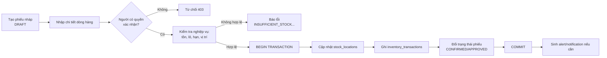

### 1) Quy trình Nhập kho (Goods Receipt)

Mục đích: ghi nhận hàng nhập từ nhà cung cấp, làm **tăng** tồn kho.

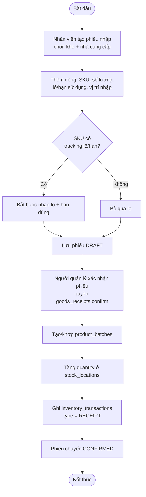

### 2) Quy trình Xuất kho (Goods Issue)

Mục đích: xuất hàng bán/điều phối, làm **giảm** tồn. Phân bổ hàng theo **FEFO/FIFO**.

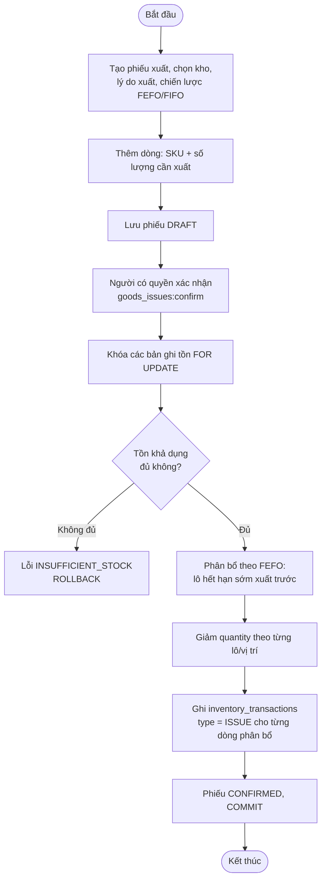

### 3) Quy trình Chuyển kho (Stock Transfer)

Mục đích: di chuyển hàng giữa hai vị trí/kho. Sinh cặp giao dịch `TRANSFER_OUT` + `TRANSFER_IN`.

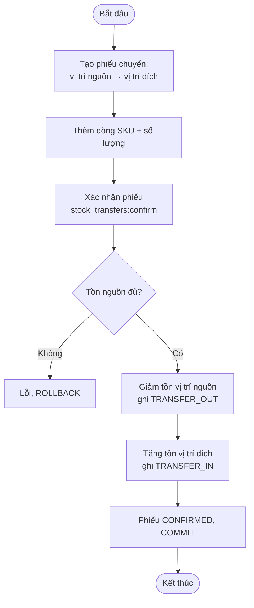

### 4) Quy trình Kiểm kê (Stock Count)

Mục đích: đếm thực tế và đối chiếu với tồn hệ thống. Có nhiều bước trạng thái.

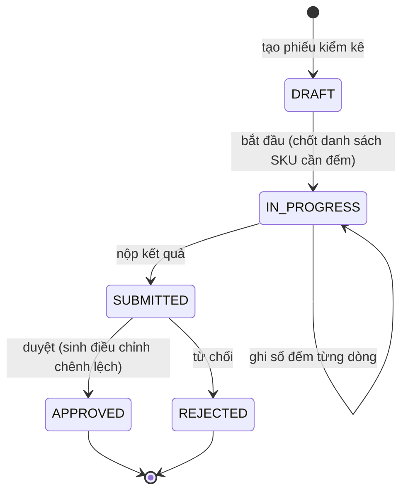

Khi **approve**: hệ thống so sánh số đếm với tồn hệ thống, chênh lệch dương sinh giao dịch `COUNT_ADJUSTMENT_IN`, chênh lệch âm sinh `COUNT_ADJUSTMENT_OUT`.

### 5) Quy trình Điều chỉnh tồn (Stock Adjustment)

Mục đích: chỉnh tồn do hư hỏng, mất mát, sai lệch... Bắt buộc qua bước **duyệt** (không tự duyệt).

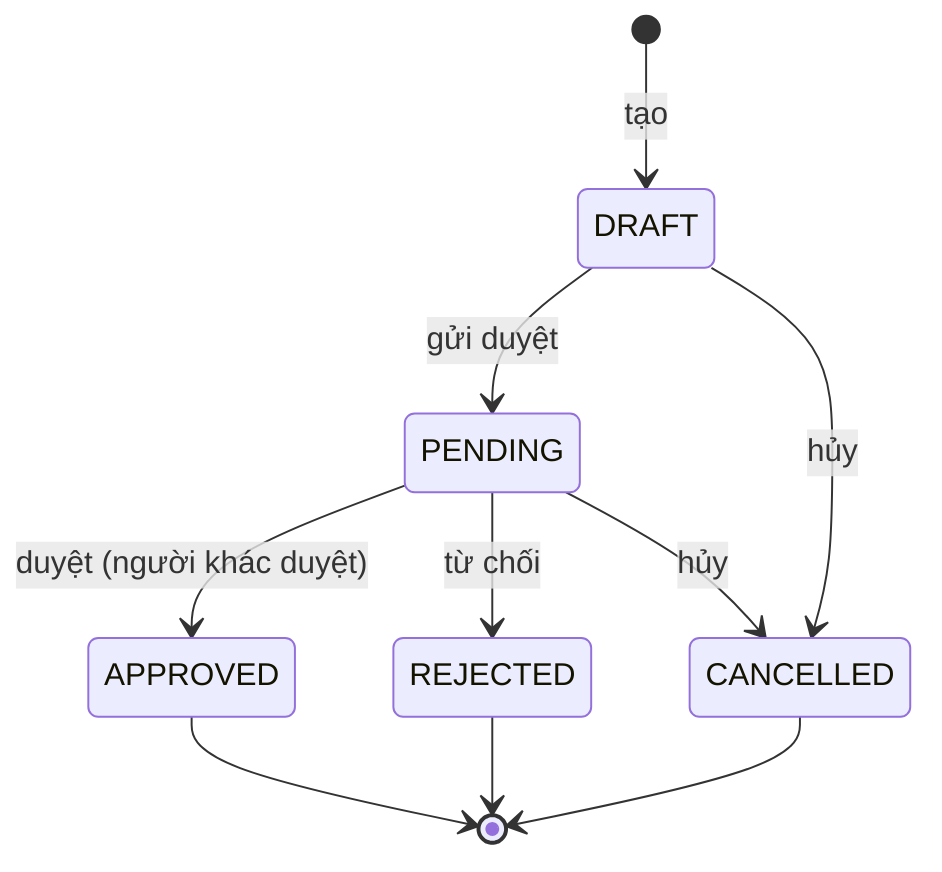

Khi **approve**: sinh `MANUAL_ADJUSTMENT_IN` / `MANUAL_ADJUSTMENT_OUT` tùy chiều điều chỉnh.

### 6) Quy trình Xác thực và phân quyền

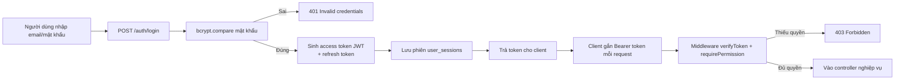

---

## 2.4.2 Sơ đồ chức năng

Phân rã chức năng hệ thống theo các phân hệ (mỗi phân hệ tương ứng một module backend + feature frontend).

```mermaid
flowchart TD
    ROOT[BAMBI WMS]

    ROOT --> A[1. Quản trị hệ thống]
    ROOT --> B[2. Danh mục hàng hóa]
    ROOT --> C[3. Cấu trúc kho]
    ROOT --> D[4. Nghiệp vụ tồn kho]
    ROOT --> E[5. Báo cáo và vận hành]

    A --> A1[Đăng nhập/Đăng xuất]
    A --> A2[Quản lý người dùng]
    A --> A3[Quản lý vai trò và quyền]
    A --> A4[Cấu hình ứng dụng]

    B --> B1[Danh mục/Nhãn hiệu/Đơn vị]
    B --> B2[Sản phẩm và biến thể SKU]
    B --> B3[Nhà cung cấp]
    B --> B4[Lô và hạn sử dụng]

    C --> C1[Quản lý kho]
    C --> C2[Khu vực - Kệ - Vị trí]

    D --> D1[Xem tồn hiện tại]
    D --> D2[Phiếu nhập kho]
    D --> D3[Phiếu xuất kho]
    D --> D4[Phiếu chuyển kho]
    D --> D5[Kiểm kê]
    D --> D6[Điều chỉnh tồn]
    D --> D7[Lịch sử giao dịch tồn]

    E --> E1[Báo cáo tồn/near-expiry]
    E --> E2[Cảnh báo - Alerts]
    E --> E3[Thông báo - Notifications]
    E --> E4[Nhật ký thao tác - Audit logs]
    E --> E5[Tệp đính kèm]
```

---

## 2.4.3 Sơ đồ Use case tổng quát

### Mô tả các Actor

| Actor | Mô tả |
| --- | --- |
| **Nhân viên kho (Staff)** | Người trực tiếp thao tác: tạo phiếu nhập/xuất/chuyển, đếm kiểm kê, xem tồn. Vai trò mặc định khi đăng ký. |
| **Quản lý kho (Warehouse Manager)** | Có quyền **xác nhận/duyệt** chứng từ (confirm receipt/issue/transfer, approve adjustment/count), reverse giao dịch, xử lý cảnh báo. |
| **Quản trị viên (Admin)** | Quản lý người dùng, vai trò, quyền, cấu hình hệ thống, danh mục nền. |
| **Hệ thống (System)** | Actor phụ (thời gian/tự động): sinh cảnh báo tồn thấp/near-expiry, sinh thông báo, ghi audit log. |

### Sơ đồ Use case tổng quát

> Bố cục gom nhóm theo Actor: mỗi Actor cùng nhóm use case của mình nằm trong một khung riêng, các đường liên kết không cắt nhau. Quan hệ dùng chung (Đăng nhập, Xem báo cáo) được nêu ở bảng mô tả bên dưới.

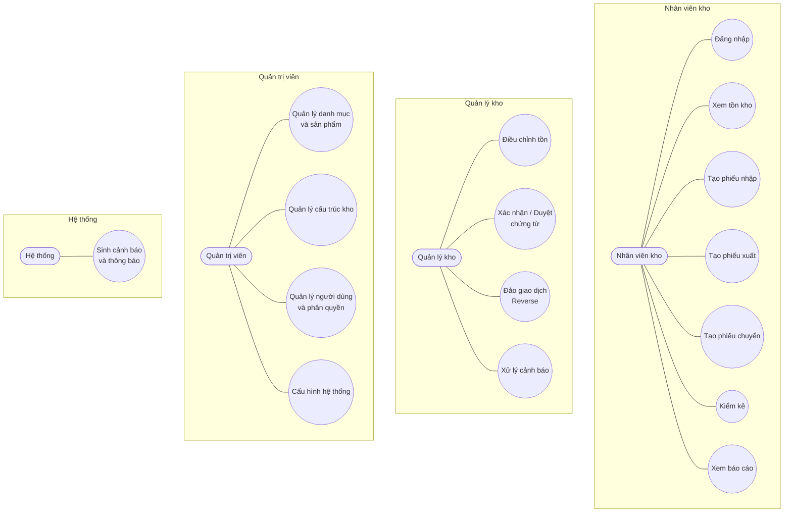

### Mô tả sơ lược các Use case

| Use case | Actor chính | Mô tả sơ lược |
| --- | --- | --- |
| Đăng nhập | Tất cả | Xác thực email/mật khẩu, cấp access + refresh token. |
| Quản lý danh mục và sản phẩm | Admin | CRUD category, brand, unit, product, product variant (SKU). |
| Quản lý cấu trúc kho | Admin | CRUD kho, khu (zone), kệ (shelf), vị trí (location). |
| Xem tồn kho | Staff, Manager | Xem tồn hiện tại theo SKU/vị trí/lô, hàng gần hết hạn. |
| Tạo phiếu nhập | Staff | Soạn phiếu nhập từ NCC, thêm dòng hàng + lô/hạn. |
| Tạo phiếu xuất | Staff | Soạn phiếu xuất theo FEFO/FIFO. |
| Tạo phiếu chuyển | Staff | Soạn phiếu chuyển vị trí/kho. |
| Kiểm kê | Staff | Đếm thực tế, nộp kết quả để duyệt. |
| Điều chỉnh tồn | Manager | Soạn phiếu điều chỉnh, gửi duyệt. |
| Xác nhận/Duyệt chứng từ | Manager | Confirm phiếu nhập/xuất/chuyển; approve kiểm kê/điều chỉnh → cập nhật tồn. |
| Đảo giao dịch (Reverse) | Manager | Đảo phiếu đã xác nhận, sinh giao dịch REVERSAL. |
| Xem báo cáo | Staff, Manager | Báo cáo tồn, near-expiry, biến động. |
| Quản lý người dùng và phân quyền | Admin | CRUD user, gán role, gán permission cho role. |
| Cấu hình hệ thống | Admin | Chỉnh `app_settings`. |
| Sinh cảnh báo và thông báo | System | Tự động sinh alert tồn thấp/hết hạn, notification. |
| Xử lý cảnh báo | Manager | Đánh dấu đã đọc/đã xử lý cảnh báo. |

---

# CHƯƠNG 3: THIẾT KẾ

## 3.1 Mô hình dữ liệu

### 3.1.1 Mức ý niệm (Conceptual)

Mô hình dữ liệu được chia thành **6 phân hệ**. Sơ đồ dưới đây là bản đồ quan hệ mức ý niệm giữa các phân hệ (các thực thể chi tiết xem ở mức luận lý 3.1.2). Cách trình bày theo phân hệ giúp các đường quan hệ **không cắt nhau** và mỗi sơ đồ vừa một khổ trang.

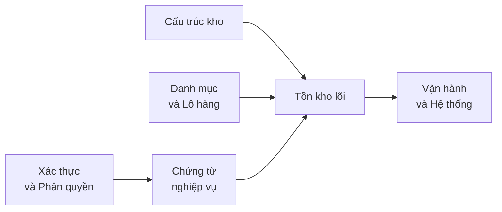

| Phân hệ | Thực thể ý niệm chính |
| --- | --- |
| Xác thực và Phân quyền | Người dùng, Vai trò, Quyền, Phiên đăng nhập |
| Cấu trúc kho | Kho, Khu vực, Kệ, Vị trí |
| Danh mục và Lô hàng | Danh mục, Nhãn hiệu, Đơn vị, Sản phẩm, Biến thể (SKU), Nhà cung cấp, Lô hàng |
| Tồn kho lõi | Tồn theo vị trí (Stock), Giao dịch tồn (Inventory Transaction) |
| Chứng từ nghiệp vụ | Phiếu nhập/xuất/chuyển/kiểm kê/điều chỉnh và dòng chi tiết |
| Vận hành và Hệ thống | Cảnh báo, Thông báo, Nhật ký, Tệp đính kèm, Cấu hình |

### 3.1.2 Mức luận lý (Logical)

Chi tiết từng phân hệ kèm khóa chính (PK), khóa ngoại (FK) và thuộc tính tiêu biểu. Mỗi phân hệ là một ERD con riêng để tránh đường cắt nhau.

**a) Phân hệ Xác thực và Phân quyền**

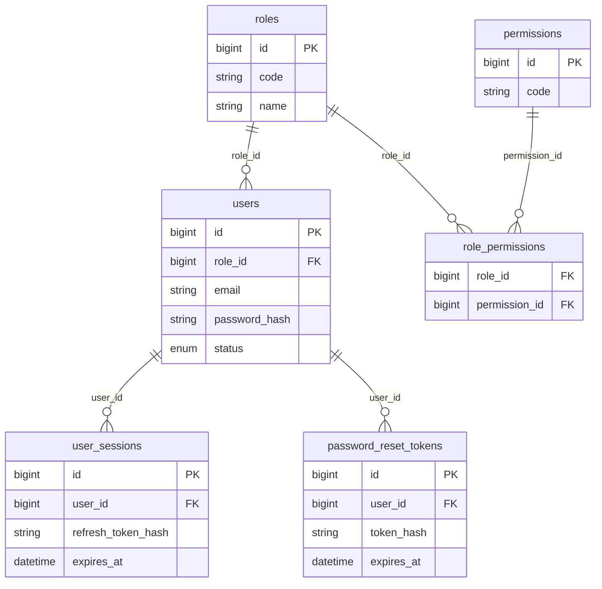

**b) Phân hệ Cấu trúc kho**

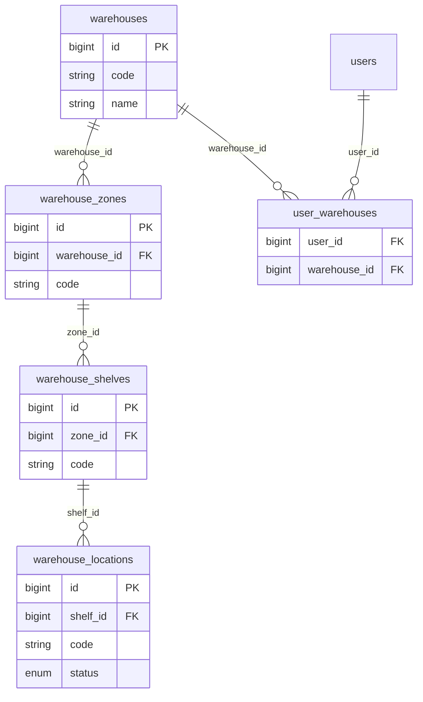

**c) Phân hệ Danh mục và Lô hàng**

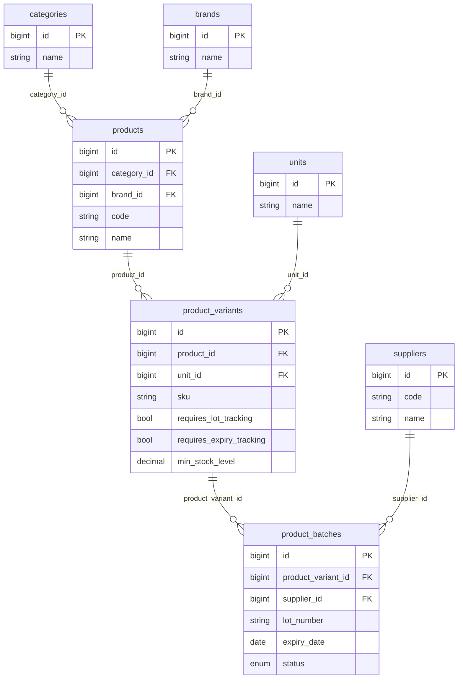

**d) Phân hệ Tồn theo vị trí (`stock_locations`)**

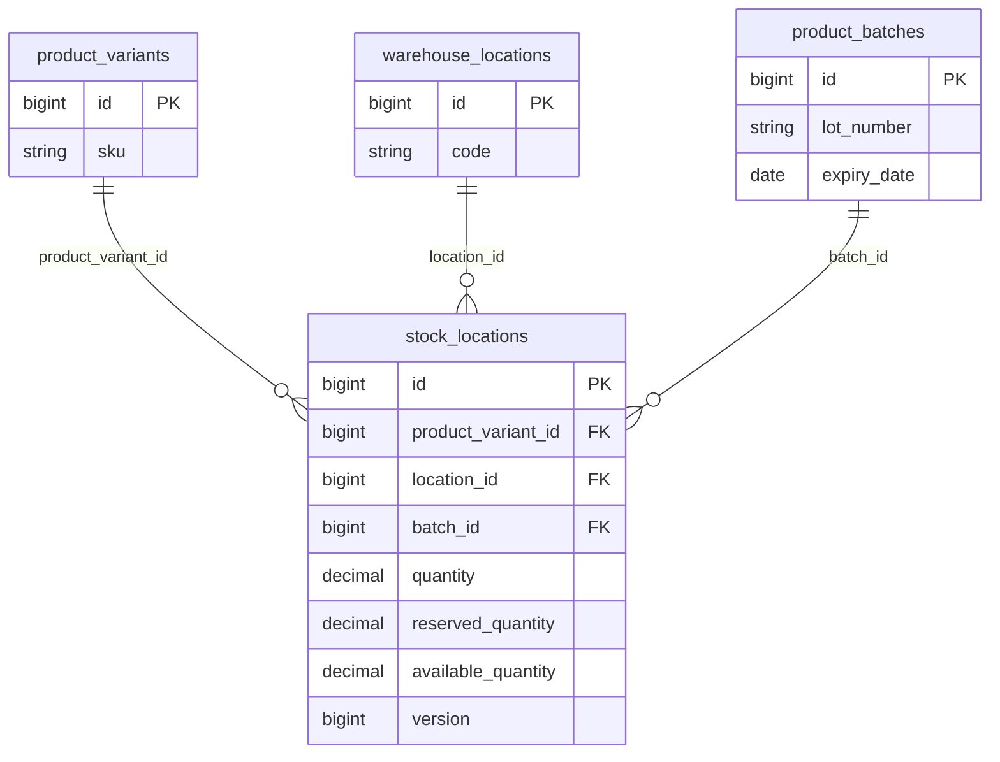

**e) Phân hệ Lịch sử giao dịch (`inventory_transactions`)**

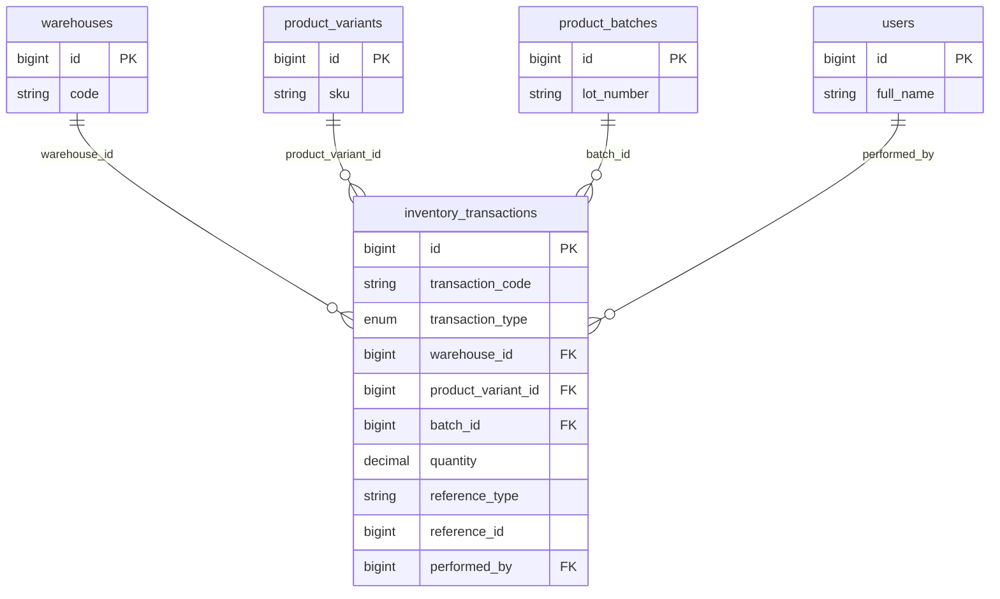

**f) Phân hệ Chứng từ nghiệp vụ**

Năm loại chứng từ có cấu trúc giống nhau: một bảng *phiếu* (header) và một bảng *dòng chi tiết* (item). Sơ đồ chỉ minh họa hai loại tiêu biểu; ba loại còn lại (chuyển kho, kiểm kê, điều chỉnh) tương tự.

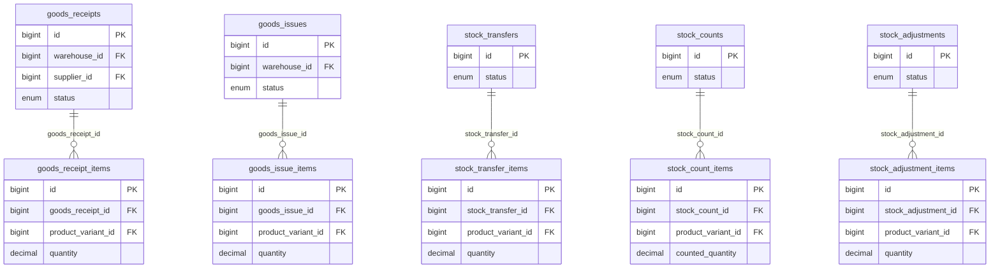

> Liên kết giữa các phân hệ: `stock_locations` và `inventory_transactions` (phân hệ d, e) tham chiếu tới `product_variants`, `warehouse_locations`, `product_batches` (phân hệ b, c); các dòng chứng từ (phân hệ f) tham chiếu `product_variants`. Việc tách phân hệ chỉ nhằm trình bày rõ ràng, không thay đổi ràng buộc khóa ngoại thực tế trong CSDL.

### 3.1.3 Mức vật lý (Physical)

Kiểu dữ liệu, ràng buộc, generated column, index thực tế của MySQL 8. Trích các bảng lõi tồn kho.

**Bảng `product_variants` (SKU)**

| Cột | Kiểu | Ràng buộc |
| --- | --- | --- |
| id | BIGINT UNSIGNED | PK, AUTO_INCREMENT |
| product_id | BIGINT UNSIGNED | FK → products(id) |
| unit_id | BIGINT UNSIGNED | FK → units(id) |
| sku | VARCHAR(100) | UNIQUE, NOT NULL |
| barcode | VARCHAR(100) | UNIQUE, NULL |
| requires_lot_tracking | BOOLEAN | DEFAULT FALSE |
| requires_expiry_tracking | BOOLEAN | DEFAULT FALSE |
| min_stock_level | DECIMAL(18,3) | DEFAULT 0, CHECK ≥ 0 |
| max_stock_level | DECIMAL(18,3) | NULL, CHECK ≥ min |
| status | ENUM('ACTIVE','INACTIVE','DISCONTINUED') | DEFAULT 'ACTIVE' |
| deleted_at | DATETIME(3) | NULL (soft delete) |

**Bảng `product_batches` (Lô/hạn dùng)**

| Cột | Kiểu | Ràng buộc |
| --- | --- | --- |
| id | BIGINT UNSIGNED | PK |
| product_variant_id | BIGINT UNSIGNED | FK → product_variants(id) |
| supplier_id | BIGINT UNSIGNED | FK → suppliers(id), NULL |
| lot_number | VARCHAR(100) | UNIQUE(variant, lot) |
| manufacture_date | DATE | NULL |
| expiry_date | DATE | NULL, CHECK expiry > manufacture |
| status | ENUM('ACTIVE','NEAR_EXPIRY','EXPIRED','BLOCKED','DEPLETED') | DEFAULT 'ACTIVE' |

**Bảng `stock_locations` (Tồn hiện tại — nguồn sự thật)**

| Cột | Kiểu | Ràng buộc / Ghi chú |
| --- | --- | --- |
| id | BIGINT UNSIGNED | PK |
| product_variant_id | BIGINT UNSIGNED | FK → product_variants(id) |
| location_id | BIGINT UNSIGNED | FK → warehouse_locations(id) |
| batch_id | BIGINT UNSIGNED | FK → product_batches(id), NULL |
| quantity | DECIMAL(18,3) | DEFAULT 0, CHECK ≥ 0 |
| reserved_quantity | DECIMAL(18,3) | DEFAULT 0, CHECK ≤ quantity |
| version | BIGINT UNSIGNED | Optimistic locking |
| batch_key | BIGINT UNSIGNED | **GENERATED** `IFNULL(batch_id, 0)` STORED |
| available_quantity | DECIMAL(18,3) | **GENERATED** `quantity - reserved_quantity` STORED |
| — | — | **UNIQUE(product_variant_id, location_id, batch_key)** |

> `batch_key` giải quyết vấn đề MySQL cho phép nhiều NULL trong unique index — nhờ đó bộ khóa tồn kho vẫn duy nhất khi hàng không có lô.

**Bảng `inventory_transactions` (Lịch sử biến động — append-only)**

| Cột | Kiểu | Ghi chú |
| --- | --- | --- |
| id | BIGINT UNSIGNED | PK |
| transaction_code | VARCHAR(80) | UNIQUE |
| transaction_type | ENUM | RECEIPT, ISSUE, TRANSFER_IN/OUT, COUNT_ADJUSTMENT_IN/OUT, MANUAL_ADJUSTMENT_IN/OUT, RETURN_IN/OUT, INITIAL_STOCK, REVERSAL |
| warehouse_id | BIGINT UNSIGNED | FK → warehouses(id) |
| product_variant_id | BIGINT UNSIGNED | FK → product_variants(id) |
| batch_id | BIGINT UNSIGNED | FK → product_batches(id), NULL |
| source_location_id / destination_location_id | BIGINT UNSIGNED | FK → warehouse_locations(id) |
| quantity | DECIMAL(18,3) | CHECK > 0 |
| quantity_before / quantity_after | DECIMAL(18,3) | Snapshot tồn |
| reference_type / reference_id | VARCHAR/BIGINT | Trỏ về phiếu gốc |
| reversal_of_transaction_id | BIGINT UNSIGNED | FK tự tham chiếu (đảo giao dịch) |
| performed_by / approved_by | BIGINT UNSIGNED | FK → users(id) |

**View báo cáo:** `vw_current_stock`, `vw_product_total_stock`, `vw_near_expiry_stock`.

Toàn bộ 38 bảng chia 6 nhóm: xác thực/phân quyền, cấu trúc kho, danh mục, tồn kho, chứng từ nghiệp vụ, hệ thống. Chi tiết đầy đủ xem [backend/warehouse_management_mysql.sql](backend/warehouse_management_mysql.sql).

---

## 3.2 Mô hình xử lý

### 3.2.1 Use case chi tiết (kèm bảng mô tả)

#### UC-05: Tạo và xác nhận phiếu nhập kho

| Mục | Nội dung |
| --- | --- |
| **Mã UC** | UC-05 |
| **Tên** | Nhập kho (Goods Receipt) |
| **Actor** | Nhân viên kho (tạo), Quản lý kho (xác nhận) |
| **Mô tả** | Ghi nhận hàng nhập từ NCC, tăng tồn khi xác nhận |
| **Tiền điều kiện** | Đã đăng nhập; đã có kho, NCC, SKU; người xác nhận có quyền `goods_receipts:confirm` |
| **Hậu điều kiện** | Phiếu CONFIRMED; `stock_locations` tăng; có bản ghi `inventory_transactions` type RECEIPT |
| **Luồng chính** | 1. Chọn kho + NCC → 2. Thêm dòng (SKU, SL, lô, hạn, vị trí) → 3. Lưu DRAFT → 4. Quản lý xác nhận → 5. Hệ thống tạo/khớp lô → 6. Tăng tồn → 7. Ghi giao dịch → 8. Phiếu CONFIRMED |
| **Luồng phụ / ngoại lệ** | 4a. Thiếu quyền → 403; 5a. SKU yêu cầu lô nhưng thiếu → lỗi validation; 6a. Lỗi DB → ROLLBACK, phiếu giữ DRAFT |

#### UC-06: Tạo và xác nhận phiếu xuất kho

| Mục | Nội dung |
| --- | --- |
| **Mã UC** | UC-06 |
| **Tên** | Xuất kho (Goods Issue) |
| **Actor** | Nhân viên kho (tạo), Quản lý kho (xác nhận) |
| **Mô tả** | Xuất hàng, giảm tồn, phân bổ FEFO/FIFO |
| **Tiền điều kiện** | Đã đăng nhập; SKU có tồn khả dụng; quyền `goods_issues:confirm` |
| **Hậu điều kiện** | Phiếu CONFIRMED; tồn giảm; giao dịch ISSUE cho từng lô phân bổ |
| **Luồng chính** | 1. Tạo phiếu, chọn chiến lược FEFO/FIFO → 2. Thêm dòng (SKU, SL) → 3. Lưu DRAFT → 4. Xác nhận → 5. Khóa tồn FOR UPDATE → 6. Phân bổ theo lô hết hạn sớm → 7. Giảm tồn + ghi giao dịch → 8. COMMIT |
| **Ngoại lệ** | 5a. Tồn không đủ → `INSUFFICIENT_STOCK`, ROLLBACK; 6a. Xung đột version → `CONCURRENT_UPDATE` |

#### UC-09: Điều chỉnh tồn kho

| Mục | Nội dung |
| --- | --- |
| **Mã UC** | UC-09 |
| **Tên** | Điều chỉnh tồn (Stock Adjustment) |
| **Actor** | Quản lý kho (tạo và gửi), Quản lý khác (duyệt) |
| **Mô tả** | Chỉnh tồn do hư hỏng/mất mát; bắt buộc duyệt bởi người khác |
| **Tiền điều kiện** | Đăng nhập; quyền `stock_adjustments:approve` để duyệt |
| **Hậu điều kiện** | APPROVED → tồn thay đổi + giao dịch MANUAL_ADJUSTMENT_IN/OUT |
| **Luồng chính** | 1. Tạo DRAFT → 2. Gửi duyệt (PENDING) → 3. Người khác duyệt → 4. Cập nhật tồn + ghi giao dịch |
| **Quy tắc** | Người tạo **không được** tự duyệt phiếu của mình |

#### UC-08: Kiểm kê

| Mục | Nội dung |
| --- | --- |
| **Mã UC** | UC-08 |
| **Actor** | Nhân viên kho, Quản lý kho |
| **Mô tả** | Đếm thực tế và đối chiếu, chênh lệch sinh điều chỉnh |
| **Luồng trạng thái** | DRAFT → IN_PROGRESS (start) → ghi count từng dòng → SUBMITTED (submit) → APPROVED/REJECTED |
| **Hậu điều kiện (APPROVED)** | Chênh lệch dương → COUNT_ADJUSTMENT_IN; âm → COUNT_ADJUSTMENT_OUT |

### 3.2.2 Sơ đồ tuần tự (Sequence)

Kiến trúc lớp mỗi request: `Routes → Middleware (auth/permission) → Controller → Validation (Zod) → Service → Repository → MySQL`.

#### Sequence 1: Đăng nhập

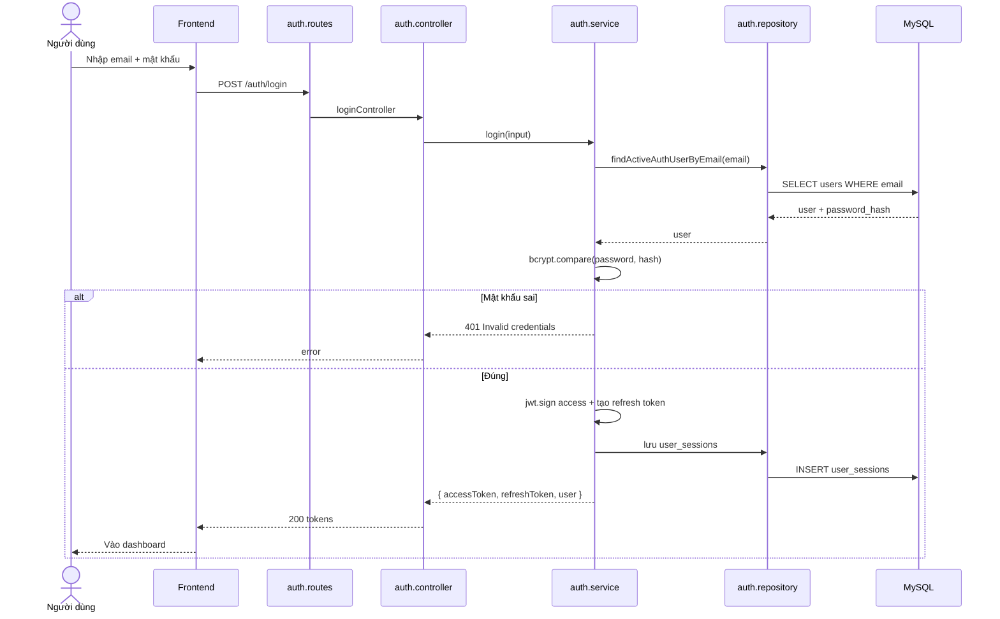

#### Sequence 2: Xác nhận phiếu xuất kho (FEFO) — nghiệp vụ lõi

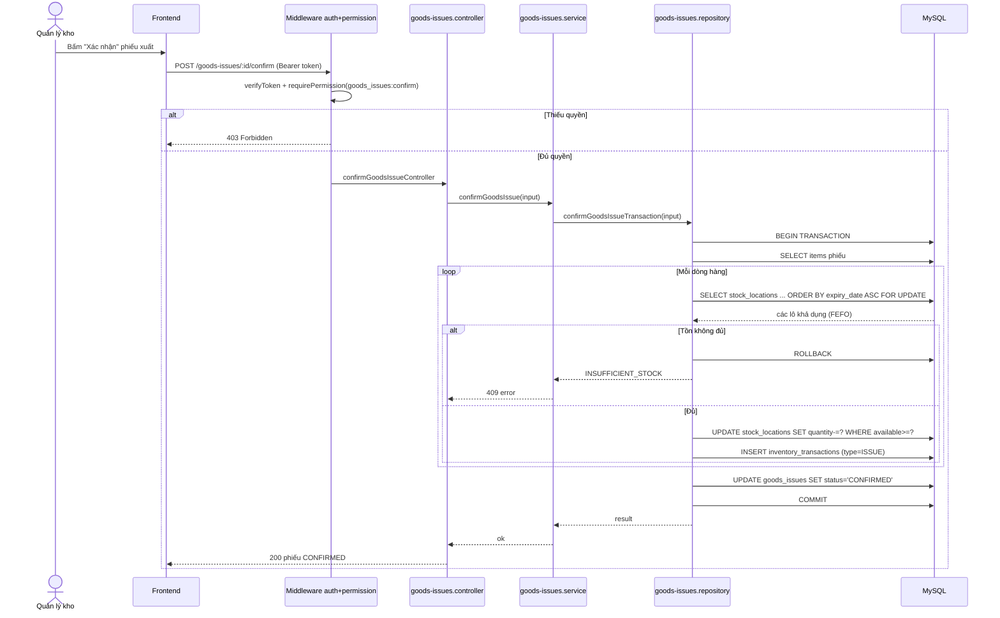

#### Sequence 3: Tạo phiếu nhập kho

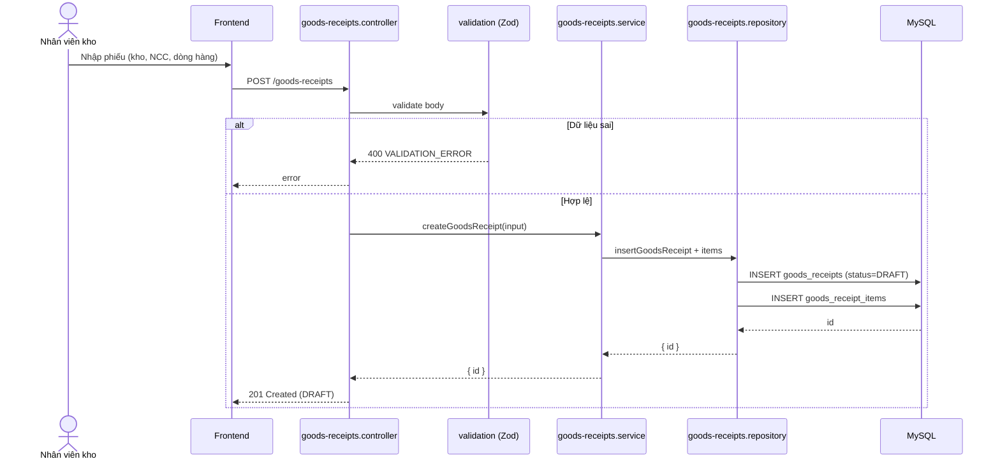

#### Sequence 4: Duyệt phiếu điều chỉnh tồn

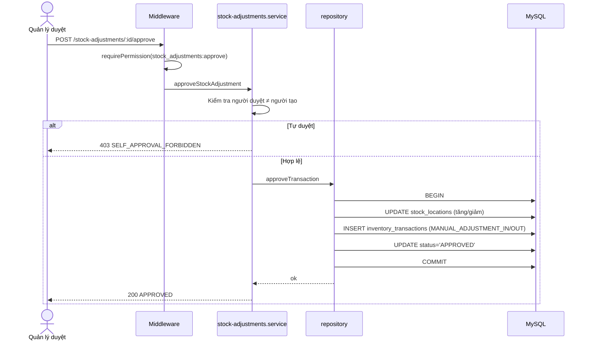

### 3.2.3 Sơ đồ hoạt động (Activity)

#### Activity 1: Xác nhận phiếu xuất kho theo FEFO

```mermaid
flowchart TD
    Start([Bắt đầu confirm]) --> A[Xác thực token và quyền]
    A --> B{Có quyền confirm?}
    B -- Không --> R1[Trả 403]:::err
    B -- Có --> C[BEGIN TRANSACTION]
    C --> D[Đọc các dòng của phiếu]
    D --> E[Chọn dòng hàng tiếp theo]
    E --> F[Khóa các lô tồn FOR UPDATE<br/>sắp xếp hết hạn sớm trước]
    F --> G{Tổng tồn khả dụng<br/>≥ số cần xuất?}
    G -- Không --> H[ROLLBACK]:::err --> R2[Trả INSUFFICIENT_STOCK]:::err
    G -- Có --> I[Phân bổ số lượng vào từng lô]
    I --> J[UPDATE giảm quantity từng lô]
    J --> K[INSERT inventory_transactions ISSUE]
    K --> L{Còn dòng hàng?}
    L -- Còn --> E
    L -- Hết --> M[UPDATE phiếu = CONFIRMED]
    M --> N[COMMIT]
    N --> O[Sinh alert nếu tồn dưới min]
    O --> End([Kết thúc])

    classDef err fill:#fee,stroke:#c00;
```

#### Activity 2: Quy trình kiểm kê

```mermaid
flowchart TD
    Start([Tạo phiếu kiểm kê]) --> A[DRAFT: chọn phạm vi SKU/vị trí]
    A --> B[start → IN_PROGRESS<br/>chốt danh sách dòng cần đếm]
    B --> C[Nhân viên đếm và ghi số thực tế]
    C --> D{Đếm xong hết?}
    D -- Chưa --> C
    D -- Rồi --> E[submit → SUBMITTED]
    E --> F{Quản lý duyệt?}
    F -- Từ chối --> G[REJECTED]:::err
    F -- Duyệt --> H[approve → so sánh đếm vs hệ thống]
    H --> I{Có chênh lệch?}
    I -- Không --> K[APPROVED, không đổi tồn]
    I -- Dương --> J1[Sinh COUNT_ADJUSTMENT_IN]
    I -- Âm --> J2[Sinh COUNT_ADJUSTMENT_OUT]
    J1 --> K
    J2 --> K
    K --> End([Kết thúc])
    G --> End

    classDef err fill:#fee,stroke:#c00;
```

#### Activity 3: Phân quyền request bất kỳ

```mermaid
flowchart TD
    Start([HTTP request]) --> A[app.ts định tuyến]
    A --> B{Route cần quyền?}
    B -- Không --> F[Vào controller]
    B -- Có --> C[verifyToken: giải mã JWT]
    C --> D{Token hợp lệ?}
    D -- Không --> E1[401 TOKEN_INVALID]:::err
    D -- Có --> G[requirePermission: tra role_permissions]
    G --> H{Role có quyền?}
    H -- Không --> E2[403 Forbidden]:::err
    H -- Có --> F[Vào controller → service → repository]
    F --> I[Trả JSON wrapper data]
    I --> End([Kết thúc])

    classDef err fill:#fee,stroke:#c00;
```

---

## Phụ lục A: Bản đồ module ↔ chức năng ↔ bảng dữ liệu

| Module backend | Base path | Chức năng | Bảng chính |
| --- | --- | --- | --- |
| auth | `/auth` | Đăng nhập, token, phiên, user | users, user_sessions, password_reset_tokens |
| authorization | `/authorization` | Role và permission | roles, permissions, role_permissions |
| warehouses | `/warehouses` | Quản lý kho | warehouses, user_warehouses |
| locations | `/locations` | Khu/kệ/vị trí | warehouse_zones, warehouse_shelves, warehouse_locations |
| catalog (products) | `/catalog` | Danh mục, SP, SKU | categories, brands, units, products, product_variants |
| suppliers (partners) | `/suppliers` | Nhà cung cấp | suppliers, supplier_products |
| batches | `/batches` | Lô/hạn dùng | product_batches |
| stock | `/stock` | Tồn hiện tại, near-expiry, allocation | stock_locations |
| inventory-transactions | `/inventory-transactions` | Lịch sử biến động | inventory_transactions |
| goods-receipts | `/goods-receipts` | Phiếu nhập | goods_receipts, goods_receipt_items |
| goods-issues | `/goods-issues` | Phiếu xuất | goods_issues, goods_issue_items |
| stock-transfers | `/stock-transfers` | Chuyển kho | stock_transfers, stock_transfer_items |
| stock-counts | `/stock-counts` | Kiểm kê | stock_counts, stock_count_items |
| stock-adjustments | `/stock-adjustments` | Điều chỉnh tồn | stock_adjustments, stock_adjustment_items |
| reports | `/reports` | Báo cáo | các view vw_* |
| alerts | `/alerts` | Cảnh báo | alerts |
| notifications | `/notifications` | Thông báo | notifications |
| audit-logs | `/audit-logs` | Nhật ký | audit_logs |
| attachments | `/attachments` | Tệp đính kèm | attachments |
| settings | `/settings` | Cấu hình | app_settings |

## Phụ lục B: Bảng quyền (permission) theo nghiệp vụ

| Nhóm | Quyền |
| --- | --- |
| Người dùng | users:read, users:create, users:update, users:delete |
| Phân quyền | authorization:read, authorization:update |
| Kho | warehouses:create, warehouses:update, warehouses:delete |
| Nhập kho | goods_receipts:confirm, goods_receipts:reverse |
| Xuất kho | goods_issues:confirm, goods_issues:reverse |
| Chuyển kho | stock_transfers:confirm, stock_transfers:reverse |
| Điều chỉnh | stock_adjustments:approve, stock_adjustments:reject, stock_adjustments:cancel |
| Kiểm kê | stock_counts:create, :start, :count, :submit, :approve |
| Cảnh báo | alerts:generate, alerts:read, alerts:resolve |
| Thông báo | notifications:generate, notifications:read |

---

## 3.3 Sơ đồ chi tiết cho từng chức năng

Mục này đặc tả **mỗi chức năng nghiệp vụ** bằng đủ **4 loại sơ đồ**: (1) Bảng đặc tả Use case, (2) Sơ đồ tuần tự (Sequence), (3) Sơ đồ hoạt động (Activity), (4) Sơ đồ trạng thái (State). Áp dụng cho 7 chức năng chính.

### 3.3.1 Chức năng: Nhập kho (Goods Receipt)

**(1) Bảng đặc tả Use case**

| Mục | Nội dung |
| --- | --- |
| Mã / Tên | F01 — Nhập kho |
| Actor | Nhân viên kho (soạn), Quản lý kho (xác nhận) |
| Mục tiêu | Ghi nhận hàng từ NCC, **tăng** tồn khi CONFIRMED |
| Tiền điều kiện | Đăng nhập; đã có kho, NCC, SKU; quyền `goods_receipts:confirm` |
| Kích hoạt | Nhân viên bấm "Tạo phiếu nhập" |
| Luồng chính | 1. Chọn kho + NCC → 2. Thêm dòng (SKU, SL, lô, hạn, vị trí) → 3. Lưu DRAFT → 4. Quản lý confirm → 5. Tạo/khớp lô → 6. Tăng `stock_locations` → 7. Ghi giao dịch RECEIPT → 8. CONFIRMED |
| Luồng phụ | Reverse: phiếu CONFIRMED → sinh REVERSAL, giảm lại tồn |
| Ngoại lệ | Thiếu quyền → 403; SKU cần lô nhưng thiếu `batch_id` → lỗi validation; phiếu rỗng → `GOODS_RECEIPT_HAS_NO_ITEMS`; lỗi DB → ROLLBACK |
| Hậu điều kiện | Tồn tăng; có `inventory_transactions` type RECEIPT |

**(2) Sơ đồ tuần tự**

```mermaid
sequenceDiagram
    actor M as Quản lý kho
    participant MW as Middleware auth+perm
    participant C as goods-receipts.controller
    participant S as goods-receipts.service
    participant Repo as repository
    participant DB as MySQL

    M->>MW: POST /goods-receipts/:id/confirm
    MW->>MW: verifyToken + requirePermission(goods_receipts:confirm)
    MW->>C: confirmGoodsReceiptController
    C->>S: confirmGoodsReceipt(id)
    S->>S: Kiểm tra phiếu tồn tại, đang DRAFT/PENDING, có dòng hàng
    S->>Repo: confirmTransaction(id)
    Repo->>DB: BEGIN
    loop Mỗi dòng hàng
        alt SKU tracking lô và thiếu batch_id
            Repo->>DB: ROLLBACK
            Repo-->>S: LOT_TRACKING_REQUIRES_BATCH
        else Hợp lệ
            Repo->>DB: INSERT/UPDATE product_batches
            Repo->>DB: UPSERT stock_locations (quantity += SL)
            Repo->>DB: INSERT inventory_transactions (RECEIPT)
        end
    end
    Repo->>DB: UPDATE goods_receipts SET status='CONFIRMED'
    Repo->>DB: COMMIT
    Repo-->>S: ok
    S-->>C: ok
    C-->>M: 200 CONFIRMED
```

**(3) Sơ đồ hoạt động**

```mermaid
flowchart TD
    A([Bắt đầu]) --> B[Tạo phiếu: kho + NCC]
    B --> C[Thêm dòng hàng]
    C --> D{SKU cần lô/hạn?}
    D -- Có --> E[Nhập lô + hạn dùng]
    D -- Không --> F[Bỏ qua lô]
    E --> G[Lưu DRAFT]
    F --> G
    G --> H[Quản lý xác nhận]
    H --> I{Đủ quyền và hợp lệ?}
    I -- Không --> J[Báo lỗi / 403]:::err
    I -- Có --> K[BEGIN]
    K --> L[Tạo/khớp lô]
    L --> M[Tăng tồn stock_locations]
    M --> N[Ghi giao dịch RECEIPT]
    N --> O[status = CONFIRMED, COMMIT]
    O --> P([Kết thúc])
    classDef err fill:#fee,stroke:#c00;
```

**(4) Sơ đồ trạng thái**

```mermaid
stateDiagram-v2
    [*] --> DRAFT: tạo
    DRAFT --> PENDING: gửi duyệt
    DRAFT --> CONFIRMED: xác nhận
    PENDING --> CONFIRMED: xác nhận
    DRAFT --> CANCELLED: hủy
    PENDING --> CANCELLED: hủy
    CONFIRMED --> CONFIRMED: đảo (sinh REVERSAL)
    CONFIRMED --> [*]
    CANCELLED --> [*]
```

### 3.3.2 Chức năng: Xuất kho (Goods Issue)

**(1) Bảng đặc tả Use case**

| Mục | Nội dung |
| --- | --- |
| Mã / Tên | F02 — Xuất kho |
| Actor | Nhân viên kho (soạn), Quản lý kho (xác nhận) |
| Mục tiêu | Xuất hàng, **giảm** tồn, phân bổ theo FEFO/FIFO |
| Tiền điều kiện | Có tồn khả dụng; quyền `goods_issues:confirm` |
| Luồng chính | 1. Tạo phiếu + chọn FEFO/FIFO → 2. Thêm dòng (SKU, SL) → 3. Lưu DRAFT → 4. Confirm → 5. Khóa tồn FOR UPDATE → 6. Phân bổ theo lô hết hạn sớm → 7. Giảm tồn + ghi ISSUE → 8. CONFIRMED |
| Ngoại lệ | Tồn không đủ → `INSUFFICIENT_STOCK`; xung đột version → `CONCURRENT_UPDATE`; lô yêu cầu hạn nhưng thiếu → lỗi |
| Hậu điều kiện | Tồn giảm; giao dịch ISSUE cho từng lô đã phân bổ |

**(2) Sơ đồ tuần tự**

```mermaid
sequenceDiagram
    actor M as Quản lý kho
    participant MW as Middleware
    participant S as goods-issues.service
    participant Repo as repository
    participant DB as MySQL

    M->>MW: POST /goods-issues/:id/confirm
    MW->>MW: requirePermission(goods_issues:confirm)
    MW->>S: confirmGoodsIssue(id)
    S->>Repo: confirmGoodsIssueTransaction
    Repo->>DB: BEGIN
    loop Mỗi dòng hàng
        Repo->>DB: SELECT stock_locations ORDER BY expiry ASC FOR UPDATE
        alt Tồn khả dụng không đủ
            Repo->>DB: ROLLBACK
            Repo-->>S: INSUFFICIENT_STOCK
        else Đủ
            Repo->>DB: UPDATE quantity -= ? WHERE available >= ?
            Repo->>DB: INSERT inventory_transactions (ISSUE)
        end
    end
    Repo->>DB: UPDATE goods_issues SET status='CONFIRMED'
    Repo->>DB: COMMIT
    Repo-->>S: ok
    S-->>M: 200 CONFIRMED
```

**(3) Sơ đồ hoạt động**

```mermaid
flowchart TD
    A([Bắt đầu]) --> B[Tạo phiếu + chọn FEFO/FIFO]
    B --> C[Thêm dòng SKU + SL]
    C --> D[Lưu DRAFT]
    D --> E[Xác nhận]
    E --> F[BEGIN + khóa tồn FOR UPDATE]
    F --> G{Tồn khả dụng đủ?}
    G -- Không --> H[INSUFFICIENT_STOCK, ROLLBACK]:::err
    G -- Có --> I[Phân bổ lô hết hạn sớm trước]
    I --> J[Giảm tồn từng lô]
    J --> K[Ghi giao dịch ISSUE]
    K --> L{Còn dòng?}
    L -- Còn --> F
    L -- Hết --> M[CONFIRMED, COMMIT]
    M --> N([Kết thúc])
    classDef err fill:#fee,stroke:#c00;
```

**(4) Sơ đồ trạng thái**

```mermaid
stateDiagram-v2
    [*] --> DRAFT: tạo
    DRAFT --> PENDING: gửi duyệt
    DRAFT --> CONFIRMED: xác nhận
    PENDING --> CONFIRMED: xác nhận
    DRAFT --> CANCELLED: hủy
    PENDING --> CANCELLED: hủy
    CONFIRMED --> CONFIRMED: đảo (REVERSAL)
    CONFIRMED --> [*]
    CANCELLED --> [*]
```

### 3.3.3 Chức năng: Chuyển kho (Stock Transfer)

**(1) Bảng đặc tả Use case**

| Mục | Nội dung |
| --- | --- |
| Mã / Tên | F03 — Chuyển kho |
| Actor | Nhân viên kho (soạn), Quản lý kho (xác nhận) |
| Mục tiêu | Di chuyển hàng giữa 2 vị trí/kho; sinh cặp TRANSFER_OUT + TRANSFER_IN |
| Tiền điều kiện | Vị trí nguồn có đủ tồn; vị trí đích hợp lệ; quyền `stock_transfers:confirm` |
| Luồng chính | 1. Chọn vị trí nguồn → đích → 2. Thêm dòng SKU + SL → 3. DRAFT → 4. Confirm → 5. Giảm tồn nguồn (TRANSFER_OUT) → 6. Tăng tồn đích (TRANSFER_IN) → 7. CONFIRMED |
| Ngoại lệ | Tồn nguồn không đủ → `INSUFFICIENT_STOCK`; vị trí đích khác kho không hợp lệ → lỗi |
| Hậu điều kiện | Tổng tồn không đổi; 2 giao dịch đối ứng |

**(2) Sơ đồ tuần tự**

```mermaid
sequenceDiagram
    actor M as Quản lý kho
    participant MW as Middleware
    participant S as stock-transfers.service
    participant Repo as repository
    participant DB as MySQL

    M->>MW: POST /stock-transfers/:id/confirm
    MW->>MW: requirePermission(stock_transfers:confirm)
    MW->>S: confirmStockTransfer(id)
    S->>Repo: confirmTransaction
    Repo->>DB: BEGIN
    loop Mỗi dòng
        Repo->>DB: SELECT stock_locations nguồn FOR UPDATE
        alt Không đủ
            Repo->>DB: ROLLBACK
            Repo-->>S: INSUFFICIENT_STOCK
        else Đủ
            Repo->>DB: UPDATE tồn nguồn (quantity -= ?)
            Repo->>DB: INSERT inventory_transactions (TRANSFER_OUT)
            Repo->>DB: UPSERT tồn đích (quantity += ?)
            Repo->>DB: INSERT inventory_transactions (TRANSFER_IN)
        end
    end
    Repo->>DB: UPDATE status='CONFIRMED'
    Repo->>DB: COMMIT
    S-->>M: 200 CONFIRMED
```

**(3) Sơ đồ hoạt động**

```mermaid
flowchart TD
    A([Bắt đầu]) --> B[Chọn vị trí nguồn và đích]
    B --> C[Thêm dòng SKU + SL]
    C --> D[Lưu DRAFT]
    D --> E[Xác nhận]
    E --> F{Tồn nguồn đủ?}
    F -- Không --> G[Lỗi, ROLLBACK]:::err
    F -- Có --> H[Giảm tồn nguồn + ghi TRANSFER_OUT]
    H --> I[Tăng tồn đích + ghi TRANSFER_IN]
    I --> J[CONFIRMED, COMMIT]
    J --> K([Kết thúc])
    classDef err fill:#fee,stroke:#c00;
```

**(4) Sơ đồ trạng thái**

```mermaid
stateDiagram-v2
    [*] --> DRAFT: tạo
    DRAFT --> PENDING: gửi duyệt
    DRAFT --> CONFIRMED: xác nhận
    PENDING --> CONFIRMED: xác nhận
    DRAFT --> CANCELLED: hủy
    PENDING --> CANCELLED: hủy
    CONFIRMED --> CONFIRMED: đảo (REVERSAL)
    CONFIRMED --> [*]
    CANCELLED --> [*]
```

### 3.3.4 Chức năng: Kiểm kê (Stock Count)

**(1) Bảng đặc tả Use case**

| Mục | Nội dung |
| --- | --- |
| Mã / Tên | F04 — Kiểm kê |
| Actor | Nhân viên kho (đếm), Quản lý kho (duyệt) |
| Mục tiêu | Đếm thực tế, đối chiếu tồn hệ thống, sinh điều chỉnh chênh lệch |
| Tiền điều kiện | Quyền `stock_counts:*` tương ứng từng bước |
| Luồng chính | 1. create (DRAFT) → 2. start (IN_PROGRESS, chốt danh sách) → 3. count từng dòng → 4. submit (SUBMITTED) → 5. approve → sinh COUNT_ADJUSTMENT |
| Ngoại lệ | reject → REJECTED (không đổi tồn); đếm thiếu dòng → cảnh báo |
| Hậu điều kiện | Chênh dương → COUNT_ADJUSTMENT_IN; chênh âm → COUNT_ADJUSTMENT_OUT |

**(2) Sơ đồ tuần tự**

```mermaid
sequenceDiagram
    actor St as Nhân viên
    actor M as Quản lý
    participant S as stock-counts.service
    participant Repo as repository
    participant DB as MySQL

    St->>S: POST /:id/start
    S->>Repo: startCount
    Repo->>DB: chốt danh sách dòng (snapshot tồn hệ thống)
    loop Đếm từng dòng
        St->>S: PATCH /:id/items/:itemId/count
        S->>Repo: recordCount(counted_qty)
        Repo->>DB: UPDATE stock_count_items
    end
    St->>S: POST /:id/submit
    S->>Repo: UPDATE status='SUBMITTED'
    M->>S: POST /:id/approve
    S->>Repo: approveCount
    Repo->>DB: BEGIN
    loop Mỗi dòng chênh lệch
        Repo->>DB: UPDATE stock_locations theo số đếm
        Repo->>DB: INSERT inventory_transactions (COUNT_ADJUSTMENT_IN/OUT)
    end
    Repo->>DB: UPDATE status='APPROVED'
    Repo->>DB: COMMIT
    S-->>M: 200 APPROVED
```

**(3) Sơ đồ hoạt động**

```mermaid
flowchart TD
    A([Tạo phiếu DRAFT]) --> B[start: chốt danh sách SKU]
    B --> C[Đếm và ghi số thực tế]
    C --> D{Đếm xong?}
    D -- Chưa --> C
    D -- Rồi --> E[submit: SUBMITTED]
    E --> F{Duyệt?}
    F -- Từ chối --> G[REJECTED]:::err
    F -- Duyệt --> H[So sánh đếm vs hệ thống]
    H --> I{Chênh lệch?}
    I -- Không --> K[APPROVED]
    I -- Dương --> J1[COUNT_ADJUSTMENT_IN]
    I -- Âm --> J2[COUNT_ADJUSTMENT_OUT]
    J1 --> K
    J2 --> K
    K --> L([Kết thúc])
    G --> L
    classDef err fill:#fee,stroke:#c00;
```

**(4) Sơ đồ trạng thái**

```mermaid
stateDiagram-v2
    [*] --> DRAFT: tạo
    DRAFT --> IN_PROGRESS: bắt đầu
    IN_PROGRESS --> IN_PROGRESS: ghi số đếm
    IN_PROGRESS --> SUBMITTED: nộp kết quả
    SUBMITTED --> APPROVED: duyệt
    SUBMITTED --> REJECTED: từ chối
    DRAFT --> CANCELLED: hủy
    IN_PROGRESS --> CANCELLED: hủy
    APPROVED --> [*]
    REJECTED --> [*]
    CANCELLED --> [*]
```

### 3.3.5 Chức năng: Điều chỉnh tồn (Stock Adjustment)

**(1) Bảng đặc tả Use case**

| Mục | Nội dung |
| --- | --- |
| Mã / Tên | F05 — Điều chỉnh tồn |
| Actor | Quản lý kho (tạo và gửi), Quản lý khác (duyệt) |
| Mục tiêu | Chỉnh tồn do hư hỏng/mất mát; bắt buộc duyệt bởi người khác |
| Tiền điều kiện | Quyền `stock_adjustments:approve` để duyệt |
| Luồng chính | 1. create (DRAFT) → 2. submit (PENDING) → 3. approve (người khác) → 4. cập nhật tồn + ghi MANUAL_ADJUSTMENT |
| Quy tắc | Người tạo **không được** tự duyệt |
| Ngoại lệ | Tự duyệt → 403; reject → REJECTED; cancel → CANCELLED |
| Hậu điều kiện | APPROVED → tồn đổi + giao dịch MANUAL_ADJUSTMENT_IN/OUT |

**(2) Sơ đồ tuần tự**

```mermaid
sequenceDiagram
    actor A as Người tạo
    actor B as Người duyệt
    participant S as stock-adjustments.service
    participant Repo as repository
    participant DB as MySQL

    A->>S: POST /stock-adjustments (DRAFT)
    A->>S: POST /:id/submit → PENDING
    B->>S: POST /:id/approve
    S->>S: Kiểm tra người duyệt ≠ người tạo
    alt Tự duyệt
        S-->>B: 403 SELF_APPROVAL_FORBIDDEN
    else Hợp lệ
        S->>Repo: approveTransaction
        Repo->>DB: BEGIN
        Repo->>DB: UPDATE stock_locations (tăng/giảm)
        Repo->>DB: INSERT inventory_transactions (MANUAL_ADJUSTMENT_IN/OUT)
        Repo->>DB: UPDATE status='APPROVED'
        Repo->>DB: COMMIT
        S-->>B: 200 APPROVED
    end
```

**(3) Sơ đồ hoạt động**

```mermaid
flowchart TD
    A([Tạo DRAFT]) --> B[submit: PENDING]
    B --> C{Người duyệt = người tạo?}
    C -- Đúng --> D[403 từ chối tự duyệt]:::err
    C -- Khác --> E{Quyết định}
    E -- Reject --> F[REJECTED]:::err
    E -- Cancel --> G[CANCELLED]
    E -- Approve --> H[BEGIN]
    H --> I[Cập nhật tồn]
    I --> J[Ghi MANUAL_ADJUSTMENT_IN/OUT]
    J --> K[APPROVED, COMMIT]
    K --> L([Kết thúc])
    F --> L
    G --> L
    classDef err fill:#fee,stroke:#c00;
```

**(4) Sơ đồ trạng thái**

```mermaid
stateDiagram-v2
    [*] --> DRAFT: tạo
    DRAFT --> PENDING: gửi duyệt
    PENDING --> APPROVED: duyệt
    PENDING --> REJECTED: từ chối
    DRAFT --> CANCELLED: hủy
    PENDING --> CANCELLED: hủy
    APPROVED --> [*]
    REJECTED --> [*]
    CANCELLED --> [*]
```

### 3.3.6 Chức năng: Quản lý sản phẩm và SKU (Catalog)

**(1) Bảng đặc tả Use case**

| Mục | Nội dung |
| --- | --- |
| Mã / Tên | F06 — Quản lý sản phẩm và SKU |
| Actor | Quản trị viên |
| Mục tiêu | CRUD category, brand, unit, product, product_variant (SKU) |
| Tiền điều kiện | Đăng nhập với quyền quản trị danh mục |
| Luồng chính | 1. Tạo/sửa danh mục → 2. Tạo sản phẩm (thuộc danh mục + nhãn hiệu) → 3. Tạo SKU (đơn vị, cấu hình lô/hạn, min/max tồn) → 4. Lưu |
| Ngoại lệ | SKU/barcode trùng → lỗi UNIQUE; xóa SP đã phát sinh giao dịch → chỉ **soft delete** (`deleted_at`) |
| Hậu điều kiện | SKU sẵn sàng cho nhập/xuất |

**(2) Sơ đồ tuần tự**

```mermaid
sequenceDiagram
    actor Ad as Quản trị viên
    participant FE as Frontend
    participant C as catalog.controller
    participant V as validation (Zod)
    participant S as catalog.service
    participant Repo as repository
    participant DB as MySQL

    Ad->>FE: Nhập thông tin SKU
    FE->>C: POST /catalog/products (hoặc variants)
    C->>V: validate
    alt Sai dữ liệu / trùng SKU
        V-->>C: 400 / 409 DUPLICATE
        C-->>FE: error
    else Hợp lệ
        C->>S: createProduct/Variant
        S->>Repo: insert
        Repo->>DB: INSERT products / product_variants
        DB-->>Repo: id
        Repo-->>S: { id }
        S-->>C: { id }
        C-->>FE: 201 Created
    end
```

**(3) Sơ đồ hoạt động**

```mermaid
flowchart TD
    A([Bắt đầu]) --> B[Chọn/ tạo danh mục + nhãn hiệu]
    B --> C[Nhập thông tin sản phẩm]
    C --> D[Tạo biến thể SKU: đơn vị, lô/hạn, min/max]
    D --> E{SKU/barcode trùng?}
    E -- Trùng --> F[Báo lỗi UNIQUE]:::err
    E -- Không --> G[Lưu sản phẩm/SKU]
    G --> H([Kết thúc])
    F --> C
    classDef err fill:#fee,stroke:#c00;
```

**(4) Sơ đồ trạng thái (vòng đời SKU)**

```mermaid
stateDiagram-v2
    [*] --> ACTIVE: tạo
    ACTIVE --> INACTIVE: tạm ngừng
    INACTIVE --> ACTIVE: kích hoạt lại
    ACTIVE --> DISCONTINUED: ngừng kinh doanh
    INACTIVE --> DISCONTINUED: ngừng kinh doanh
    ACTIVE --> [*]: xóa mềm (deleted_at)
    DISCONTINUED --> [*]
```

### 3.3.7 Chức năng: Quản lý người dùng và phân quyền

**(1) Bảng đặc tả Use case**

| Mục | Nội dung |
| --- | --- |
| Mã / Tên | F07 — Quản lý người dùng và phân quyền |
| Actor | Quản trị viên |
| Mục tiêu | CRUD user, gán vai trò, gán quyền cho vai trò |
| Tiền điều kiện | Quyền `users:*`, `authorization:*` |
| Luồng chính | 1. Tạo user (email, mật khẩu hash, role) → 2. Gán role → 3. Cấu hình role_permissions → 4. Lưu |
| Ngoại lệ | Email trùng → lỗi UNIQUE; `POST /auth/register` public luôn tạo role STAFF (không nhận roleCode từ client) |
| Hậu điều kiện | User đăng nhập được, quyền áp dụng ở mọi request |

**(2) Sơ đồ tuần tự**

```mermaid
sequenceDiagram
    actor Ad as Quản trị viên
    participant MW as Middleware
    participant C as auth.controller
    participant S as auth.service
    participant Repo as repository
    participant DB as MySQL

    Ad->>MW: POST /auth/users (Bearer token)
    MW->>MW: requirePermission(users:create)
    MW->>C: createUserController
    C->>S: createUser(input)
    S->>S: bcrypt.hash(password)
    S->>Repo: insertUser + gán role_id
    alt Email trùng
        Repo->>DB: INSERT users → lỗi UNIQUE
        Repo-->>S: 409 DUPLICATE_EMAIL
    else Hợp lệ
        Repo->>DB: INSERT users
        DB-->>Repo: id
        Repo-->>S: user
        S-->>C: user
        C-->>Ad: 201 Created
    end
```

**(3) Sơ đồ hoạt động**

```mermaid
flowchart TD
    A([Bắt đầu]) --> B[Nhập thông tin user + chọn role]
    B --> C[verifyToken + requirePermission users:create]
    C --> D{Đủ quyền?}
    D -- Không --> E[403]:::err
    D -- Có --> F[Hash mật khẩu bcrypt]
    F --> G{Email trùng?}
    G -- Trùng --> H[Lỗi DUPLICATE_EMAIL]:::err
    G -- Không --> I[Lưu user + gán role]
    I --> J[Cấu hình role_permissions nếu cần]
    J --> K([Kết thúc])
    classDef err fill:#fee,stroke:#c00;
```

**(4) Sơ đồ trạng thái (vòng đời tài khoản)**

```mermaid
stateDiagram-v2
    [*] --> ACTIVE: tạo / đăng ký
    ACTIVE --> INACTIVE: khóa tài khoản
    INACTIVE --> ACTIVE: mở khóa
    ACTIVE --> [*]: xóa mềm (deleted_at)
    INACTIVE --> [*]: xóa mềm (deleted_at)
```
---

# CHƯƠNG 4: SƠ ĐỒ NGHIỆP VỤ VÀ KIẾN TRÚC MỞ RỘNG (GÓC NHÌN BA / SA / SOLUTION ARCHITECT)

Chương 2 và 3 đã phủ nhóm sơ đồ cốt lõi (Use case, Activity, Sequence, State, ERD). Chương này bổ sung các sơ đồ mà một Business Analyst / System Analyst / Solution Architect chuyên nghiệp thường dùng, áp dụng trực tiếp cho Bambi WMS: Context, BPMN, DFD, Class, Component, Deployment, C4 và User Flow.

## Bản đồ vai trò và loại sơ đồ trong tài liệu này

| Vai trò | Loại sơ đồ | Vị trí trong tài liệu |
| --- | --- | --- |
| Business Analyst (BA) | BPMN, Use Case, Activity | 2.4.1, 4.2, 2.4.3, 3.3, 3.2.3 |
| System Analyst (SA) | Sequence, Class, ERD | 3.2.2, 4.4, 3.1 |
| Solution Architect | C4, Component, Deployment | 4.1, 4.5, 4.6, 4.7 |
| Product Owner | User Flow | 4.9 |
| Data / phân tích luồng | DFD, Context | 4.1, 4.3 |

## 4.1 Sơ đồ ngữ cảnh (Context Diagram — C4 Level 1)

Hệ thống nhìn như một hộp đen, cho biết ai/ cái gì tương tác với nó.

```mermaid
flowchart TB
    Staff([Nhân viên kho])
    Manager([Quản lý kho])
    Admin([Quản trị viên])
    WMS[Hệ thống Bambi WMS]
    DB[(CSDL MySQL)]

    Staff -->|Nhập, xuất, chuyển, kiểm kê| WMS
    Manager -->|Xác nhận, duyệt, xem báo cáo| WMS
    Admin -->|Quản trị danh mục, người dùng, cấu hình| WMS
    WMS -->|Đọc/ghi tồn kho, chứng từ| DB
    DB -->|Dữ liệu tồn, lịch sử, báo cáo| WMS
```

## 4.2 Sơ đồ BPMN (Business Process — quy trình nhập kho, dạng lane)

Trình bày quy trình nghiệp vụ theo làn trách nhiệm (swimlane): ai làm bước nào.

```mermaid
flowchart TB
    subgraph LNV[Làn: Nhân viên kho]
        direction LR
        A[Tạo phiếu nhập] --> B[Thêm dòng hàng, lô/hạn]
        B --> C[Lưu phiếu DRAFT]
    end
    subgraph LQL[Làn: Quản lý kho]
        direction LR
        D{Xác nhận phiếu?}
    end
    subgraph LHT[Làn: Hệ thống]
        direction LR
        E[Tạo/khớp lô] --> F[Tăng tồn stock_locations]
        F --> G[Ghi inventory_transactions RECEIPT]
        G --> H[Phiếu chuyển CONFIRMED]
    end

    C --> D
    D -->|Đồng ý| E
    D -->|Từ chối| C
```

## 4.3 Sơ đồ luồng dữ liệu (Data Flow Diagram — DFD)

Cho biết dữ liệu tồn kho di chuyển giữa tác nhân, tiến trình và kho dữ liệu.

**DFD mức 0 (tổng quát)**

```mermaid
flowchart LR
    Staff([Nhân viên kho])
    Manager([Quản lý kho])
    P1((1.0 Xử lý nhập kho))
    P2((2.0 Xử lý xuất kho))
    P3((3.0 Tổng hợp báo cáo))
    D1[(stock_locations)]
    D2[(inventory_transactions)]

    Staff -->|Phiếu nhập| P1
    Staff -->|Phiếu xuất| P2
    P1 -->|Tăng tồn| D1
    P2 -->|Giảm tồn| D1
    P1 -->|Ghi biến động| D2
    P2 -->|Ghi biến động| D2
    D1 -->|Tồn hiện tại| P3
    D2 -->|Lịch sử biến động| P3
    P3 -->|Báo cáo tồn, near-expiry| Manager
```

## 4.4 Sơ đồ lớp (Class Diagram — mô hình miền)

Mô hình miền (domain model) suy ra từ các `*.model.ts` và service. Thuộc tính/phương thức đặt theo tên miền; giá trị enum giữ tiếng Anh.

```mermaid
classDiagram
    class Product {
        +bigint id
        +string code
        +string name
        +ProductStatus status
    }
    class ProductVariant {
        +bigint id
        +string sku
        +bool requiresLotTracking
        +bool requiresExpiryTracking
        +decimal minStockLevel
    }
    class ProductBatch {
        +bigint id
        +string lotNumber
        +date expiryDate
        +BatchStatus status
    }
    class WarehouseLocation {
        +bigint id
        +string code
        +LocationStatus status
    }
    class StockLocation {
        +bigint id
        +decimal quantity
        +decimal reservedQuantity
        +availableQuantity() decimal
    }
    class InventoryTransaction {
        +bigint id
        +string transactionCode
        +TransactionType type
        +decimal quantity
    }
    class GoodsReceipt {
        +bigint id
        +GoodsReceiptStatus status
        +confirm()
        +reverse()
    }
    class GoodsReceiptItem {
        +bigint id
        +decimal quantity
    }

    Product "1" --> "*" ProductVariant : có
    ProductVariant "1" --> "*" ProductBatch : chia lô
    ProductVariant "1" --> "*" StockLocation : tồn tại
    WarehouseLocation "1" --> "*" StockLocation : chứa
    ProductBatch "0..1" --> "*" StockLocation : theo lô
    ProductVariant "1" --> "*" InventoryTransaction : biến động
    GoodsReceipt "1" --> "*" GoodsReceiptItem : gồm
```

> Ghi chú: khi `GoodsReceipt` được xác nhận (`confirm()`), hệ thống sinh các `InventoryTransaction` loại `RECEIPT` và cập nhật `StockLocation` — quan hệ này được thể hiện ở sơ đồ tuần tự 3.2.2 và 3.3.1, không vẽ vào sơ đồ lớp để tránh đường cắt nhau.

## 4.5 Sơ đồ thành phần (Component Diagram)

Các thành phần phần mềm và quan hệ phụ thuộc.

```mermaid
flowchart TB
    subgraph FEc[Frontend React + Vite]
        direction LR
        UI[Feature UI Components]
        SVC[Service layer httpClient]
    end
    subgraph BEc[Backend Express + TypeScript]
        direction LR
        RT[Routes]
        MW[Middleware auth + permission]
        CTRL[Controller]
        SRV[Service]
        REPO[Repository]
    end
    DB[(MySQL)]

    UI --> SVC
    SVC -->|REST + JWT| RT
    RT --> MW
    MW --> CTRL
    CTRL --> SRV
    SRV --> REPO
    REPO -->|mysql2/promise| DB
```

## 4.6 Sơ đồ triển khai (Deployment Diagram)

Ánh xạ phần mềm lên hạ tầng chạy thật (theo `docker-compose.yml` và `Dockerfile`).

```mermaid
flowchart TB
    subgraph Client[Máy người dùng]
        Browser[Trình duyệt web]
    end
    subgraph Host[Máy chủ / Docker host]
        subgraph N1[Static host - Nginx]
            SPA[frontend/dist React SPA]
        end
        subgraph N2[Container Node 22 - Express]
            API[API :3000]
        end
        subgraph N3[Container MySQL 8.4]
            DB[(warehouse_management :3306)]
        end
    end

    Browser -->|HTTPS tải SPA| SPA
    Browser -->|REST JSON + JWT| API
    API -->|mysql2/promise :3306| DB
```

## 4.7 C4 Model

**C4 mức 2 — Container**

```mermaid
flowchart TB
    User([Người dùng])
    subgraph WMS[Hệ thống Bambi WMS]
        SPA[Web: React + Vite<br/>SPA tĩnh]
        API[Ứng dụng: Express + TS<br/>REST API]
        DB[(CSDL: MySQL 8)]
    end

    User -->|HTTPS| SPA
    SPA -->|JSON/REST + JWT| API
    API -->|SQL| DB
```

**C4 mức 3 — Component (bên trong API)**

```mermaid
flowchart TB
    Gateway[Express App / Router]
    Guard[Middleware verifyToken + requirePermission]
    subgraph Mods[Các module nghiệp vụ]
        direction LR
        Auth[auth]
        Cat[catalog]
        Stk[stock]
        GR[goods-receipts]
        GI[goods-issues]
        Rep[reports]
        Auth ~~~ Cat ~~~ Stk ~~~ GR ~~~ GI ~~~ Rep
    end
    RepoL[Repository layer]
    DB[(MySQL)]

    Gateway --> Guard
    Guard --> Mods
    Mods --> RepoL
    RepoL --> DB
```

## 4.8 Sơ đồ gói (Package Diagram — cấu trúc mã nguồn)

```mermaid
flowchart TB
    subgraph BE[backend/src/modules]
        direction LR
        b1[auth, authorization]
        b2[catalog, batches, suppliers]
        b3[warehouses, locations]
        b4[stock, inventory-transactions]
        b5[goods-receipts, goods-issues,<br/>stock-transfers, stock-counts,<br/>stock-adjustments]
        b6[reports, alerts, notifications,<br/>audit-logs, attachments, settings]
        b1 ~~~ b2 ~~~ b3 ~~~ b4 ~~~ b5 ~~~ b6
    end
    subgraph FE[frontend/src/features]
        direction LR
        f1[auth, authorization, staff]
        f2[products, batches, partners]
        f3[locations, warehouses]
        f4[stock, transactions, stock-counts]
        f5[reports, alerts, notifications,<br/>audit-logs, settings]
        f1 ~~~ f2 ~~~ f3 ~~~ f4 ~~~ f5
    end

    FE -->|REST API| BE
```

## 4.9 Sơ đồ luồng người dùng (User Flow)

Hành trình điển hình của nhân viên kho từ khi đăng nhập đến khi hoàn tất một nghiệp vụ.

```mermaid
flowchart TB
    A[Mở ứng dụng] --> B[Đăng nhập]
    B --> C{Xác thực hợp lệ?}
    C -->|Không| B
    C -->|Có| D[Trang tổng quan Dashboard]
    D --> E[Chọn chức năng từ menu]
    E --> F[Sản phẩm / SKU]
    E --> G[Cấu trúc kho]
    E --> H[Nhập / Xuất / Chuyển]
    E --> I[Kiểm kê / Điều chỉnh]
    E --> J[Báo cáo]
    H --> K[Soạn phiếu, thêm dòng hàng]
    K --> L[Lưu phiếu DRAFT]
    L --> M[Quản lý xác nhận/duyệt]
    M --> N[Xem kết quả cập nhật tồn]
    N --> D
```

