# Tài liệu mô tả và thiết kế hệ thống — Bambi WMS (Hệ thống quản lý kho Mẹ và Bé)

> Tài liệu này mô tả đầy đủ dự án để phục vụ viết luận văn: quy trình nghiệp vụ, sơ đồ chức năng, sơ đồ use case tổng quát và chi tiết, mô hình dữ liệu (ý niệm / luận lý / vật lý), sơ đồ tuần tự (sequence) và sơ đồ hoạt động (activity).
>
> Tài liệu gồm **68 sơ đồ**: 67 sơ đồ viết bằng **Mermaid** và 1 sơ đồ use case viết bằng **PlantUML** (Mermaid không có ký hiệu chuẩn cho use case diagram). Có thể xem trực tiếp trên GitHub/VS Code (extension Markdown Preview Mermaid) hoặc dùng bản đã render sẵn ở [docs/diagrams/](docs/diagrams/) để chèn vào Word — nên dùng file `.svg`.
>
> **Riêng 24 sơ đồ luồng có thêm bản `.drawio`.** Mermaid để thư viện dagre tự dàn trang nên các sơ đồ có nhánh quay ngược luôn sinh đường cắt qua nhau. Bản `.drawio` được sinh bằng bộ dàn trang tự đặt tọa độ (`docs/gen-drawio.mjs`) nên bảo đảm đường gấp khúc 90° và **không có đường nào cắt nhau**; ảnh `.png`/`.svg` của 24 sơ đồ đó được export từ bản `.drawio` và mở ra draw.io là chỉnh tay được. Khối mermaid ngay trong tài liệu này vẫn giữ để xem nhanh — nội dung hai bản luôn khớp vì cùng sinh từ một nguồn, chỉ khác cách dàn trang.
>
> **Nguồn sự thật của sơ đồ là mã nguồn đang chạy**, không phải mô tả nghiệp vụ trên giấy. Mọi tên endpoint, tên quyền, mã lỗi, tên bảng và giá trị `ENUM` xuất hiện trong sơ đồ đều lấy nguyên văn từ `backend/src/modules`, `backend/warehouse_management_mysql.sql` và `frontend/src/app/router`. Những chỗ lược đồ CSDL rộng hơn phần đã cài đặt được liệt kê ở **Phụ lục C** — sơ đồ chỉ vẽ phần đã cài đặt.

---

## 0. Giới thiệu tổng quan hệ thống

**Bambi WMS** là hệ thống quản lý kho (Warehouse Management System) cho chuỗi cửa hàng Mẹ và Bé. Hệ thống quản lý toàn bộ vòng đời hàng hóa trong kho: từ danh mục sản phẩm, cấu trúc lưu trữ (kho → khu → kệ → vị trí), nhập kho, xuất kho, chuyển kho, kiểm kê, điều chỉnh tồn, đến báo cáo và cảnh báo vận hành.

| Thành phần | Công nghệ |
| --- | --- |
| Frontend | React + TypeScript + Vite |
| Backend | Express + TypeScript |
| Cơ sở dữ liệu | MySQL 8 (InnoDB) |
| Xác thực | JWT (access + refresh token), bcrypt |
| Tài liệu API | OpenAPI/Swagger |

**Nguyên tắc cốt lõi về tồn kho:**

- Tồn kho **không** lưu trong bảng sản phẩm; được quản lý bởi bảng `stock_locations` theo bộ khóa `product_variant_id + location_id + batch_id`.
- Mọi biến động tồn phải sinh bản ghi `inventory_transactions` (append-only — chỉ thêm, không sửa/xóa).
- Phiếu nhập/xuất/chuyển/điều chỉnh **chỉ làm đổi tồn khi được xác nhận (confirm) hoặc duyệt (approve)**.
- Hàng có hạn sử dụng quản lý theo lô (`product_batches`), xuất theo chiến lược **FEFO** (First Expired First Out) / **FIFO**.
- Muốn sửa giao dịch sai → tạo giao dịch đối ứng loại `REVERSAL`, không xóa lịch sử.

---

# CHƯƠNG 2: KHẢO SÁT VÀ PHÂN TÍCH

## 2.4.1 Các quy trình, nghiệp vụ

Hệ thống có 6 nhóm quy trình nghiệp vụ chính. Điểm chung của các chứng từ kho: đều theo mô hình **soạn phiếu (DRAFT) → xác nhận/duyệt → hệ thống ghi giao dịch tồn**, và có thể **đảo (reverse)** khi sai sót.

### Quy trình chung của một chứng từ kho

Sơ đồ trả lời câu hỏi: một chứng từ kho đi qua những bước nào từ lúc soạn tới lúc ghi sổ, và dừng ở đâu khi thiếu quyền hoặc dữ liệu không hợp lệ.

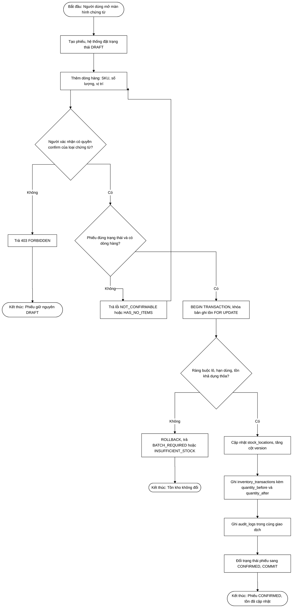

### 1) Quy trình Nhập kho (Goods Receipt)

Mục đích: ghi nhận hàng nhập từ nhà cung cấp, làm **tăng** tồn kho.

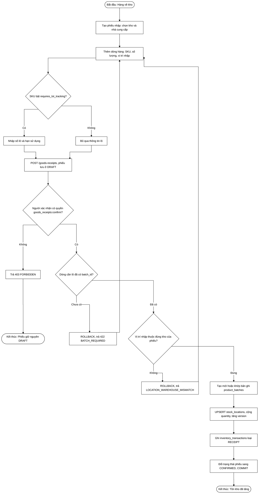

### 2) Quy trình Xuất kho (Goods Issue)

Mục đích: xuất hàng bán/điều phối, làm **giảm** tồn. Phân bổ hàng theo **FEFO/FIFO**.

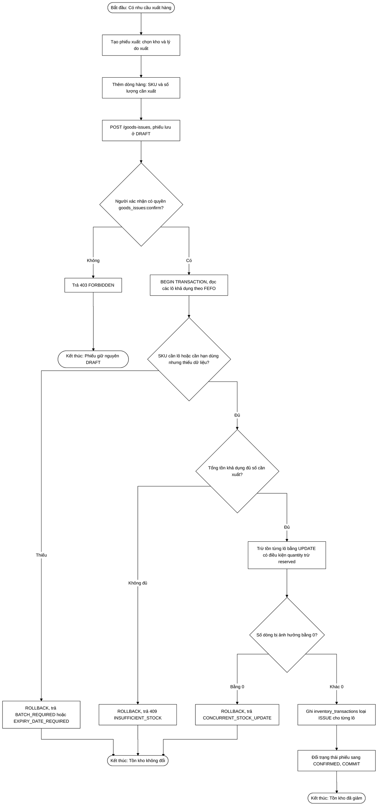

### 3) Quy trình Chuyển kho (Stock Transfer)

Mục đích: di chuyển hàng giữa hai vị trí/kho. Sinh cặp giao dịch `TRANSFER_OUT` + `TRANSFER_IN`.

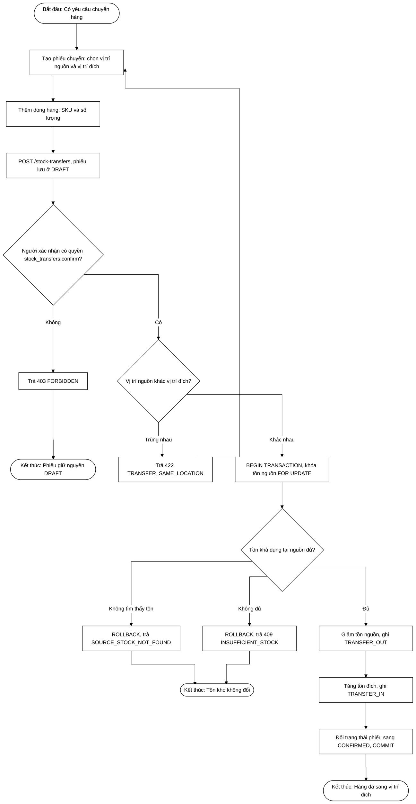

### 4) Quy trình Kiểm kê (Stock Count)

Mục đích: đếm thực tế và đối chiếu với tồn hệ thống. Có nhiều bước trạng thái.

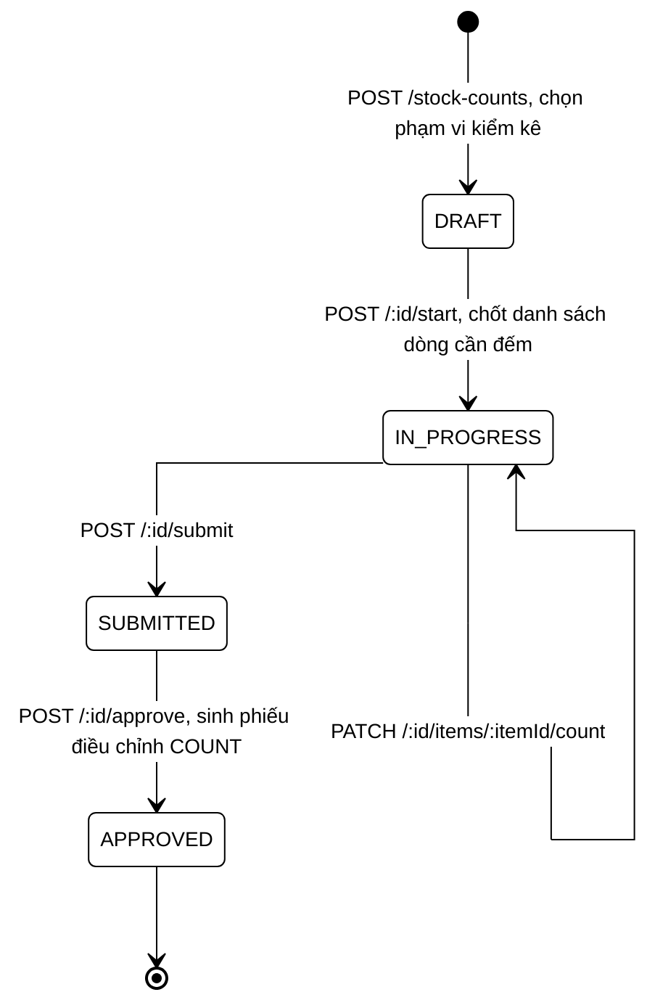

Khi **approve**: hệ thống so sánh số đếm với tồn hệ thống, chênh lệch dương sinh giao dịch `COUNT_ADJUSTMENT_IN`, chênh lệch âm sinh `COUNT_ADJUSTMENT_OUT`.

### 5) Quy trình Điều chỉnh tồn (Stock Adjustment)

Mục đích: chỉnh tồn do hư hỏng, mất mát, sai lệch... Bắt buộc qua bước **duyệt** (không tự duyệt).

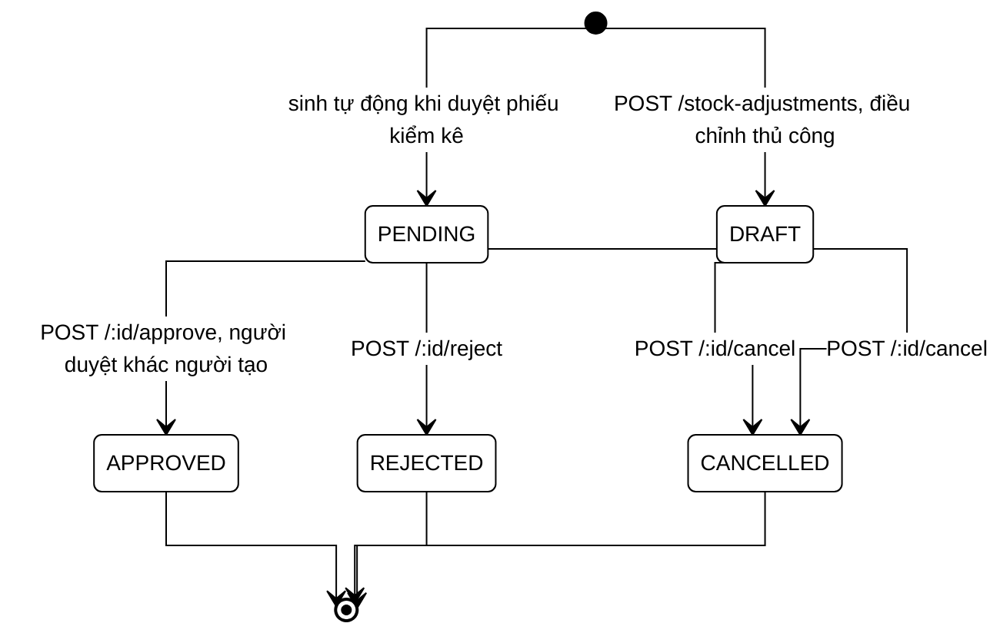

Khi **approve**: sinh `MANUAL_ADJUSTMENT_IN` / `MANUAL_ADJUSTMENT_OUT` tùy chiều điều chỉnh.

### 6) Quy trình Xác thực và phân quyền

Sơ đồ trả lời câu hỏi: một người dùng được xác thực và kiểm tra quyền ở những điểm nào trước khi chạm tới nghiệp vụ.

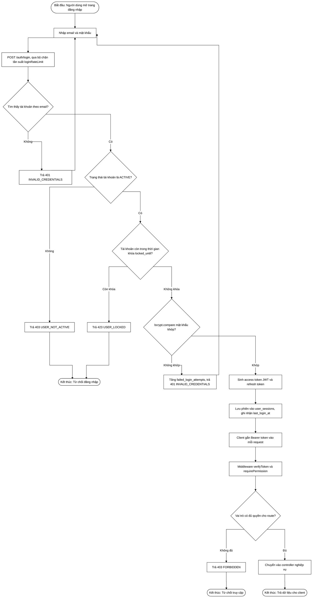

---

### 7) Quy trình Đảo chứng từ (Reverse)

Mục đích: sửa sai một chứng từ **đã xác nhận** mà không xóa lịch sử. Hệ thống sinh giao dịch đối ứng loại `REVERSAL` và chuyển phiếu gốc sang `CANCELLED`. Áp dụng cho phiếu nhập, phiếu xuất và phiếu chuyển kho (quyền `goods_receipts:reverse`, `goods_issues:reverse`, `stock_transfers:reverse`).

Sơ đồ trả lời câu hỏi: một phiếu đã ghi sổ được hoàn tác theo trình tự nào và bị chặn ở đâu khi đã đảo rồi hoặc tồn không đủ để hoàn tác.

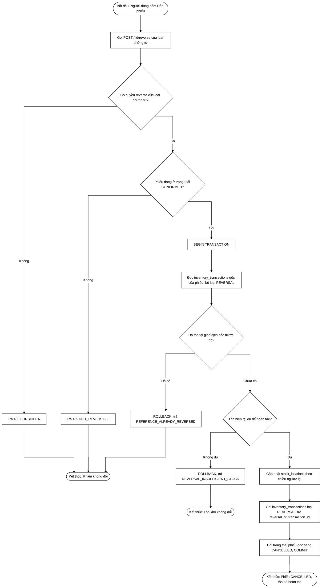

Điểm cần lưu ý: đảo phiếu **nhập** làm giảm tồn nên có thể vướng `REVERSAL_INSUFFICIENT_STOCK` nếu hàng đã được xuất đi; đảo phiếu **xuất** làm tăng tồn trở lại nên không gặp lỗi này.

### 8) Quy trình Nhận nhanh bằng QR (Quick Receive)

Mục đích: nhập hàng tại chỗ bằng cách quét mã sản phẩm và mã vị trí, **không cần soạn phiếu nhập**. Dùng cho hàng lẻ, hàng bù. Endpoint `POST /stock/quick-receive`.

Sơ đồ trả lời câu hỏi: một lần quét QR làm thay đổi tồn kho như thế nào và dừng ở đâu khi quét sai mã.

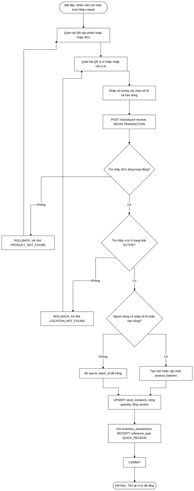

Giao dịch sinh ra có `transaction_type = 'RECEIPT'` và `reference_type = 'QUICK_RECEIVE'` (không trỏ về phiếu nào), nhờ đó vẫn truy vết được nguồn gốc biến động.

### 9) Quy trình Cảnh báo và Thông báo

Mục đích: phát hiện tồn bất thường và đưa tới người dùng. Hệ thống quét tồn theo ba nhóm quy tắc để sinh **cảnh báo** (`alerts`), sau đó chuyển cảnh báo đang mở thành **thông báo** (`notifications`) cho người dùng.

Sơ đồ trả lời câu hỏi: cảnh báo được sinh từ quy tắc nào và đi tới người dùng qua bước nào.

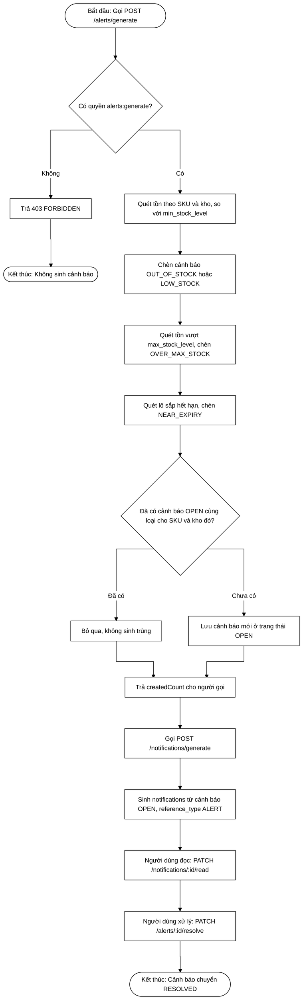

Ba nhóm quy tắc: hết hàng và sắp hết hàng (`OUT_OF_STOCK`, `LOW_STOCK`), vượt tồn tối đa (`OVER_MAX_STOCK`), và hàng cận hạn (`NEAR_EXPIRY`). Cả hai bước đều chạy theo yêu cầu qua API (`POST /alerts/generate`, `POST /notifications/generate`), chưa có bộ lập lịch tự động.

## 2.4.2 Sơ đồ chức năng

Phân rã chức năng hệ thống theo các phân hệ (mỗi phân hệ tương ứng một module backend + feature frontend).

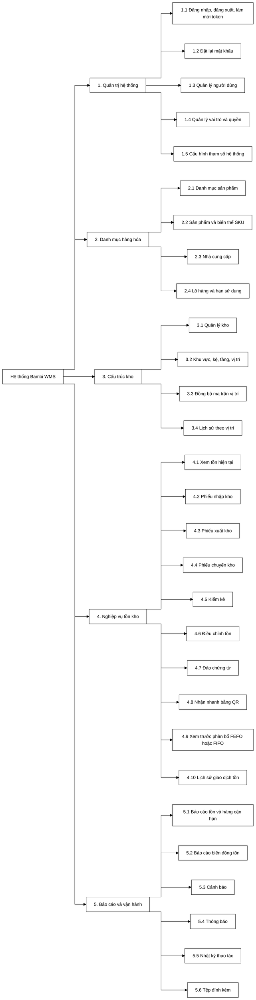

---

## 2.4.3 Sơ đồ Use case tổng quát

### Mô tả các Actor

| Actor | Mô tả |
| --- | --- |
| **Nhân viên kho (Staff)** | Người trực tiếp thao tác: tạo phiếu nhập/xuất/chuyển, đếm kiểm kê, xem tồn. Vai trò mặc định khi đăng ký. |
| **Quản lý kho (Warehouse Manager)** | Có quyền **xác nhận/duyệt** chứng từ (confirm receipt/issue/transfer, approve adjustment/count), reverse giao dịch, xử lý cảnh báo. |
| **Quản trị viên (Admin)** | Quản lý người dùng, vai trò, quyền, cấu hình hệ thống, danh mục nền. |
| **Hệ thống (System)** | Actor phụ (thời gian/tự động): sinh cảnh báo tồn thấp/near-expiry, sinh thông báo, ghi audit log. |

### Sơ đồ Use case tổng quát

> Sơ đồ vẽ theo đúng notation UML: actor là hình người que đặt ngoài ranh giới hệ thống, use case là hình elip đặt trong khung `Hệ thống Bambi WMS`, đường liên kết (association) là nét liền gấp khúc 90° và không cắt nhau. Quan hệ dùng chung (Đăng nhập, Xem báo cáo) được nêu ở bảng mô tả bên dưới.
>
> Sơ đồ này viết bằng **PlantUML** (`docs/diagrams/09_2-4-3_so-do-use-case-tong-quat_flow.puml`) vì Mermaid không có ký hiệu chuẩn cho use case diagram; 53 sơ đồ còn lại vẫn dùng Mermaid.

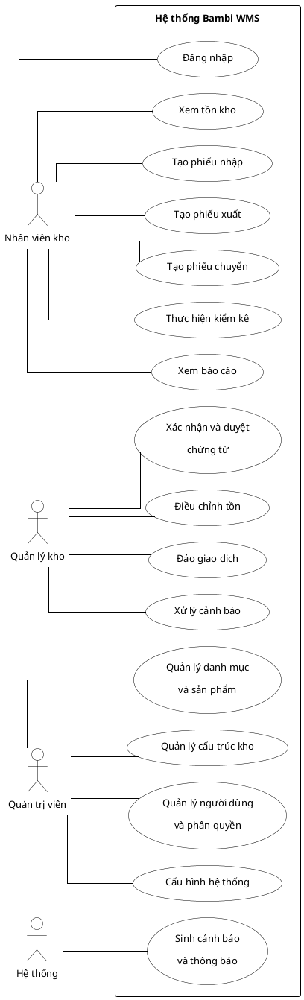

### Mô tả sơ lược các Use case

| Use case | Actor chính | Mô tả sơ lược |
| --- | --- | --- |
| Đăng nhập | Tất cả | Xác thực email/mật khẩu, cấp access + refresh token. |
| Quản lý danh mục và sản phẩm | Admin | CRUD category, brand, unit, product, product variant (SKU). |
| Quản lý cấu trúc kho | Admin | CRUD kho, khu (zone), kệ (shelf), vị trí (location). |
| Xem tồn kho | Staff, Manager | Xem tồn hiện tại theo SKU/vị trí/lô, hàng gần hết hạn. |
| Tạo phiếu nhập | Staff | Soạn phiếu nhập từ NCC, thêm dòng hàng + lô/hạn. |
| Tạo phiếu xuất | Staff | Soạn phiếu xuất theo FEFO/FIFO. |
| Tạo phiếu chuyển | Staff | Soạn phiếu chuyển vị trí/kho. |
| Kiểm kê | Staff | Đếm thực tế, nộp kết quả để duyệt. |
| Điều chỉnh tồn | Manager | Soạn phiếu điều chỉnh, gửi duyệt. |
| Xác nhận/Duyệt chứng từ | Manager | Confirm phiếu nhập/xuất/chuyển; approve kiểm kê/điều chỉnh → cập nhật tồn. |
| Đảo giao dịch (Reverse) | Manager | Đảo phiếu đã xác nhận, sinh giao dịch REVERSAL. |
| Xem báo cáo | Staff, Manager | Báo cáo tồn, near-expiry, biến động. |
| Quản lý người dùng và phân quyền | Admin | CRUD user, gán role, gán permission cho role. |
| Cấu hình hệ thống | Admin | Chỉnh `app_settings`. |
| Sinh cảnh báo và thông báo | System | Tự động sinh alert tồn thấp/hết hạn, notification. |
| Xử lý cảnh báo | Manager | Đánh dấu đã đọc/đã xử lý cảnh báo. |

---

# CHƯƠNG 3: THIẾT KẾ

## 3.1 Mô hình dữ liệu

### 3.1.1 Mức ý niệm (Conceptual)

Mô hình dữ liệu được chia thành **6 phân hệ**. Sơ đồ dưới đây là bản đồ quan hệ mức ý niệm giữa các phân hệ (các thực thể chi tiết xem ở mức luận lý 3.1.2). Cách trình bày theo phân hệ giúp các đường quan hệ **không cắt nhau** và mỗi sơ đồ vừa một khổ trang.

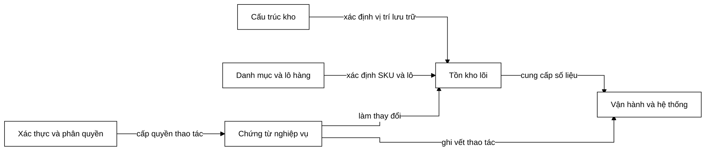

| Phân hệ | Thực thể ý niệm chính |
| --- | --- |
| Xác thực và Phân quyền | Người dùng, Vai trò, Quyền, Phiên đăng nhập |
| Cấu trúc kho | Kho, Khu vực, Kệ, Vị trí |
| Danh mục và Lô hàng | Danh mục, Nhãn hiệu, Đơn vị, Sản phẩm, Biến thể (SKU), Nhà cung cấp, Lô hàng |
| Tồn kho lõi | Tồn theo vị trí (Stock), Giao dịch tồn (Inventory Transaction) |
| Chứng từ nghiệp vụ | Phiếu nhập/xuất/chuyển/kiểm kê/điều chỉnh và dòng chi tiết |
| Vận hành và Hệ thống | Cảnh báo, Thông báo, Nhật ký, Tệp đính kèm, Cấu hình |

### 3.1.2 Mức luận lý (Logical)

Chi tiết từng phân hệ kèm khóa chính (PK), khóa ngoại (FK) và thuộc tính tiêu biểu. Mỗi phân hệ là một ERD con riêng để tránh đường cắt nhau.

**a) Phân hệ Xác thực và Phân quyền**

Sơ đồ trả lời câu hỏi: tài khoản, vai trò, quyền và phiên đăng nhập liên kết với nhau ra sao.

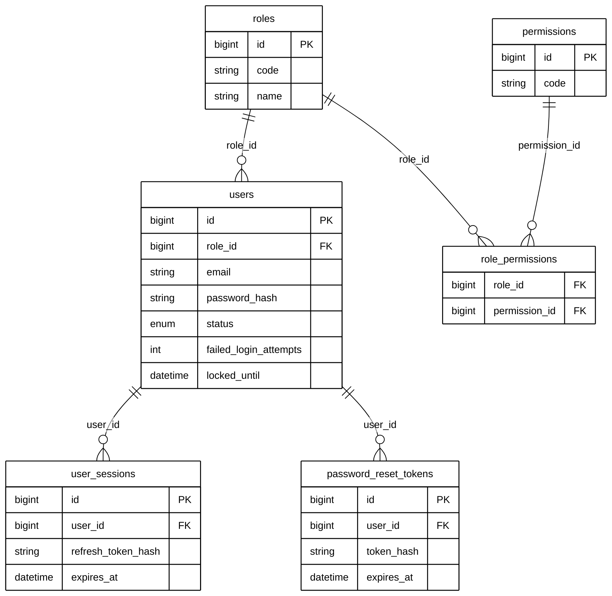

**b) Phân hệ Cấu trúc kho**

Sơ đồ trả lời câu hỏi: kho được phân rã tới vị trí lưu trữ theo mấy cấp và người dùng gắn với kho nào.

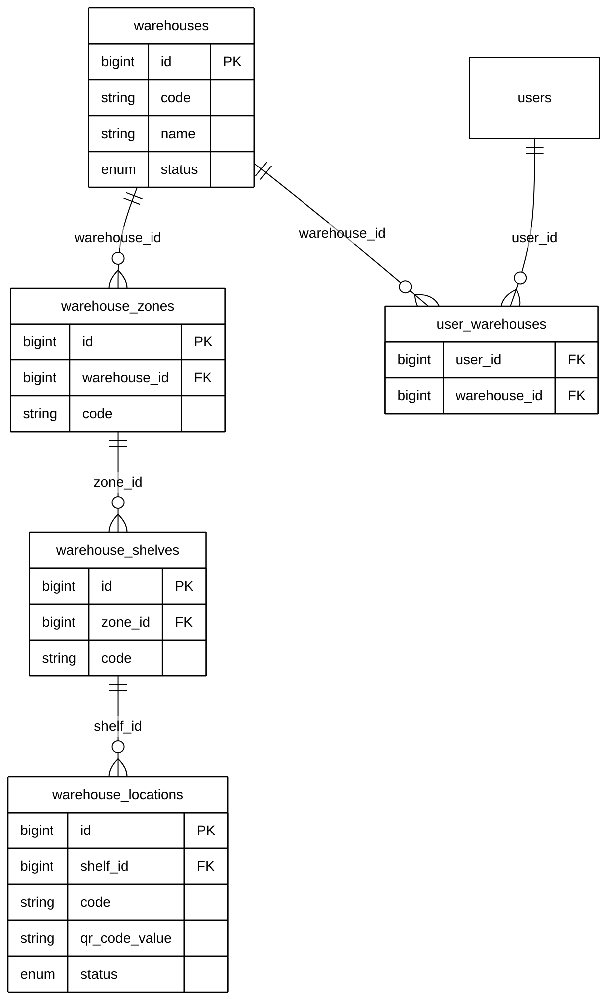

**c) Phân hệ Danh mục và Lô hàng**

Sơ đồ trả lời câu hỏi: một SKU được mô tả bởi những bảng danh mục nào và lô hàng gắn vào đâu.

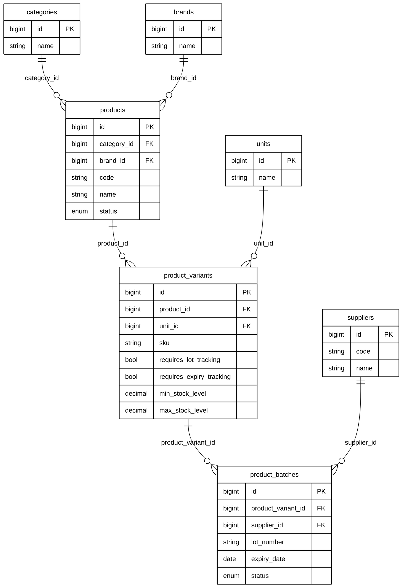

**d) Phân hệ Tồn theo vị trí (`stock_locations`)**

Sơ đồ trả lời câu hỏi: tồn kho được lưu ở mức chi tiết nào — theo SKU, theo vị trí hay theo lô.

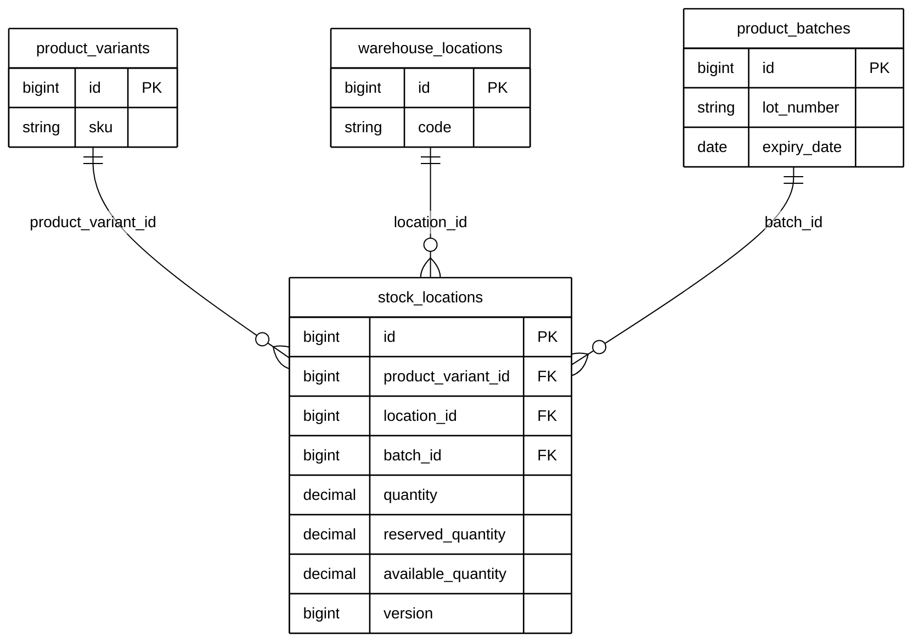

**e) Phân hệ Lịch sử giao dịch (`inventory_transactions`)**

Sơ đồ trả lời câu hỏi: mỗi biến động tồn được ghi lại kèm những thông tin truy vết nào.

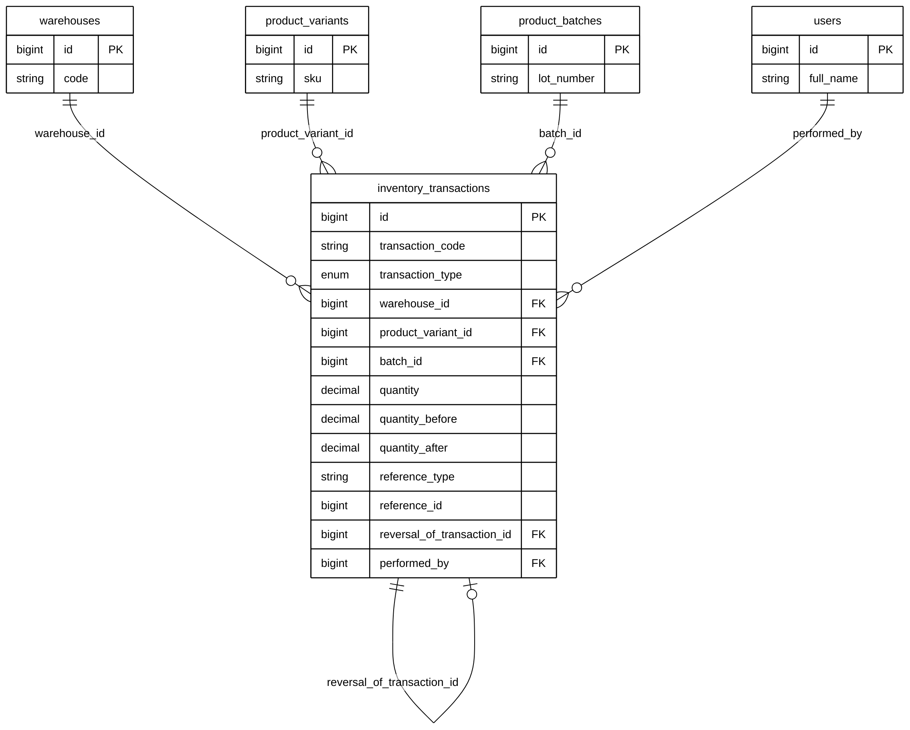

**f) Phân hệ Chứng từ nghiệp vụ**

Năm loại chứng từ có cấu trúc giống nhau: một bảng *phiếu* (header) và một bảng *dòng chi tiết* (item). Sơ đồ liệt kê đủ cả năm cặp bảng, chỉ giữ khóa chính, khóa ngoại và thuộc tính tiêu biểu của mỗi bảng.

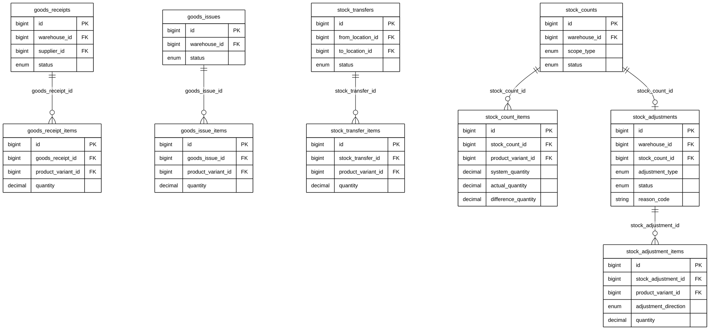

> Liên kết giữa các phân hệ: `stock_locations` và `inventory_transactions` (phân hệ d, e) tham chiếu tới `product_variants`, `warehouse_locations`, `product_batches` (phân hệ b, c); các dòng chứng từ (phân hệ f) tham chiếu `product_variants`. Việc tách phân hệ chỉ nhằm trình bày rõ ràng, không thay đổi ràng buộc khóa ngoại thực tế trong CSDL.

**g) Phân hệ Vận hành và hệ thống**

Nhóm bảng phục vụ vận hành: cảnh báo, thông báo, nhật ký thao tác, tệp đính kèm và tham số cấu hình.

Sơ đồ trả lời câu hỏi: dữ liệu vận hành được lưu ở những bảng nào và tham chiếu ngược về người dùng, kho, SKU ra sao.

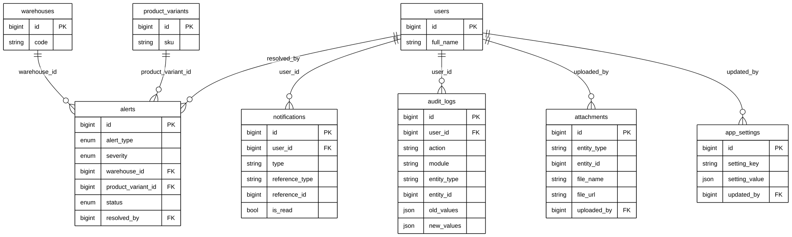

`audit_logs` và `attachments` dùng cặp `entity_type` + `entity_id` để trỏ tới bất kỳ thực thể nào (quan hệ đa hình), nên không có khóa ngoại cứng tới từng bảng chứng từ.

### 3.1.3 Mức vật lý (Physical)

Kiểu dữ liệu, ràng buộc, generated column, index thực tế của MySQL 8. Trích các bảng lõi tồn kho.

**Bảng `product_variants` (SKU)**

| Cột | Kiểu | Ràng buộc |
| --- | --- | --- |
| id | BIGINT UNSIGNED | PK, AUTO_INCREMENT |
| product_id | BIGINT UNSIGNED | FK → products(id) |
| unit_id | BIGINT UNSIGNED | FK → units(id) |
| sku | VARCHAR(100) | UNIQUE, NOT NULL |
| barcode | VARCHAR(100) | UNIQUE, NULL |
| requires_lot_tracking | BOOLEAN | DEFAULT FALSE |
| requires_expiry_tracking | BOOLEAN | DEFAULT FALSE |
| min_stock_level | DECIMAL(18,3) | DEFAULT 0, CHECK ≥ 0 |
| max_stock_level | DECIMAL(18,3) | NULL, CHECK ≥ min |
| status | ENUM('ACTIVE','INACTIVE','DISCONTINUED') | DEFAULT 'ACTIVE' |
| deleted_at | DATETIME(3) | NULL (soft delete) |

**Bảng `product_batches` (Lô/hạn dùng)**

| Cột | Kiểu | Ràng buộc |
| --- | --- | --- |
| id | BIGINT UNSIGNED | PK |
| product_variant_id | BIGINT UNSIGNED | FK → product_variants(id) |
| supplier_id | BIGINT UNSIGNED | FK → suppliers(id), NULL |
| lot_number | VARCHAR(100) | UNIQUE(variant, lot) |
| manufacture_date | DATE | NULL |
| expiry_date | DATE | NULL, CHECK expiry > manufacture |
| status | ENUM('ACTIVE','NEAR_EXPIRY','EXPIRED','BLOCKED','DEPLETED') | DEFAULT 'ACTIVE' |

**Bảng `stock_locations` (Tồn hiện tại — nguồn sự thật)**

| Cột | Kiểu | Ràng buộc / Ghi chú |
| --- | --- | --- |
| id | BIGINT UNSIGNED | PK |
| product_variant_id | BIGINT UNSIGNED | FK → product_variants(id) |
| location_id | BIGINT UNSIGNED | FK → warehouse_locations(id) |
| batch_id | BIGINT UNSIGNED | FK → product_batches(id), NULL |
| quantity | DECIMAL(18,3) | DEFAULT 0, CHECK ≥ 0 |
| reserved_quantity | DECIMAL(18,3) | DEFAULT 0, CHECK ≤ quantity |
| version | BIGINT UNSIGNED | Optimistic locking |
| batch_key | BIGINT UNSIGNED | **GENERATED** `IFNULL(batch_id, 0)` STORED |
| available_quantity | DECIMAL(18,3) | **GENERATED** `quantity - reserved_quantity` STORED |
| — | — | **UNIQUE(product_variant_id, location_id, batch_key)** |

> `batch_key` giải quyết vấn đề MySQL cho phép nhiều NULL trong unique index — nhờ đó bộ khóa tồn kho vẫn duy nhất khi hàng không có lô.

**Bảng `inventory_transactions` (Lịch sử biến động — append-only)**

| Cột | Kiểu | Ghi chú |
| --- | --- | --- |
| id | BIGINT UNSIGNED | PK |
| transaction_code | VARCHAR(80) | UNIQUE |
| transaction_type | ENUM | RECEIPT, ISSUE, TRANSFER_IN/OUT, COUNT_ADJUSTMENT_IN/OUT, MANUAL_ADJUSTMENT_IN/OUT, RETURN_IN/OUT, INITIAL_STOCK, REVERSAL |
| warehouse_id | BIGINT UNSIGNED | FK → warehouses(id) |
| product_variant_id | BIGINT UNSIGNED | FK → product_variants(id) |
| batch_id | BIGINT UNSIGNED | FK → product_batches(id), NULL |
| source_location_id / destination_location_id | BIGINT UNSIGNED | FK → warehouse_locations(id) |
| quantity | DECIMAL(18,3) | CHECK > 0 |
| quantity_before / quantity_after | DECIMAL(18,3) | Snapshot tồn |
| reference_type / reference_id | VARCHAR/BIGINT | Trỏ về phiếu gốc |
| reversal_of_transaction_id | BIGINT UNSIGNED | FK tự tham chiếu (đảo giao dịch) |
| performed_by / approved_by | BIGINT UNSIGNED | FK → users(id) |

**View báo cáo:** `vw_current_stock`, `vw_product_total_stock`, `vw_near_expiry_stock`.

Toàn bộ 38 bảng chia 6 nhóm: xác thực/phân quyền, cấu trúc kho, danh mục, tồn kho, chứng từ nghiệp vụ, hệ thống. Chi tiết đầy đủ xem [backend/warehouse_management_mysql.sql](backend/warehouse_management_mysql.sql).

---

## 3.2 Mô hình xử lý

### 3.2.1 Use case chi tiết (kèm bảng mô tả)

#### UC-05: Tạo và xác nhận phiếu nhập kho

| Mục | Nội dung |
| --- | --- |
| **Mã UC** | UC-05 |
| **Tên** | Nhập kho (Goods Receipt) |
| **Actor** | Nhân viên kho (tạo), Quản lý kho (xác nhận) |
| **Mô tả** | Ghi nhận hàng nhập từ NCC, tăng tồn khi xác nhận |
| **Tiền điều kiện** | Đã đăng nhập; đã có kho, NCC, SKU; người xác nhận có quyền `goods_receipts:confirm` |
| **Hậu điều kiện** | Phiếu CONFIRMED; `stock_locations` tăng; có bản ghi `inventory_transactions` type RECEIPT |
| **Luồng chính** | 1. Chọn kho + NCC → 2. Thêm dòng (SKU, SL, lô, hạn, vị trí) → 3. Lưu DRAFT → 4. Quản lý xác nhận → 5. Hệ thống tạo/khớp lô → 6. Tăng tồn → 7. Ghi giao dịch → 8. Phiếu CONFIRMED |
| **Luồng phụ / ngoại lệ** | 4a. Thiếu quyền → 403; 5a. SKU yêu cầu lô nhưng thiếu → lỗi validation; 6a. Lỗi DB → ROLLBACK, phiếu giữ DRAFT |

#### UC-06: Tạo và xác nhận phiếu xuất kho

| Mục | Nội dung |
| --- | --- |
| **Mã UC** | UC-06 |
| **Tên** | Xuất kho (Goods Issue) |
| **Actor** | Nhân viên kho (tạo), Quản lý kho (xác nhận) |
| **Mô tả** | Xuất hàng, giảm tồn, phân bổ FEFO/FIFO |
| **Tiền điều kiện** | Đã đăng nhập; SKU có tồn khả dụng; quyền `goods_issues:confirm` |
| **Hậu điều kiện** | Phiếu CONFIRMED; tồn giảm; giao dịch ISSUE cho từng lô phân bổ |
| **Luồng chính** | 1. Tạo phiếu, chọn chiến lược FEFO/FIFO → 2. Thêm dòng (SKU, SL) → 3. Lưu DRAFT → 4. Xác nhận → 5. Khóa tồn FOR UPDATE → 6. Phân bổ theo lô hết hạn sớm → 7. Giảm tồn + ghi giao dịch → 8. COMMIT |
| **Ngoại lệ** | 5a. Tồn không đủ → `INSUFFICIENT_STOCK`, ROLLBACK; 6a. Xung đột version → `CONCURRENT_UPDATE` |

#### UC-09: Điều chỉnh tồn kho

| Mục | Nội dung |
| --- | --- |
| **Mã UC** | UC-09 |
| **Tên** | Điều chỉnh tồn (Stock Adjustment) |
| **Actor** | Quản lý kho (tạo và gửi), Quản lý khác (duyệt) |
| **Mô tả** | Chỉnh tồn do hư hỏng/mất mát; bắt buộc duyệt bởi người khác |
| **Tiền điều kiện** | Đăng nhập; quyền `stock_adjustments:approve` để duyệt |
| **Hậu điều kiện** | APPROVED → tồn thay đổi + giao dịch MANUAL_ADJUSTMENT_IN/OUT |
| **Luồng chính** | 1. Tạo DRAFT → 2. Gửi duyệt (PENDING) → 3. Người khác duyệt → 4. Cập nhật tồn + ghi giao dịch |
| **Quy tắc** | Người tạo **không được** tự duyệt phiếu của mình |

#### UC-08: Kiểm kê

| Mục | Nội dung |
| --- | --- |
| **Mã UC** | UC-08 |
| **Actor** | Nhân viên kho, Quản lý kho |
| **Mô tả** | Đếm thực tế và đối chiếu, chênh lệch sinh điều chỉnh |
| **Luồng trạng thái** | DRAFT → IN_PROGRESS (start) → ghi count từng dòng → SUBMITTED (submit) → APPROVED/REJECTED |
| **Hậu điều kiện (APPROVED)** | Chênh lệch dương → COUNT_ADJUSTMENT_IN; âm → COUNT_ADJUSTMENT_OUT |

### 3.2.2 Sơ đồ tuần tự (Sequence)

Kiến trúc lớp mỗi request: `Routes → Middleware (auth/permission) → Controller → Validation (Zod) → Service → Repository → MySQL`.

#### Sequence 1: Đăng nhập

Sơ đồ trả lời câu hỏi: các lớp nào tham gia vào một lần đăng nhập và hệ thống trả gì về khi mật khẩu sai.

```mermaid
%%{init: {
  'theme': 'base',
  'themeVariables': {
    'primaryColor': '#ffffff',
    'primaryBorderColor': '#000000',
    'primaryTextColor': '#000000',
    'secondaryColor': '#ffffff',
    'secondaryBorderColor': '#000000',
    'secondaryTextColor': '#000000',
    'tertiaryColor': '#ffffff',
    'tertiaryBorderColor': '#000000',
    'tertiaryTextColor': '#000000',
    'lineColor': '#000000',
    'textColor': '#000000',
    'mainBkg': '#ffffff',
    'nodeBorder': '#000000',
    'clusterBkg': '#ffffff',
    'clusterBorder': '#000000',
    'edgeLabelBackground': '#ffffff',
    'fontSize': '14px',
    'actorBkg': '#ffffff',
    'actorBorder': '#000000',
    'actorTextColor': '#000000',
    'actorLineColor': '#000000',
    'signalColor': '#000000',
    'signalTextColor': '#000000',
    'labelBoxBkgColor': '#ffffff',
    'labelBoxBorderColor': '#000000',
    'labelTextColor': '#000000',
    'loopTextColor': '#000000',
    'noteBkgColor': '#ffffff',
    'noteBorderColor': '#000000',
    'noteTextColor': '#000000',
    'activationBkgColor': '#ffffff',
    'activationBorderColor': '#000000',
    'altBackground': '#ffffff'
  },
  'sequence': { 'mirrorActors': false, 'messageMargin': 40, 'boxMargin': 10, 'useMaxWidth': false }
}}%%
sequenceDiagram
    actor U as Người dùng
    participant FE as Frontend
    participant R as auth.routes
    participant C as auth.controller
    participant S as auth.service
    participant Repo as auth.repository
    participant DB as MySQL

    U->>FE: Nhập email và mật khẩu
    FE->>R: POST /auth/login
    R->>R: loginRateLimit chặn dò mật khẩu
    R->>C: loginController(body)
    C->>S: login(input)
    S->>Repo: findLoginUserByEmail(email)
    Repo->>DB: SELECT users WHERE email = ?
    DB-->>Repo: user kèm status, locked_until, password_hash
    Repo-->>S: user
    alt Không tìm thấy tài khoản
        S-->>C: 401 INVALID_CREDENTIALS
        C-->>FE: 401 INVALID_CREDENTIALS
        FE-->>U: Hiện lỗi Email hoặc mật khẩu không đúng
    else Trạng thái khác ACTIVE
        S-->>C: 403 USER_NOT_ACTIVE
        C-->>FE: 403 USER_NOT_ACTIVE
        FE-->>U: Hiện lỗi Tài khoản đã bị vô hiệu hóa
    else Còn trong thời gian khóa
        S-->>C: 423 USER_LOCKED
        C-->>FE: 423 USER_LOCKED
        FE-->>U: Hiện lỗi Tài khoản tạm khóa
    else Tài khoản hợp lệ
        S->>S: bcrypt.compare(password, password_hash)
        alt Mật khẩu sai
            S->>Repo: markLoginFailure(userId)
            Repo->>DB: UPDATE users tăng failed_login_attempts
            S-->>C: 401 INVALID_CREDENTIALS
            C-->>FE: 401 INVALID_CREDENTIALS
            FE-->>U: Hiện lỗi Email hoặc mật khẩu không đúng
        else Mật khẩu đúng
            S->>Repo: markLoginSuccess(userId)
            Repo->>DB: UPDATE users đặt last_login_at, reset số lần sai
            S->>S: issueTokenPair: jwt.sign và sinh refresh token
            S->>Repo: lưu phiên đăng nhập
            Repo->>DB: INSERT user_sessions
            DB-->>Repo: session_id
            Repo-->>S: session
            S-->>C: accessToken, refreshToken, user
            C-->>FE: 200 kèm cặp token
            FE-->>U: Mở trang tổng quan
        end
    end
```

#### Sequence 2: Xác nhận phiếu xuất kho (FEFO) — nghiệp vụ lõi

Sơ đồ trả lời câu hỏi: khi xác nhận phiếu xuất, hệ thống khóa và trừ tồn theo FEFO ở bước nào, và trả lỗi gì khi tồn không đủ.

```mermaid
%%{init: {
  'theme': 'base',
  'themeVariables': {
    'primaryColor': '#ffffff',
    'primaryBorderColor': '#000000',
    'primaryTextColor': '#000000',
    'secondaryColor': '#ffffff',
    'secondaryBorderColor': '#000000',
    'secondaryTextColor': '#000000',
    'tertiaryColor': '#ffffff',
    'tertiaryBorderColor': '#000000',
    'tertiaryTextColor': '#000000',
    'lineColor': '#000000',
    'textColor': '#000000',
    'mainBkg': '#ffffff',
    'nodeBorder': '#000000',
    'clusterBkg': '#ffffff',
    'clusterBorder': '#000000',
    'edgeLabelBackground': '#ffffff',
    'fontSize': '14px',
    'actorBkg': '#ffffff',
    'actorBorder': '#000000',
    'actorTextColor': '#000000',
    'actorLineColor': '#000000',
    'signalColor': '#000000',
    'signalTextColor': '#000000',
    'labelBoxBkgColor': '#ffffff',
    'labelBoxBorderColor': '#000000',
    'labelTextColor': '#000000',
    'loopTextColor': '#000000',
    'noteBkgColor': '#ffffff',
    'noteBorderColor': '#000000',
    'noteTextColor': '#000000',
    'activationBkgColor': '#ffffff',
    'activationBorderColor': '#000000',
    'altBackground': '#ffffff'
  },
  'sequence': { 'mirrorActors': false, 'messageMargin': 40, 'boxMargin': 10, 'useMaxWidth': false }
}}%%
sequenceDiagram
    actor M as Quản lý kho
    participant FE as Frontend
    participant MW as Middleware xác thực và phân quyền
    participant C as goods-issues.controller
    participant S as goods-issues.service
    participant Repo as goods-issues.repository
    participant DB as MySQL

    M->>FE: Bấm Xác nhận trên phiếu xuất
    FE->>MW: POST /goods-issues/:id/confirm kèm Bearer token
    MW->>MW: verifyToken và requirePermission(goods_issues:confirm)
    alt Thiếu quyền
        MW-->>FE: 403 FORBIDDEN
        FE-->>M: Hiện thông báo không đủ quyền
    else Đủ quyền
        MW->>C: confirmGoodsIssueController(id)
        C->>S: confirmGoodsIssue(input)
        S->>Repo: confirmGoodsIssueTransaction(input)
        Repo->>DB: BEGIN TRANSACTION
        Repo->>DB: SELECT goods_issues FOR UPDATE
        DB-->>Repo: phiếu kèm status
        alt Trạng thái không phải DRAFT hoặc PENDING
            Repo->>DB: ROLLBACK
            Repo-->>S: GOODS_ISSUE_NOT_CONFIRMABLE
            S-->>C: 409 GOODS_ISSUE_NOT_CONFIRMABLE
            C-->>FE: 409 GOODS_ISSUE_NOT_CONFIRMABLE
            FE-->>M: Hiện lỗi Phiếu không ở trạng thái xác nhận được
        else Trạng thái hợp lệ
            Repo->>DB: SELECT goods_issue_items
            DB-->>Repo: danh sách dòng hàng
            loop Mỗi dòng hàng
                Repo->>DB: SELECT stock_locations ORDER BY expiry_date ASC FOR UPDATE
                DB-->>Repo: các lô khả dụng theo FEFO
                alt Thiếu batch_id hoặc thiếu expiry_date
                    Repo->>DB: ROLLBACK
                    Repo-->>S: BATCH_REQUIRED hoặc EXPIRY_DATE_REQUIRED
                    S-->>C: 422 kèm mã lỗi
                    C-->>FE: 422 kèm mã lỗi
                    FE-->>M: Hiện lỗi thiếu thông tin lô
                else Dữ liệu lô đầy đủ
                    Repo->>DB: UPDATE stock_locations SET quantity = quantity - ?, version = version + 1 WHERE quantity - reserved_quantity >= ?
                    DB-->>Repo: affectedRows
                    alt affectedRows bằng 0
                        Repo->>DB: ROLLBACK
                        Repo-->>S: CONCURRENT_STOCK_UPDATE
                        S-->>C: 409 CONCURRENT_STOCK_UPDATE
                        C-->>FE: 409 CONCURRENT_STOCK_UPDATE
                        FE-->>M: Hiện lỗi Dữ liệu vừa bị thay đổi, tải lại
                    else Trừ tồn thành công
                        Repo->>DB: INSERT inventory_transactions loại ISSUE
                    end
                end
            end
            alt Tổng phân bổ chưa đủ số cần xuất
                Repo->>DB: ROLLBACK
                Repo-->>S: INSUFFICIENT_STOCK
                S-->>C: 409 INSUFFICIENT_STOCK
                C-->>FE: 409 INSUFFICIENT_STOCK
                FE-->>M: Hiện lỗi Tồn kho không đủ
            else Phân bổ đủ
                Repo->>DB: UPDATE goods_issues SET status = 'CONFIRMED'
                Repo->>DB: INSERT audit_logs action CONFIRM
                Repo->>DB: COMMIT
                Repo-->>S: kết quả phân bổ theo lô
                S-->>C: thành công
                C-->>FE: 200 phiếu CONFIRMED
                FE-->>M: Hiện phiếu đã xác nhận
            end
        end
    end
```

#### Sequence 3: Tạo phiếu nhập kho

Sơ đồ trả lời câu hỏi: dữ liệu phiếu nhập được kiểm tra ở đâu trước khi ghi xuống cơ sở dữ liệu.

```mermaid
%%{init: {
  'theme': 'base',
  'themeVariables': {
    'primaryColor': '#ffffff',
    'primaryBorderColor': '#000000',
    'primaryTextColor': '#000000',
    'secondaryColor': '#ffffff',
    'secondaryBorderColor': '#000000',
    'secondaryTextColor': '#000000',
    'tertiaryColor': '#ffffff',
    'tertiaryBorderColor': '#000000',
    'tertiaryTextColor': '#000000',
    'lineColor': '#000000',
    'textColor': '#000000',
    'mainBkg': '#ffffff',
    'nodeBorder': '#000000',
    'clusterBkg': '#ffffff',
    'clusterBorder': '#000000',
    'edgeLabelBackground': '#ffffff',
    'fontSize': '14px',
    'actorBkg': '#ffffff',
    'actorBorder': '#000000',
    'actorTextColor': '#000000',
    'actorLineColor': '#000000',
    'signalColor': '#000000',
    'signalTextColor': '#000000',
    'labelBoxBkgColor': '#ffffff',
    'labelBoxBorderColor': '#000000',
    'labelTextColor': '#000000',
    'loopTextColor': '#000000',
    'noteBkgColor': '#ffffff',
    'noteBorderColor': '#000000',
    'noteTextColor': '#000000',
    'activationBkgColor': '#ffffff',
    'activationBorderColor': '#000000',
    'altBackground': '#ffffff'
  },
  'sequence': { 'mirrorActors': false, 'messageMargin': 40, 'boxMargin': 10, 'useMaxWidth': false }
}}%%
sequenceDiagram
    actor St as Nhân viên kho
    participant FE as Frontend
    participant C as goods-receipts.controller
    participant V as Lớp kiểm tra dữ liệu Zod
    participant S as goods-receipts.service
    participant Repo as goods-receipts.repository
    participant DB as MySQL

    St->>FE: Nhập phiếu: kho, nhà cung cấp, dòng hàng
    FE->>C: POST /goods-receipts
    C->>V: validate(body)
    alt Dữ liệu không hợp lệ
        V-->>C: 400 VALIDATION_ERROR
        C-->>FE: 400 VALIDATION_ERROR kèm danh sách trường sai
        FE-->>St: Hiện lỗi ngay trên form
    else Dữ liệu hợp lệ
        C->>S: createGoodsReceipt(input)
        S->>Repo: insertGoodsReceipt kèm dòng hàng
        Repo->>DB: BEGIN TRANSACTION
        Repo->>DB: INSERT goods_receipts, status = 'DRAFT'
        Repo->>DB: INSERT goods_receipt_items
        Repo->>DB: INSERT audit_logs action CREATE
        Repo->>DB: COMMIT
        DB-->>Repo: id phiếu
        Repo-->>S: id phiếu
        S-->>C: id phiếu
        C-->>FE: 201 Created, phiếu DRAFT
        FE-->>St: Mở phiếu vừa tạo
    end
```

#### Sequence 4: Duyệt phiếu điều chỉnh tồn

Sơ đồ trả lời câu hỏi: hệ thống chặn hành vi tự duyệt phiếu điều chỉnh ở bước nào.

```mermaid
%%{init: {
  'theme': 'base',
  'themeVariables': {
    'primaryColor': '#ffffff',
    'primaryBorderColor': '#000000',
    'primaryTextColor': '#000000',
    'secondaryColor': '#ffffff',
    'secondaryBorderColor': '#000000',
    'secondaryTextColor': '#000000',
    'tertiaryColor': '#ffffff',
    'tertiaryBorderColor': '#000000',
    'tertiaryTextColor': '#000000',
    'lineColor': '#000000',
    'textColor': '#000000',
    'mainBkg': '#ffffff',
    'nodeBorder': '#000000',
    'clusterBkg': '#ffffff',
    'clusterBorder': '#000000',
    'edgeLabelBackground': '#ffffff',
    'fontSize': '14px',
    'actorBkg': '#ffffff',
    'actorBorder': '#000000',
    'actorTextColor': '#000000',
    'actorLineColor': '#000000',
    'signalColor': '#000000',
    'signalTextColor': '#000000',
    'labelBoxBkgColor': '#ffffff',
    'labelBoxBorderColor': '#000000',
    'labelTextColor': '#000000',
    'loopTextColor': '#000000',
    'noteBkgColor': '#ffffff',
    'noteBorderColor': '#000000',
    'noteTextColor': '#000000',
    'activationBkgColor': '#ffffff',
    'activationBorderColor': '#000000',
    'altBackground': '#ffffff'
  },
  'sequence': { 'mirrorActors': false, 'messageMargin': 40, 'boxMargin': 10, 'useMaxWidth': false }
}}%%
sequenceDiagram
    actor M as Quản lý duyệt
    participant MW as Middleware xác thực và phân quyền
    participant S as stock-adjustments.service
    participant Repo as stock-adjustments.repository
    participant DB as MySQL

    M->>MW: POST /stock-adjustments/:id/approve
    MW->>MW: requirePermission(stock_adjustments:approve)
    alt Thiếu quyền
        MW-->>M: 403 FORBIDDEN
    else Đủ quyền
        MW->>S: approveStockAdjustment(id, approvedBy)
        S->>Repo: approveTransaction(id)
        Repo->>DB: BEGIN TRANSACTION
        Repo->>DB: SELECT stock_adjustments FOR UPDATE
        DB-->>Repo: phiếu kèm status, created_by, adjustment_type
        alt Trạng thái không phải PENDING
            Repo->>DB: ROLLBACK
            Repo-->>S: STOCK_ADJUSTMENT_NOT_APPROVABLE
            S-->>M: 409 STOCK_ADJUSTMENT_NOT_APPROVABLE
        else Người duyệt trùng người tạo
            Repo->>DB: ROLLBACK
            Repo-->>S: SELF_APPROVAL_NOT_ALLOWED
            S-->>M: 403 SELF_APPROVAL_NOT_ALLOWED
        else Hợp lệ
            loop Mỗi dòng điều chỉnh
                Repo->>DB: SELECT stock_locations FOR UPDATE
                alt Chiều OUT và tồn không đủ
                    Repo->>DB: ROLLBACK
                    Repo-->>S: INSUFFICIENT_STOCK
                    S-->>M: 409 INSUFFICIENT_STOCK
                else Hợp lệ
                    Repo->>DB: UPDATE stock_locations theo adjustment_direction
                    Repo->>DB: INSERT inventory_transactions MANUAL hoặc COUNT_ADJUSTMENT
                end
            end
            Repo->>DB: UPDATE stock_adjustments SET status = 'APPROVED'
            Repo->>DB: INSERT audit_logs action APPROVE
            Repo->>DB: COMMIT
            Repo-->>S: thành công
            S-->>M: 200 phiếu APPROVED
        end
    end
```

#### Sequence 5: Làm mới token và đăng xuất

Sơ đồ trả lời câu hỏi: phiên đăng nhập được gia hạn và kết thúc thông qua bảng `user_sessions` như thế nào.

```mermaid
%%{init: {
  'theme': 'base',
  'themeVariables': {
    'primaryColor': '#ffffff',
    'primaryBorderColor': '#000000',
    'primaryTextColor': '#000000',
    'secondaryColor': '#ffffff',
    'secondaryBorderColor': '#000000',
    'secondaryTextColor': '#000000',
    'tertiaryColor': '#ffffff',
    'tertiaryBorderColor': '#000000',
    'tertiaryTextColor': '#000000',
    'lineColor': '#000000',
    'textColor': '#000000',
    'mainBkg': '#ffffff',
    'nodeBorder': '#000000',
    'clusterBkg': '#ffffff',
    'clusterBorder': '#000000',
    'edgeLabelBackground': '#ffffff',
    'fontSize': '14px',
    'actorBkg': '#ffffff',
    'actorBorder': '#000000',
    'actorTextColor': '#000000',
    'actorLineColor': '#000000',
    'signalColor': '#000000',
    'signalTextColor': '#000000',
    'labelBoxBkgColor': '#ffffff',
    'labelBoxBorderColor': '#000000',
    'labelTextColor': '#000000',
    'loopTextColor': '#000000',
    'noteBkgColor': '#ffffff',
    'noteBorderColor': '#000000',
    'noteTextColor': '#000000',
    'activationBkgColor': '#ffffff',
    'activationBorderColor': '#000000',
    'altBackground': '#ffffff'
  },
  'sequence': { 'mirrorActors': false, 'messageMargin': 40, 'boxMargin': 10, 'useMaxWidth': false }
}}%%
sequenceDiagram
    actor U as Người dùng
    participant FE as Frontend
    participant C as auth.controller
    participant S as auth.service
    participant Repo as auth.repository
    participant DB as MySQL

    FE->>C: POST /auth/refresh kèm refreshToken
    C->>S: refresh(refreshToken)
    S->>Repo: tìm phiên theo refresh_token_hash
    Repo->>DB: SELECT user_sessions WHERE refresh_token_hash = ?
    DB-->>Repo: phiên kèm expires_at
    Repo-->>S: session
    alt Không tìm thấy phiên hoặc đã hết hạn
        S-->>C: 401 REFRESH_TOKEN_INVALID
        C-->>FE: 401 REFRESH_TOKEN_INVALID
        FE-->>U: Đưa về trang đăng nhập
    else Phiên còn hiệu lực
        S->>S: Sinh cặp token mới
        S->>Repo: thay refresh_token_hash của phiên
        Repo->>DB: UPDATE user_sessions
        Repo-->>S: thành công
        S-->>C: accessToken, refreshToken mới
        C-->>FE: 200 kèm cặp token mới
        FE-->>U: Giữ nguyên phiên làm việc
    end
    U->>FE: Bấm Đăng xuất
    FE->>C: POST /auth/logout
    C->>S: logout(refreshToken)
    S->>Repo: xóa phiên
    Repo->>DB: DELETE user_sessions WHERE refresh_token_hash = ?
    Repo-->>S: thành công
    S-->>C: thành công
    C-->>FE: 204 No Content
    FE-->>U: Xóa token phía client, về trang đăng nhập
```

#### Sequence 6: Đảo phiếu nhập kho đã xác nhận

Sơ đồ trả lời câu hỏi: thao tác đảo phiếu đọc lại giao dịch gốc và sinh giao dịch đối ứng ở bước nào.

```mermaid
%%{init: {
  'theme': 'base',
  'themeVariables': {
    'primaryColor': '#ffffff',
    'primaryBorderColor': '#000000',
    'primaryTextColor': '#000000',
    'secondaryColor': '#ffffff',
    'secondaryBorderColor': '#000000',
    'secondaryTextColor': '#000000',
    'tertiaryColor': '#ffffff',
    'tertiaryBorderColor': '#000000',
    'tertiaryTextColor': '#000000',
    'lineColor': '#000000',
    'textColor': '#000000',
    'mainBkg': '#ffffff',
    'nodeBorder': '#000000',
    'clusterBkg': '#ffffff',
    'clusterBorder': '#000000',
    'edgeLabelBackground': '#ffffff',
    'fontSize': '14px',
    'actorBkg': '#ffffff',
    'actorBorder': '#000000',
    'actorTextColor': '#000000',
    'actorLineColor': '#000000',
    'signalColor': '#000000',
    'signalTextColor': '#000000',
    'labelBoxBkgColor': '#ffffff',
    'labelBoxBorderColor': '#000000',
    'labelTextColor': '#000000',
    'loopTextColor': '#000000',
    'noteBkgColor': '#ffffff',
    'noteBorderColor': '#000000',
    'noteTextColor': '#000000',
    'activationBkgColor': '#ffffff',
    'activationBorderColor': '#000000',
    'altBackground': '#ffffff'
  },
  'sequence': { 'mirrorActors': false, 'messageMargin': 40, 'boxMargin': 10, 'useMaxWidth': false }
}}%%
sequenceDiagram
    actor M as Quản lý kho
    participant MW as Middleware xác thực và phân quyền
    participant S as goods-receipts.service
    participant Repo as reversal.repository
    participant DB as MySQL

    M->>MW: POST /goods-receipts/:id/reverse
    MW->>MW: requirePermission(goods_receipts:reverse)
    alt Thiếu quyền
        MW-->>M: 403 FORBIDDEN
    else Đủ quyền
        MW->>S: reverseGoodsReceipt(id, reversedBy)
        S->>Repo: reverseGoodsReceiptTransaction(id)
        Repo->>DB: BEGIN TRANSACTION
        Repo->>DB: SELECT goods_receipts FOR UPDATE
        DB-->>Repo: phiếu kèm status
        alt Trạng thái không phải CONFIRMED
            Repo->>DB: ROLLBACK
            Repo-->>S: GOODS_RECEIPT_NOT_REVERSIBLE
            S-->>M: 409 GOODS_RECEIPT_NOT_REVERSIBLE
        else Trạng thái CONFIRMED
            Repo->>DB: SELECT inventory_transactions WHERE reference_id = ? AND transaction_type <> 'REVERSAL'
            DB-->>Repo: danh sách giao dịch gốc
            alt Đã có giao dịch đảo trước đó
                Repo->>DB: ROLLBACK
                Repo-->>S: REFERENCE_ALREADY_REVERSED
                S-->>M: 409 REFERENCE_ALREADY_REVERSED
            else Chưa từng đảo
                loop Mỗi giao dịch gốc
                    Repo->>DB: SELECT stock_locations FOR UPDATE
                    alt Tồn hiện tại không đủ để hoàn tác
                        Repo->>DB: ROLLBACK
                        Repo-->>S: REVERSAL_INSUFFICIENT_STOCK
                        S-->>M: 409 REVERSAL_INSUFFICIENT_STOCK
                    else Tồn đủ
                        Repo->>DB: UPDATE stock_locations trừ lại số đã nhập
                        Repo->>DB: INSERT inventory_transactions loại REVERSAL
                    end
                end
                Repo->>DB: UPDATE goods_receipts SET status = 'CANCELLED'
                Repo->>DB: INSERT audit_logs action REVERSE
                Repo->>DB: COMMIT
                Repo-->>S: thành công
                S-->>M: 200 phiếu CANCELLED
            end
        end
    end
```

#### Sequence 7: Duyệt kiểm kê và sinh phiếu điều chỉnh

Sơ đồ trả lời câu hỏi: vì sao duyệt kiểm kê **chưa** làm đổi tồn ngay, mà phải qua một phiếu điều chỉnh trung gian.

```mermaid
%%{init: {
  'theme': 'base',
  'themeVariables': {
    'primaryColor': '#ffffff',
    'primaryBorderColor': '#000000',
    'primaryTextColor': '#000000',
    'secondaryColor': '#ffffff',
    'secondaryBorderColor': '#000000',
    'secondaryTextColor': '#000000',
    'tertiaryColor': '#ffffff',
    'tertiaryBorderColor': '#000000',
    'tertiaryTextColor': '#000000',
    'lineColor': '#000000',
    'textColor': '#000000',
    'mainBkg': '#ffffff',
    'nodeBorder': '#000000',
    'clusterBkg': '#ffffff',
    'clusterBorder': '#000000',
    'edgeLabelBackground': '#ffffff',
    'fontSize': '14px',
    'actorBkg': '#ffffff',
    'actorBorder': '#000000',
    'actorTextColor': '#000000',
    'actorLineColor': '#000000',
    'signalColor': '#000000',
    'signalTextColor': '#000000',
    'labelBoxBkgColor': '#ffffff',
    'labelBoxBorderColor': '#000000',
    'labelTextColor': '#000000',
    'loopTextColor': '#000000',
    'noteBkgColor': '#ffffff',
    'noteBorderColor': '#000000',
    'noteTextColor': '#000000',
    'activationBkgColor': '#ffffff',
    'activationBorderColor': '#000000',
    'altBackground': '#ffffff'
  },
  'sequence': { 'mirrorActors': false, 'messageMargin': 40, 'boxMargin': 10, 'useMaxWidth': false }
}}%%
sequenceDiagram
    actor M as Quản lý kho
    participant MW as Middleware xác thực và phân quyền
    participant S as stock-counts.service
    participant Repo as stock-counts.repository
    participant DB as MySQL

    M->>MW: POST /stock-counts/:id/approve
    MW->>MW: requirePermission(stock_counts:approve)
    MW->>S: approveStockCount(id, approvedBy)
    S->>Repo: approveCountTransaction(id)
    Repo->>DB: BEGIN TRANSACTION
    Repo->>DB: SELECT stock_counts FOR UPDATE
    DB-->>Repo: phiếu kèm status
    alt Trạng thái không phải SUBMITTED
        Repo->>DB: ROLLBACK
        Repo-->>S: STOCK_COUNT_NOT_APPROVABLE
        S-->>M: 409 STOCK_COUNT_NOT_APPROVABLE
    else Trạng thái SUBMITTED
        Repo->>DB: SELECT stock_count_items FOR UPDATE
        DB-->>Repo: danh sách dòng kèm difference_quantity
        alt Còn dòng chưa nhập số thực đếm
            Repo->>DB: ROLLBACK
            Repo-->>S: STOCK_COUNT_HAS_UNCOUNTED_ITEMS
            S-->>M: 409 STOCK_COUNT_HAS_UNCOUNTED_ITEMS
        else Đã đếm đủ
            alt Có dòng chênh lệch khác 0
                Repo->>DB: INSERT stock_adjustments type COUNT, status PENDING, reason COUNT_VARIANCE
                loop Mỗi dòng chênh lệch
                    Repo->>DB: INSERT stock_adjustment_items, direction IN nếu thừa, OUT nếu thiếu
                end
            else Không có chênh lệch
                Repo->>Repo: Bỏ qua, không sinh phiếu điều chỉnh
            end
            Repo->>DB: UPDATE stock_counts SET status = 'APPROVED'
            Repo->>DB: INSERT audit_logs action APPROVE
            Repo->>DB: COMMIT
            Repo-->>S: adjustmentId và số dòng chênh lệch
            S-->>M: 200 kèm mã phiếu điều chỉnh cần duyệt tiếp
    end
    end
```

Đây là điểm dễ hiểu nhầm nhất của nghiệp vụ kiểm kê: `POST /stock-counts/:id/approve` chỉ chốt kết quả đếm và sinh phiếu `stock_adjustments` loại `COUNT` ở trạng thái `PENDING`. Tồn kho chỉ thay đổi khi phiếu điều chỉnh đó được duyệt bằng `POST /stock-adjustments/:id/approve`.

### 3.2.3 Sơ đồ hoạt động (Activity)

#### Activity 1: Xác nhận phiếu xuất kho theo FEFO

Sơ đồ trả lời câu hỏi: một lần xác nhận phiếu xuất xử lý lần lượt từng dòng hàng như thế nào trong một giao dịch.

```mermaid
%%{init: {
  'theme': 'base',
  'themeVariables': {
    'primaryColor': '#ffffff',
    'primaryBorderColor': '#000000',
    'primaryTextColor': '#000000',
    'secondaryColor': '#ffffff',
    'secondaryBorderColor': '#000000',
    'secondaryTextColor': '#000000',
    'tertiaryColor': '#ffffff',
    'tertiaryBorderColor': '#000000',
    'tertiaryTextColor': '#000000',
    'lineColor': '#000000',
    'textColor': '#000000',
    'mainBkg': '#ffffff',
    'nodeBorder': '#000000',
    'clusterBkg': '#ffffff',
    'clusterBorder': '#000000',
    'edgeLabelBackground': '#ffffff',
    'fontSize': '14px'
  },
  'flowchart': { 'curve': 'stepAfter', 'nodeSpacing': 60, 'rankSpacing': 70, 'padding': 12, 'useMaxWidth': false }
}}%%
flowchart TD
    Start(["Bắt đầu: Người dùng bấm Xác nhận"]) --> A["Xác thực token và kiểm tra quyền"]
    A --> B{"Có quyền goods_issues:confirm?"}
    B -->|Không| B1["Trả 403 FORBIDDEN"]
    B1 --> End1(["Kết thúc: Phiếu giữ nguyên DRAFT"])
    B -->|Có| C["BEGIN TRANSACTION, khóa phiếu FOR UPDATE"]
    C --> Dq{"Phiếu ở DRAFT hoặc PENDING và có dòng hàng?"}
    Dq -->|Không| D1["ROLLBACK, trả NOT_CONFIRMABLE hoặc HAS_NO_ITEMS"]
    D1 --> End1
    Dq -->|Có| E["Chọn dòng hàng tiếp theo"]
    E --> F["Khóa các lô tồn FOR UPDATE, sắp xếp hết hạn sớm trước"]
    F --> G{"Dữ liệu lô và hạn dùng đủ theo cấu hình SKU?"}
    G -->|Thiếu| G1["ROLLBACK, trả BATCH_REQUIRED hoặc EXPIRY_DATE_REQUIRED"]
    G1 --> End2(["Kết thúc: Tồn kho không đổi"])
    G -->|Đủ| H["Phân bổ số lượng vào từng lô theo FEFO"]
    H --> I["UPDATE trừ tồn với điều kiện quantity trừ reserved lớn hơn hoặc bằng số cần"]
    I --> J{"Số dòng bị ảnh hưởng khác 0?"}
    J -->|Bằng 0| J1["ROLLBACK, trả CONCURRENT_STOCK_UPDATE"]
    J1 --> End2
    J -->|Khác 0| K["Ghi inventory_transactions loại ISSUE"]
    K --> L{"Đã phân bổ đủ số lượng của dòng?"}
    L -->|Chưa đủ và hết lô| L1["ROLLBACK, trả INSUFFICIENT_STOCK"]
    L1 --> End2
    L -->|Đủ| M{"Còn dòng hàng chưa xử lý?"}
    M -->|Còn| E
    M -->|Hết| N["Đổi trạng thái phiếu sang CONFIRMED"]
    N --> O["Ghi audit_logs action CONFIRM"]
    O --> P["COMMIT"]
    P --> End3(["Kết thúc: Xuất kho thành công"])
```

#### Activity 2: Quy trình kiểm kê

Sơ đồ trả lời câu hỏi: kết quả kiểm kê được đối chiếu và chuyển thành giao dịch điều chỉnh ở bước nào.

```mermaid
%%{init: {
  'theme': 'base',
  'themeVariables': {
    'primaryColor': '#ffffff',
    'primaryBorderColor': '#000000',
    'primaryTextColor': '#000000',
    'secondaryColor': '#ffffff',
    'secondaryBorderColor': '#000000',
    'secondaryTextColor': '#000000',
    'tertiaryColor': '#ffffff',
    'tertiaryBorderColor': '#000000',
    'tertiaryTextColor': '#000000',
    'lineColor': '#000000',
    'textColor': '#000000',
    'mainBkg': '#ffffff',
    'nodeBorder': '#000000',
    'clusterBkg': '#ffffff',
    'clusterBorder': '#000000',
    'edgeLabelBackground': '#ffffff',
    'fontSize': '14px'
  },
  'flowchart': { 'curve': 'stepAfter', 'nodeSpacing': 60, 'rankSpacing': 70, 'padding': 12, 'useMaxWidth': false }
}}%%
flowchart TD
    Start(["Bắt đầu: POST /stock-counts, phiếu DRAFT"]) --> A["Chọn phạm vi: kho, khu vực, kệ, vị trí, SKU hoặc danh mục"]
    A --> B["POST /:id/start, chốt snapshot tồn hệ thống vào stock_count_items"]
    B --> C{"Snapshot có dòng nào không?"}
    C -->|Rỗng| C1["Trả STOCK_COUNT_SNAPSHOT_EMPTY"]
    C1 --> End1(["Kết thúc: Phiếu giữ nguyên DRAFT"])
    C -->|Có dòng| Dn["Nhân viên ghi actual_quantity từng dòng"]
    Dn --> E{"Đã đếm hết các dòng?"}
    E -->|Chưa| Dn
    E -->|Rồi| F["POST /:id/submit, phiếu chuyển SUBMITTED"]
    F --> G{"Quản lý có quyền stock_counts:approve?"}
    G -->|Không| G1["Trả 403 FORBIDDEN"]
    G1 --> End2(["Kết thúc: Phiếu giữ nguyên SUBMITTED"])
    G -->|Có| H{"Còn dòng chưa nhập số thực đếm?"}
    H -->|Còn| H1["Trả STOCK_COUNT_HAS_UNCOUNTED_ITEMS"]
    H1 --> Dn
    H -->|Không| I{"Có dòng chênh lệch khác 0?"}
    I -->|Không có| J["Chuyển APPROVED, tồn kho giữ nguyên"]
    J --> End3(["Kết thúc: Kiểm kê khớp, không phát sinh điều chỉnh"])
    I -->|Có| K["Sinh stock_adjustments loại COUNT ở trạng thái PENDING"]
    K --> L["Sinh stock_adjustment_items, chiều IN nếu thừa, OUT nếu thiếu"]
    L --> M["Chuyển phiếu kiểm kê sang APPROVED, COMMIT"]
    M --> N["Người duyệt xử lý phiếu điều chỉnh bằng POST /stock-adjustments/:id/approve"]
    N --> End4(["Kết thúc: Tồn kho chỉ đổi sau khi duyệt phiếu điều chỉnh"])
```

#### Activity 3: Phân quyền request bất kỳ

Sơ đồ trả lời câu hỏi: một request bất kỳ bị chặn ở đâu khi thiếu token hoặc thiếu quyền.

```mermaid
%%{init: {
  'theme': 'base',
  'themeVariables': {
    'primaryColor': '#ffffff',
    'primaryBorderColor': '#000000',
    'primaryTextColor': '#000000',
    'secondaryColor': '#ffffff',
    'secondaryBorderColor': '#000000',
    'secondaryTextColor': '#000000',
    'tertiaryColor': '#ffffff',
    'tertiaryBorderColor': '#000000',
    'tertiaryTextColor': '#000000',
    'lineColor': '#000000',
    'textColor': '#000000',
    'mainBkg': '#ffffff',
    'nodeBorder': '#000000',
    'clusterBkg': '#ffffff',
    'clusterBorder': '#000000',
    'edgeLabelBackground': '#ffffff',
    'fontSize': '14px'
  },
  'flowchart': { 'curve': 'stepAfter', 'nodeSpacing': 60, 'rankSpacing': 70, 'padding': 12, 'useMaxWidth': false }
}}%%
flowchart TD
    Start(["Bắt đầu: Nhận HTTP request"]) --> A["requestContext gắn requestId, requestLogger ghi log"]
    A --> B["app.ts định tuyến tới module nghiệp vụ"]
    B --> C{"Route có gắn verifyToken?"}
    C -->|Không| F["Chuyển vào controller, service, repository"]
    C -->|Có| Dn["verifyToken: đọc header Authorization"]
    Dn --> E{"Có Bearer token?"}
    E -->|Không| E1["Trả 401 TOKEN_MISSING"]
    E1 --> End1(["Kết thúc: Từ chối truy cập"])
    E -->|Có| G{"Chữ ký JWT hợp lệ và còn hạn?"}
    G -->|Không| G1["Trả 401 TOKEN_INVALID"]
    G1 --> End1
    G -->|Có| H["requirePermission: tra roles và role_permissions"]
    H --> I{"Vai trò có mã quyền yêu cầu?"}
    I -->|Không| I1["Trả 403 FORBIDDEN"]
    I1 --> End1
    I -->|Có| F
    F --> J["Trả JSON bọc trong trường data"]
    J --> End2(["Kết thúc: Trả dữ liệu thành công"])
```

---

#### Activity 4: Nhận nhanh bằng QR

Sơ đồ trả lời câu hỏi: một lần quét QR đi qua những bước kiểm tra nào trong cùng một giao dịch cơ sở dữ liệu.

```mermaid
%%{init: {
  'theme': 'base',
  'themeVariables': {
    'primaryColor': '#ffffff',
    'primaryBorderColor': '#000000',
    'primaryTextColor': '#000000',
    'secondaryColor': '#ffffff',
    'secondaryBorderColor': '#000000',
    'secondaryTextColor': '#000000',
    'tertiaryColor': '#ffffff',
    'tertiaryBorderColor': '#000000',
    'tertiaryTextColor': '#000000',
    'lineColor': '#000000',
    'textColor': '#000000',
    'mainBkg': '#ffffff',
    'nodeBorder': '#000000',
    'clusterBkg': '#ffffff',
    'clusterBorder': '#000000',
    'edgeLabelBackground': '#ffffff',
    'fontSize': '14px'
  },
  'flowchart': { 'curve': 'stepAfter', 'nodeSpacing': 60, 'rankSpacing': 70, 'padding': 12, 'useMaxWidth': false }
}}%%
flowchart TD
    Start(["Bắt đầu: POST /stock/quick-receive"]) --> A["BEGIN TRANSACTION"]
    A --> B["Tra SKU theo mã quét: sku, barcode hoặc qr_code_value"]
    B --> C{"Tìm thấy SKU đang hoạt động?"}
    C -->|Không| C1["ROLLBACK, trả 404 PRODUCT_NOT_FOUND"]
    C1 --> End1(["Kết thúc: Không ghi nhận tồn"])
    C -->|Có| Dn["Tra vị trí theo mã quét, khóa FOR UPDATE"]
    Dn --> E{"Tìm thấy vị trí ở trạng thái ACTIVE?"}
    E -->|Không| E1["ROLLBACK, trả 404 LOCATION_NOT_FOUND"]
    E1 --> End1
    E -->|Có| F{"Tìm được người thực hiện đang ACTIVE?"}
    F -->|Không| F1["ROLLBACK, trả 422 PERFORMED_BY_NOT_FOUND"]
    F1 --> End1
    F -->|Có| G{"Có nhập số lô hoặc hạn dùng?"}
    G -->|Có| H["Khóa product_batches theo lô, tạo mới nếu chưa có"]
    G -->|Không| I["Bỏ qua lô, batch_id để trống"]
    H --> J["Đọc tồn hiện tại làm quantity_before"]
    I --> J
    J --> K["UPSERT stock_locations, cộng quantity, tăng version"]
    K --> L["Ghi inventory_transactions RECEIPT, reference_type QUICK_RECEIVE"]
    L --> M["COMMIT"]
    M --> End2(["Kết thúc: Tồn tại vị trí đã tăng"])
```

#### Activity 5: Sinh cảnh báo và thông báo

Sơ đồ trả lời câu hỏi: ba nhóm quy tắc cảnh báo được quét theo thứ tự nào và làm sao tránh sinh trùng cảnh báo đang mở.

```mermaid
%%{init: {
  'theme': 'base',
  'themeVariables': {
    'primaryColor': '#ffffff',
    'primaryBorderColor': '#000000',
    'primaryTextColor': '#000000',
    'secondaryColor': '#ffffff',
    'secondaryBorderColor': '#000000',
    'secondaryTextColor': '#000000',
    'tertiaryColor': '#ffffff',
    'tertiaryBorderColor': '#000000',
    'tertiaryTextColor': '#000000',
    'lineColor': '#000000',
    'textColor': '#000000',
    'mainBkg': '#ffffff',
    'nodeBorder': '#000000',
    'clusterBkg': '#ffffff',
    'clusterBorder': '#000000',
    'edgeLabelBackground': '#ffffff',
    'fontSize': '14px'
  },
  'flowchart': { 'curve': 'stepAfter', 'nodeSpacing': 60, 'rankSpacing': 70, 'padding': 12, 'useMaxWidth': false }
}}%%
flowchart TD
    Start(["Bắt đầu: POST /alerts/generate"]) --> A["Quét quy tắc 1: tổng tồn khả dụng so với min_stock_level"]
    A --> B{"Tồn bằng 0 hay chỉ dưới ngưỡng?"}
    B -->|Bằng 0| B1["Chuẩn bị cảnh báo OUT_OF_STOCK mức CRITICAL"]
    B -->|Dưới ngưỡng| B2["Chuẩn bị cảnh báo LOW_STOCK mức WARNING"]
    B -->|Trên ngưỡng| C["Bỏ qua SKU này"]
    B1 --> Dn["Quy tắc chống trùng: đã có cảnh báo OPEN cùng loại?"]
    B2 --> Dn
    Dn --> E{"Kết quả kiểm tra trùng"}
    E -->|Đã có| C
    E -->|Chưa có| F["INSERT alerts, status OPEN"]
    C --> G["Quét quy tắc 2: tồn vượt max_stock_level"]
    F --> G
    G --> H["Chuẩn bị cảnh báo OVER_MAX_STOCK mức INFO, lọc trùng như trên"]
    H --> I["Quét quy tắc 3: lô cận hạn theo ngưỡng số ngày"]
    I --> J["Chuẩn bị cảnh báo NEAR_EXPIRY, lọc trùng như trên"]
    J --> K["Trả createdCount cho người gọi"]
    K --> L["POST /notifications/generate"]
    L --> M["Sinh notifications từ cảnh báo OPEN, type ALERT cộng alert_type"]
    M --> End1(["Kết thúc: Người dùng thấy thông báo trên giao diện"])
```

## Phụ lục A: Bản đồ module ↔ chức năng ↔ bảng dữ liệu

| Module backend | Base path | Chức năng | Bảng chính |
| --- | --- | --- | --- |
| auth | `/auth` | Đăng nhập, token, phiên, user | users, user_sessions, password_reset_tokens |
| authorization | `/authorization` | Role và permission | roles, permissions, role_permissions |
| warehouses | `/warehouses` | Quản lý kho | warehouses, user_warehouses |
| locations | `/locations` | Khu/kệ/vị trí | warehouse_zones, warehouse_shelves, warehouse_locations |
| catalog (products) | `/catalog` | Danh mục, SP, SKU | categories, brands, units, products, product_variants |
| suppliers (partners) | `/suppliers` | Nhà cung cấp | suppliers, supplier_products |
| batches | `/batches` | Lô/hạn dùng | product_batches |
| stock | `/stock` | Tồn hiện tại, near-expiry, allocation | stock_locations |
| inventory-transactions | `/inventory-transactions` | Lịch sử biến động | inventory_transactions |
| goods-receipts | `/goods-receipts` | Phiếu nhập | goods_receipts, goods_receipt_items |
| goods-issues | `/goods-issues` | Phiếu xuất | goods_issues, goods_issue_items |
| stock-transfers | `/stock-transfers` | Chuyển kho | stock_transfers, stock_transfer_items |
| stock-counts | `/stock-counts` | Kiểm kê | stock_counts, stock_count_items |
| stock-adjustments | `/stock-adjustments` | Điều chỉnh tồn | stock_adjustments, stock_adjustment_items |
| reports | `/reports` | Báo cáo | các view vw_* |
| alerts | `/alerts` | Cảnh báo | alerts |
| notifications | `/notifications` | Thông báo | notifications |
| audit-logs | `/audit-logs` | Nhật ký | audit_logs |
| attachments | `/attachments` | Tệp đính kèm | attachments |
| settings | `/settings` | Cấu hình | app_settings |

## Phụ lục B: Bảng quyền (permission) theo nghiệp vụ

Cột *Vai trò được gán* lấy đúng theo dữ liệu khởi tạo trong `backend/warehouse_management_mysql.sql`.

| Nhóm | Quyền | Vai trò được gán |
| --- | --- | --- |
| Người dùng | users:read, users:create, users:update, users:delete | ADMIN, WAREHOUSE_MANAGER |
| Phân quyền | authorization:read, authorization:update | ADMIN, WAREHOUSE_MANAGER |
| Kho | warehouses:create, warehouses:update, warehouses:delete | ADMIN, WAREHOUSE_MANAGER |
| Cấu hình | settings:update | ADMIN, WAREHOUSE_MANAGER |
| Nhập kho | goods_receipts:confirm, goods_receipts:reverse | ADMIN, WAREHOUSE_MANAGER |
| Xuất kho | goods_issues:confirm, goods_issues:reverse | ADMIN, WAREHOUSE_MANAGER |
| Chuyển kho | stock_transfers:confirm, stock_transfers:reverse | ADMIN, WAREHOUSE_MANAGER |
| Điều chỉnh | stock_adjustments:approve, stock_adjustments:reject, stock_adjustments:cancel | ADMIN, WAREHOUSE_MANAGER |
| Kiểm kê | stock_counts:create, :start, :approve | ADMIN, WAREHOUSE_MANAGER |
| Kiểm kê | stock_counts:count, stock_counts:submit | ADMIN, WAREHOUSE_MANAGER, **STAFF** |
| Cảnh báo | alerts:generate, alerts:read, alerts:resolve | ADMIN, WAREHOUSE_MANAGER |
| Thông báo | notifications:generate, notifications:read | ADMIN, WAREHOUSE_MANAGER |

Ba nhận xét rút ra từ bảng này, chi tiết ở **Phụ lục C**: (1) `ADMIN` và `WAREHOUSE_MANAGER` đang có bộ quyền **giống hệt nhau**; (2) `STAFF` chỉ có 2 quyền; (3) vai trò `AUDITOR` được khai báo nhưng **chưa được gán quyền nào**.

---

## 3.3 Sơ đồ chi tiết cho từng chức năng

Mục này đặc tả **mỗi chức năng nghiệp vụ** bằng đủ **4 loại sơ đồ**: (1) Bảng đặc tả Use case, (2) Sơ đồ tuần tự (Sequence), (3) Sơ đồ hoạt động (Activity), (4) Sơ đồ trạng thái (State). Áp dụng cho 10 chức năng chính. Ba chức năng cuối (cấu trúc kho, cảnh báo và thông báo, báo cáo và nhật ký) không có vòng đời trạng thái riêng cho chứng từ nên chỉ có các loại sơ đồ phù hợp.

### 3.3.1 Chức năng: Nhập kho (Goods Receipt)

**(1) Bảng đặc tả Use case**

| Mục | Nội dung |
| --- | --- |
| Mã / Tên | F01 — Nhập kho |
| Actor | Nhân viên kho (soạn), Quản lý kho (xác nhận) |
| Mục tiêu | Ghi nhận hàng từ NCC, **tăng** tồn khi CONFIRMED |
| Tiền điều kiện | Đăng nhập; đã có kho, NCC, SKU; quyền `goods_receipts:confirm` |
| Kích hoạt | Nhân viên bấm "Tạo phiếu nhập" |
| Luồng chính | 1. Chọn kho + NCC → 2. Thêm dòng (SKU, SL, lô, hạn, vị trí) → 3. Lưu DRAFT → 4. Quản lý confirm → 5. Tạo/khớp lô → 6. Tăng `stock_locations` → 7. Ghi giao dịch RECEIPT → 8. CONFIRMED |
| Luồng phụ | Reverse: phiếu CONFIRMED → sinh giao dịch REVERSAL, giảm lại tồn, phiếu chuyển `CANCELLED` |
| Ngoại lệ | Thiếu quyền → 403; SKU cần lô nhưng thiếu `batch_id` → lỗi validation; phiếu rỗng → `GOODS_RECEIPT_HAS_NO_ITEMS`; lỗi DB → ROLLBACK |
| Hậu điều kiện | Tồn tăng; có `inventory_transactions` type RECEIPT |

**(2) Sơ đồ tuần tự**

Sơ đồ trả lời câu hỏi: xác nhận phiếu nhập đi qua những lớp nào và dừng ở đâu khi SKU cần lô nhưng thiếu batch_id.

```mermaid
%%{init: {
  'theme': 'base',
  'themeVariables': {
    'primaryColor': '#ffffff',
    'primaryBorderColor': '#000000',
    'primaryTextColor': '#000000',
    'secondaryColor': '#ffffff',
    'secondaryBorderColor': '#000000',
    'secondaryTextColor': '#000000',
    'tertiaryColor': '#ffffff',
    'tertiaryBorderColor': '#000000',
    'tertiaryTextColor': '#000000',
    'lineColor': '#000000',
    'textColor': '#000000',
    'mainBkg': '#ffffff',
    'nodeBorder': '#000000',
    'clusterBkg': '#ffffff',
    'clusterBorder': '#000000',
    'edgeLabelBackground': '#ffffff',
    'fontSize': '14px',
    'actorBkg': '#ffffff',
    'actorBorder': '#000000',
    'actorTextColor': '#000000',
    'actorLineColor': '#000000',
    'signalColor': '#000000',
    'signalTextColor': '#000000',
    'labelBoxBkgColor': '#ffffff',
    'labelBoxBorderColor': '#000000',
    'labelTextColor': '#000000',
    'loopTextColor': '#000000',
    'noteBkgColor': '#ffffff',
    'noteBorderColor': '#000000',
    'noteTextColor': '#000000',
    'activationBkgColor': '#ffffff',
    'activationBorderColor': '#000000',
    'altBackground': '#ffffff'
  },
  'sequence': { 'mirrorActors': false, 'messageMargin': 40, 'boxMargin': 10, 'useMaxWidth': false }
}}%%
sequenceDiagram
    actor M as Quản lý kho
    participant MW as Middleware xác thực và phân quyền
    participant C as goods-receipts.controller
    participant S as goods-receipts.service
    participant Repo as goods-receipts.repository
    participant DB as MySQL

    M->>MW: POST /goods-receipts/:id/confirm
    MW->>MW: verifyToken và requirePermission(goods_receipts:confirm)
    MW->>C: confirmGoodsReceiptController(id)
    C->>S: confirmGoodsReceipt(id, confirmedBy)
    S->>Repo: confirmGoodsReceiptTransaction(id)
    Repo->>DB: BEGIN TRANSACTION
    Repo->>DB: SELECT goods_receipts FOR UPDATE
    DB-->>Repo: phiếu kèm status
    alt Trạng thái không phải DRAFT hoặc PENDING
        Repo->>DB: ROLLBACK
        Repo-->>S: GOODS_RECEIPT_NOT_CONFIRMABLE
        S-->>C: 409 GOODS_RECEIPT_NOT_CONFIRMABLE
        C-->>M: 409 GOODS_RECEIPT_NOT_CONFIRMABLE
    else Trạng thái hợp lệ
        Repo->>DB: SELECT goods_receipt_items
        DB-->>Repo: danh sách dòng hàng
        alt Phiếu không có dòng hàng
            Repo->>DB: ROLLBACK
            Repo-->>S: GOODS_RECEIPT_HAS_NO_ITEMS
            S-->>C: 422 GOODS_RECEIPT_HAS_NO_ITEMS
            C-->>M: 422 GOODS_RECEIPT_HAS_NO_ITEMS
        else Có dòng hàng
            loop Mỗi dòng hàng
                alt SKU cần lô nhưng thiếu batch_id
                    Repo->>DB: ROLLBACK
                    Repo-->>S: BATCH_REQUIRED
                    S-->>C: 422 BATCH_REQUIRED
                    C-->>M: 422 kèm dòng hàng bị lỗi
                else Vị trí không thuộc kho của phiếu
                    Repo->>DB: ROLLBACK
                    Repo-->>S: LOCATION_WAREHOUSE_MISMATCH
                    S-->>C: 422 LOCATION_WAREHOUSE_MISMATCH
                    C-->>M: 422 LOCATION_WAREHOUSE_MISMATCH
                else Dòng hàng hợp lệ
                    Repo->>DB: INSERT hoặc UPDATE product_batches
                    Repo->>DB: UPSERT stock_locations, cộng quantity
                    Repo->>DB: INSERT inventory_transactions loại RECEIPT
                end
            end
            Repo->>DB: UPDATE goods_receipts SET status = 'CONFIRMED'
            Repo->>DB: INSERT audit_logs action CONFIRM
            Repo->>DB: COMMIT
            Repo-->>S: thành công
            S-->>C: thành công
            C-->>M: 200 phiếu CONFIRMED
        end
    end
```

**(3) Sơ đồ hoạt động**

Sơ đồ trả lời câu hỏi: người dùng thao tác theo trình tự nào để đưa một phiếu nhập từ DRAFT tới CONFIRMED.

```mermaid
%%{init: {
  'theme': 'base',
  'themeVariables': {
    'primaryColor': '#ffffff',
    'primaryBorderColor': '#000000',
    'primaryTextColor': '#000000',
    'secondaryColor': '#ffffff',
    'secondaryBorderColor': '#000000',
    'secondaryTextColor': '#000000',
    'tertiaryColor': '#ffffff',
    'tertiaryBorderColor': '#000000',
    'tertiaryTextColor': '#000000',
    'lineColor': '#000000',
    'textColor': '#000000',
    'mainBkg': '#ffffff',
    'nodeBorder': '#000000',
    'clusterBkg': '#ffffff',
    'clusterBorder': '#000000',
    'edgeLabelBackground': '#ffffff',
    'fontSize': '14px'
  },
  'flowchart': { 'curve': 'stepAfter', 'nodeSpacing': 60, 'rankSpacing': 70, 'padding': 12, 'useMaxWidth': false }
}}%%
flowchart TD
    Start(["Bắt đầu"]) --> B["Tạo phiếu: chọn kho và nhà cung cấp"]
    B --> C["Thêm dòng hàng: SKU, số lượng, vị trí nhập"]
    C --> Dq{"SKU bật requires_lot_tracking?"}
    Dq -->|Có| E["Nhập số lô và hạn sử dụng"]
    Dq -->|Không| F["Bỏ qua thông tin lô"]
    E --> G["POST /goods-receipts, phiếu lưu ở DRAFT"]
    F --> G
    G --> H{"Người xác nhận có quyền goods_receipts:confirm?"}
    H -->|Không| H1["Trả 403 FORBIDDEN"]
    H1 --> End1(["Kết thúc: Phiếu giữ nguyên DRAFT"])
    H -->|Có| I["BEGIN TRANSACTION, khóa phiếu FOR UPDATE"]
    I --> J{"Phiếu có dòng hàng?"}
    J -->|Không| J1["ROLLBACK, trả GOODS_RECEIPT_HAS_NO_ITEMS"]
    J1 --> C
    J -->|Có| K{"Dòng cần lô đã có batch_id và vị trí đúng kho?"}
    K -->|Không| K1["ROLLBACK, trả BATCH_REQUIRED hoặc LOCATION_WAREHOUSE_MISMATCH"]
    K1 --> C
    K -->|Có| L["Tạo hoặc khớp bản ghi product_batches"]
    L --> Mn["UPSERT stock_locations, cộng quantity, tăng version"]
    Mn --> N["Ghi inventory_transactions loại RECEIPT"]
    N --> O["Đổi trạng thái CONFIRMED, ghi audit_logs, COMMIT"]
    O --> End2(["Kết thúc: Nhập kho thành công"])
```

**(4) Sơ đồ trạng thái**

Sơ đồ trả lời câu hỏi: phiếu nhập kho có những trạng thái nào và thao tác đảo giao dịch đưa phiếu về đâu.

```mermaid
%%{init: {
  'theme': 'base',
  'themeVariables': {
    'primaryColor': '#ffffff',
    'primaryBorderColor': '#000000',
    'primaryTextColor': '#000000',
    'secondaryColor': '#ffffff',
    'secondaryBorderColor': '#000000',
    'secondaryTextColor': '#000000',
    'tertiaryColor': '#ffffff',
    'tertiaryBorderColor': '#000000',
    'tertiaryTextColor': '#000000',
    'lineColor': '#000000',
    'textColor': '#000000',
    'mainBkg': '#ffffff',
    'nodeBorder': '#000000',
    'clusterBkg': '#ffffff',
    'clusterBorder': '#000000',
    'edgeLabelBackground': '#ffffff',
    'fontSize': '14px',
    'labelBackgroundColor': '#ffffff'
  },
  'flowchart': { 'curve': 'stepAfter', 'nodeSpacing': 60, 'rankSpacing': 70, 'padding': 12 },
  'state': { 'padding': 12, 'useMaxWidth': false }
}}%%
stateDiagram-v2
    [*] --> DRAFT: POST /goods-receipts
    DRAFT --> CONFIRMED: POST /:id/confirm, quyền goods_receipts:confirm
    CONFIRMED --> CANCELLED: POST /:id/reverse, sinh giao dịch REVERSAL
    CONFIRMED --> [*]
    CANCELLED --> [*]
```

### 3.3.2 Chức năng: Xuất kho (Goods Issue)

**(1) Bảng đặc tả Use case**

| Mục | Nội dung |
| --- | --- |
| Mã / Tên | F02 — Xuất kho |
| Actor | Nhân viên kho (soạn), Quản lý kho (xác nhận) |
| Mục tiêu | Xuất hàng, **giảm** tồn, phân bổ theo FEFO/FIFO |
| Tiền điều kiện | Có tồn khả dụng; quyền `goods_issues:confirm` |
| Luồng chính | 1. Tạo phiếu + chọn FEFO/FIFO → 2. Thêm dòng (SKU, SL) → 3. Lưu DRAFT → 4. Confirm → 5. Khóa tồn FOR UPDATE → 6. Phân bổ theo lô hết hạn sớm → 7. Giảm tồn + ghi ISSUE → 8. CONFIRMED |
| Ngoại lệ | Tồn không đủ → `INSUFFICIENT_STOCK`; xung đột version → `CONCURRENT_UPDATE`; lô yêu cầu hạn nhưng thiếu → lỗi |
| Hậu điều kiện | Tồn giảm; giao dịch ISSUE cho từng lô đã phân bổ |

**(2) Sơ đồ tuần tự**

Sơ đồ trả lời câu hỏi: xác nhận phiếu xuất gọi qua những lớp nào và trả mã lỗi gì khi tồn không đủ.

```mermaid
%%{init: {
  'theme': 'base',
  'themeVariables': {
    'primaryColor': '#ffffff',
    'primaryBorderColor': '#000000',
    'primaryTextColor': '#000000',
    'secondaryColor': '#ffffff',
    'secondaryBorderColor': '#000000',
    'secondaryTextColor': '#000000',
    'tertiaryColor': '#ffffff',
    'tertiaryBorderColor': '#000000',
    'tertiaryTextColor': '#000000',
    'lineColor': '#000000',
    'textColor': '#000000',
    'mainBkg': '#ffffff',
    'nodeBorder': '#000000',
    'clusterBkg': '#ffffff',
    'clusterBorder': '#000000',
    'edgeLabelBackground': '#ffffff',
    'fontSize': '14px',
    'actorBkg': '#ffffff',
    'actorBorder': '#000000',
    'actorTextColor': '#000000',
    'actorLineColor': '#000000',
    'signalColor': '#000000',
    'signalTextColor': '#000000',
    'labelBoxBkgColor': '#ffffff',
    'labelBoxBorderColor': '#000000',
    'labelTextColor': '#000000',
    'loopTextColor': '#000000',
    'noteBkgColor': '#ffffff',
    'noteBorderColor': '#000000',
    'noteTextColor': '#000000',
    'activationBkgColor': '#ffffff',
    'activationBorderColor': '#000000',
    'altBackground': '#ffffff'
  },
  'sequence': { 'mirrorActors': false, 'messageMargin': 40, 'boxMargin': 10, 'useMaxWidth': false }
}}%%
sequenceDiagram
    actor M as Quản lý kho
    participant MW as Middleware xác thực và phân quyền
    participant S as goods-issues.service
    participant Repo as goods-issues.repository
    participant DB as MySQL

    M->>MW: POST /goods-issues/:id/confirm
    MW->>MW: requirePermission(goods_issues:confirm)
    MW->>S: confirmGoodsIssue(id, confirmedBy)
    S->>Repo: confirmGoodsIssueTransaction(id)
    Repo->>DB: BEGIN TRANSACTION
    Repo->>DB: SELECT goods_issues FOR UPDATE
    DB-->>Repo: phiếu kèm status và chiến lược phân bổ
    alt Trạng thái không phải DRAFT hoặc PENDING
        Repo->>DB: ROLLBACK
        Repo-->>S: GOODS_ISSUE_NOT_CONFIRMABLE
        S-->>M: 409 GOODS_ISSUE_NOT_CONFIRMABLE
    else Trạng thái hợp lệ
        loop Mỗi dòng hàng
            Repo->>DB: SELECT stock_locations ORDER BY expiry_date ASC FOR UPDATE
            DB-->>Repo: các lô khả dụng theo FEFO
            alt Tồn khả dụng không đủ
                Repo->>DB: ROLLBACK
                Repo-->>S: INSUFFICIENT_STOCK
                S-->>M: 409 INSUFFICIENT_STOCK
            else Có bản ghi bị sửa đồng thời
                Repo->>DB: ROLLBACK
                Repo-->>S: CONCURRENT_STOCK_UPDATE
                S-->>M: 409 CONCURRENT_STOCK_UPDATE
            else Tồn khả dụng đủ
                Repo->>DB: UPDATE stock_locations trừ quantity, tăng version
                Repo->>DB: INSERT inventory_transactions loại ISSUE
            end
        end
        Repo->>DB: UPDATE goods_issues SET status = 'CONFIRMED'
        Repo->>DB: INSERT audit_logs action CONFIRM
        Repo->>DB: COMMIT
        Repo-->>S: thành công
        S-->>M: 200 phiếu CONFIRMED
    end
```

**(3) Sơ đồ hoạt động**

Sơ đồ trả lời câu hỏi: người dùng thao tác theo trình tự nào để xuất kho và hệ thống lặp xử lý từng dòng hàng ra sao.

```mermaid
%%{init: {
  'theme': 'base',
  'themeVariables': {
    'primaryColor': '#ffffff',
    'primaryBorderColor': '#000000',
    'primaryTextColor': '#000000',
    'secondaryColor': '#ffffff',
    'secondaryBorderColor': '#000000',
    'secondaryTextColor': '#000000',
    'tertiaryColor': '#ffffff',
    'tertiaryBorderColor': '#000000',
    'tertiaryTextColor': '#000000',
    'lineColor': '#000000',
    'textColor': '#000000',
    'mainBkg': '#ffffff',
    'nodeBorder': '#000000',
    'clusterBkg': '#ffffff',
    'clusterBorder': '#000000',
    'edgeLabelBackground': '#ffffff',
    'fontSize': '14px'
  },
  'flowchart': { 'curve': 'stepAfter', 'nodeSpacing': 60, 'rankSpacing': 70, 'padding': 12, 'useMaxWidth': false }
}}%%
flowchart TD
    Start(["Bắt đầu"]) --> B["Tạo phiếu xuất: chọn kho và lý do xuất"]
    B --> C["Thêm dòng hàng: SKU và số lượng"]
    C --> Dn["POST /goods-issues, phiếu lưu ở DRAFT"]
    Dn --> E{"Người xác nhận có quyền goods_issues:confirm?"}
    E -->|Không| E1["Trả 403 FORBIDDEN"]
    E1 --> End1(["Kết thúc: Phiếu giữ nguyên DRAFT"])
    E -->|Có| F["BEGIN TRANSACTION"]
    F --> G["Chọn dòng hàng tiếp theo, khóa lô tồn FOR UPDATE theo FEFO"]
    G --> H{"Tồn khả dụng đủ?"}
    H -->|Không đủ| H1["ROLLBACK, trả INSUFFICIENT_STOCK"]
    H1 --> End2(["Kết thúc: Tồn kho không đổi"])
    H -->|Đủ| I["Phân bổ vào từng lô, lô hết hạn sớm trước"]
    I --> J{"UPDATE trừ tồn có ảnh hưởng dòng nào?"}
    J -->|Không| J1["ROLLBACK, trả CONCURRENT_STOCK_UPDATE"]
    J1 --> End2
    J -->|Có| K["Ghi inventory_transactions loại ISSUE"]
    K --> L{"Còn dòng hàng chưa xử lý?"}
    L -->|Còn| G
    L -->|Hết| Mn["Đổi trạng thái CONFIRMED, ghi audit_logs, COMMIT"]
    Mn --> End3(["Kết thúc: Xuất kho thành công"])
```

**(4) Sơ đồ trạng thái**

Sơ đồ trả lời câu hỏi: phiếu xuất kho có những trạng thái nào và thao tác đảo giao dịch đưa phiếu về đâu.

```mermaid
%%{init: {
  'theme': 'base',
  'themeVariables': {
    'primaryColor': '#ffffff',
    'primaryBorderColor': '#000000',
    'primaryTextColor': '#000000',
    'secondaryColor': '#ffffff',
    'secondaryBorderColor': '#000000',
    'secondaryTextColor': '#000000',
    'tertiaryColor': '#ffffff',
    'tertiaryBorderColor': '#000000',
    'tertiaryTextColor': '#000000',
    'lineColor': '#000000',
    'textColor': '#000000',
    'mainBkg': '#ffffff',
    'nodeBorder': '#000000',
    'clusterBkg': '#ffffff',
    'clusterBorder': '#000000',
    'edgeLabelBackground': '#ffffff',
    'fontSize': '14px',
    'labelBackgroundColor': '#ffffff'
  },
  'flowchart': { 'curve': 'stepAfter', 'nodeSpacing': 60, 'rankSpacing': 70, 'padding': 12 },
  'state': { 'padding': 12, 'useMaxWidth': false }
}}%%
stateDiagram-v2
    [*] --> DRAFT: POST /goods-issues
    DRAFT --> CONFIRMED: POST /:id/confirm, quyền goods_issues:confirm
    CONFIRMED --> CANCELLED: POST /:id/reverse, sinh giao dịch REVERSAL
    CONFIRMED --> [*]
    CANCELLED --> [*]
```

### 3.3.3 Chức năng: Chuyển kho (Stock Transfer)

**(1) Bảng đặc tả Use case**

| Mục | Nội dung |
| --- | --- |
| Mã / Tên | F03 — Chuyển kho |
| Actor | Nhân viên kho (soạn), Quản lý kho (xác nhận) |
| Mục tiêu | Di chuyển hàng giữa 2 vị trí/kho; sinh cặp TRANSFER_OUT + TRANSFER_IN |
| Tiền điều kiện | Vị trí nguồn có đủ tồn; vị trí đích hợp lệ; quyền `stock_transfers:confirm` |
| Luồng chính | 1. Chọn vị trí nguồn → đích → 2. Thêm dòng SKU + SL → 3. DRAFT → 4. Confirm → 5. Giảm tồn nguồn (TRANSFER_OUT) → 6. Tăng tồn đích (TRANSFER_IN) → 7. CONFIRMED |
| Ngoại lệ | Tồn nguồn không đủ → `INSUFFICIENT_STOCK`; vị trí đích khác kho không hợp lệ → lỗi |
| Hậu điều kiện | Tổng tồn không đổi; 2 giao dịch đối ứng |

**(2) Sơ đồ tuần tự**

Sơ đồ trả lời câu hỏi: một lần chuyển kho sinh cặp giao dịch TRANSFER_OUT và TRANSFER_IN ở bước nào.

```mermaid
%%{init: {
  'theme': 'base',
  'themeVariables': {
    'primaryColor': '#ffffff',
    'primaryBorderColor': '#000000',
    'primaryTextColor': '#000000',
    'secondaryColor': '#ffffff',
    'secondaryBorderColor': '#000000',
    'secondaryTextColor': '#000000',
    'tertiaryColor': '#ffffff',
    'tertiaryBorderColor': '#000000',
    'tertiaryTextColor': '#000000',
    'lineColor': '#000000',
    'textColor': '#000000',
    'mainBkg': '#ffffff',
    'nodeBorder': '#000000',
    'clusterBkg': '#ffffff',
    'clusterBorder': '#000000',
    'edgeLabelBackground': '#ffffff',
    'fontSize': '14px',
    'actorBkg': '#ffffff',
    'actorBorder': '#000000',
    'actorTextColor': '#000000',
    'actorLineColor': '#000000',
    'signalColor': '#000000',
    'signalTextColor': '#000000',
    'labelBoxBkgColor': '#ffffff',
    'labelBoxBorderColor': '#000000',
    'labelTextColor': '#000000',
    'loopTextColor': '#000000',
    'noteBkgColor': '#ffffff',
    'noteBorderColor': '#000000',
    'noteTextColor': '#000000',
    'activationBkgColor': '#ffffff',
    'activationBorderColor': '#000000',
    'altBackground': '#ffffff'
  },
  'sequence': { 'mirrorActors': false, 'messageMargin': 40, 'boxMargin': 10, 'useMaxWidth': false }
}}%%
sequenceDiagram
    actor M as Quản lý kho
    participant MW as Middleware xác thực và phân quyền
    participant S as stock-transfers.service
    participant Repo as stock-transfers.repository
    participant DB as MySQL

    M->>MW: POST /stock-transfers/:id/confirm
    MW->>MW: requirePermission(stock_transfers:confirm)
    MW->>S: confirmStockTransfer(id, confirmedBy)
    S->>Repo: confirmStockTransferTransaction(id)
    Repo->>DB: BEGIN TRANSACTION
    Repo->>DB: SELECT stock_transfers FOR UPDATE
    DB-->>Repo: phiếu kèm vị trí nguồn và đích
    alt Vị trí nguồn trùng vị trí đích
        Repo->>DB: ROLLBACK
        Repo-->>S: TRANSFER_SAME_LOCATION
        S-->>M: 422 TRANSFER_SAME_LOCATION
    else Vị trí hợp lệ
        loop Mỗi dòng hàng
            Repo->>DB: SELECT stock_locations tại nguồn FOR UPDATE
            DB-->>Repo: tồn khả dụng tại nguồn
            alt Không có bản ghi tồn tại nguồn
                Repo->>DB: ROLLBACK
                Repo-->>S: SOURCE_STOCK_NOT_FOUND
                S-->>M: 404 SOURCE_STOCK_NOT_FOUND
            else Tồn nguồn không đủ
                Repo->>DB: ROLLBACK
                Repo-->>S: INSUFFICIENT_STOCK
                S-->>M: 409 INSUFFICIENT_STOCK
            else Tồn nguồn đủ
                Repo->>DB: UPDATE tồn nguồn, trừ quantity
                Repo->>DB: INSERT inventory_transactions loại TRANSFER_OUT
                Repo->>DB: UPSERT tồn đích, cộng quantity
                Repo->>DB: INSERT inventory_transactions loại TRANSFER_IN
            end
        end
        Repo->>DB: UPDATE stock_transfers SET status = 'CONFIRMED'
        Repo->>DB: INSERT audit_logs action CONFIRM
        Repo->>DB: COMMIT
        Repo-->>S: thành công
        S-->>M: 200 phiếu CONFIRMED
    end
```

**(3) Sơ đồ hoạt động**

Sơ đồ trả lời câu hỏi: người dùng thao tác theo trình tự nào để chuyển hàng giữa hai vị trí.

```mermaid
%%{init: {
  'theme': 'base',
  'themeVariables': {
    'primaryColor': '#ffffff',
    'primaryBorderColor': '#000000',
    'primaryTextColor': '#000000',
    'secondaryColor': '#ffffff',
    'secondaryBorderColor': '#000000',
    'secondaryTextColor': '#000000',
    'tertiaryColor': '#ffffff',
    'tertiaryBorderColor': '#000000',
    'tertiaryTextColor': '#000000',
    'lineColor': '#000000',
    'textColor': '#000000',
    'mainBkg': '#ffffff',
    'nodeBorder': '#000000',
    'clusterBkg': '#ffffff',
    'clusterBorder': '#000000',
    'edgeLabelBackground': '#ffffff',
    'fontSize': '14px'
  },
  'flowchart': { 'curve': 'stepAfter', 'nodeSpacing': 60, 'rankSpacing': 70, 'padding': 12, 'useMaxWidth': false }
}}%%
flowchart TD
    Start(["Bắt đầu"]) --> B["Chọn vị trí nguồn và vị trí đích"]
    B --> C["Thêm dòng hàng: SKU và số lượng"]
    C --> Dn["POST /stock-transfers, phiếu lưu ở DRAFT"]
    Dn --> E{"Người xác nhận có quyền stock_transfers:confirm?"}
    E -->|Không| E1["Trả 403 FORBIDDEN"]
    E1 --> End1(["Kết thúc: Phiếu giữ nguyên DRAFT"])
    E -->|Có| F{"Vị trí nguồn khác vị trí đích?"}
    F -->|Trùng| F1["Trả 422 TRANSFER_SAME_LOCATION"]
    F1 --> B
    F -->|Khác| G["BEGIN TRANSACTION, khóa tồn nguồn FOR UPDATE"]
    G --> H{"Tồn khả dụng tại nguồn đủ?"}
    H -->|Không có bản ghi| H1["ROLLBACK, trả SOURCE_STOCK_NOT_FOUND"]
    H1 --> End2(["Kết thúc: Tồn kho không đổi"])
    H -->|Không đủ| H2["ROLLBACK, trả INSUFFICIENT_STOCK"]
    H2 --> End2
    H -->|Đủ| I["Giảm tồn nguồn, ghi TRANSFER_OUT"]
    I --> J["Tăng tồn đích, ghi TRANSFER_IN"]
    J --> K["Đổi trạng thái CONFIRMED, ghi audit_logs, COMMIT"]
    K --> End3(["Kết thúc: Hàng đã sang vị trí đích"])
```

**(4) Sơ đồ trạng thái**

Sơ đồ trả lời câu hỏi: phiếu chuyển kho có những trạng thái nào và thao tác đảo giao dịch đưa phiếu về đâu.

```mermaid
%%{init: {
  'theme': 'base',
  'themeVariables': {
    'primaryColor': '#ffffff',
    'primaryBorderColor': '#000000',
    'primaryTextColor': '#000000',
    'secondaryColor': '#ffffff',
    'secondaryBorderColor': '#000000',
    'secondaryTextColor': '#000000',
    'tertiaryColor': '#ffffff',
    'tertiaryBorderColor': '#000000',
    'tertiaryTextColor': '#000000',
    'lineColor': '#000000',
    'textColor': '#000000',
    'mainBkg': '#ffffff',
    'nodeBorder': '#000000',
    'clusterBkg': '#ffffff',
    'clusterBorder': '#000000',
    'edgeLabelBackground': '#ffffff',
    'fontSize': '14px',
    'labelBackgroundColor': '#ffffff'
  },
  'flowchart': { 'curve': 'stepAfter', 'nodeSpacing': 60, 'rankSpacing': 70, 'padding': 12 },
  'state': { 'padding': 12, 'useMaxWidth': false }
}}%%
stateDiagram-v2
    [*] --> DRAFT: POST /stock-transfers
    DRAFT --> CONFIRMED: POST /:id/confirm, quyền stock_transfers:confirm
    CONFIRMED --> CANCELLED: POST /:id/reverse, sinh cặp giao dịch REVERSAL
    CONFIRMED --> [*]
    CANCELLED --> [*]
```

### 3.3.4 Chức năng: Kiểm kê (Stock Count)

**(1) Bảng đặc tả Use case**

| Mục | Nội dung |
| --- | --- |
| Mã / Tên | F04 — Kiểm kê |
| Actor | Nhân viên kho (đếm), Quản lý kho (duyệt) |
| Mục tiêu | Đếm thực tế, đối chiếu tồn hệ thống, sinh điều chỉnh chênh lệch |
| Tiền điều kiện | Quyền `stock_counts:*` tương ứng từng bước |
| Luồng chính | 1. create (DRAFT) → 2. start (IN_PROGRESS, chốt danh sách) → 3. count từng dòng → 4. submit (SUBMITTED) → 5. approve → sinh COUNT_ADJUSTMENT |
| Ngoại lệ | reject → REJECTED (không đổi tồn); đếm thiếu dòng → cảnh báo |
| Hậu điều kiện | Chênh dương → COUNT_ADJUSTMENT_IN; chênh âm → COUNT_ADJUSTMENT_OUT |

**(2) Sơ đồ tuần tự**

Sơ đồ trả lời câu hỏi: nhân viên và quản lý lần lượt tham gia vào những bước nào của một đợt kiểm kê.

```mermaid
%%{init: {
  'theme': 'base',
  'themeVariables': {
    'primaryColor': '#ffffff',
    'primaryBorderColor': '#000000',
    'primaryTextColor': '#000000',
    'secondaryColor': '#ffffff',
    'secondaryBorderColor': '#000000',
    'secondaryTextColor': '#000000',
    'tertiaryColor': '#ffffff',
    'tertiaryBorderColor': '#000000',
    'tertiaryTextColor': '#000000',
    'lineColor': '#000000',
    'textColor': '#000000',
    'mainBkg': '#ffffff',
    'nodeBorder': '#000000',
    'clusterBkg': '#ffffff',
    'clusterBorder': '#000000',
    'edgeLabelBackground': '#ffffff',
    'fontSize': '14px',
    'actorBkg': '#ffffff',
    'actorBorder': '#000000',
    'actorTextColor': '#000000',
    'actorLineColor': '#000000',
    'signalColor': '#000000',
    'signalTextColor': '#000000',
    'labelBoxBkgColor': '#ffffff',
    'labelBoxBorderColor': '#000000',
    'labelTextColor': '#000000',
    'loopTextColor': '#000000',
    'noteBkgColor': '#ffffff',
    'noteBorderColor': '#000000',
    'noteTextColor': '#000000',
    'activationBkgColor': '#ffffff',
    'activationBorderColor': '#000000',
    'altBackground': '#ffffff'
  },
  'sequence': { 'mirrorActors': false, 'messageMargin': 40, 'boxMargin': 10, 'useMaxWidth': false }
}}%%
sequenceDiagram
    actor St as Nhân viên kho
    actor M as Quản lý kho
    participant S as stock-counts.service
    participant Repo as stock-counts.repository
    participant DB as MySQL

    St->>S: POST /stock-counts, quyền stock_counts:create
    S->>Repo: createStockCount(input)
    Repo->>DB: INSERT stock_counts, status = 'DRAFT'
    DB-->>Repo: id phiếu
    Repo-->>S: id phiếu
    S-->>St: 201 Created, phiếu DRAFT
    St->>S: POST /:id/start, quyền stock_counts:start
    S->>Repo: startCount(id)
    Repo->>DB: INSERT stock_count_items từ snapshot stock_locations
    DB-->>Repo: số dòng đã chốt
    alt Snapshot rỗng
        Repo-->>S: STOCK_COUNT_SNAPSHOT_EMPTY
        S-->>St: 422 STOCK_COUNT_SNAPSHOT_EMPTY
    else Có dòng cần đếm
        Repo->>DB: UPDATE stock_counts SET status = 'IN_PROGRESS'
        Repo-->>S: danh sách dòng cần đếm
        S-->>St: 200 phiếu IN_PROGRESS
        loop Mỗi dòng cần đếm
            St->>S: PATCH /:id/items/:itemId/count, quyền stock_counts:count
            S->>Repo: recordCount(itemId, actualQuantity)
            Repo->>DB: UPDATE stock_count_items SET actual_quantity, difference_quantity
            Repo-->>S: dòng đã ghi nhận
            S-->>St: 200 đã lưu số đếm
        end
        St->>S: POST /:id/submit, quyền stock_counts:submit
        S->>Repo: submitCount(id)
        Repo->>DB: UPDATE stock_counts SET status = 'SUBMITTED'
        Repo-->>S: thành công
        S-->>St: 200 phiếu SUBMITTED
        M->>S: POST /:id/approve, quyền stock_counts:approve
        S->>Repo: approveCount(id)
        Repo->>DB: BEGIN TRANSACTION
        alt Còn dòng chưa đếm
            Repo->>DB: ROLLBACK
            Repo-->>S: STOCK_COUNT_HAS_UNCOUNTED_ITEMS
            S-->>M: 409 STOCK_COUNT_HAS_UNCOUNTED_ITEMS
        else Đã đếm đủ
            Repo->>DB: INSERT stock_adjustments type COUNT status PENDING
            Repo->>DB: INSERT stock_adjustment_items cho các dòng chênh lệch
            Repo->>DB: UPDATE stock_counts SET status = 'APPROVED'
            Repo->>DB: COMMIT
            Repo-->>S: adjustmentId
            S-->>M: 200 kèm mã phiếu điều chỉnh chờ duyệt
        end
    end
```

**(3) Sơ đồ hoạt động**

Sơ đồ trả lời câu hỏi: chênh lệch giữa số thực đếm và tồn hệ thống được xử lý theo hướng nào.

```mermaid
%%{init: {
  'theme': 'base',
  'themeVariables': {
    'primaryColor': '#ffffff',
    'primaryBorderColor': '#000000',
    'primaryTextColor': '#000000',
    'secondaryColor': '#ffffff',
    'secondaryBorderColor': '#000000',
    'secondaryTextColor': '#000000',
    'tertiaryColor': '#ffffff',
    'tertiaryBorderColor': '#000000',
    'tertiaryTextColor': '#000000',
    'lineColor': '#000000',
    'textColor': '#000000',
    'mainBkg': '#ffffff',
    'nodeBorder': '#000000',
    'clusterBkg': '#ffffff',
    'clusterBorder': '#000000',
    'edgeLabelBackground': '#ffffff',
    'fontSize': '14px'
  },
  'flowchart': { 'curve': 'stepAfter', 'nodeSpacing': 60, 'rankSpacing': 70, 'padding': 12, 'useMaxWidth': false }
}}%%
flowchart TD
    Start(["Bắt đầu: Tạo phiếu kiểm kê DRAFT"]) --> B["POST /:id/start, chốt snapshot tồn hệ thống"]
    B --> C{"Snapshot có dòng nào?"}
    C -->|Rỗng| C1["Trả STOCK_COUNT_SNAPSHOT_EMPTY"]
    C1 --> End1(["Kết thúc: Phiếu giữ nguyên DRAFT"])
    C -->|Có| Dn["Ghi actual_quantity cho từng dòng"]
    Dn --> E{"Đã đếm hết các dòng?"}
    E -->|Chưa| Dn
    E -->|Rồi| F["POST /:id/submit, phiếu chuyển SUBMITTED"]
    F --> G["POST /:id/approve, hệ thống so sánh số đếm với tồn"]
    G --> H{"Có dòng chênh lệch khác 0?"}
    H -->|Không| I["Chuyển APPROVED, tồn kho giữ nguyên"]
    I --> End2(["Kết thúc: Kiểm kê khớp"])
    H -->|Có| J["Sinh phiếu stock_adjustments loại COUNT, trạng thái PENDING"]
    J --> K["Chuyển phiếu kiểm kê sang APPROVED"]
    K --> L["Người duyệt gọi POST /stock-adjustments/:id/approve"]
    L --> End3(["Kết thúc: Tồn kho đổi sau khi duyệt phiếu điều chỉnh"])
```

**(4) Sơ đồ trạng thái**

Sơ đồ trả lời câu hỏi: phiếu kiểm kê chuyển trạng thái theo những sự kiện nào.

```mermaid
%%{init: {
  'theme': 'base',
  'themeVariables': {
    'primaryColor': '#ffffff',
    'primaryBorderColor': '#000000',
    'primaryTextColor': '#000000',
    'secondaryColor': '#ffffff',
    'secondaryBorderColor': '#000000',
    'secondaryTextColor': '#000000',
    'tertiaryColor': '#ffffff',
    'tertiaryBorderColor': '#000000',
    'tertiaryTextColor': '#000000',
    'lineColor': '#000000',
    'textColor': '#000000',
    'mainBkg': '#ffffff',
    'nodeBorder': '#000000',
    'clusterBkg': '#ffffff',
    'clusterBorder': '#000000',
    'edgeLabelBackground': '#ffffff',
    'fontSize': '14px',
    'labelBackgroundColor': '#ffffff'
  },
  'flowchart': { 'curve': 'stepAfter', 'nodeSpacing': 60, 'rankSpacing': 70, 'padding': 12 },
  'state': { 'padding': 12, 'useMaxWidth': false }
}}%%
stateDiagram-v2
    [*] --> DRAFT: POST /stock-counts
    DRAFT --> IN_PROGRESS: POST /:id/start
    IN_PROGRESS --> IN_PROGRESS: PATCH /:id/items/:itemId/count
    IN_PROGRESS --> SUBMITTED: POST /:id/submit
    SUBMITTED --> APPROVED: POST /:id/approve
    APPROVED --> [*]
```

### 3.3.5 Chức năng: Điều chỉnh tồn (Stock Adjustment)

**(1) Bảng đặc tả Use case**

| Mục | Nội dung |
| --- | --- |
| Mã / Tên | F05 — Điều chỉnh tồn |
| Actor | Quản lý kho (tạo và gửi), Quản lý khác (duyệt) |
| Mục tiêu | Chỉnh tồn do hư hỏng/mất mát; bắt buộc duyệt bởi người khác |
| Tiền điều kiện | Quyền `stock_adjustments:approve` để duyệt |
| Luồng chính | 1. create (DRAFT) → 2. submit (PENDING) → 3. approve (người khác) → 4. cập nhật tồn + ghi MANUAL_ADJUSTMENT |
| Quy tắc | Người tạo **không được** tự duyệt |
| Ngoại lệ | Tự duyệt → 403; reject → REJECTED; cancel → CANCELLED |
| Hậu điều kiện | APPROVED → tồn đổi + giao dịch MANUAL_ADJUSTMENT_IN/OUT |

**(2) Sơ đồ tuần tự**

Sơ đồ trả lời câu hỏi: người tạo và người duyệt tham gia vào những bước nào của một phiếu điều chỉnh.

```mermaid
%%{init: {
  'theme': 'base',
  'themeVariables': {
    'primaryColor': '#ffffff',
    'primaryBorderColor': '#000000',
    'primaryTextColor': '#000000',
    'secondaryColor': '#ffffff',
    'secondaryBorderColor': '#000000',
    'secondaryTextColor': '#000000',
    'tertiaryColor': '#ffffff',
    'tertiaryBorderColor': '#000000',
    'tertiaryTextColor': '#000000',
    'lineColor': '#000000',
    'textColor': '#000000',
    'mainBkg': '#ffffff',
    'nodeBorder': '#000000',
    'clusterBkg': '#ffffff',
    'clusterBorder': '#000000',
    'edgeLabelBackground': '#ffffff',
    'fontSize': '14px',
    'actorBkg': '#ffffff',
    'actorBorder': '#000000',
    'actorTextColor': '#000000',
    'actorLineColor': '#000000',
    'signalColor': '#000000',
    'signalTextColor': '#000000',
    'labelBoxBkgColor': '#ffffff',
    'labelBoxBorderColor': '#000000',
    'labelTextColor': '#000000',
    'loopTextColor': '#000000',
    'noteBkgColor': '#ffffff',
    'noteBorderColor': '#000000',
    'noteTextColor': '#000000',
    'activationBkgColor': '#ffffff',
    'activationBorderColor': '#000000',
    'altBackground': '#ffffff'
  },
  'sequence': { 'mirrorActors': false, 'messageMargin': 40, 'boxMargin': 10, 'useMaxWidth': false }
}}%%
sequenceDiagram
    actor A as Người tạo phiếu
    actor B as Người duyệt
    participant S as stock-adjustments.service
    participant Repo as stock-adjustments.repository
    participant DB as MySQL

    A->>S: POST /stock-adjustments
    S->>Repo: createStockAdjustment(input)
    Repo->>DB: INSERT stock_adjustments type MANUAL, status DRAFT
    DB-->>Repo: id phiếu
    Repo-->>S: id phiếu
    S-->>A: 201 Created, phiếu DRAFT
    B->>S: POST /stock-adjustments/:id/approve
    S->>Repo: approveTransaction(id, approvedBy)
    Repo->>DB: BEGIN TRANSACTION
    Repo->>DB: SELECT stock_adjustments FOR UPDATE
    DB-->>Repo: phiếu kèm status và created_by
    alt Trạng thái không phải PENDING
        Repo->>DB: ROLLBACK
        Repo-->>S: STOCK_ADJUSTMENT_NOT_APPROVABLE
        S-->>B: 409 STOCK_ADJUSTMENT_NOT_APPROVABLE
    else Người duyệt trùng người tạo
        Repo->>DB: ROLLBACK
        Repo-->>S: SELF_APPROVAL_NOT_ALLOWED
        S-->>B: 403 SELF_APPROVAL_NOT_ALLOWED
    else Hợp lệ
        loop Mỗi dòng điều chỉnh
            Repo->>DB: SELECT stock_locations FOR UPDATE
            alt Chiều OUT và tồn không đủ
                Repo->>DB: ROLLBACK
                Repo-->>S: INSUFFICIENT_STOCK
                S-->>B: 409 INSUFFICIENT_STOCK
            else Hợp lệ
                Repo->>DB: UPDATE stock_locations theo adjustment_direction
                Repo->>DB: INSERT inventory_transactions MANUAL_ADJUSTMENT hoặc COUNT_ADJUSTMENT
            end
        end
        Repo->>DB: UPDATE stock_adjustments SET status = 'APPROVED'
        Repo->>DB: COMMIT
        Repo-->>S: thành công
        S-->>B: 200 phiếu APPROVED
    end
```

**(3) Sơ đồ hoạt động**

Sơ đồ trả lời câu hỏi: người duyệt có những lựa chọn nào và mỗi lựa chọn đưa phiếu tới trạng thái nào.

```mermaid
%%{init: {
  'theme': 'base',
  'themeVariables': {
    'primaryColor': '#ffffff',
    'primaryBorderColor': '#000000',
    'primaryTextColor': '#000000',
    'secondaryColor': '#ffffff',
    'secondaryBorderColor': '#000000',
    'secondaryTextColor': '#000000',
    'tertiaryColor': '#ffffff',
    'tertiaryBorderColor': '#000000',
    'tertiaryTextColor': '#000000',
    'lineColor': '#000000',
    'textColor': '#000000',
    'mainBkg': '#ffffff',
    'nodeBorder': '#000000',
    'clusterBkg': '#ffffff',
    'clusterBorder': '#000000',
    'edgeLabelBackground': '#ffffff',
    'fontSize': '14px'
  },
  'flowchart': { 'curve': 'stepAfter', 'nodeSpacing': 60, 'rankSpacing': 70, 'padding': 12, 'useMaxWidth': false }
}}%%
flowchart TD
    Start(["Bắt đầu"]) --> A{"Phiếu điều chỉnh đến từ đâu?"}
    A -->|Người dùng tạo tay| B["POST /stock-adjustments, phiếu ở DRAFT"]
    A -->|Sinh từ duyệt kiểm kê| C["Phiếu loại COUNT được tạo sẵn ở PENDING"]
    B --> Dn{"Người duyệt xử lý phiếu DRAFT thế nào?"}
    Dn -->|Hủy phiếu nháp| D1["POST /:id/cancel từ trạng thái DRAFT"]
    D1 --> End1(["Kết thúc: Phiếu đã hủy"])
    Dn -->|Chưa có API chuyển sang PENDING| D2["Phiếu nằm chờ ở DRAFT"]
    D2 --> End2(["Kết thúc: Chưa duyệt được, xem Phụ lục C"])
    C --> E{"Quyết định của người duyệt"}
    E -->|Từ chối| E1["POST /:id/reject, chuyển REJECTED"]
    E1 --> End3(["Kết thúc: Phiếu bị từ chối, tồn không đổi"])
    E -->|Hủy phiếu chờ duyệt| E2["POST /:id/cancel từ trạng thái PENDING"]
    E2 --> End1
    E -->|Duyệt| F{"Người duyệt trùng người tạo?"}
    F -->|Trùng| F1["Trả 403 SELF_APPROVAL_NOT_ALLOWED"]
    F1 --> End4(["Kết thúc: Phiếu giữ nguyên PENDING"])
    F -->|Khác| G["BEGIN TRANSACTION, khóa tồn FOR UPDATE"]
    G --> H{"Dòng chiều OUT có đủ tồn?"}
    H -->|Không đủ| H1["ROLLBACK, trả INSUFFICIENT_STOCK"]
    H1 --> End4
    H -->|Đủ| I["Cập nhật quantity trong stock_locations"]
    I --> J["Ghi MANUAL_ADJUSTMENT hoặc COUNT_ADJUSTMENT theo adjustment_type"]
    J --> K["Chuyển APPROVED, COMMIT"]
    K --> End5(["Kết thúc: Tồn kho đã điều chỉnh"])
```

**(4) Sơ đồ trạng thái**

Sơ đồ trả lời câu hỏi: phiếu điều chỉnh tồn chuyển trạng thái theo những sự kiện nào.

```mermaid
%%{init: {
  'theme': 'base',
  'themeVariables': {
    'primaryColor': '#ffffff',
    'primaryBorderColor': '#000000',
    'primaryTextColor': '#000000',
    'secondaryColor': '#ffffff',
    'secondaryBorderColor': '#000000',
    'secondaryTextColor': '#000000',
    'tertiaryColor': '#ffffff',
    'tertiaryBorderColor': '#000000',
    'tertiaryTextColor': '#000000',
    'lineColor': '#000000',
    'textColor': '#000000',
    'mainBkg': '#ffffff',
    'nodeBorder': '#000000',
    'clusterBkg': '#ffffff',
    'clusterBorder': '#000000',
    'edgeLabelBackground': '#ffffff',
    'fontSize': '14px',
    'labelBackgroundColor': '#ffffff'
  },
  'flowchart': { 'curve': 'stepAfter', 'nodeSpacing': 60, 'rankSpacing': 70, 'padding': 12 },
  'state': { 'padding': 12, 'useMaxWidth': false }
}}%%
stateDiagram-v2
    [*] --> DRAFT: POST /stock-adjustments, loại MANUAL
    [*] --> PENDING: sinh khi duyệt kiểm kê, loại COUNT
    DRAFT --> CANCELLED: POST /:id/cancel
    PENDING --> APPROVED: POST /:id/approve
    PENDING --> REJECTED: POST /:id/reject
    PENDING --> CANCELLED: POST /:id/cancel
    APPROVED --> [*]
    REJECTED --> [*]
    CANCELLED --> [*]
```

### 3.3.6 Chức năng: Quản lý sản phẩm và SKU (Catalog)

**(1) Bảng đặc tả Use case**

| Mục | Nội dung |
| --- | --- |
| Mã / Tên | F06 — Quản lý sản phẩm và SKU |
| Actor | Quản trị viên |
| Mục tiêu | CRUD category, brand, unit, product, product_variant (SKU) |
| Tiền điều kiện | Đăng nhập với quyền quản trị danh mục |
| Luồng chính | 1. Tạo/sửa danh mục → 2. Tạo sản phẩm (thuộc danh mục + nhãn hiệu) → 3. Tạo SKU (đơn vị, cấu hình lô/hạn, min/max tồn) → 4. Lưu |
| Ngoại lệ | SKU/barcode trùng → lỗi UNIQUE; xóa SP đã phát sinh giao dịch → chỉ **soft delete** (`deleted_at`) |
| Hậu điều kiện | SKU sẵn sàng cho nhập/xuất |

**(2) Sơ đồ tuần tự**

Sơ đồ trả lời câu hỏi: dữ liệu sản phẩm và SKU được kiểm tra trùng ở lớp nào.

```mermaid
%%{init: {
  'theme': 'base',
  'themeVariables': {
    'primaryColor': '#ffffff',
    'primaryBorderColor': '#000000',
    'primaryTextColor': '#000000',
    'secondaryColor': '#ffffff',
    'secondaryBorderColor': '#000000',
    'secondaryTextColor': '#000000',
    'tertiaryColor': '#ffffff',
    'tertiaryBorderColor': '#000000',
    'tertiaryTextColor': '#000000',
    'lineColor': '#000000',
    'textColor': '#000000',
    'mainBkg': '#ffffff',
    'nodeBorder': '#000000',
    'clusterBkg': '#ffffff',
    'clusterBorder': '#000000',
    'edgeLabelBackground': '#ffffff',
    'fontSize': '14px',
    'actorBkg': '#ffffff',
    'actorBorder': '#000000',
    'actorTextColor': '#000000',
    'actorLineColor': '#000000',
    'signalColor': '#000000',
    'signalTextColor': '#000000',
    'labelBoxBkgColor': '#ffffff',
    'labelBoxBorderColor': '#000000',
    'labelTextColor': '#000000',
    'loopTextColor': '#000000',
    'noteBkgColor': '#ffffff',
    'noteBorderColor': '#000000',
    'noteTextColor': '#000000',
    'activationBkgColor': '#ffffff',
    'activationBorderColor': '#000000',
    'altBackground': '#ffffff'
  },
  'sequence': { 'mirrorActors': false, 'messageMargin': 40, 'boxMargin': 10, 'useMaxWidth': false }
}}%%
sequenceDiagram
    actor Ad as Quản trị viên
    participant FE as Frontend
    participant C as catalog.controller
    participant V as Lớp kiểm tra dữ liệu Zod
    participant S as catalog.service
    participant Repo as catalog.repository
    participant DB as MySQL

    Ad->>FE: Nhập thông tin sản phẩm và SKU
    FE->>C: POST /catalog/products
    C->>V: validate(body)
    alt Dữ liệu không hợp lệ
        V-->>C: 400 VALIDATION_ERROR
        C-->>FE: 400 VALIDATION_ERROR
        FE-->>Ad: Hiện lỗi ngay trên form
    else Dữ liệu hợp lệ
        C->>S: createProduct(input)
        S->>Repo: insertProduct(input)
        Repo->>DB: INSERT products và product_variants
        alt Mã SKU hoặc barcode đã tồn tại
            DB-->>Repo: lỗi ER_DUP_ENTRY
            Repo-->>S: lỗi ràng buộc UNIQUE
            S-->>C: 409 DUPLICATE_ENTRY
            C-->>FE: 409 DUPLICATE_ENTRY
            FE-->>Ad: Hiện lỗi Mã SKU đã tồn tại
        else Chưa tồn tại
            DB-->>Repo: id sản phẩm
            Repo-->>S: id sản phẩm
            S-->>C: id sản phẩm
            C-->>FE: 201 Created
            FE-->>Ad: Hiện SKU vừa tạo
        end
    end
```

**(3) Sơ đồ hoạt động**

Sơ đồ trả lời câu hỏi: quản trị viên khai báo một SKU mới theo trình tự nào và bị chặn ở đâu khi mã trùng.

```mermaid
%%{init: {
  'theme': 'base',
  'themeVariables': {
    'primaryColor': '#ffffff',
    'primaryBorderColor': '#000000',
    'primaryTextColor': '#000000',
    'secondaryColor': '#ffffff',
    'secondaryBorderColor': '#000000',
    'secondaryTextColor': '#000000',
    'tertiaryColor': '#ffffff',
    'tertiaryBorderColor': '#000000',
    'tertiaryTextColor': '#000000',
    'lineColor': '#000000',
    'textColor': '#000000',
    'mainBkg': '#ffffff',
    'nodeBorder': '#000000',
    'clusterBkg': '#ffffff',
    'clusterBorder': '#000000',
    'edgeLabelBackground': '#ffffff',
    'fontSize': '14px'
  },
  'flowchart': { 'curve': 'stepAfter', 'nodeSpacing': 60, 'rankSpacing': 70, 'padding': 12, 'useMaxWidth': false }
}}%%
flowchart TD
    Start(["Bắt đầu"]) --> B["Chọn hoặc tạo danh mục và nhãn hiệu"]
    B --> C["Nhập thông tin sản phẩm"]
    C --> Dn["Tạo biến thể SKU: đơn vị tính, cờ theo dõi lô và hạn, tồn tối thiểu và tối đa"]
    Dn --> E{"Mã SKU hoặc barcode đã tồn tại?"}
    E -->|Trùng| E1["Trả 409 DUPLICATE_ENTRY"]
    E1 --> Dn
    E -->|Không trùng| F["Lưu products và product_variants"]
    F --> G{"Cần ngừng kinh doanh một SKU cũ?"}
    G -->|Có| H["PUT /catalog/products/:id, đổi status sang DISCONTINUED"]
    H --> End1(["Kết thúc: SKU ngừng kinh doanh"])
    G -->|Không| I["Giữ status ACTIVE"]
    I --> End2(["Kết thúc: SKU sẵn sàng cho nghiệp vụ kho"])
```

**(4) Sơ đồ trạng thái (vòng đời SKU)**

Sơ đồ trả lời câu hỏi: sản phẩm và SKU có những trạng thái kinh doanh nào.

```mermaid
%%{init: {
  'theme': 'base',
  'themeVariables': {
    'primaryColor': '#ffffff',
    'primaryBorderColor': '#000000',
    'primaryTextColor': '#000000',
    'secondaryColor': '#ffffff',
    'secondaryBorderColor': '#000000',
    'secondaryTextColor': '#000000',
    'tertiaryColor': '#ffffff',
    'tertiaryBorderColor': '#000000',
    'tertiaryTextColor': '#000000',
    'lineColor': '#000000',
    'textColor': '#000000',
    'mainBkg': '#ffffff',
    'nodeBorder': '#000000',
    'clusterBkg': '#ffffff',
    'clusterBorder': '#000000',
    'edgeLabelBackground': '#ffffff',
    'fontSize': '14px',
    'labelBackgroundColor': '#ffffff'
  },
  'flowchart': { 'curve': 'stepAfter', 'nodeSpacing': 60, 'rankSpacing': 70, 'padding': 12 },
  'state': { 'padding': 12, 'useMaxWidth': false }
}}%%
stateDiagram-v2
    [*] --> ACTIVE: POST /catalog/products
    ACTIVE --> INACTIVE: tạm ngừng kinh doanh
    INACTIVE --> ACTIVE: kích hoạt lại
    ACTIVE --> DISCONTINUED: ngừng kinh doanh
    INACTIVE --> DISCONTINUED: ngừng kinh doanh
    ACTIVE --> [*]: DELETE, xóa mềm ghi deleted_at
    INACTIVE --> [*]: DELETE, xóa mềm ghi deleted_at
    DISCONTINUED --> [*]: DELETE, xóa mềm ghi deleted_at
```

### 3.3.7 Chức năng: Quản lý người dùng và phân quyền

**(1) Bảng đặc tả Use case**

| Mục | Nội dung |
| --- | --- |
| Mã / Tên | F07 — Quản lý người dùng và phân quyền |
| Actor | Quản trị viên |
| Mục tiêu | CRUD user, gán vai trò, gán quyền cho vai trò |
| Tiền điều kiện | Quyền `users:*`, `authorization:*` |
| Luồng chính | 1. Tạo user (email, mật khẩu hash, role) → 2. Gán role → 3. Cấu hình role_permissions → 4. Lưu |
| Ngoại lệ | Email trùng → lỗi UNIQUE; `POST /auth/register` public luôn tạo role STAFF (không nhận roleCode từ client) |
| Hậu điều kiện | User đăng nhập được, quyền áp dụng ở mọi request |

**(2) Sơ đồ tuần tự**

Sơ đồ trả lời câu hỏi: tạo tài khoản mới đi qua những lớp nào và trả gì về khi email đã tồn tại.

```mermaid
%%{init: {
  'theme': 'base',
  'themeVariables': {
    'primaryColor': '#ffffff',
    'primaryBorderColor': '#000000',
    'primaryTextColor': '#000000',
    'secondaryColor': '#ffffff',
    'secondaryBorderColor': '#000000',
    'secondaryTextColor': '#000000',
    'tertiaryColor': '#ffffff',
    'tertiaryBorderColor': '#000000',
    'tertiaryTextColor': '#000000',
    'lineColor': '#000000',
    'textColor': '#000000',
    'mainBkg': '#ffffff',
    'nodeBorder': '#000000',
    'clusterBkg': '#ffffff',
    'clusterBorder': '#000000',
    'edgeLabelBackground': '#ffffff',
    'fontSize': '14px',
    'actorBkg': '#ffffff',
    'actorBorder': '#000000',
    'actorTextColor': '#000000',
    'actorLineColor': '#000000',
    'signalColor': '#000000',
    'signalTextColor': '#000000',
    'labelBoxBkgColor': '#ffffff',
    'labelBoxBorderColor': '#000000',
    'labelTextColor': '#000000',
    'loopTextColor': '#000000',
    'noteBkgColor': '#ffffff',
    'noteBorderColor': '#000000',
    'noteTextColor': '#000000',
    'activationBkgColor': '#ffffff',
    'activationBorderColor': '#000000',
    'altBackground': '#ffffff'
  },
  'sequence': { 'mirrorActors': false, 'messageMargin': 40, 'boxMargin': 10, 'useMaxWidth': false }
}}%%
sequenceDiagram
    actor Ad as Quản trị viên
    participant MW as Middleware xác thực và phân quyền
    participant C as auth.controller
    participant S as auth.service
    participant Repo as auth.repository
    participant AzRepo as authorization.repository
    participant DB as MySQL

    Ad->>MW: POST /auth/users kèm Bearer token
    MW->>MW: requirePermission(users:create)
    alt Thiếu quyền
        MW-->>Ad: 403 FORBIDDEN
    else Đủ quyền
        MW->>C: createUserController(body)
        C->>S: createUser(input)
        S->>S: bcrypt.hash(password)
        S->>Repo: insertUser(input, role_id)
        alt Email đã tồn tại
            Repo->>DB: INSERT users vi phạm ràng buộc UNIQUE email
            DB-->>Repo: lỗi ER_DUP_ENTRY
            Repo-->>S: DUPLICATE_EMAIL
            S-->>C: 409 DUPLICATE_EMAIL
            C-->>Ad: 409 DUPLICATE_EMAIL
        else Email chưa tồn tại
            Repo->>DB: INSERT users, status ACTIVE
            DB-->>Repo: id người dùng
            Repo-->>S: user
            S-->>C: user
            C-->>Ad: 201 Created
        end
    end
    Ad->>MW: PUT /authorization/roles/:id/permissions
    MW->>MW: requirePermission(authorization:update)
    MW->>AzRepo: replaceRolePermissions(roleId, permissionIds)
    alt Không tìm thấy vai trò
        AzRepo-->>Ad: 404 ROLE_NOT_FOUND
    else Vai trò tồn tại
        AzRepo->>DB: DELETE role_permissions WHERE role_id = ?
        AzRepo->>DB: INSERT role_permissions theo danh sách mới
        AzRepo-->>Ad: 200 danh sách quyền sau cập nhật
    end
```

**(3) Sơ đồ hoạt động**

Sơ đồ trả lời câu hỏi: quản trị viên tạo tài khoản theo trình tự nào và bị chặn ở đâu khi thiếu quyền.

```mermaid
%%{init: {
  'theme': 'base',
  'themeVariables': {
    'primaryColor': '#ffffff',
    'primaryBorderColor': '#000000',
    'primaryTextColor': '#000000',
    'secondaryColor': '#ffffff',
    'secondaryBorderColor': '#000000',
    'secondaryTextColor': '#000000',
    'tertiaryColor': '#ffffff',
    'tertiaryBorderColor': '#000000',
    'tertiaryTextColor': '#000000',
    'lineColor': '#000000',
    'textColor': '#000000',
    'mainBkg': '#ffffff',
    'nodeBorder': '#000000',
    'clusterBkg': '#ffffff',
    'clusterBorder': '#000000',
    'edgeLabelBackground': '#ffffff',
    'fontSize': '14px'
  },
  'flowchart': { 'curve': 'stepAfter', 'nodeSpacing': 60, 'rankSpacing': 70, 'padding': 12, 'useMaxWidth': false }
}}%%
flowchart TD
    Start(["Bắt đầu"]) --> B["Nhập thông tin người dùng và chọn vai trò"]
    B --> C["Middleware verifyToken và requirePermission users:create"]
    C --> Dq{"Có quyền users:create?"}
    Dq -->|Không| D1["Trả 403 FORBIDDEN"]
    D1 --> End1(["Kết thúc: Không tạo được tài khoản"])
    Dq -->|Có| E["Băm mật khẩu bằng bcrypt"]
    E --> F{"Email đã tồn tại?"}
    F -->|Trùng| F1["Trả 409 DUPLICATE_EMAIL"]
    F1 --> B
    F -->|Không trùng| G["Lưu bản ghi users, status ACTIVE, gán role_id"]
    G --> H{"Cần chỉnh quyền của vai trò?"}
    H -->|Có| I["PUT /authorization/roles/:id/permissions, ghi đè role_permissions"]
    I --> End2(["Kết thúc: Vai trò có bộ quyền mới"])
    H -->|Không| J["Giữ nguyên bộ quyền của vai trò"]
    J --> End3(["Kết thúc: Tài khoản sẵn sàng đăng nhập"])
```

**(4) Sơ đồ trạng thái (vòng đời tài khoản)**

Sơ đồ trả lời câu hỏi: tài khoản người dùng có những trạng thái nào và sự kiện nào làm nó chuyển trạng thái.

```mermaid
%%{init: {
  'theme': 'base',
  'themeVariables': {
    'primaryColor': '#ffffff',
    'primaryBorderColor': '#000000',
    'primaryTextColor': '#000000',
    'secondaryColor': '#ffffff',
    'secondaryBorderColor': '#000000',
    'secondaryTextColor': '#000000',
    'tertiaryColor': '#ffffff',
    'tertiaryBorderColor': '#000000',
    'tertiaryTextColor': '#000000',
    'lineColor': '#000000',
    'textColor': '#000000',
    'mainBkg': '#ffffff',
    'nodeBorder': '#000000',
    'clusterBkg': '#ffffff',
    'clusterBorder': '#000000',
    'edgeLabelBackground': '#ffffff',
    'fontSize': '14px',
    'labelBackgroundColor': '#ffffff'
  },
  'flowchart': { 'curve': 'stepAfter', 'nodeSpacing': 60, 'rankSpacing': 70, 'padding': 12 },
  'state': { 'padding': 12, 'useMaxWidth': false }
}}%%
stateDiagram-v2
    [*] --> ACTIVE: POST /auth/users
    ACTIVE --> LOCKED: khóa tạm do đăng nhập sai nhiều lần
    LOCKED --> ACTIVE: hết thời hạn locked_until hoặc quản trị viên mở khóa
    ACTIVE --> INACTIVE: PUT /auth/users/:id, ngừng sử dụng
    INACTIVE --> ACTIVE: PUT /auth/users/:id, kích hoạt lại
    ACTIVE --> [*]: DELETE /auth/users/:id, xóa mềm
    INACTIVE --> [*]: DELETE /auth/users/:id, xóa mềm
    LOCKED --> [*]: DELETE /auth/users/:id, xóa mềm
```
---

### 3.3.8 Chức năng: Quản lý cấu trúc kho

**(1) Mô tả**

| Mục | Nội dung |
| --- | --- |
| Actor | Quản trị viên (tạo/sửa/xóa kho), Quản lý kho (khai báo khu vực, kệ, tầng, vị trí) |
| Mục tiêu | Dựng cây `Kho → Khu vực → Kệ → Vị trí` để hàng có chỗ lưu và có mã QR để quét |
| Tiền điều kiện | Đăng nhập; quyền `warehouses:create` / `warehouses:update` / `warehouses:delete` cho thao tác trên kho |
| Kích hoạt | Người dùng mở màn hình *Vị trí kho* hoặc *Kho* |
| Luồng chính | 1. Tạo kho → 2. Thêm khu vực → 3. Thêm kệ → 4. Thêm tầng/vị trí → 5. Đồng bộ ma trận vị trí → 6. Sắp xếp lại thứ tự kệ |
| Ngoại lệ | Xóa vị trí còn tồn → `LOCATION_HAS_STOCK`; xóa kho không tồn tại → `WAREHOUSE_NOT_FOUND`; thiếu quyền → 403 |
| Hậu điều kiện | Cây vị trí sẵn sàng cho nhập, xuất, chuyển và kiểm kê |

**(2) Sơ đồ tuần tự**

Sơ đồ trả lời câu hỏi: thao tác thêm một tầng vị trí đi qua những lớp nào và bị chặn ở đâu khi vị trí còn hàng.

```mermaid
%%{init: {
  'theme': 'base',
  'themeVariables': {
    'primaryColor': '#ffffff',
    'primaryBorderColor': '#000000',
    'primaryTextColor': '#000000',
    'secondaryColor': '#ffffff',
    'secondaryBorderColor': '#000000',
    'secondaryTextColor': '#000000',
    'tertiaryColor': '#ffffff',
    'tertiaryBorderColor': '#000000',
    'tertiaryTextColor': '#000000',
    'lineColor': '#000000',
    'textColor': '#000000',
    'mainBkg': '#ffffff',
    'nodeBorder': '#000000',
    'clusterBkg': '#ffffff',
    'clusterBorder': '#000000',
    'edgeLabelBackground': '#ffffff',
    'fontSize': '14px',
    'actorBkg': '#ffffff',
    'actorBorder': '#000000',
    'actorTextColor': '#000000',
    'actorLineColor': '#000000',
    'signalColor': '#000000',
    'signalTextColor': '#000000',
    'labelBoxBkgColor': '#ffffff',
    'labelBoxBorderColor': '#000000',
    'labelTextColor': '#000000',
    'loopTextColor': '#000000',
    'noteBkgColor': '#ffffff',
    'noteBorderColor': '#000000',
    'noteTextColor': '#000000',
    'activationBkgColor': '#ffffff',
    'activationBorderColor': '#000000',
    'altBackground': '#ffffff'
  },
  'sequence': { 'mirrorActors': false, 'messageMargin': 40, 'boxMargin': 10, 'useMaxWidth': false }
}}%%
sequenceDiagram
    actor Ad as Quản trị viên
    participant FE as Frontend
    participant MW as Middleware xác thực và phân quyền
    participant C as locations.controller
    participant S as locations.service
    participant Repo as locations.repository
    participant DB as MySQL

    Ad->>FE: Mở màn hình Vị trí kho
    FE->>C: GET /locations
    C->>S: listLocations(filters)
    S->>Repo: findLocations(filters)
    Repo->>DB: SELECT cây kho, khu vực, kệ, vị trí
    DB-->>Repo: danh sách vị trí
    Repo-->>S: danh sách vị trí
    S-->>C: danh sách vị trí
    C-->>FE: 200 cây vị trí
    FE-->>Ad: Hiện lưới vị trí theo kệ và tầng
    Ad->>FE: Thêm một tầng vị trí mới
    FE->>C: POST /locations/layers
    C->>S: addLayer(input)
    S->>Repo: insertLayer(input)
    Repo->>DB: INSERT warehouse_locations cho từng ô của tầng
    DB-->>Repo: số vị trí đã tạo
    Repo-->>S: kết quả
    S-->>C: kết quả
    C-->>FE: 201 Created
    FE-->>Ad: Vẽ lại lưới vị trí
    Ad->>FE: Xóa một tầng vị trí
    FE->>MW: DELETE /locations/layer
    MW->>S: removeLocationLayer(input)
    S->>Repo: deleteLayer(input)
    Repo->>DB: SELECT tổng tồn của các vị trí thuộc tầng
    alt Còn tồn tại vị trí trong tầng
        Repo-->>S: LOCATION_HAS_STOCK
        S-->>FE: 409 LOCATION_HAS_STOCK
        FE-->>Ad: Hiện lỗi Vị trí còn hàng, không xóa được
    else Tầng đã trống
        Repo->>DB: DELETE warehouse_locations của tầng
        Repo-->>S: thành công
        S-->>FE: 200 đã xóa
        FE-->>Ad: Vẽ lại lưới vị trí
    end
```

**(3) Sơ đồ hoạt động**

Sơ đồ trả lời câu hỏi: người dùng dựng cây vị trí theo thứ tự nào và xóa được ở mức nào.

```mermaid
%%{init: {
  'theme': 'base',
  'themeVariables': {
    'primaryColor': '#ffffff',
    'primaryBorderColor': '#000000',
    'primaryTextColor': '#000000',
    'secondaryColor': '#ffffff',
    'secondaryBorderColor': '#000000',
    'secondaryTextColor': '#000000',
    'tertiaryColor': '#ffffff',
    'tertiaryBorderColor': '#000000',
    'tertiaryTextColor': '#000000',
    'lineColor': '#000000',
    'textColor': '#000000',
    'mainBkg': '#ffffff',
    'nodeBorder': '#000000',
    'clusterBkg': '#ffffff',
    'clusterBorder': '#000000',
    'edgeLabelBackground': '#ffffff',
    'fontSize': '14px'
  },
  'flowchart': { 'curve': 'stepAfter', 'nodeSpacing': 60, 'rankSpacing': 70, 'padding': 12, 'useMaxWidth': false }
}}%%
flowchart TD
    Start(["Bắt đầu: Mở màn hình quản lý kho"]) --> A{"Có quyền warehouses:create?"}
    A -->|Không| A1["Trả 403 FORBIDDEN"]
    A1 --> End1(["Kết thúc: Chỉ xem được cây vị trí"])
    A -->|Có| B["POST /warehouses, tạo kho"]
    B --> C["POST /locations/zones, thêm khu vực"]
    C --> Dn["POST /locations/shelves, thêm kệ"]
    Dn --> E["POST /locations/layers, thêm tầng và sinh vị trí"]
    E --> F["POST /locations/sync-matrix, đồng bộ ma trận vị trí"]
    F --> G{"Cần đổi thứ tự kệ?"}
    G -->|Có| H["PUT /locations/shelves/reorder"]
    H --> I["Cây vị trí sẵn sàng dùng"]
    G -->|Không| I
    I --> J{"Cần xóa bớt vị trí?"}
    J -->|Không| End2(["Kết thúc: Cây vị trí hoàn chỉnh"])
    J -->|Có| K{"Vị trí cần xóa còn tồn kho?"}
    K -->|Còn| K1["Trả 409 LOCATION_HAS_STOCK"]
    K1 --> End3(["Kết thúc: Giữ nguyên vị trí"])
    K -->|Trống| L["DELETE /locations/layer hoặc /locations/shelf/:shelfId"]
    L --> End4(["Kết thúc: Đã xóa vị trí trống"])
```

### 3.3.9 Chức năng: Cảnh báo và thông báo

**(1) Mô tả**

| Mục | Nội dung |
| --- | --- |
| Actor | Quản lý kho (xem, đánh dấu đã đọc, xử lý), Hệ thống (sinh cảnh báo theo quy tắc) |
| Mục tiêu | Phát hiện sớm tồn bất thường: hết hàng, sắp hết, vượt tồn tối đa, hàng cận hạn |
| Tiền điều kiện | Đăng nhập; quyền `alerts:generate` / `alerts:read` / `alerts:resolve`, `notifications:generate` / `notifications:read` |
| Kích hoạt | Gọi `POST /alerts/generate` (quét tồn) hoặc `POST /notifications/generate` (đẩy thông báo) |
| Luồng chính | 1. Quét quy tắc tồn → 2. Chèn cảnh báo `OPEN` (bỏ qua cảnh báo trùng đang mở) → 3. Sinh thông báo từ cảnh báo `OPEN` → 4. Người dùng đọc → 5. Người dùng xử lý |
| Ngoại lệ | Thiếu quyền → 403; không có tồn nào vi phạm quy tắc → `createdCount = 0`, không sinh cảnh báo |
| Hậu điều kiện | Cảnh báo ở `OPEN`/`READ`/`RESOLVED`; thông báo tham chiếu ngược về cảnh báo qua `reference_type = 'ALERT'` |

**(3) Sơ đồ hoạt động**

Sơ đồ trả lời câu hỏi: từ lúc quét quy tắc tới lúc người dùng xử lý xong, cảnh báo đi qua những bước nào.

```mermaid
%%{init: {
  'theme': 'base',
  'themeVariables': {
    'primaryColor': '#ffffff',
    'primaryBorderColor': '#000000',
    'primaryTextColor': '#000000',
    'secondaryColor': '#ffffff',
    'secondaryBorderColor': '#000000',
    'secondaryTextColor': '#000000',
    'tertiaryColor': '#ffffff',
    'tertiaryBorderColor': '#000000',
    'tertiaryTextColor': '#000000',
    'lineColor': '#000000',
    'textColor': '#000000',
    'mainBkg': '#ffffff',
    'nodeBorder': '#000000',
    'clusterBkg': '#ffffff',
    'clusterBorder': '#000000',
    'edgeLabelBackground': '#ffffff',
    'fontSize': '14px'
  },
  'flowchart': { 'curve': 'stepAfter', 'nodeSpacing': 60, 'rankSpacing': 70, 'padding': 12, 'useMaxWidth': false }
}}%%
flowchart TD
    Start(["Bắt đầu: Người dùng bấm Quét cảnh báo"]) --> A{"Có quyền alerts:generate?"}
    A -->|Không| A1["Trả 403 FORBIDDEN"]
    A1 --> End1(["Kết thúc: Không quét được"])
    A -->|Có| B["POST /alerts/generate, chạy 3 nhóm quy tắc"]
    B --> C{"Có bản ghi nào vi phạm quy tắc?"}
    C -->|Không| C1["Trả createdCount bằng 0"]
    C1 --> End2(["Kết thúc: Không có cảnh báo mới"])
    C -->|Có| Dn["INSERT alerts ở trạng thái OPEN, bỏ qua bản trùng đang mở"]
    Dn --> E["POST /notifications/generate, đẩy thông báo cho người dùng"]
    E --> F["Người dùng mở màn hình Thông báo, GET /notifications"]
    F --> G{"Người dùng xử lý thế nào?"}
    G -->|Đánh dấu đã đọc| H["PATCH /notifications/:id/read hoặc POST /notifications/read-all"]
    H --> I["Cảnh báo chuyển READ qua PATCH /alerts/:id/read"]
    I --> J{"Đã xử lý xong nguyên nhân?"}
    J -->|Chưa| F
    J -->|Rồi| K["PATCH /alerts/:id/resolve, ghi resolved_by"]
    K --> End3(["Kết thúc: Cảnh báo RESOLVED"])
    G -->|Bỏ qua| End4(["Kết thúc: Cảnh báo giữ nguyên OPEN"])
```

**(4) Sơ đồ trạng thái**

Sơ đồ trả lời câu hỏi: một cảnh báo có những trạng thái nào và sự kiện nào làm nó chuyển trạng thái.

```mermaid
%%{init: {
  'theme': 'base',
  'themeVariables': {
    'primaryColor': '#ffffff',
    'primaryBorderColor': '#000000',
    'primaryTextColor': '#000000',
    'secondaryColor': '#ffffff',
    'secondaryBorderColor': '#000000',
    'secondaryTextColor': '#000000',
    'tertiaryColor': '#ffffff',
    'tertiaryBorderColor': '#000000',
    'tertiaryTextColor': '#000000',
    'lineColor': '#000000',
    'textColor': '#000000',
    'mainBkg': '#ffffff',
    'nodeBorder': '#000000',
    'clusterBkg': '#ffffff',
    'clusterBorder': '#000000',
    'edgeLabelBackground': '#ffffff',
    'fontSize': '14px',
    'labelBackgroundColor': '#ffffff'
  },
  'flowchart': { 'curve': 'stepAfter', 'nodeSpacing': 60, 'rankSpacing': 70, 'padding': 12 },
  'state': { 'padding': 12, 'useMaxWidth': false }
}}%%
stateDiagram-v2
    [*] --> OPEN: POST /alerts/generate, quy tắc tồn phát hiện bất thường
    OPEN --> READ: PATCH /:id/read, quyền alerts:read
    OPEN --> RESOLVED: PATCH /:id/resolve, quyền alerts:resolve
    READ --> RESOLVED: PATCH /:id/resolve, ghi resolved_by và resolved_at
    RESOLVED --> [*]
```

### 3.3.10 Chức năng: Báo cáo và nhật ký thao tác

**(1) Mô tả**

| Mục | Nội dung |
| --- | --- |
| Actor | Quản lý kho, Quản trị viên |
| Mục tiêu | Tổng hợp số liệu tồn và tra cứu lại mọi thao tác đã thực hiện |
| Tiền điều kiện | Đăng nhập |
| Kích hoạt | Người dùng mở màn hình *Báo cáo* hoặc *Nhật ký thao tác* |
| Luồng chính | 1. Chọn loại báo cáo và bộ lọc → 2. Hệ thống tổng hợp từ `stock_locations` và `inventory_transactions` → 3. Hiển thị bảng kết quả |
| Ngoại lệ | Bộ lọc không khớp dữ liệu nào → trả danh sách rỗng, không phải lỗi |
| Hậu điều kiện | Không thay đổi dữ liệu nghiệp vụ (chỉ đọc) |

Bốn báo cáo hiện có: tồn theo sản phẩm (`/reports/product-stock`), hàng cận hạn (`/reports/near-expiry`), biến động tồn (`/reports/inventory-movements`) và chi tiết giao dịch (`/reports/inventory-transactions`). Nhật ký thao tác (`/audit-logs`) được ghi tự động bởi `insertAuditLog` trong cùng giao dịch với nghiệp vụ, nên không thể ghi lệch.

**(3) Sơ đồ hoạt động**

Sơ đồ trả lời câu hỏi: dữ liệu báo cáo được tổng hợp từ nguồn nào và nhật ký thao tác được ghi vào lúc nào.

```mermaid
%%{init: {
  'theme': 'base',
  'themeVariables': {
    'primaryColor': '#ffffff',
    'primaryBorderColor': '#000000',
    'primaryTextColor': '#000000',
    'secondaryColor': '#ffffff',
    'secondaryBorderColor': '#000000',
    'secondaryTextColor': '#000000',
    'tertiaryColor': '#ffffff',
    'tertiaryBorderColor': '#000000',
    'tertiaryTextColor': '#000000',
    'lineColor': '#000000',
    'textColor': '#000000',
    'mainBkg': '#ffffff',
    'nodeBorder': '#000000',
    'clusterBkg': '#ffffff',
    'clusterBorder': '#000000',
    'edgeLabelBackground': '#ffffff',
    'fontSize': '14px'
  },
  'flowchart': { 'curve': 'stepAfter', 'nodeSpacing': 60, 'rankSpacing': 70, 'padding': 12, 'useMaxWidth': false }
}}%%
flowchart TD
    Start(["Bắt đầu: Người dùng mở màn hình Báo cáo"]) --> A{"Chọn loại báo cáo"}
    A -->|Tồn theo sản phẩm| B["GET /reports/product-stock"]
    A -->|Hàng cận hạn| C["GET /reports/near-expiry"]
    A -->|Biến động tồn| Dn["GET /reports/inventory-movements"]
    A -->|Chi tiết giao dịch| E["GET /reports/inventory-transactions"]
    B --> F["Tổng hợp từ stock_locations theo kho và SKU"]
    C --> G["Lọc product_batches theo số ngày còn lại tới expiry_date"]
    Dn --> H["Tổng hợp inventory_transactions theo loại giao dịch và kỳ"]
    E --> I["Liệt kê inventory_transactions kèm người thực hiện"]
    F --> J{"Bộ lọc khớp bản ghi nào không?"}
    G --> J
    H --> J
    I --> J
    J -->|Không có| J1["Trả danh sách rỗng, không phải lỗi"]
    J1 --> End1(["Kết thúc: Hiện bảng trống kèm gợi ý đổi bộ lọc"])
    J -->|Có| K["Hiển thị bảng kết quả, cho phép lọc tiếp"]
    K --> End2(["Kết thúc: Người dùng đọc được số liệu"])
    K --> L["Muốn truy vết ai đã thao tác: GET /audit-logs"]
    L --> M["Đọc audit_logs đã được insertAuditLog ghi cùng giao dịch nghiệp vụ"]
    M --> End3(["Kết thúc: Truy được người, thời điểm và giá trị trước sau"])
```

# CHƯƠNG 4: SƠ ĐỒ NGHIỆP VỤ VÀ KIẾN TRÚC MỞ RỘNG (GÓC NHÌN BA / SA / SOLUTION ARCHITECT)

Chương 2 và 3 đã phủ nhóm sơ đồ cốt lõi (Use case, Activity, Sequence, State, ERD). Chương này bổ sung các sơ đồ mà một Business Analyst / System Analyst / Solution Architect chuyên nghiệp thường dùng, áp dụng trực tiếp cho Bambi WMS: Context, BPMN, DFD, Class, Component, Deployment, C4 và User Flow.

## Bản đồ vai trò và loại sơ đồ trong tài liệu này

| Vai trò | Loại sơ đồ | Vị trí trong tài liệu |
| --- | --- | --- |
| Business Analyst (BA) | BPMN, Use Case, Activity | 2.4.1, 4.2, 2.4.3, 3.3, 3.2.3 |
| System Analyst (SA) | Sequence, Class, ERD | 3.2.2, 4.4, 3.1 |
| Solution Architect | C4, Component, Deployment | 4.1, 4.5, 4.6, 4.7 |
| Product Owner | User Flow | 4.9 |
| Data / phân tích luồng | DFD, Context | 4.1, 4.3 |

## 4.1 Sơ đồ ngữ cảnh (Context Diagram — C4 Level 1)

Hệ thống nhìn như một hộp đen, cho biết ai/ cái gì tương tác với nó.

```mermaid
%%{init: {
  'theme': 'base',
  'themeVariables': {
    'primaryColor': '#ffffff',
    'primaryBorderColor': '#000000',
    'primaryTextColor': '#000000',
    'secondaryColor': '#ffffff',
    'secondaryBorderColor': '#000000',
    'secondaryTextColor': '#000000',
    'tertiaryColor': '#ffffff',
    'tertiaryBorderColor': '#000000',
    'tertiaryTextColor': '#000000',
    'lineColor': '#000000',
    'textColor': '#000000',
    'mainBkg': '#ffffff',
    'nodeBorder': '#000000',
    'clusterBkg': '#ffffff',
    'clusterBorder': '#000000',
    'edgeLabelBackground': '#ffffff',
    'fontSize': '14px'
  },
  'flowchart': { 'curve': 'stepAfter', 'nodeSpacing': 60, 'rankSpacing': 70, 'padding': 12, 'useMaxWidth': false }
}}%%
flowchart TB
    Staff(["Nhân viên kho"])
    Manager(["Quản lý kho"])
    Admin(["Quản trị viên"])
    WMS["Hệ thống Bambi WMS"]
    DB[("Cơ sở dữ liệu MySQL")]

    Staff -->|Nhập, xuất, chuyển, kiểm kê, quét QR| WMS
    Manager -->|Xác nhận, duyệt, đảo phiếu, xử lý cảnh báo| WMS
    Admin -->|Quản trị danh mục, người dùng, cấu hình| WMS
    WMS -->|Đọc và ghi tồn kho, chứng từ, nhật ký| DB
    DB -->|Số liệu tồn, lịch sử, báo cáo| WMS
```

## 4.2 Sơ đồ BPMN (Business Process — quy trình nhập kho, dạng lane)

Trình bày quy trình nghiệp vụ theo làn trách nhiệm (swimlane): ai làm bước nào.

```mermaid
%%{init: {
  'theme': 'base',
  'themeVariables': {
    'primaryColor': '#ffffff',
    'primaryBorderColor': '#000000',
    'primaryTextColor': '#000000',
    'secondaryColor': '#ffffff',
    'secondaryBorderColor': '#000000',
    'secondaryTextColor': '#000000',
    'tertiaryColor': '#ffffff',
    'tertiaryBorderColor': '#000000',
    'tertiaryTextColor': '#000000',
    'lineColor': '#000000',
    'textColor': '#000000',
    'mainBkg': '#ffffff',
    'nodeBorder': '#000000',
    'clusterBkg': '#ffffff',
    'clusterBorder': '#000000',
    'edgeLabelBackground': '#ffffff',
    'fontSize': '14px'
  },
  'flowchart': { 'curve': 'stepAfter', 'nodeSpacing': 60, 'rankSpacing': 70, 'padding': 12, 'useMaxWidth': false }
}}%%
flowchart TB
    subgraph L1["Làn: Nhân viên kho"]
        Start(["Bắt đầu: Hàng về kho"]) --> A["Tạo phiếu nhập"]
        A --> B["Thêm dòng hàng, lô và hạn dùng"]
        B --> C["Lưu phiếu, trạng thái DRAFT"]
    end
    subgraph L2["Làn: Quản lý kho"]
        Dg{"Xác nhận phiếu nhập?"}
    end
    subgraph L3["Làn: Hệ thống"]
        E["Tạo hoặc khớp bản ghi lô"] --> F["Tăng tồn trong stock_locations"]
        F --> G["Ghi inventory_transactions loại RECEIPT"]
        G --> H["Ghi audit_logs action CONFIRM"]
        H --> I["Đổi trạng thái phiếu sang CONFIRMED"]
        I --> End1(["Kết thúc: Hàng đã nhập kho"])
    end

    C --> Dg
    Dg -->|Đồng ý| E
    Dg -->|Từ chối, yêu cầu sửa| B
```

## 4.3 Sơ đồ luồng dữ liệu (Data Flow Diagram — DFD)

Cho biết dữ liệu tồn kho di chuyển giữa tác nhân, tiến trình và kho dữ liệu.

**DFD mức 0 (tổng quát)**

Sơ đồ trả lời câu hỏi: dữ liệu chảy từ tác nhân qua tiến trình nào tới kho dữ liệu nào.

```mermaid
%%{init: {
  'theme': 'base',
  'themeVariables': {
    'primaryColor': '#ffffff',
    'primaryBorderColor': '#000000',
    'primaryTextColor': '#000000',
    'secondaryColor': '#ffffff',
    'secondaryBorderColor': '#000000',
    'secondaryTextColor': '#000000',
    'tertiaryColor': '#ffffff',
    'tertiaryBorderColor': '#000000',
    'tertiaryTextColor': '#000000',
    'lineColor': '#000000',
    'textColor': '#000000',
    'mainBkg': '#ffffff',
    'nodeBorder': '#000000',
    'clusterBkg': '#ffffff',
    'clusterBorder': '#000000',
    'edgeLabelBackground': '#ffffff',
    'fontSize': '14px'
  },
  'flowchart': { 'curve': 'stepAfter', 'nodeSpacing': 60, 'rankSpacing': 70, 'padding': 12, 'useMaxWidth': false }
}}%%
flowchart LR
    Staff(["Nhân viên kho"])
    Manager(["Quản lý kho"])
    P1(("1.0 Xử lý nhập kho"))
    P2(("2.0 Xử lý xuất kho"))
    P3(("3.0 Tổng hợp báo cáo"))
    P4(("4.0 Sinh cảnh báo"))
    D1[("D1 stock_locations")]
    D2[("D2 inventory_transactions")]
    D3[("D3 alerts")]

    Staff -->|Dữ liệu phiếu nhập| P1
    Staff -->|Dữ liệu phiếu xuất| P2
    P1 -->|Tăng tồn| D1
    P2 -->|Giảm tồn| D1
    P1 -->|Ghi biến động| D2
    P2 -->|Ghi biến động| D2
    D1 -->|Tồn hiện tại| P3
    D2 -->|Lịch sử biến động| P3
    D1 -->|Tồn so với ngưỡng| P4
    P4 -->|Cảnh báo mới| D3
    D3 -->|Danh sách cảnh báo| Manager
    P3 -->|Báo cáo tồn và hàng cận hạn| Manager
```

## 4.4 Sơ đồ lớp (Class Diagram — mô hình miền)

Mô hình miền (domain model) suy ra từ các `*.model.ts` và service. Thuộc tính/phương thức đặt theo tên miền; giá trị enum giữ tiếng Anh.

```mermaid
%%{init: {
  'theme': 'base',
  'themeVariables': {
    'primaryColor': '#ffffff',
    'primaryBorderColor': '#000000',
    'primaryTextColor': '#000000',
    'secondaryColor': '#ffffff',
    'secondaryBorderColor': '#000000',
    'secondaryTextColor': '#000000',
    'tertiaryColor': '#ffffff',
    'tertiaryBorderColor': '#000000',
    'tertiaryTextColor': '#000000',
    'lineColor': '#000000',
    'textColor': '#000000',
    'mainBkg': '#ffffff',
    'nodeBorder': '#000000',
    'clusterBkg': '#ffffff',
    'clusterBorder': '#000000',
    'edgeLabelBackground': '#ffffff',
    'fontSize': '14px',
    'classText': '#000000'
  },
  'class': { 'useMaxWidth': false }
}}%%
classDiagram
    class Product {
        +bigint id
        +string code
        +string name
        +ProductStatus status
    }
    class ProductVariant {
        +bigint id
        +string sku
        +bool requiresLotTracking
        +bool requiresExpiryTracking
        +decimal minStockLevel
        +decimal maxStockLevel
    }
    class ProductBatch {
        +bigint id
        +string lotNumber
        +date expiryDate
        +BatchStatus status
    }
    class WarehouseLocation {
        +bigint id
        +string code
        +string qrCodeValue
        +LocationStatus status
    }
    class StockLocation {
        +bigint id
        +decimal quantity
        +decimal reservedQuantity
        +bigint version
        +availableQuantity() decimal
    }
    class InventoryTransaction {
        +bigint id
        +string transactionCode
        +TransactionType type
        +decimal quantity
        +decimal quantityBefore
        +decimal quantityAfter
    }
    class GoodsReceipt {
        +bigint id
        +GoodsReceiptStatus status
        +confirm()
        +reverse()
    }
    class GoodsReceiptItem {
        +bigint id
        +decimal quantity
    }
    class StockCount {
        +bigint id
        +StockCountStatus status
        +start()
        +submit()
        +approve()
    }
    class StockAdjustment {
        +bigint id
        +AdjustmentType adjustmentType
        +StockAdjustmentStatus status
        +approve()
        +reject()
        +cancel()
    }
    class Alert {
        +bigint id
        +AlertType alertType
        +Severity severity
        +AlertStatus status
    }

    Product "1" --> "*" ProductVariant : có biến thể
    ProductVariant "1" --> "*" ProductBatch : chia lô
    ProductVariant "1" --> "*" StockLocation : tồn tại ở
    WarehouseLocation "1" --> "*" StockLocation : chứa
    ProductBatch "0..1" --> "*" StockLocation : theo lô
    ProductVariant "1" --> "*" InventoryTransaction : phát sinh
    GoodsReceipt "1" --> "*" GoodsReceiptItem : gồm
    StockCount "1" --> "0..1" StockAdjustment : sinh phiếu chênh lệch
    StockAdjustment "1" --> "*" InventoryTransaction : ghi khi duyệt
    ProductVariant "1" --> "*" Alert : bị cảnh báo
```

> Ghi chú: khi `GoodsReceipt` được xác nhận (`confirm()`), hệ thống sinh các `InventoryTransaction` loại `RECEIPT` và cập nhật `StockLocation` — quan hệ này được thể hiện ở sơ đồ tuần tự 3.2.2 và 3.3.1, không vẽ vào sơ đồ lớp để tránh đường cắt nhau.

## 4.5 Sơ đồ thành phần (Component Diagram)

Các thành phần phần mềm và quan hệ phụ thuộc.

```mermaid
%%{init: {
  'theme': 'base',
  'themeVariables': {
    'primaryColor': '#ffffff',
    'primaryBorderColor': '#000000',
    'primaryTextColor': '#000000',
    'secondaryColor': '#ffffff',
    'secondaryBorderColor': '#000000',
    'secondaryTextColor': '#000000',
    'tertiaryColor': '#ffffff',
    'tertiaryBorderColor': '#000000',
    'tertiaryTextColor': '#000000',
    'lineColor': '#000000',
    'textColor': '#000000',
    'mainBkg': '#ffffff',
    'nodeBorder': '#000000',
    'clusterBkg': '#ffffff',
    'clusterBorder': '#000000',
    'edgeLabelBackground': '#ffffff',
    'fontSize': '14px'
  },
  'flowchart': { 'curve': 'stepAfter', 'nodeSpacing': 60, 'rankSpacing': 70, 'padding': 12, 'useMaxWidth': false }
}}%%
flowchart TB
    subgraph FEc["Frontend: React và Vite"]
        UI["Thành phần giao diện theo tính năng"]
        SVC["Lớp gọi API httpClient"]
    end
    subgraph BEc["Backend: Express và TypeScript"]
        RT["Routes"]
        MW["Middleware xác thực và phân quyền"]
        CTRL["Controller"]
        VAL["Lớp kiểm tra dữ liệu Zod"]
        SRV["Service"]
        REPO["Repository"]
        AUD["insertAuditLog dùng chung"]
    end
    DB[("MySQL")]

    UI --> SVC
    SVC -->|REST kèm JWT| RT
    RT --> MW
    MW --> CTRL
    CTRL --> VAL
    VAL --> SRV
    SRV --> REPO
    REPO --> AUD
    REPO -->|mysql2/promise| DB
    AUD -->|cùng transaction| DB
```

## 4.6 Sơ đồ triển khai (Deployment Diagram)

Ánh xạ phần mềm lên hạ tầng chạy thật (theo `docker-compose.yml` và `Dockerfile`).

```mermaid
%%{init: {
  'theme': 'base',
  'themeVariables': {
    'primaryColor': '#ffffff',
    'primaryBorderColor': '#000000',
    'primaryTextColor': '#000000',
    'secondaryColor': '#ffffff',
    'secondaryBorderColor': '#000000',
    'secondaryTextColor': '#000000',
    'tertiaryColor': '#ffffff',
    'tertiaryBorderColor': '#000000',
    'tertiaryTextColor': '#000000',
    'lineColor': '#000000',
    'textColor': '#000000',
    'mainBkg': '#ffffff',
    'nodeBorder': '#000000',
    'clusterBkg': '#ffffff',
    'clusterBorder': '#000000',
    'edgeLabelBackground': '#ffffff',
    'fontSize': '14px'
  },
  'flowchart': { 'curve': 'stepAfter', 'nodeSpacing': 60, 'rankSpacing': 70, 'padding': 12, 'useMaxWidth': false }
}}%%
flowchart TB
    subgraph Client["Nút: Máy người dùng"]
        Browser["Trình duyệt web"]
    end
    subgraph Host["Nút: Máy chủ Docker host"]
        subgraph N1["Nginx phục vụ tệp tĩnh"]
            SPA["frontend/dist, ứng dụng React SPA"]
        end
        subgraph N2["Container Node 22 và Express"]
            API["API cổng 3000"]
        end
        subgraph N3["Container MySQL 8.4"]
            DB[("warehouse_management, cổng 3306")]
        end
    end

    Browser -->|HTTPS tải SPA| SPA
    Browser -->|REST JSON kèm JWT| API
    API -->|mysql2/promise, cổng 3306| DB
```

## 4.7 C4 Model

**C4 mức 2 — Container**

Sơ đồ trả lời câu hỏi: hệ thống gồm những container nào và chúng gọi nhau qua giao thức gì.

```mermaid
%%{init: {
  'theme': 'base',
  'themeVariables': {
    'primaryColor': '#ffffff',
    'primaryBorderColor': '#000000',
    'primaryTextColor': '#000000',
    'secondaryColor': '#ffffff',
    'secondaryBorderColor': '#000000',
    'secondaryTextColor': '#000000',
    'tertiaryColor': '#ffffff',
    'tertiaryBorderColor': '#000000',
    'tertiaryTextColor': '#000000',
    'lineColor': '#000000',
    'textColor': '#000000',
    'mainBkg': '#ffffff',
    'nodeBorder': '#000000',
    'clusterBkg': '#ffffff',
    'clusterBorder': '#000000',
    'edgeLabelBackground': '#ffffff',
    'fontSize': '14px'
  },
  'flowchart': { 'curve': 'stepAfter', 'nodeSpacing': 60, 'rankSpacing': 70, 'padding': 12, 'useMaxWidth': false }
}}%%
flowchart TB
    User(["Người dùng"])
    subgraph WMS["Hệ thống Bambi WMS"]
        SPA["Container Web: React và Vite, SPA tĩnh"]
        API["Container Ứng dụng: Express và TypeScript, REST API"]
        DB[("Container Dữ liệu: MySQL 8")]
    end

    User -->|HTTPS| SPA
    SPA -->|REST JSON kèm JWT| API
    API -->|SQL| DB
```

**C4 mức 3 — Component (bên trong API)**

Sơ đồ trả lời câu hỏi: bên trong container API có những thành phần nào và thứ tự gọi giữa chúng ra sao.

```mermaid
%%{init: {
  'theme': 'base',
  'themeVariables': {
    'primaryColor': '#ffffff',
    'primaryBorderColor': '#000000',
    'primaryTextColor': '#000000',
    'secondaryColor': '#ffffff',
    'secondaryBorderColor': '#000000',
    'secondaryTextColor': '#000000',
    'tertiaryColor': '#ffffff',
    'tertiaryBorderColor': '#000000',
    'tertiaryTextColor': '#000000',
    'lineColor': '#000000',
    'textColor': '#000000',
    'mainBkg': '#ffffff',
    'nodeBorder': '#000000',
    'clusterBkg': '#ffffff',
    'clusterBorder': '#000000',
    'edgeLabelBackground': '#ffffff',
    'fontSize': '14px'
  },
  'flowchart': { 'curve': 'stepAfter', 'nodeSpacing': 60, 'rankSpacing': 70, 'padding': 12, 'useMaxWidth': false }
}}%%
flowchart TB
    Gateway["Express App và Router"]
    Guard["Middleware verifyToken và requirePermission"]
    subgraph Mods["Các module nghiệp vụ"]
        direction LR
        M1["auth, authorization"]
        M2["catalog, suppliers, batches"]
        M3["warehouses, locations"]
        M4["stock, inventory-transactions"]
        M5["goods-receipts, goods-issues, stock-transfers"]
        M6["stock-counts, stock-adjustments"]
        M7["reports, alerts, notifications"]
        M8["audit-logs, attachments, settings"]
        M1 ~~~ M2 ~~~ M3 ~~~ M4
        M5 ~~~ M6 ~~~ M7 ~~~ M8
    end
    RepoL["Lớp Repository"]
    DB[("MySQL")]

    Gateway --> Guard
    Guard --> Mods
    Mods --> RepoL
    RepoL --> DB
```

## 4.8 Sơ đồ gói (Package Diagram — cấu trúc mã nguồn)

Sơ đồ trả lời câu hỏi: mã nguồn được tổ chức thành những gói nào ở hai phía frontend và backend.

```mermaid
%%{init: {
  'theme': 'base',
  'themeVariables': {
    'primaryColor': '#ffffff',
    'primaryBorderColor': '#000000',
    'primaryTextColor': '#000000',
    'secondaryColor': '#ffffff',
    'secondaryBorderColor': '#000000',
    'secondaryTextColor': '#000000',
    'tertiaryColor': '#ffffff',
    'tertiaryBorderColor': '#000000',
    'tertiaryTextColor': '#000000',
    'lineColor': '#000000',
    'textColor': '#000000',
    'mainBkg': '#ffffff',
    'nodeBorder': '#000000',
    'clusterBkg': '#ffffff',
    'clusterBorder': '#000000',
    'edgeLabelBackground': '#ffffff',
    'fontSize': '14px'
  },
  'flowchart': { 'curve': 'stepAfter', 'nodeSpacing': 60, 'rankSpacing': 70, 'padding': 12, 'useMaxWidth': false }
}}%%
flowchart TB
    subgraph BE["backend/src/modules"]
        direction LR
        b1["auth, authorization"]
        b2["catalog, batches, suppliers"]
        b3["warehouses, locations"]
        b4["stock, inventory-transactions"]
        b5["goods-receipts, goods-issues,<br/>stock-transfers, stock-counts,<br/>stock-adjustments"]
        b6["reports, alerts, notifications,<br/>audit-logs, attachments, settings"]
        b1 ~~~ b2 ~~~ b3 ~~~ b4 ~~~ b5 ~~~ b6
    end
    subgraph FE["frontend/src/features"]
        direction LR
        f1["auth, authorization, staff"]
        f2["products, batches, partners"]
        f3["locations, warehouses"]
        f4["stock, transactions, transfers,<br/>stock-counts, quick-receive"]
        f5["reports, alerts, notifications,<br/>audit-logs, attachments, settings"]
        f1 ~~~ f2 ~~~ f3 ~~~ f4 ~~~ f5
    end

    FE -->|Gọi REST API| BE
```

## 4.9 Sơ đồ luồng người dùng (User Flow)

Hành trình điển hình của nhân viên kho từ khi đăng nhập đến khi hoàn tất một nghiệp vụ.

```mermaid
%%{init: {
  'theme': 'base',
  'themeVariables': {
    'primaryColor': '#ffffff',
    'primaryBorderColor': '#000000',
    'primaryTextColor': '#000000',
    'secondaryColor': '#ffffff',
    'secondaryBorderColor': '#000000',
    'secondaryTextColor': '#000000',
    'tertiaryColor': '#ffffff',
    'tertiaryBorderColor': '#000000',
    'tertiaryTextColor': '#000000',
    'lineColor': '#000000',
    'textColor': '#000000',
    'mainBkg': '#ffffff',
    'nodeBorder': '#000000',
    'clusterBkg': '#ffffff',
    'clusterBorder': '#000000',
    'edgeLabelBackground': '#ffffff',
    'fontSize': '14px'
  },
  'flowchart': { 'curve': 'stepAfter', 'nodeSpacing': 60, 'rankSpacing': 70, 'padding': 12, 'useMaxWidth': false }
}}%%
flowchart TB
    Start(["Bắt đầu: Mở ứng dụng"]) --> A["Trang /login, nhập email và mật khẩu"]
    A --> B{"Xác thực hợp lệ?"}
    B -->|Không| A
    B -->|Có| C["Trang /dashboard"]
    C --> Dm{"Chọn nhóm chức năng"}
    Dm -->|Danh mục| F1["/products, /categories, /batches, /partners"]
    Dm -->|Cấu trúc kho| F2["/warehouses, /locations"]
    Dm -->|Chứng từ kho| F3["/receipts/:id, /issues/:id, /transfers"]
    Dm -->|Nhận nhanh| F4["/quick-receive, quét QR sản phẩm và vị trí"]
    Dm -->|Kiểm kê| F5["/stock-counts, /adjustments/:id"]
    Dm -->|Tồn và giao dịch| F6["/stock, /transactions, /inventory-transactions"]
    Dm -->|Báo cáo và vận hành| F7["/reports, /alerts, /notifications, /audit-logs"]
    Dm -->|Quản trị| F8["/employees, /authorization, /settings"]
    Dm -->|Đăng xuất| End1(["Kết thúc: Đã đăng xuất"])
    F3 --> G["Soạn phiếu, lưu ở trạng thái DRAFT"]
    G --> H["Quản lý xác nhận hoặc duyệt phiếu"]
    H --> I["Xem tồn kho đã cập nhật tại /stock"]
    I --> C
    F1 --> C
    F2 --> C
    F4 --> C
    F5 --> C
    F6 --> C
    F7 --> C
    F8 --> C
```


---

## Phụ lục C: Khoảng trống giữa thiết kế và cài đặt

Mục này ghi lại những điểm mà **lược đồ cơ sở dữ liệu hoặc ý định thiết kế rộng hơn phần đã cài đặt**. Toàn bộ sơ đồ trong tài liệu được vẽ theo **phần đã cài đặt**, nên đọc mục này để biết chỗ nào tài liệu cố tình không vẽ.

| Mã | Vị trí | Nội dung | Ảnh hưởng | Đề xuất |
| --- | --- | --- | --- | --- |
| GAP-01 | `stock_adjustments` | ~~Phiếu tạo tay (`POST /stock-adjustments`) sinh ra ở `DRAFT`, nhưng `approve` và `reject` chỉ chấp nhận `PENDING`, và không có API nào chuyển `DRAFT` sang `PENDING`~~ **Đã xử lý**: `approve` và `reject` nay chấp nhận cả `DRAFT` lẫn `PENDING` (khớp cách `goods_receipts`/`goods_issues` xử lý `confirm`) | ~~Phiếu điều chỉnh thủ công tạo xong chỉ có thể hủy, không thể duyệt~~ | Đã cho `approve`/`reject` nhận cả `DRAFT` |
| GAP-02 | `goods_receipts`, `goods_issues`, `stock_transfers` | `ENUM` có `PENDING` nhưng không có API nào ghi giá trị này; `CANCELLED` chỉ đạt được qua `reverse`, không có API hủy phiếu `DRAFT` | Bước "gửi duyệt" và "hủy phiếu nháp" trong quy trình giấy chưa có trên hệ thống | Bổ sung `submit` và `cancel`, hoặc bỏ `PENDING` khỏi `ENUM` cho khớp |
| GAP-03 | `stock_counts` | `ENUM` có `REJECTED`, `CANCELLED`, `COMPLETED` nhưng không có API nào ghi ba giá trị này | Quản lý không từ chối được kết quả kiểm kê sai; phiếu lỡ tạo không hủy được | Bổ sung `POST /:id/reject` và `POST /:id/cancel` |
| GAP-04 | Dữ liệu khởi tạo phân quyền | `ADMIN` và `WAREHOUSE_MANAGER` được gán **cùng một bộ 29 quyền** | Không tách được quyền quản trị hệ thống khỏi quyền nghiệp vụ kho; nguyên tắc đặc quyền tối thiểu bị phá vỡ | Bỏ nhóm `users:*`, `authorization:*`, `settings:update` khỏi `WAREHOUSE_MANAGER` |
| GAP-05 | Dữ liệu khởi tạo phân quyền | Vai trò `AUDITOR` được khai báo nhưng **không được gán quyền nào** | Tài khoản kiểm toán không dùng được đúng vai trò | Gán các quyền chỉ đọc, hoặc bỏ vai trò này |
| GAP-06 | Định tuyến backend | Nhiều route **ghi dữ liệu** chưa gắn `verifyToken`: tạo phiếu nhập/xuất/chuyển, `POST /stock/quick-receive`, CRUD `catalog`, `suppliers`, `locations` | Ai biết URL đều gọi được, kể cả khi chưa đăng nhập. Cột `performed_by` của giao dịch nhận nhanh còn được lấy bằng `SELECT ... LIMIT 1` chứ không phải người đang đăng nhập | Gắn `verifyToken` cho toàn bộ route ghi dữ liệu và lấy `performed_by` từ token |
| GAP-07 | `alerts`, `notifications` | Việc sinh cảnh báo và thông báo chỉ chạy khi có người gọi API, **chưa có bộ lập lịch** | Cảnh báo hàng cận hạn chỉ xuất hiện nếu có người bấm quét | Thêm cron job gọi `generateAlerts` theo chu kỳ |
| GAP-08 | `alerts` | `ENUM alert_type` có `EXPIRED`, `LOCATION_NEAR_FULL`, `COUNT_VARIANCE`, `ABNORMAL_ADJUSTMENT`, `SECURITY` nhưng bộ quy tắc chỉ sinh 4 loại: `OUT_OF_STOCK`, `LOW_STOCK`, `OVER_MAX_STOCK`, `NEAR_EXPIRY` | Năm loại cảnh báo còn lại không bao giờ phát sinh | Cài thêm quy tắc, hoặc thu gọn `ENUM` |
| GAP-09 | `stock_locations.reserved_quantity` | Cột được dùng trong điều kiện trừ tồn (`quantity - reserved_quantity >= ?`) nhưng **không nghiệp vụ nào ghi giá trị khác 0** — chỉ được đặt bằng 0 lúc tạo bản ghi tồn mới | Chức năng giữ chỗ hàng (reservation) mới có phần khung, chưa dùng được; điều kiện trừ tồn luôn tương đương `quantity >= ?` | Bổ sung nghiệp vụ đặt giữ khi soạn phiếu xuất, hoặc bỏ cột nếu không làm |

Các sơ đồ liên quan trực tiếp tới những khoảng trống trên: sơ đồ trạng thái phiếu nhập/xuất/chuyển (mục 3.3.1, 3.3.2, 3.3.3) chỉ vẽ `DRAFT → CONFIRMED → CANCELLED`; sơ đồ trạng thái kiểm kê (3.3.4) chỉ vẽ tới `APPROVED`; sơ đồ hoạt động điều chỉnh tồn (3.3.5) có một nhánh kết thúc ghi rõ *"Chưa duyệt được, xem Phụ lục C"*.
