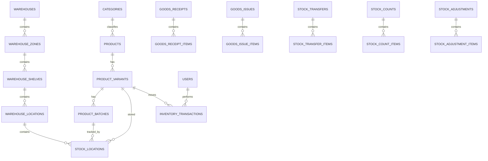

# Thiết kế cơ sở dữ liệu MySQL — Hệ thống quản lý kho Mẹ & Bé

## 1. Nguyên tắc thiết kế

- MySQL 8+ và InnoDB.
- Tồn kho không lưu trong bảng sản phẩm.
- Tồn hiện tại được quản lý bởi `stock_locations`.
- Mọi biến động phải tạo `inventory_transactions`.
- Phiếu nhập, xuất, điều chuyển và điều chỉnh chỉ làm thay đổi tồn khi được xác nhận.
- `inventory_transactions` và `audit_logs` phải được xem là append-only.
- Sản phẩm và vị trí đã phát sinh giao dịch chỉ soft delete.
- Hàng có hạn sử dụng được quản lý theo `product_batches`.
- Mỗi tồn kho được xác định bởi bộ khóa:
  `product_variant_id + location_id + batch_id`.

## 2. Nhóm bảng

### Xác thực và phân quyền

- `roles`
- `permissions`
- `role_permissions`
- `users`
- `user_sessions`
- `password_reset_tokens`

### Cấu trúc kho

- `warehouses`
- `user_warehouses`
- `warehouse_zones`
- `warehouse_shelves`
- `warehouse_locations`

### Danh mục hàng hóa

- `categories`
- `brands`
- `units`
- `products`
- `product_variants`
- `product_images`
- `suppliers`
- `supplier_products`

### Tồn kho

- `product_batches`
- `stock_locations`
- `inventory_transactions`

### Nghiệp vụ kho

- `goods_receipts`
- `goods_receipt_items`
- `goods_issues`
- `goods_issue_items`
- `stock_transfers`
- `stock_transfer_items`
- `stock_counts`
- `stock_count_items`
- `stock_adjustments`
- `stock_adjustment_items`

### Hệ thống

- `alerts`
- `notifications`
- `audit_logs`
- `attachments`
- `app_settings`

## 3. Quan hệ quan trọng



## 4. Điểm kỹ thuật cần giữ

### Tồn theo vị trí và lô

`stock_locations` không chỉ lưu tổng tồn theo sản phẩm. Mỗi bản ghi biểu diễn lượng tồn của một SKU tại đúng một vị trí và một lô hàng.

### Tránh duplicate khi `batch_id` là NULL

MySQL cho phép nhiều giá trị `NULL` trong unique index. Vì vậy schema dùng generated column:

```sql
batch_key BIGINT UNSIGNED
GENERATED ALWAYS AS (IFNULL(batch_id, 0)) STORED
```

Sau đó unique:

```sql
UNIQUE (
  product_variant_id,
  location_id,
  batch_key
)
```

### Concurrency

Khi xuất hoặc điều chuyển, Backend phải thực hiện trong transaction:

```sql
SELECT *
FROM stock_locations
WHERE id = ?
FOR UPDATE;
```

Sau đó kiểm tra tồn và cập nhật. Có thể dùng atomic update:

```sql
UPDATE stock_locations
SET
  quantity = quantity - ?,
  version = version + 1
WHERE id = ?
  AND quantity - reserved_quantity >= ?;
```

Nếu affected rows bằng `0`, trả lỗi `INSUFFICIENT_STOCK` hoặc `CONCURRENT_UPDATE`.

### Append-only

Không cấp API sửa hoặc xóa:

- `inventory_transactions`
- `audit_logs`

Nếu giao dịch sai, tạo transaction loại `REVERSAL` hoặc adjustment đối ứng.

## 5. View báo cáo

Schema có sẵn:

- `vw_current_stock`
- `vw_product_total_stock`
- `vw_near_expiry_stock`

## 6. File SQL

Chạy schema theo thứ tự bằng MySQL 8+:

```bash
mysql -u root -p < warehouse_management_mysql.sql
```

## 7. Phần phải xử lý ở Backend

Database chỉ giữ cấu trúc và constraint cơ bản. NestJS Service vẫn phải kiểm soát:

- Trạng thái phiếu.
- Quyền xác nhận.
- Không tự duyệt adjustment.
- Batch bắt buộc.
- Expiry bắt buộc.
- FEFO.
- Vị trí thuộc đúng kho.
- Phiếu đã confirmed không sửa.
- Inventory transaction và cập nhật tồn phải cùng transaction.
- Sinh mã phiếu duy nhất.
