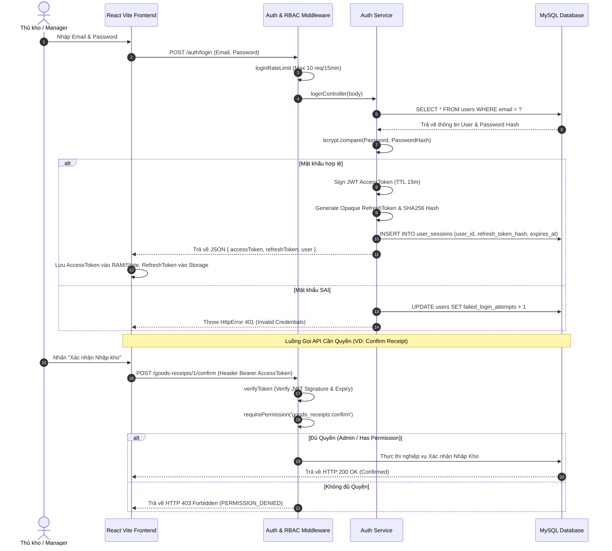
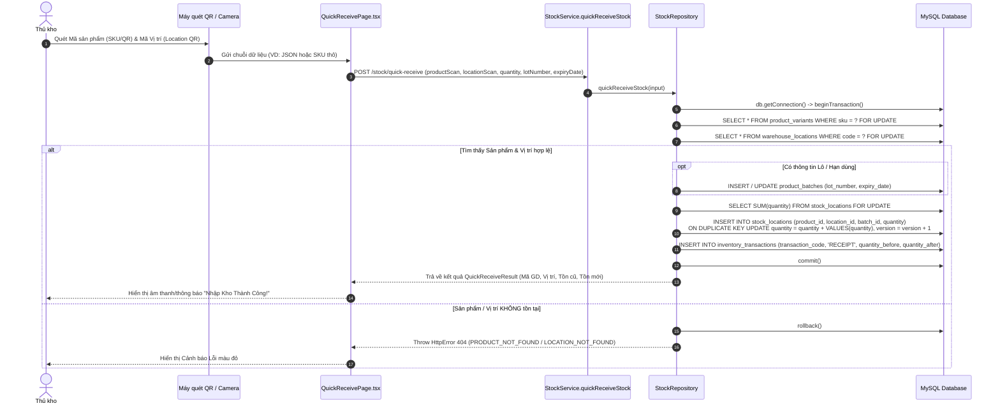
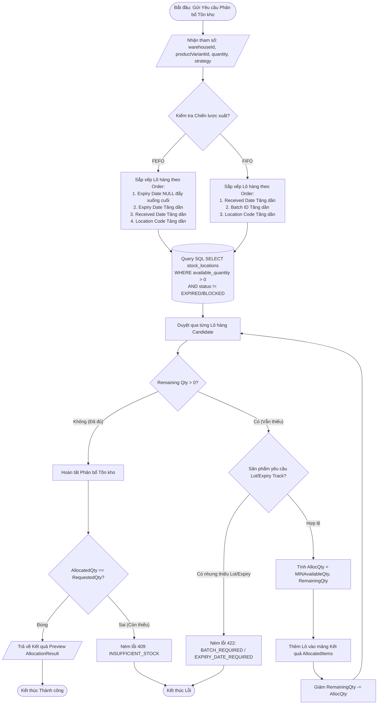
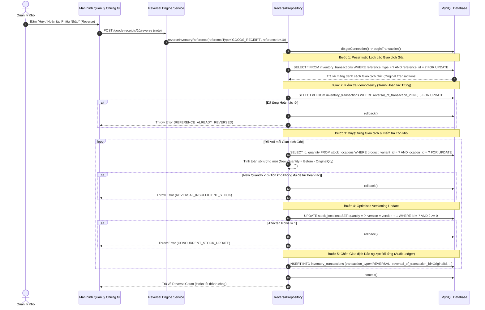
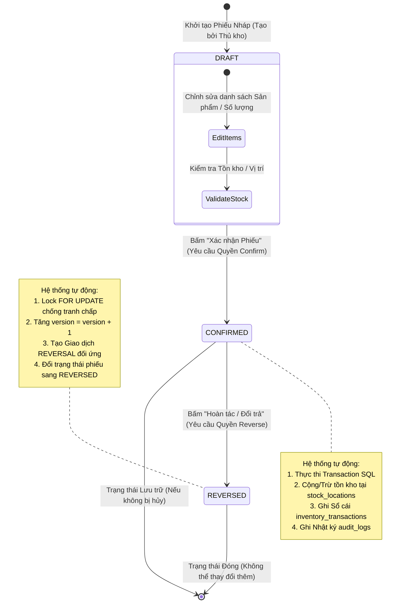

# 🔄 QUY TRÌNH & SƠ ĐỒ LƯỒNG XỬ LÝ (PROCESS DIAGRAMS) - BAMBI WMS

**Tác giả:** Senior Software Architect  
**Mục tiêu:** Cung cấp bộ sơ đồ quy trình chuẩn hóa định dạng **Mermaid Sequence Diagram**, **Flowchart** và **State Diagram** sẵn sàng copy chèn vào Slide thuyết trình và Báo cáo Đồ án tốt nghiệp.

---

## 📌 MỤC LỤC SƠ ĐỒ
1. [Sơ đồ 1: Quy trình Xác thực JWT & Phân quyền RBAC (Sequence Diagram)](#1-sơ-đồ-1-quy-trình-xác-thực-jwt--phân-quyền-rbac-sequence-diagram)
2. [Sơ đồ 2: Quy trình Quét mã QR Nhập kho Nhanh Quick Receive (Sequence Diagram)](#2-sơ-đồ-2-quy-trình-quét-mã-qr-nhập-kho-nhanh-quick-receive-sequence-diagram)
3. [Sơ đồ 3: Quy trình Phân bổ Tồn kho Thuật toán FEFO/FIFO (Flowchart)](#3-sơ-đồ-3-quy-trình-phân-bổ-tồn-kho-thuật-toán-fefofifo-flowchart)
4. [Sơ đồ 4: Quy trình Xử lý Đồng thời Concurrency & Engine Đảo ngược Giao dịch Reversal Engine (Sequence Diagram)](#4-sơ-đồ-4-quy-trình-xử-lý-đồng-thời-concurrency--engine-đảo-ngược-giao-dịch-reversal-engine-sequence-diagram)
5. [Sơ đồ 5: Sơ đồ Chuyển đổi Trạng thái Chứng từ Kho (State Diagram)](#5-sơ-đồ-5-sơ-đồ-chuyển-đổi-trạng-thái-chứng-từ-kho-state-diagram)

---

## 1. Sơ đồ 1: Quy trình Xác thực JWT & Phân quyền RBAC (Sequence Diagram)

Sơ đồ mô tả chi tiết luồng Đăng nhập (Login), Cấp Token Pair, Kiểm tra quyền middleware (`requirePermission`) và Xoay vòng Token (`/auth/refresh`).

---

## 2. Sơ đồ 2: Quy trình Quét mã QR Nhập kho Nhanh Quick Receive (Sequence Diagram)

Sơ đồ mô tả tính năng độc đáo Quét mã QR/Barcode trên máy quét cầm tay hoặc camera di động để nhập hàng siêu tốc vào vị trí ô kho.

---

## 3. Sơ đồ 3: Quy trình Phân bổ Tồn kho Thuật toán FEFO/FIFO (Flowchart)

Sơ đồ khối thể hiện chi tiết thuật toán sắp xếp và chọn lọc các lô hàng khả dụng trong kho phục vụ xuất hàng.

---

## 4. Sơ đồ 4: Quy trình Xử lý Đồng thời Concurrency & Engine Đảo ngược Giao dịch Reversal Engine (Sequence Diagram)

Sơ đồ thể hiện sự phối hợp giữa Khóa bi quan `FOR UPDATE`, Khóa lạc quan `version = version + 1` và Cơ chế Hoàn tác giao dịch bất biến.

---

## 5. Sơ đồ 5: Sơ đồ Chuyển đổi Trạng thái Chứng từ Kho (State Diagram)

Sơ đồ trạng thái (State Diagram) mô tả toàn bộ vòng đời hợp lệ của Chứng từ Nhập kho (Goods Receipt) và Chứng từ Xuất kho (Goods Issue).

