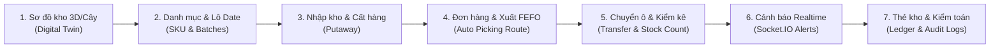

# 🎬 KỊCH BẢN DEMO BÁO CÁO HỆ THỐNG QUẢN TRỊ KHO HÀNG THÔNG MINH (BAMBI WMS)
> **Đề tài luận văn tốt nghiệp**: Xây dựng Hệ thống Quản trị Kho hàng Thông minh (Bambi WMS)  
> **Thời lượng khuyến nghị**: 10 – 15 phút  
> **Công nghệ**: React (TypeScript, TailwindCSS) + Node.js (Express, MySQL2) + Socket.IO + MySQL 8.0  

---

## 🧭 TỔNG QUAN LUỒNG DEMO (END-TO-END FLOW)

---

## 📋 CHI TIẾT CÁC BƯỚC THỰC HIỆN

### 📍 BƯỚC 1: Số hóa & Trực quan hóa Sơ đồ kho vật lý (Digital Twin)
* **Đường dẫn / Màn hình**: `/locations` (*Cấu trúc kho / Sơ đồ vị trí*)
* **Mục tiêu**: Chứng minh hệ thống không quản lý hàng hóa "chung chung" mà định vị chính xác vị trí vật lý đến từng ô lưu trữ.
* **Thao tác Demo**:
  1. Chọn kho thực hiện: **Kho HCM 01** (hoặc Kho Hà Nội, Kho Đà Nẵng).
  2. Xem cấu trúc cây phân cấp 4 tầng: **Khu (Zone A, B, C) $\rightarrow$ Kệ (Shelf A01, A02) $\rightarrow$ Tầng (Layer 01, 02) $\rightarrow$ Ô lưu trữ (Cell HCM01-A-A01-01)**.
  3. Bấm vào một ô lưu trữ: Cho Hội đồng thấy thông tin chi tiết: Sức chứa thể tích ($m^3$), Tải trọng tối đa ($kg$), Trạng thái ô (`ACTIVE`, `FULL`, `LOCKED`) và danh sách hàng hóa thực tế đang nằm trong ô.
* **Điểm sáng kỹ thuật (Hội đồng đánh giá cao)**:
  * **Toàn vẹn dữ liệu**: Ràng buộc xóa an toàn — Không cho phép xóa Kệ/Ô nếu đang có hàng tồn (`quantity > 0`) hoặc đang có đơn đặt trước (`reserved_quantity > 0`).
  * Xóa mềm đồng bộ Transaction giữa `warehouse_locations` và `warehouse_shelves`.
* **Lời thoại mẫu**:
  > *"Kính thưa Hội đồng, hệ thống bắt đầu bằng việc số hóa toàn bộ không gian kho vật lý thành mô hình cây phân cấp Kho - Khu - Kệ - Tầng - Ô. Mỗi ô lưu trữ có một mã định danh duy nhất và theo dõi trực quan tải trọng, thể tích giúp tối ưu hóa không gian lưu trữ và đảm bảo an toàn tải trọng."*

---

### 📍 BƯỚC 2: Quản lý Biến thể sản phẩm (SKU) & Quản lý Lô Date (Batches)
* **Đường dẫn / Màn hình**: `/products` (*Sản phẩm*) $\rightarrow$ `/batches` (*Lô hàng*)
* **Mục tiêu**: Chứng minh khả năng quản lý chuyên sâu cho ngành hàng có hạn sử dụng (Mẹ & Bé, Dược phẩm, Thực phẩm).
* **Thao tác Demo**:
  1. **Trang Sản phẩm (`/products`)**:
     * Xem sản phẩm mẹ và các **Biến thể SKU** (VD: `SUA-FRISO-3` - Sữa Friso Gold 3 850g, `BIM-MOONY-M` - Bỉm Moony size M).
     * Cho thấy cấu hình ngưỡng an toàn: **Tồn tối thiểu (`min_stock_level`)**, **Tồn tối đa (`max_stock_level`)**, và cờ quản lý lô `requires_lot_tracking = TRUE`.
  2. **Trang Lô hàng (`/batches`)**:
     * Xem danh sách các lô hàng: Số lô (`lot_number`), Ngày sản xuất (**NSX**), Hạn sử dụng (**HSD**), Nhà cung cấp và trạng thái lô.
* **Lời thoại mẫu**:
  > *"Đối với ngành hàng Mẹ & Bé, date sản phẩm là yếu tố sống còn. Hệ thống tách biệt rõ ràng giữa Danh mục biến thể SKU và Lô hàng thực tế. Mỗi lô được gắn chặt với HSD và Nhà cung cấp để phục vụ thuật toán xuất kho thông minh và truy xuất nguồn gốc."*

---

### 📍 BƯỚC 3: Quy trình Nhập kho & Phân bổ Ô lưu trữ (Putaway)
* **Đường dẫn / Màn hình**: `/transactions` (*Giao dịch kho*) $\rightarrow$ Nút **+ Thêm giao dịch mới**
* **Mục tiêu**: Thao tác nhập hàng thực tế, gắn vị trí lưu kho và cập nhật sổ tồn kho.
* **Thao tác Demo**:
  1. Mở modal: Chọn loại **Phiếu nhập kho (`NHAP`)**.
  2. Chọn Nhà cung cấp: **Công ty FrieslandCampina Việt Nam**.
  3. Tại dòng hàng chi tiết:
     * Chọn Sản phẩm: `SUA-FRISO-3` (Hệ thống tự động ưu tiên lọc các sản phẩm thuộc Nhà cung cấp đã chọn).
     * Chọn Lô hàng: Chọn từ dropdown `BatchSelect` (Hiển thị trực quan Số lô, NSX, HSD, NCC).
     * Chọn Ô lưu trữ: Dùng bộ chọn phân cấp `LocationCascadePicker` (Khu A $\rightarrow$ Kệ A01 $\rightarrow$ Ô 01).
     * Nhập số lượng: `50` lon.
  4. Bấm **Lưu giao dịch** $\rightarrow$ Phiếu nhập sinh mã chuẩn tự động `PN-YYYYMM-NNN`.
  5. Mở chi tiết phiếu, bấm **Xác nhận nhập kho** $\rightarrow$ Trạng thái chuyển `CONFIRMED`, tồn kho được cộng tự động và sinh thẻ kho.
* **Điểm sáng kỹ thuật**:
  * Toàn bộ thao tác chọn ô/lô đều được ràng buộc qua Dropdown thông minh, loại bỏ 100% lỗi gõ nhầm ID.
  * Cập nhật tồn kho an toàn bằng MySQL ACID Transaction.

---

### 📍 BƯỚC 4: Bán hàng, Khóa giữ tồn (Reservation) & Xuất kho FEFO/FIFO (Picking Route)
* **Đường dẫn / Màn hình**: `/orders` (*Đơn hàng*) $\rightarrow$ `/transactions` (*Giao dịch kho*)
* **Mục tiêu**: **TRỌNG TÂM ĐỀ TÀI** — Trình diễn cơ chế Khóa giữ tồn chống bán vượt và Thuật toán gợi ý Lộ trình nhặt hàng tối ưu (FEFO/FIFO).
* **Thao tác Demo**:
  1. **Tạo Đơn hàng bán ra (`/orders`)**:
     * Khách hàng đặt mua 10 lon sữa `SUA-FRISO-3` $\rightarrow$ Đơn hàng ở trạng thái `PENDING`.
     * Mở trang **Tồn kho (`/stock`)**: Cho Hội đồng thấy con số thực tế:
       $$\text{Tổng tồn vật lý: } 50 \quad | \quad \text{Đang giữ (Reserved): } 10 \quad | \quad \text{Khả dụng (Available): } 40$$
  2. **Tạo Phiếu xuất kho (`/transactions`)**:
     * Chọn loại: **Phiếu xuất kho (`XUAT`)**.
     * Chọn Chiến lược xuất kho: **FEFO - Hết hạn trước xuất trước (Khuyến nghị)**.
     * Chọn Sản phẩm: `SUA-FRISO-3` $\rightarrow$ Hệ thống tự động tính và hiển thị ngay huy hiệu: `📦 Khả dụng tại kho: 40`.
     * Nhập số lượng xuất: `15`.
     * Bấm nút **🔍 Xem phân bổ**:
       * Hệ thống hiển thị ngay bảng **Lộ trình lấy hàng (Picking Route)** chi tiết: Chỉ định nhân viên kho đến đúng ô nào (`location_code`), lấy bao nhiêu lon từ lô nào (`lot_number`), HSD ngày mấy.
  3. Bấm **Lưu giao dịch** & **Xác nhận xuất kho** $\rightarrow$ Hệ thống tự động trừ tồn kho theo đúng các ô và lô đã phân bổ.
* **Điểm sáng kỹ thuật (Điểm 10 tốt nghiệp)**:
  * **Thuật toán FEFO/FIFO phía Backend**: Quét toàn bộ vị trí kho, xếp thứ tự ưu tiên hạn sử dụng gần nhất (`expiry_date ASC`) hoặc ngày nhập trước (`received_date ASC`), tự động giải quyết bài toán phân bổ không cần thủ kho can thiệp.
  * **Cột ảo Generated Column & Chỉ mục `idx_stock_available`**:
    `available_quantity GENERATED ALWAYS AS (quantity - reserved_quantity) STORED`
  * **Khóa chống bán vượt (Anti-Overselling Lock)**: `WHERE quantity - reserved_quantity >= requested_quantity`.
* **Lời thoại mẫu**:
  > *"Đây là đóng góp nổi bật của đề tài. Khi xuất kho, thủ kho không cần phải tự đi tìm hàng nằm ở đâu hay tự xem từng lô nào sắp hết hạn. Thuật toán FEFO trên backend tự động phân tích và sinh ra Lộ trình lấy hàng (Picking Route) chính xác từng ô và từng lô, giúp giảm 80% thời gian nhặt hàng và triệt tiêu nguy cơ xuất nhầm hàng cận date."*

---

### 📍 BƯỚC 5: Điều chuyển kho (Transfers) & Kiểm kê tự động (Stock Counts)
* **Đường dẫn / Màn hình**: `/transfers` (*Chuyển kho*) $\rightarrow$ `/stock-counts` (*Kiểm kê*)
* **Mục tiêu**: Quản lý sự xáo trộn vị trí trong kho và quy trình đối soát định kỳ.
* **Thao tác Demo**:
  1. **Chuyển kho / Đổi vị trí (`/transfers`)**:
     * Chọn hàng tồn nguồn: Chọn ô `HCM01-A-A01-01`.
     * Chọn ô đích: Chọn ô `HCM01-B-B01-01`.
     * Hệ thống hiển thị rõ ràng: Tồn thực tế, Đang giữ cho đơn hàng, Khả dụng được chuyển.
     * Xác nhận chuyển kho $\rightarrow$ Hàng hóa dời sang vị trí mới ngay lập tức.
  2. **Kiểm kê định kỳ (`/stock-counts`)**:
     * Khởi tạo phiếu kiểm kê cho Kệ `A01`.
     * Nhập số lượng thực đếm (VD: Sổ sách 50, thực đếm 48 lon).
     * Hệ thống tự động tính chênh lệch (-2 lon) và cho phép bấm **Tạo phiếu điều chỉnh tồn** chỉ với 1 click.
* **Lời thoại mẫu**:
  > *"Hệ thống hỗ trợ toàn diện nghiệp vụ kiểm kê định kỳ và đột xuất. Khi có sự sai lệch giữa sổ sách và thực tế do đổ vỡ hoặc thất thoát, hệ thống tự động sinh phiếu điều chỉnh kho có ghi rõ lý do để phục vụ đối soát kế toán."*

---

### 📍 BƯỚC 6: Trung tâm Cảnh báo (Alerts) & Thông báo Realtime (Socket.IO)
* **Đường dẫn / Màn hình**: `/alerts` (*Cảnh báo*) & Biểu tượng quả chuông trên Header.
* **Mục tiêu**: Chứng minh tính chủ động (Proactive Monitoring) của hệ thống WMS.
* **Thao tác Demo**:
  1. **Trang Cảnh báo (`/alerts`)**: Cho thấy 3 quy tắc cảnh báo vận hành tự động:
     * 🔴 **Hàng cận hạn sử dụng (`NEAR_EXPIRY`)**: Tự động phát hiện các lô còn $\le 30$ ngày hoặc $\le 7$ ngày.
     * 🟡 **Hàng sắp hết (`LOW_STOCK`)**: Tự động phát hiện khi tồn khả dụng $\le$ Ngưỡng `min_stock_level`.
     * 🔵 **Ô lưu trữ quá tải (`LOCATION_CAPACITY_EXCEEDED`)**: Cảnh báo ô vượt thể tích/tải trọng.
  2. **Thông báo Realtime**:
     * Mở biểu tượng Quả chuông trên thanh Navbar: Thấy thông báo mới nhất được đẩy tức thời qua **Socket.IO** đến đúng tài khoản Thủ kho / Quản lý kho phụ trách.
* **Điểm sáng kỹ thuật**:
  * Kiến trúc cảnh báo 2 tầng tách biệt: Bảng `alerts` quản lý trạng thái nghiệp vụ chung (`OPEN` / `RESOLVED`), bảng `notifications` quản lý hộp thư cá nhân của từng user (`is_read`).

---

### 📍 BƯỚC 7: Báo cáo Thống kê, Thẻ kho (Ledger) & Nhật ký Kiểm toán (Audit Logs)
* **Đường dẫn / Màn hình**: `/reports` $\rightarrow$ `/inventory-transactions` $\rightarrow$ `/audit-logs`
* **Mục tiêu**: Khép lại buổi demo bằng tính minh bạch, khả năng truy vết và báo cáo quản trị.
* **Thao tác Demo**:
  1. **Báo cáo quản trị (`/reports`)**:
     * Biểu đồ Nhập - Xuất - Tồn theo thời gian.
     * Biểu đồ Cơ cấu giá trị tồn kho theo danh mục.
     * Tỷ lệ lấp đầy kho theo từng khu vực.
  2. **Sổ thẻ kho (`/inventory-transactions`)**:
     * Truy vết toàn bộ lịch sử vòng đời của 1 sản phẩm: Ngày giờ nhập, ở ô nào, chuyển sang ô nào, xuất theo đơn nào, số tồn trước và sau mỗi giao dịch.
  3. **Nhật ký kiểm toán (`/audit-logs`)**:
     * Minh chứng tính bảo mật: Ghi lại từng thao tác của từng nhân viên, IP, thời gian, cùng chi tiết payload `old_values` và `new_values`.
* **Lời thoại mẫu kết thúc**:
  > *"Hệ thống đảm bảo tính toàn vẹn và minh bạch tuyệt đối nhờ sổ thẻ kho bất biến và nhật ký kiểm toán ghi vết 100% thay đổi dữ liệu. Đây là nền tảng vững chắc giúp doanh nghiệp vận hành kho bãi chuẩn hóa và sẵn sàng tích hợp với các hệ thống ERP lớn."*

---

## 🏆 BẢNG TÓM TẮT 5 "VŨ KHÍ GHI ĐIỂM" VỚI HỘI ĐỒNG

| STT | Tính năng nổi bật | Giá trị thực tiễn & Kỹ thuật |
| :---: | :--- | :--- |
| **1** | **Mô hình hóa Sơ đồ kho 3D/Cây** | Định vị chính xác hàng hóa theo 4 cấp (Kho - Khu - Kệ - Tầng - Ô); quản lý sức chứa và tải trọng. |
| **2** | **Thuật toán Xuất kho FEFO/FIFO** | Tự động phân tích date của các lô hàng, sinh lộ trình lấy hàng (Picking Route) tối ưu đường đi, triệt tiêu hàng hết hạn. |
| **3** | **Khóa tồn chống bán vượt (Anti-Overselling)** | Ràng buộc ở mức Database với Generated Column `available_quantity = quantity - reserved_quantity`. |
| **4** | **Hệ thống Cảnh báo & Socket.IO Realtime** | Tự động quét cận date, tồn tối thiểu, ô quá tải và đẩy thông báo tức thời đến đúng người phụ trách. |
| **5** | **Truy vết & Kiểm toán toàn diện (Traceability)** | Thẻ kho chi tiết từng bước di chuyển + Audit Logs lưu vết giá trị trước/sau (`old_values`, `new_values`). |
