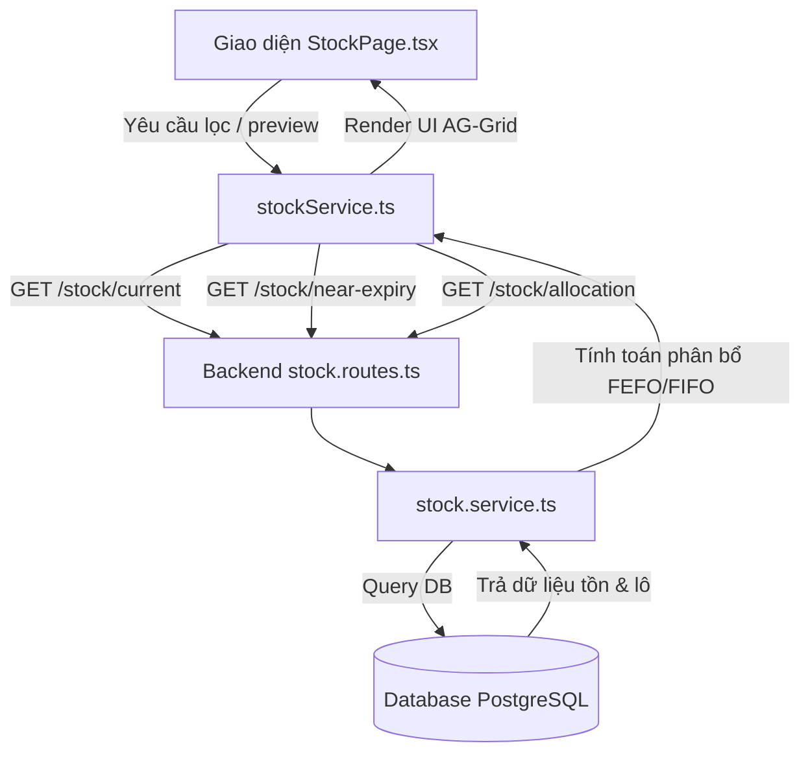

# TÀI LIỆU GIẢI THÍCH CHI TIẾT TRANG QUẢN LÝ TỒN KHO (`/stock`)

## 1. Tổng Quan Trang
Trang **Quản lý Tồn kho** (`/stock`) là trung tâm theo dõi và kiểm soát hàng hóa trong Hệ thống Quản lý Kho hàng (WMS). Trang giúp nhân viên kho và quản lý theo dõi chính xác lượng hàng tồn thực tế, hàng đã cam kết đơn, hàng cận date và kiểm tra trước phương án phân bổ xuất kho tối ưu.

### Các Chức Năng Chính Trên Giao Diện:
1. **Bộ lọc tồn kho**: Tra cứu tồn kho theo từng **Kho** và theo **Variant ID** (mã phiên bản sản phẩm).
2. **Preview phân bổ xuất kho (Allocation Preview)**: Giả lập xuất kho một số lượng sản phẩm nhất định theo thuật toán:
   - **FEFO** (*First Expired, First Out*): Ưu tiên xuất lô hàng có hạn sử dụng gần nhất.
   - **FIFO** (*First In, First Out*): Ưu tiên xuất lô hàng nhập kho sớm nhất.
3. **Danh sách Tồn hiện tại**: Bảng hiển thị chi tiết vị trí lưu trữ, thông tin lô, ngày hết hạn và số lượng (Tồn, Đã giữ, Khả dụng).
4. **Danh sách Lô gần hết hạn**: Cảnh báo các lô hàng cận date sắp hết hạn để ưu tiên xử lý.

---

## 2. Phân Tích Kỹ: Thông Báo (Notifications) vs Cảnh Báo (Warnings & Alerts)

Trên trang Quản lý tồn kho, **Thông báo** và **Cảnh báo** được thiết kế thành 2 phân hệ riêng biệt với mục đích và hành vi giao diện hoàn toàn khác nhau:

### 📢 2.1. Phân Hệ THÔNG BÁO (Notifications & Informational Feedback)
Mục đích: Cung cấp thông tin ngữ cảnh làm việc, phản hồi trạng thái xử lý bình thường hoặc thông báo sự kiện mới.

1. **Thông báo Ngữ cảnh Kho (`Warehouse Context Badge`)**:
   - **Vị trí**: Badge màu hồng ở góc trên bên phải tiêu đề trang.
   - **Nội dung**: Tên và mã kho hiện tại đang chọn (Ví dụ: `KHO-HCM-02 - Kho chi nhánh Quận 7`).
   - **Tác dụng**: Thông báo cho người dùng biết toàn bộ dữ liệu trên bảng và preview xuất kho đang áp dụng cho kho nào.
2. **Thông báo Trạng thái Xử lý (`Loading State Feedback`)**:
   - **Nội dung**: Nút bấm chuyển sang chữ `"Đang tải"` (khi lọc tồn) hoặc `"Đang xem"` (khi preview phân bổ).
   - **Tác dụng**: Thông báo hệ thống đang gửi request và truy vấn cơ sở dữ liệu, ngăn người dùng click trùng lặp.
3. **Thông báo Kết quả Phân bổ Xuất kho (`Allocation Results Feedback`)**:
   - **Vị trí**: Khối bảng viền xanh lục bên dưới form Preview.
   - **Nội dung**: Danh sách chi tiết các vị trí ô/kệ, Batch ID, số lô, HSD, ngày nhập và số lượng phân bổ trích xuất. Nếu kho không còn hàng sẽ thông báo `"Không có tồn khả dụng."`.
   - **Tác dụng**: Phản hồi phương án xuất kho tối ưu dựa trên chiến thuật FEFO/FIFO được chọn.
4. **Thông báo Chuông Hệ thống (`Header Notification Bell Icon`)**:
   - **Vị trí**: Thanh Header chung trên giao diện (`DashboardLayout`).
   - **Nội dung**: Icon chuông hiển thị badge đếm số lượng (Ví dụ: badge màu đỏ ghi số `2`).
   - **Tác dụng**: Thông báo các sự kiện toàn hệ thống như: có phiếu xuất/nhập kho mới tạo, yêu cầu duyệt phiếu kiểm kê hoặc điều chỉnh tồn kho.

---

### ⚠️ 2.2. Phân Hệ CẢNH BÁO (Warnings, Alerts & Error Banners)
Mục đích: Chú ý rủi ro tổn thất hàng hóa, nhắc nhở thiếu hụt tồn kho hoặc phát cảnh báo lỗi thao tác/lỗi kết nối hệ thống.

1. **Cảnh báo Lô hàng gần hết hạn (`Near-Expiry Warning Table`)**:
   - **Vị trí**: Bảng dữ liệu riêng biệt "Lô gần hết hạn" ở dưới cùng trang.
   - **Nội dung**: Hiển thị các lô hàng cận date kèm cột **"Còn lại"** tính theo số ngày (`days_until_expiry`).
   - **Tác dụng**: Cảnh báo rủi ro hàng quá hạn để thủ kho có kế hoạch ưu tiên xuất trước (FEFO) hoặc đề xuất giảm giá/tiêu hủy, tránh thất thoát chi phí.
2. **Cảnh báo Thiếu hụt Tồn kho (`Shortage Warning Alert & Banner`)**:
   - **Vị trí**: Badge màu đỏ cạnh tiêu đề khối Preview và khung thông báo cảnh báo chi tiết bên trong khối.
   - **Nội dung hiển thị chi tiết**:
     - Phát cảnh báo khi tổng lượng tồn khả dụng nhỏ hơn số lượng xuất yêu cầu (`allocatedQuantity < requestedQuantity`).
     - **Liệt kê cụ thể từng vị trí ô/kệ**: Hệ thống hiển thị rõ ràng *Vị trí nào có bao nhiêu sản phẩm khả dụng* (Ví dụ: `Vị trí HCM02-A-A01-01: chỉ có 5 sản phẩm khả dụng`).
     - Tính toán chính xác số lượng sản phẩm còn thiếu (`requestedQuantity - allocatedQuantity`).
   - **Tác dụng**: Cảnh báo tức thì cho thủ kho biết nguyên nhân thiếu hàng và chính xác từng ô/kệ đang chứa bao nhiêu hàng khả dụng để chủ động bổ sung/kiểm kê.
3. **Cảnh báo Lỗi Thao tác & Lỗi Kết nối (`Error Banner Alert`)**:
   - **Vị trí**: Khung cảnh báo màu đỏ (`bg-red-50 text-red-700`) xuất hiện dưới tiêu đề trang khi có sự cố.
   - **Nội dung các cảnh báo lỗi**:
     - *Cảnh báo thiếu dữ liệu*: `"Chọn kho trước khi xem phân bổ."`
     - *Cảnh báo sai định dạng*: `"Nhập Variant ID và số lượng hợp lệ trước khi xem phân bổ."`
     - *Cảnh báo lỗi Backend/HTTP*: `"Không tải được dữ liệu tồn kho từ backend"`, `"INSUFFICIENT_STOCK"`,...
   - **Tác dụng**: Ngăn chặn hành vi thao tác sai và thông báo rõ nguyên nhân lỗi để người dùng xử lý.

---

## 3. Giải Thích Các Trường Dữ Liệu (Data Fields)

### 3.1. Bảng "Tồn hiện tại" (`CurrentStockItem`)
| Tên cột / Field | Tên trong Code | Ý nghĩa & Mô tả dữ liệu |
| :--- | :--- | :--- |
| **SKU** | `sku` | Mã quản lý đơn vị tồn kho duy nhất của biến thể sản phẩm (*Stock Keeping Unit*). |
| **Sản phẩm** | `product_name`, `variant_name` | Tên sản phẩm chính kết hợp tên biến thể (ví dụ: kích thước, màu sắc, dung tích). |
| **Kho** | `warehouse_code`, `warehouse_name` | Mã kho và tên chi nhánh kho đang chứa sản phẩm. |
| **Vị trí** | `location_code` | Mã vị trí kệ/ô chứa hàng trong kho (ví dụ: `HCM02-A-A01-01`). |
| **Lô** | `batch_id`, `lot_number` | Thông tin lô hàng: • `batch_id`: Mã định danh lô trong cơ sở dữ liệu hệ thống. • `lot_number`: Số lô phát hành từ nhà sản xuất. *(Hiển thị dạng `#batch_id - lot_number`)*. |
| **Hạn sử dụng** | `expiry_date` | Ngày hết hạn của lô hàng (định dạng dd/mm/yyyy). Hiển thị `"Không có"` nếu sản phẩm không quản lý date. |
| **Tồn** | `quantity` | **Tổng số lượng vật lý thực tế** đang nằm tại vị trí kệ này. |
| **Đã giữ** | `reserved_quantity` | **Số lượng đã được khóa / giữ chỗ** cho các đơn hàng hoặc phiếu xuất chưa hoàn tất. |
| **Khả dụng** | `available_quantity` | **Số lượng rảnh rỗi** thực tế có thể tiếp tục bán hoặc phân bổ xuất kho. |

---

### 3.2. Bảng "Lô gần hết hạn" (`NearExpiryStockItem`)
| Tên cột / Field | Tên trong Code | Ý nghĩa & Mô tả dữ liệu |
| :--- | :--- | :--- |
| **SKU** | `sku` | Mã SKU sản phẩm. |
| **Sản phẩm** | `product_name` | Tên sản phẩm cận hạn. |
| **Lô** | `batch_id`, `lot_number` | ID lô hệ thống và số lô nhà sản xuất. |
| **Vị trí** | `location_code` | Vị trí ô/kệ lưu trữ lô cận date. |
| **Hạn sử dụng** | `expiry_date` | Ngày hết hạn dùng của lô. |
| **Còn lại** | `days_until_expiry` | Số ngày còn lại từ hôm nay đến khi hết hạn (ví dụ: `30 ngày`). |
| **Khả dụng** | `available_quantity` | Số lượng tồn khả dụng còn lại của lô cận hạn. |

---

### 3.3. Bảng "Preview phân bổ xuất kho" (`AllocationPreviewResult`)
| Tên cột / Field | Tên trong Code | Ý nghĩa & Mô tả dữ liệu |
| :--- | :--- | :--- |
| **Vị trí** | `locationCode` | Vị trí ô/kệ được thuật toán chọn để trích xuất hàng. |
| **Batch ID** | `batchId` | ID lô hàng trong cơ sở dữ liệu sẽ xuất. |
| **Lô** | `lotNumber` | Số lô nhà sản xuất tương ứng. |
| **Hạn sử dụng** | `expiryDate` | Hạn dùng của lô được chọn xuất. |
| **Ngày nhập** | `receivedDate` | Ngày lô hàng này được nhập vào kho (dùng cho thuật toán FIFO). |
| **Số lượng** | `quantity` | **Số lượng trích xuất** tại vị trí/lô cụ thể này. |

---

## 4. Phân Tích Nghiệp Vụ Core: Tồn - Đã Giữ - Khả Dụng

### 4.1. Định nghĩa & Khái niệm
- **Tồn (`quantity`)**: Là tổng lượng hàng hóa đếm được bằng mắt/tay tại ô kệ kho.
- **Đã giữ (`reserved_quantity`)**: Là lượng hàng hóa đã có chủ (đã gán cho đơn hàng mua online, phiếu chuyển kho đã tạo, phiếu xuất chờ bốc hàng). Hàng chưa rời khỏi kho nhưng không được bán cho khách mới.
- **Khả dụng (`available_quantity`)**: Là lượng hàng rảnh rỗi thực tế có thể cam kết bán tiếp.

### 4.2. Công thức toán học
$$\text{Khả dụng} = \text{Tồn} - \text{Đã giữ}$$

### 4.3. Ví dụ minh họa thực tế
Giả sử tại ô kệ `HCM02-A-A01-01` chứa **Tã Moony Size M**:
- **Tồn** = `42` bịch (Đếm thực tế tại kệ).
- **Đã giữ** = `5` bịch (Đã có 5 đơn hàng đặt thành công đang chờ nhân viên đi nhặt hàng).
- **Khả dụng** = `37` bịch ($42 - 5 = 37$).

---

## 5. Kiến Trúc Mã Nguồn (Technical Architecture)

### 5.1. Frontend Page — StockPage.tsx
- `useEffect()`: Khởi tạo tải danh sách kho từ `warehouseService` và gọi `loadStock()` cho kho mặc định.
- `loadStock()`: Lấy dữ liệu tồn kho hiện tại và lô sắp hết hạn.
- `handlePreviewAllocation()`: Thu thập `warehouseId`, `productVariantId`, `quantity`, `strategy` để gọi API preview phân bổ xuất hàng.
- Bảng hiển thị sử dụng `DataGridLayout` bọc thư viện **AG Grid**, tối ưu hiệu năng lọc và sắp xếp.

### 5.2. Frontend Service — stockService.ts
- `listCurrentStock(filters)`: `GET /stock/current`
- `listNearExpiryStock(filters)`: `GET /stock/near-expiry`
- `previewAllocation(input)`: `GET /stock/allocation`

### 5.3. Backend Processing — stock.service.ts
- `previewStockAllocation()`:
  1. Truy vấn các dòng tồn khả dụng (`available_quantity > 0`).
  2. Sắp xếp theo **FEFO** (HSD tăng dần) hoặc **FIFO** (Ngày nhập tăng dần).
  3. Kiểm tra tính hợp lệ về quản lý Lô (`requires_lot_tracking`) và HSD (`requires_expiry_tracking`).
  4. Trừ dần `remainingQuantity` để tạo danh sách vị trí xuất hàng chi tiết.
