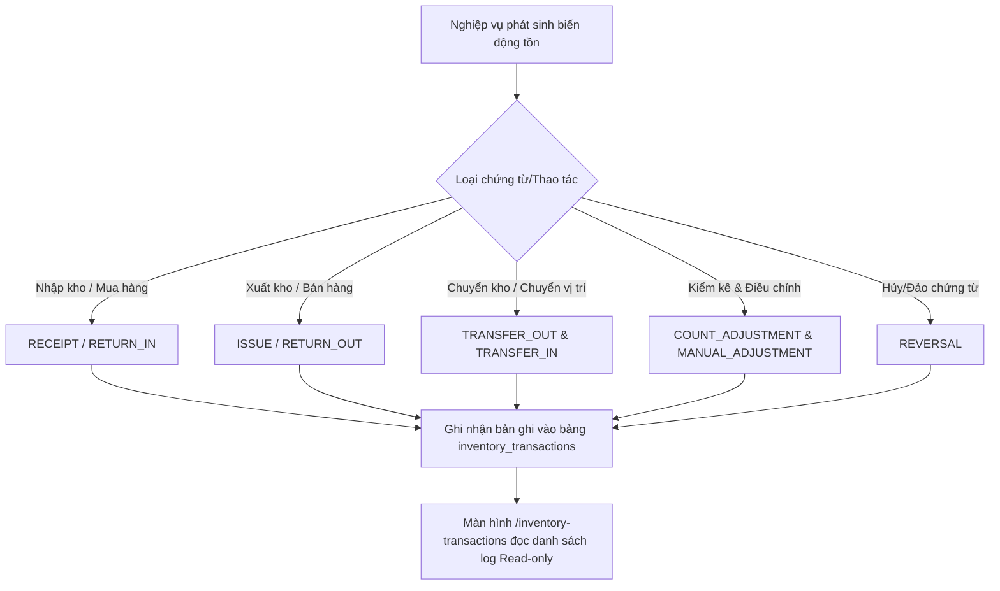

# Nhật ký Giao dịch Tồn kho (Inventory Transactions Feature)

## 1. Tổng quan & Mục đích nghiệp vụ

Màn **Log giao dịch tồn kho** (`/inventory-transactions`) đóng vai trò là nhật ký kiểm toán (Audit Log) theo dõi toàn bộ các biến động tăng/giảm/chuyển vị trí tồn kho phát sinh trong toàn bộ hệ thống.

Mọi thao tác làm thay đổi số lượng tồn kho (Nhập kho, Xuất kho, Chuyển kho, Kiểm kê, Điều chỉnh, Hoàn tác) đều tự động sinh ra bản ghi nhật ký giao dịch không thể sửa đổi (Immutable Ledger).

---

## 2. Luồng nghiệp vụ & Phân loại Giao dịch (Business & Data Flow)

### Phân loại loại giao dịch (`transaction_type`)

| Mã loại (`transaction_type`) | Tên hiển thị Tiếng Việt | Mô tả biến động tồn |
| --- | --- | --- |
| `RECEIPT` | Nhập kho | Tăng tồn kho khi xác nhận phiếu nhập mua từ nhà cung cấp (hỗ trợ nhập lại cùng 1 số lô nhiều lần) |
| `ISSUE` | Xuất kho | Giảm tồn kho khi xuất bán hàng hoặc xuất sử dụng nội bộ |
| `TRANSFER_OUT` | Chuyển đi | Giảm tồn tại vị trí nguồn khi tạo lệnh chuyển kho |
| `TRANSFER_IN` | Chuyển đến | Tăng tồn tại vị trí đích khi nhận hàng chuyển đến |
| `COUNT_ADJUSTMENT_IN` | Kiểm kê tăng | Tăng tồn sau khi kiểm kê phát hiện thừa hàng |
| `COUNT_ADJUSTMENT_OUT` | Kiểm kê giảm | Giảm tồn sau khi kiểm kê phát hiện thiếu hàng |
| `MANUAL_ADJUSTMENT_IN` | Điều chỉnh tăng | Tăng tồn kho thủ công được phê duyệt |
| `MANUAL_ADJUSTMENT_OUT` | Điều chỉnh giảm | Giảm tồn kho thủ công (VD: hư hỏng, hết hạn) |
| `RETURN_IN` | Trả nhập | Nhập lại hàng trả về |
| `RETURN_OUT` | Trả xuất | Xuất trả hàng lại cho nhà cung cấp |
| `INITIAL_STOCK` | Tồn đầu kỳ | Ghi nhận số lượng tồn khởi tạo ban đầu |
| `REVERSAL` | Hoàn tác | Khôi phục/Đảo ngược trạng thái tồn khi hủy chứng từ |

---

## 3. Quy tắc Nghiệp vụ nhập nhiều lần cho 1 Lô (Multiple Receipts per Batch)

> [!IMPORTANT]
> - **Cho phép nhập nhiều lần cùng 1 Lô (`lot_number`)**: Một lô hàng (VD: `LOT-FRISO3-202605`) có thể được nhập kho nhiều đợt khác nhau (qua các phiếu nhập kho hoặc các ngày nhập khác nhau).
> - **Ghi nhật ký độc lập**: Mỗi lần phát sinh giao dịch nhập kho cho lô đó, hệ thống sẽ sinh ra **một bản ghi log giao dịch `RECEIPT` riêng biệt** gắn với mã chứng từ tương ứng, giúp người quản lý dễ dàng đối soát từng đợt nhập hàng theo thời gian thực.

---

## 4. Cấu trúc Cấu phần & File chính

- `frontend/src/features/inventory-transactions/pages/InventoryTransactionsPage.tsx`: Màn hình hiển thị bảng log, thanh tìm kiếm theo mã giao dịch/loại tham chiếu và ánh xạ mã giao dịch sang Tiếng Việt (hiển thị tên Kho, tên Variant/SKU, tên Người thực hiện thay cho ID).
- `frontend/src/features/inventory-transactions/services/inventoryTransactionService.ts`: Chứa dịch vụ gọi API `GET /inventory-transactions`.
- `backend/src/modules/inventory-transactions/`:
  - `inventory-transactions.routes.ts`: Khai báo endpoint `/inventory-transactions`.
  - `inventory-transactions.controller.ts`: Nhận tham số tìm kiếm (`search`).
  - `inventory-transactions.repository.ts`: Truy vấn bảng `inventory_transactions` JOIN với các bảng liên quan để lấy mã/tên kho, sản phẩm, vị trí và nhân viên.

---

## 5. Nguyên tắc Nghiệp vụ cần lưu ý

> [!NOTE]
> - **Nhật ký Chỉ đọc (Read-only)**: Màn hình này hoàn toàn đóng vai trò theo dõi và không cung cấp tính năng Thêm/Sửa/Xóa bản ghi trực tiếp.
> - **Truy xuất Nguồn gốc (Traceability)**: Mỗi bản ghi log luôn liên kết với chứng từ gốc thông qua cặp trường `reference_type` (VD: `GOODS_RECEIPT`, `GOODS_ISSUE`, `STOCK_TRANSFER`) và `reference_id`.
> - **Toàn vẹn Dữ liệu**: Bản ghi log giao dịch được ghi theo cơ chế transaction cùng lúc với thời điểm số lượng trên `stock_locations` được cập nhật.
