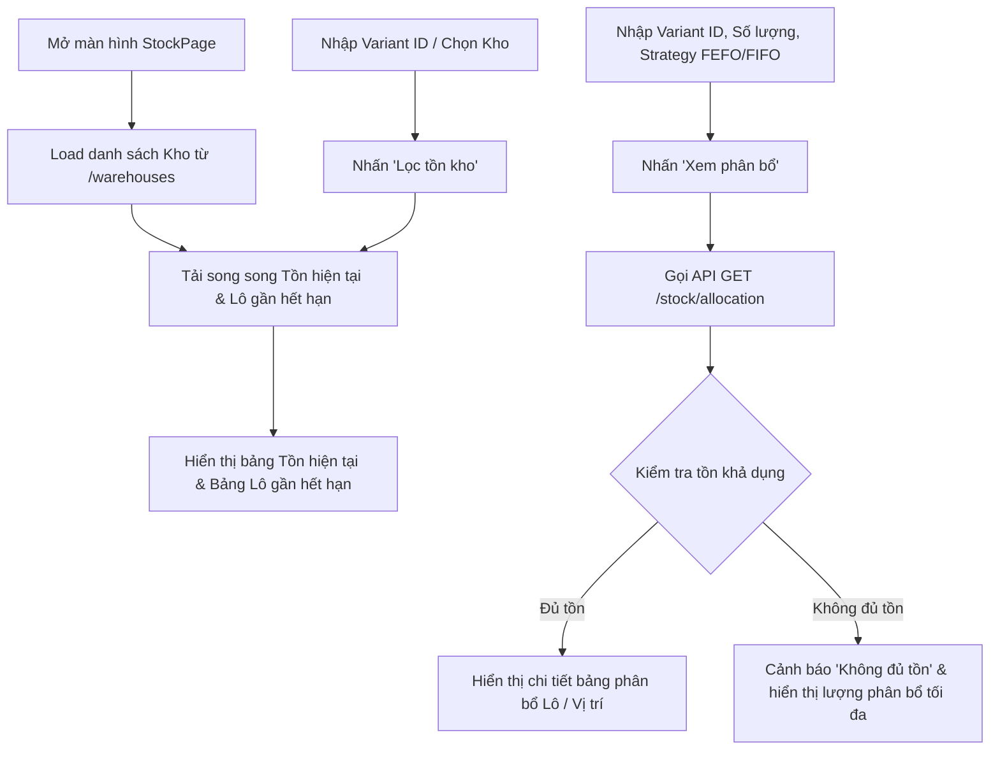

# Quản lý Tồn kho (Stock Feature)

## 1. Tổng quan & Mục đích nghiệp vụ

Màn **Tồn kho** (`/stock`) phục vụ việc theo dõi, quản trị lượng tồn kho thực tế theo từng kho/vị trí/lô hàng và kiểm thử thuật toán phân bổ hàng xuất kho.

Màn hình đáp ứng 3 nhu cầu nghiệp vụ chính:
1. **Theo dõi Tồn hiện tại (Current Stock)**: Xem chi tiết vị trí lưu kho (Location), lô hàng (Batch/Lot), tổng tồn (Quantity), hàng đã giữ chỗ/đang trong giao dịch chờ duyệt (`Reserved Quantity`) và lượng khả dụng thực tế để bán/xuất (`Available Quantity`).
2. **Cảnh báo Lô gần hết hạn (Near Expiry Stock)**: Liệt kê các lô hàng sắp hết hạn sử dụng (tính theo số ngày còn lại), giúp thủ kho ưu tiên giải phóng hàng trước để tránh rủi ro hủy hàng.
3. **Preview phân bổ xuất kho (Allocation Preview - FEFO/FIFO)**: Cho phép xem trước vị trí và lô hàng cụ thể sẽ được lấy khi xuất một số lượng nhất định của một Variant sản phẩm mà không làm thay đổi hay ghi dữ liệu vào database.

---

## 2. Luồng dữ liệu & Nghiệp vụ (Data & Business Flow)

### 2.1 Khởi tạo dữ liệu (Page Load)
1. Tải danh sách Kho khả dụng từ backend: `GET /warehouses?status=ACTIVE`.
2. Mặc định chọn Kho đầu tiên (ví dụ `KHO-HCM-01` hoặc `KHO-HCM-02`).
3. Gọi song song 2 API nạp bảng:
   - `GET /stock/current?warehouseId={id}`: Lấy danh sách tồn kho theo từng vị trí & lô.
   - `GET /stock/near-expiry?warehouseId={id}`: Lấy danh sách các lô sắp hết hạn.

### 2.2 Lọc tồn kho
- Cho phép chọn lại Kho (`warehouseId`) hoặc nhập mã Variant ID (`productVariantId`).
- Khi nhấn nút **Lọc tồn kho**, hệ thống gọi lại API `GET /stock/current` và `GET /stock/near-expiry` theo bộ lọc mới.
- Nút **Xóa lọc variant** sẽ reset ô Variant ID và nạp lại toàn bộ tồn kho của Kho đang chọn.

### 2.3 Xem trước phân bổ xuất kho (Preview Allocation)
- **Đầu vào**: `warehouseId`, `productVariantId`, `quantity` (Số lượng xuất), `strategy` (`FEFO` hoặc `FIFO`).
- **Xử lý (API `GET /stock/allocation`)**:
  - Backend truy vấn các bản ghi `stock_locations` còn tồn khả dụng (`available_quantity > 0`).
  - **FEFO (First Expired, First Out - Hạn gần xuất trước)**: Sắp xếp ưu tiên các lô có hạn sử dụng gần nhất (`expiry_date ASC`).
  - **FIFO (First In, First Out - Nhập trước xuất trước)**: Sắp xếp ưu tiên các lô nhập kho sớm nhất (`received_date ASC`).
  - Trừ lùi số lượng khả dụng qua từng vị trí/lô cho đến khi đủ số lượng yêu cầu.
- **Đầu ra**: Bảng Preview hiển thị chi tiết danh sách vị trí (`locationCode`), mã lô (`lotNumber`), hạn dùng (`expiryDate`), ngày nhập (`receivedDate`) và số lượng sẽ trừ trên từng vị trí.
- **Cảnh báo thiếu hàng**: Nếu tổng tồn khả dụng trong kho không đủ cho số lượng cần xuất, hệ thống hiển thị nhãn cảnh báo **"Không đủ tồn"**.

---

## 3. Quy tắc Quản lý Lô Hàng (Multiple Receipts per Batch Rule)

> [!IMPORTANT]
> - **1 Lô có thể nhập nhiều lần**: Hệ thống cho phép một Lô sản phẩm (`lot_number`, ví dụ: `LOT-FRISO3-202605`) được nhập vào kho thành nhiều đợt/phiếu nhập kho khác nhau.
> - **Cơ chế nhận diện & Cộng dồn**: Khi nhập tiếp một lô đã tồn tại trong hệ thống cho cùng một Variant sản phẩm:
>   - Backend tự động nhận diện `batch_id` có sẵn và cập nhật/bảo toàn hạn sử dụng (`expiry_date`).
>   - Số lượng tồn khả dụng sẽ được cộng dồn vào vị trí kho tương ứng hoặc lưu vào các vị trí kho mới.
>   - Mỗi lần nhập đều tự động ghi nhận thêm bản ghi nhật ký giao dịch nhập kho (`RECEIPT`) riêng biệt để phục vụ truy xuất nguồn gốc.

---

## 4. Cấu trúc Cấu phần & File chính

- `frontend/src/features/stock/pages/StockPage.tsx`: Màn hình chính chứa các bộ lọc, form preview allocation và 2 bảng AgGrid.
- `frontend/src/features/stock/services/stockService.ts`: Gom toàn bộ API calls liên quan đến tồn kho (`listCurrentStock`, `listNearExpiryStock`, `previewAllocation`).
- `backend/src/modules/stock/`:
  - `stock.routes.ts`: Định nghĩa các endpoints `/stock/current`, `/stock/near-expiry`, `/stock/allocation`.
  - `stock.controller.ts`: Tiếp nhận và validate tham số HTTP query.
  - `stock.service.ts` & `stock.repository.ts`: Thực thi các câu SQL query tồn kho và thuật toán tính toán phân bổ FEFO/FIFO.

---

## 5. Nguyên tắc Nghiệp vụ quan trọng

> [!NOTE]
> - **Chế độ Read-only**: Tính năng **Preview phân bổ** chỉ đóng vai trò xem trước thử nghiệm (Simulated Allocation) và KHÔNG làm thay đổi số lượng tồn kho trong database.
> - **Công thức Tồn Khả dụng**: `Tồn khả dụng (Available) = Tổng tồn (Quantity) - Đã giữ chỗ (Reserved)`. Hàng đã nằm trong các phiếu xuất kho/chuyển kho chưa duyệt sẽ ở trạng thái `Reserved`.
> - **Xuất kho thực tế**: Việc xuất kho thật diễn ra ở màn **Chứng từ giao dịch (Transactions)** khi phiếu xuất được duyệt. Khi đó thuật toán FEFO/FIFO tương tự sẽ được kích hoạt để trừ tồn chính thức.